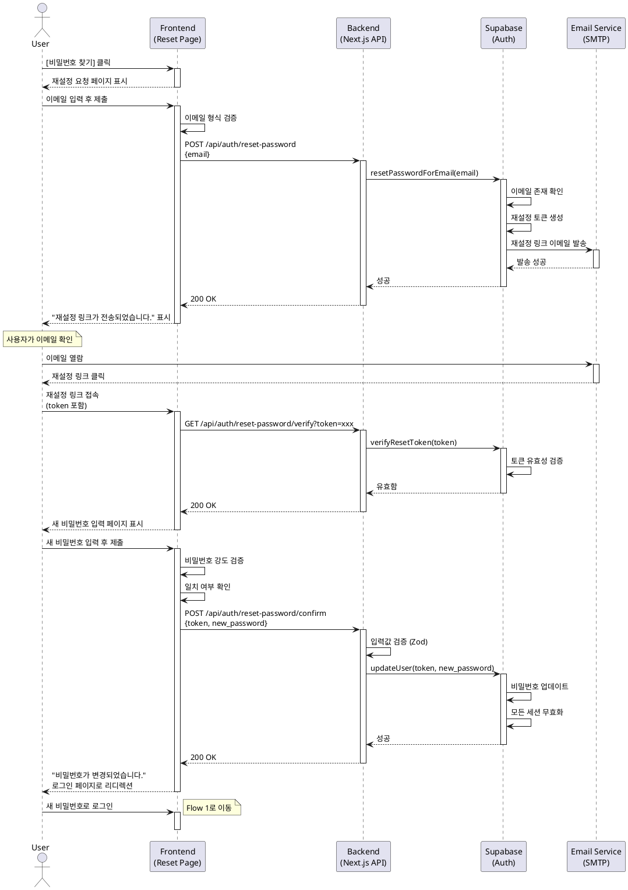

# Flow 1.5: 비밀번호 찾기 (Account Recovery)

## Primary Actor
- **비로그인 사용자** (비밀번호를 잊어버린 기존 가입자)

## Precondition
- 사용자는 과거에 가입한 이력이 있습니다.
- 사용자는 가입 시 사용한 이메일 주소를 알고 있습니다.
- 사용자는 로그인되지 않은 상태입니다.

## Trigger
- 사용자가 로그인 페이지에서 `[비밀번호 찾기]` 링크를 클릭합니다.

## Main Scenario

1. 사용자가 로그인 페이지의 `[비밀번호 찾기]` 링크를 클릭합니다.
2. 시스템은 비밀번호 재설정 요청 페이지를 표시합니다.
3. 페이지에 이메일 입력 필드가 표시됩니다.
4. 사용자가 가입 시 사용한 이메일 주소를 입력합니다.
5. 사용자가 `[재설정 링크 보내기]` 버튼을 클릭합니다.
6. 시스템은 입력된 이메일 형식을 검증합니다.
7. 시스템은 Supabase Auth의 비밀번호 재설정 API를 호출합니다.
8. Supabase는 해당 이메일로 비밀번호 재설정 링크를 발송합니다.
9. 시스템은 "재설정 링크가 이메일로 전송되었습니다." 안내 메시지를 표시합니다.
10. 사용자가 이메일을 확인하고 재설정 링크를 클릭합니다.
11. 시스템은 재설정 토큰을 검증하고 비밀번호 변경 페이지를 표시합니다.
12. 페이지에 다음 필드들이 표시됩니다:
    - 새 비밀번호 입력 필드
    - 새 비밀번호 확인 입력 필드
13. 사용자가 새 비밀번호를 입력하고 `[비밀번호 변경]` 버튼을 클릭합니다.
14. 시스템은 입력값을 검증합니다:
    - 비밀번호 강도 검증 (최소 8자)
    - 두 비밀번호 입력값 일치 확인
15. 시스템은 Supabase Auth를 통해 비밀번호를 업데이트합니다.
16. 시스템은 "비밀번호가 성공적으로 변경되었습니다." 메시지를 표시합니다.
17. 시스템은 사용자를 로그인 페이지로 리디렉션합니다.
18. 사용자가 새 비밀번호로 로그인합니다 (Flow 1로 이동).

## Edge Cases

### 존재하지 않는 이메일
- **상황**: 시스템에 등록되지 않은 이메일 주소로 재설정 요청
- **처리**: 보안상 "재설정 링크가 전송되었습니다." 동일 메시지 표시 (이메일 존재 여부를 노출하지 않음)

### 만료된 재설정 링크
- **상황**: 재설정 링크가 발송된 지 24시간 이상 경과
- **처리**: "재설정 링크가 만료되었습니다. 다시 요청해주세요." 에러 메시지 표시 및 재요청 버튼 제공

### 잘못된 재설정 토큰
- **상황**: 이미 사용된 토큰 또는 변조된 토큰으로 접근
- **처리**: "유효하지 않은 링크입니다. 비밀번호 재설정을 다시 요청해주세요." 에러 메시지 표시

### 비밀번호 불일치
- **상황**: 새 비밀번호와 확인 비밀번호가 일치하지 않음
- **처리**: "비밀번호가 일치하지 않습니다." 실시간 검증 메시지 표시

### 이전 비밀번호와 동일
- **상황**: 새 비밀번호가 이전 비밀번호와 동일한 경우
- **처리**: "이전과 다른 비밀번호를 입력해주세요." 에러 메시지 표시

### 이메일 발송 실패
- **상황**: SMTP 서버 오류 등으로 이메일 발송 실패
- **처리**: 사용자에게는 성공 메시지 표시 (보안), 서버 로그에 오류 기록 및 관리자 알림

## Business Rules

1. **보안 우선**: 이메일 존재 여부를 외부에 노출하지 않습니다.
2. **토큰 만료**: 재설정 링크는 24시간 후 자동 만료됩니다.
3. **일회성**: 재설정 토큰은 한 번만 사용할 수 있습니다.
4. **비밀번호 정책**: 새 비밀번호도 가입 시와 동일한 강도 정책을 적용합니다 (최소 8자).
5. **재시도 제한**: 동일 IP에서 5분 내 5회 이상 재설정 요청 시 일시적으로 차단합니다 (Rate Limiting).
6. **이메일 인증**: 비밀번호 재설정은 이메일 소유권을 간접적으로 검증하는 유일한 지점입니다.
7. **세션 무효화**: 비밀번호 변경 시 기존의 모든 세션이 무효화됩니다.

## Sequence Diagram

