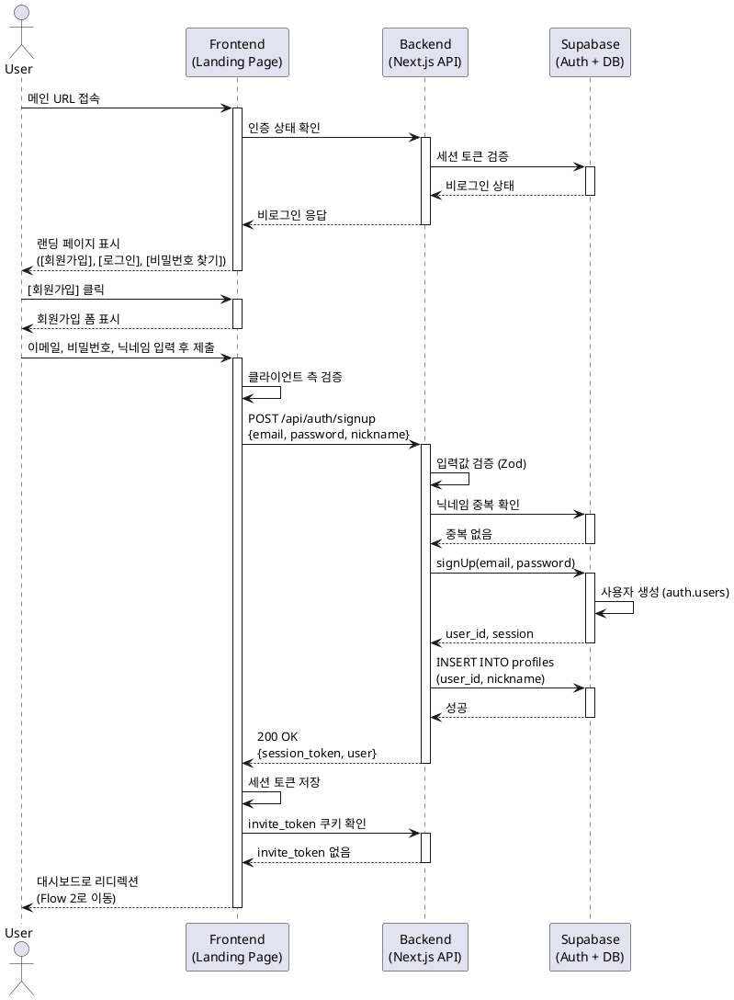

# Flow 1: 신규 방문자 가입 / 로그인 (Organic Landing)

## Primary Actor
- **비로그인 사용자** (초대 없이 메인 URL로 직접 방문한 사용자)

## Precondition
- 사용자는 아직 로그인하지 않은 상태입니다.
- 사용자의 브라우저에 `invite_token` 쿠키가 없습니다.
- 사용자는 메인 URL(`minimal-chat.com`)에 접근할 수 있습니다.

## Trigger
- 비로그인 사용자가 메인 URL에 접속합니다.

## Main Scenario

1. 사용자가 브라우저에서 `minimal-chat.com`을 입력하거나 북마크를 통해 접속합니다.
2. 시스템은 사용자의 인증 상태를 확인합니다.
3. 시스템은 비로그인 사용자임을 감지합니다.
4. 시스템은 '스플래시 랜딩 페이지'를 렌더링합니다.
5. 페이지에 다음 요소들이 표시됩니다:
   - 서비스 소개 및 가치 제안
   - `[회원가입]` 버튼
   - `[로그인]` 버튼
   - `[비밀번호 찾기]` 링크
6. 사용자가 `[회원가입]` 버튼을 클릭합니다.
7. 시스템은 회원가입 폼을 표시합니다:
   - 이메일 입력 필드
   - 비밀번호 입력 필드
   - 닉네임 입력 필드
8. 사용자가 필요한 정보를 입력하고 제출합니다.
9. 시스템은 입력값을 검증합니다:
   - 이메일 형식 검증
   - 비밀번호 강도 검증 (최소 8자)
   - 닉네임 중복 검증
10. 시스템은 Supabase Auth를 통해 사용자를 생성합니다.
11. 시스템은 `profiles` 테이블에 사용자 메타데이터를 저장합니다.
12. 시스템은 사용자 세션을 생성하고 인증 토큰을 발급합니다.
13. 시스템은 쿠키에 `invite_token`이 없음을 확인합니다.
14. 시스템은 사용자를 `Flow 2 (첫 로그인 온보딩)`로 리디렉션합니다.

## Alternative Scenario: 로그인 선택

6a. 사용자가 `[로그인]` 버튼을 클릭합니다.
7a. 시스템은 로그인 폼을 표시합니다:
   - 이메일 입력 필드
   - 비밀번호 입력 필드
8a. 사용자가 이메일과 비밀번호를 입력하고 제출합니다.
9a. 시스템은 Supabase Auth를 통해 자격 증명을 검증합니다.
10a. 시스템은 사용자 세션을 생성하고 인증 토큰을 발급합니다.
11a. 시스템은 쿠키에 `invite_token`이 없음을 확인합니다.
12a. 시스템은 기존 사용자 여부를 판단합니다.
13a. 기존 사용자인 경우 `Flow 5 (재방문)`로 이동합니다.
14a. 처음 로그인하는 사용자인 경우 `Flow 2 (첫 로그인 온보딩)`로 이동합니다.

## Alternative Scenario: 비밀번호 찾기

6b. 사용자가 `[비밀번호 찾기]` 링크를 클릭합니다.
7b. 시스템은 `Flow 1.5 (비밀번호 찾기)`로 이동합니다.

## Edge Cases

### 이메일 중복
- **상황**: 가입 시 이미 존재하는 이메일을 입력한 경우
- **처리**: "이미 가입된 이메일입니다. 로그인하시겠습니까?" 메시지와 함께 로그인 링크 제공

### 잘못된 로그인 자격 증명
- **상황**: 로그인 시 이메일 또는 비밀번호가 일치하지 않는 경우
- **처리**: "이메일 또는 비밀번호가 올바르지 않습니다." 에러 메시지 표시

### 네트워크 오류
- **상황**: 가입/로그인 요청 중 네트워크 오류 발생
- **처리**: "연결에 실패했습니다. 다시 시도해주세요." 에러 메시지 표시 및 재시도 버튼 제공

### 비밀번호 강도 부족
- **상황**: 8자 미만 또는 너무 간단한 비밀번호 입력
- **처리**: "비밀번호는 최소 8자 이상이어야 합니다." 실시간 검증 메시지 표시

### 닉네임 중복
- **상황**: 이미 사용 중인 닉네임 입력
- **처리**: "이미 사용 중인 닉네임입니다. 다른 닉네임을 입력해주세요." 에러 메시지 표시

## Business Rules

1. **인증 우선**: 모든 기능 접근 전에 인증이 선행되어야 합니다.
2. **최소 정보 수집**: 이메일, 비밀번호, 닉네임만 필수로 수집합니다.
3. **즉시 접근**: 가입 완료 후 이메일 인증 없이 바로 서비스를 사용할 수 있습니다.
4. **초대 분리**: 초대 링크를 통한 가입은 별도 Flow로 처리합니다 (Flow 4).
5. **세션 유지**: 로그인 시 세션은 7일간 유지됩니다.
6. **비밀번호 보안**: 비밀번호는 Supabase Auth의 bcrypt 해싱을 통해 저장됩니다.

## Sequence Diagram

