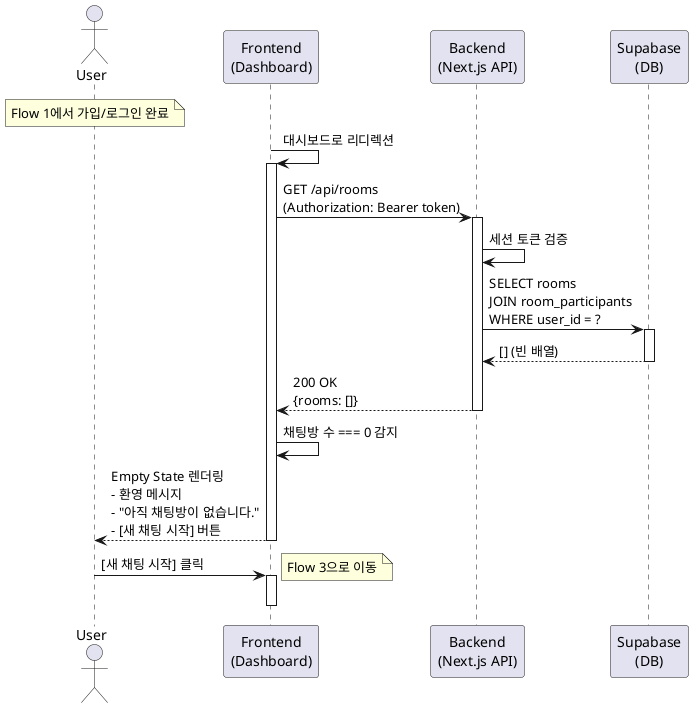

# Flow 2: 첫 로그인 온보딩 (First-Time Onboarding)

## Primary Actor
- **처음 로그인한 사용자** (Flow 1에서 초대 없이 가입/로그인을 완료한 사용자)

## Precondition
- 사용자는 Flow 1을 통해 가입/로그인을 완료했습니다.
- 사용자의 세션이 정상적으로 생성되었습니다.
- 사용자의 쿠키에 `invite_token`이 없습니다.
- 사용자가 아직 참여한 채팅방이 하나도 없습니다.

## Trigger
- Flow 1에서 가입/로그인 완료 후 자동으로 리디렉션됩니다.

## Main Scenario

1. 시스템은 Flow 1에서 사용자를 메인 대시보드로 리디렉션합니다.
2. 시스템은 사용자의 인증 상태를 확인합니다.
3. 시스템은 사용자가 참여 중인 채팅방 목록을 조회합니다.
4. 시스템은 채팅방이 없음을 감지합니다.
5. 시스템은 메인 대시보드를 'Empty State'로 렌더링합니다.
6. 페이지에 다음 요소들이 표시됩니다:
   - 환영 메시지: "환영합니다, {닉네임}님!"
   - 안내 문구: "아직 채팅방이 없습니다. 첫 채팅을 시작해보세요."
   - 중앙에 큰 `[새 채팅 시작]` 버튼
   - (선택적) 간단한 사용 가이드 또는 일러스트
7. 사용자가 화면을 확인합니다.
8. 사용자가 `[새 채팅 시작]` 버튼을 클릭하면 Flow 3으로 이동합니다.

## Alternative Scenario: 초대받은 사용자

- 이 Flow는 초대받지 않은 사용자만 진입합니다.
- 초대를 통해 가입한 사용자는 Flow 4를 거쳐 바로 채팅방으로 이동하므로 이 Flow를 거치지 않습니다.

## Edge Cases

### 네트워크 오류로 방 목록 조회 실패
- **상황**: API 호출 중 네트워크 오류 발생
- **처리**: "데이터를 불러오는 중 오류가 발생했습니다. [다시 시도]" 버튼 제공

### 세션 만료
- **상황**: 리디렉션 중 세션이 만료된 경우
- **처리**: 자동으로 로그인 페이지로 리디렉션

### 이미 채팅방이 있는 경우
- **상황**: 가입 직후 누군가 해당 사용자를 채팅방에 초대한 경우
- **처리**: Empty State가 아닌 일반 대시보드(Flow 5)를 표시

## Business Rules

1. **Empty State 표시**: 채팅방이 없는 첫 사용자에게는 명확한 안내를 제공합니다.
2. **즉시 행동 유도**: `[새 채팅 시작]` 버튼을 화면 중앙에 눈에 띄게 배치합니다.
3. **복잡도 최소화**: 튜토리얼이나 팝업을 최소화하고 직관적인 UI로 안내합니다.
4. **재방문 구분**: 이미 채팅방이 있는 사용자는 Flow 5로 자동 전환됩니다.
5. **세션 유지**: 온보딩 중에도 세션은 정상적으로 유지됩니다.

## Sequence Diagram

