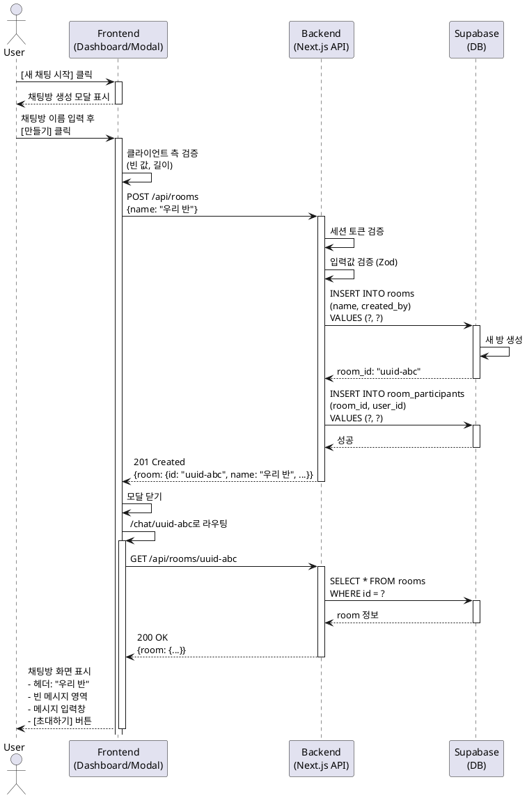

# Flow 3: 핵심 루프 - 채팅방 생성 (Room Naming)

## Primary Actor
- **로그인한 사용자** (채팅방을 생성하려는 사용자)

## Precondition
- 사용자는 로그인된 상태입니다.
- 사용자는 메인 대시보드(Flow 2 또는 Flow 5)에 있습니다.
- 사용자가 `[새 채팅 시작]` 버튼을 클릭할 수 있는 상태입니다.

## Trigger
- 사용자가 `[새 채팅 시작]` 버튼을 클릭합니다.

## Main Scenario

1. 사용자가 대시보드에서 `[새 채팅 시작]` 버튼을 클릭합니다.
2. 시스템은 '채팅방 생성' 모달(또는 다이얼로그)을 화면 중앙에 표시합니다.
3. 모달에 다음 요소들이 표시됩니다:
   - 제목: "새 채팅방 만들기"
   - 입력 필드: "채팅방 이름을 입력하세요" (placeholder)
   - `[만들기]` 버튼
   - `[취소]` 버튼
4. 사용자가 채팅방 이름을 입력합니다.
5. 사용자가 `[만들기]` 버튼을 클릭합니다.
6. 시스템은 입력값을 검증합니다:
   - 빈 문자열이 아닌지 확인
   - 길이 제한 확인 (1~50자)
7. 시스템은 백엔드 API를 호출하여 채팅방을 생성합니다.
8. 백엔드는 `rooms` 테이블에 새 레코드를 생성합니다:
   - `name`: 사용자가 입력한 이름
   - `created_by`: 현재 사용자의 ID
   - `created_at`: 현재 시각
9. 백엔드는 `room_participants` 테이블에 참여자 레코드를 생성합니다:
   - `room_id`: 생성된 방 ID
   - `user_id`: 현재 사용자의 ID
   - `joined_at`: 현재 시각
10. 백엔드는 생성된 방 정보를 응답합니다.
11. 프론트엔드는 모달을 닫습니다.
12. 시스템은 사용자를 즉시 생성된 채팅방 화면(`/chat/{room_id}`)으로 이동시킵니다.
13. 채팅방 화면이 표시됩니다:
    - 헤더에 방 이름
    - 빈 메시지 영역 (아직 메시지 없음)
    - 하단에 메시지 입력 영역
    - 헤더에 `[초대하기]` 버튼 (Flow 6으로 연결)

## Alternative Scenario: 취소

5a. 사용자가 `[취소]` 버튼을 클릭하거나 모달 외부를 클릭합니다.
6a. 시스템은 모달을 닫습니다.
7a. 사용자는 이전 화면(대시보드)에 남아있습니다.
8a. 채팅방은 생성되지 않습니다.

## Edge Cases

### 빈 이름 입력
- **상황**: 사용자가 채팅방 이름을 입력하지 않고 `[만들기]` 클릭
- **처리**: "채팅방 이름을 입력해주세요." 에러 메시지 표시, 모달 유지

### 이름 길이 초과
- **상황**: 50자를 초과하는 이름 입력
- **처리**: 입력 필드에서 50자까지만 입력 가능하도록 제한, 실시간 카운터 표시 "12/50"

### 공백만 입력
- **상황**: 사용자가 공백 문자만 입력
- **처리**: "유효한 채팅방 이름을 입력해주세요." 에러 메시지 표시

### 네트워크 오류
- **상황**: 채팅방 생성 API 호출 중 네트워크 오류
- **처리**: "채팅방 생성에 실패했습니다. 다시 시도해주세요." 에러 메시지 표시, 모달 유지

### 데이터베이스 오류
- **상황**: DB 삽입 중 오류 발생
- **처리**: 500 에러 로깅, "일시적인 오류가 발생했습니다. 잠시 후 다시 시도해주세요." 사용자에게 표시

### 중복 이름
- **상황**: 동일한 이름의 방이 이미 존재 (동일 사용자 또는 다른 사용자)
- **처리**: 허용 (방 이름 고유성 제약 없음, 여러 방이 같은 이름을 가질 수 있음)

## Business Rules

1. **방 이름 필수**: 채팅방은 반드시 이름을 가져야 합니다 (빈 방 생성 불가).
2. **즉시 이동**: 방 생성 즉시 해당 방으로 이동하여 첫 메시지를 작성할 수 있도록 합니다.
3. **소유권**: 방을 생성한 사용자가 자동으로 첫 번째 참여자가 됩니다.
4. **이름 고유성 불필요**: 같은 이름의 방이 여러 개 존재할 수 있습니다 (UUID로 구분).
5. **길이 제한**: 채팅방 이름은 1~50자로 제한됩니다.
6. **특수문자 허용**: 이모지 및 특수문자를 포함한 모든 유니코드 문자 허용.
7. **초대 준비**: 방 생성 시 초대 기능이 즉시 사용 가능해야 합니다 (Flow 6).

## Sequence Diagram

