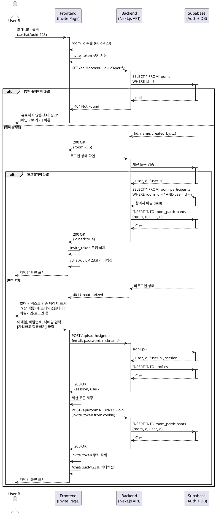

# Flow 4: 핵심 루프 - 초대 및 합류 (Invitation & Contextual Auth Wall)

## Primary Actor
- **User B** (초대 링크를 받은 사용자, 로그인 여부 불문)

## Precondition
- User A가 채팅방을 생성하고 초대 URL을 공유했습니다.
- User B가 초대 URL(예: `.../chat/uuid-123`)을 받았습니다.
- 초대 링크는 유효한 채팅방 ID를 포함하고 있습니다.

## Trigger
- User B가 초대 URL을 클릭합니다.

## Main Scenario

1. User B가 초대 URL(`.../chat/uuid-123`)을 클릭합니다.
2. 시스템은 URL에서 `room_id` (uuid-123)를 추출합니다.
3. 시스템은 해당 `room_id`를 `invite_token`으로 세션/쿠키에 즉시 저장합니다.
4. 시스템은 백엔드에 초대 토큰의 유효성을 검증 요청합니다.
5. 백엔드는 `rooms` 테이블에서 해당 `room_id`가 존재하는지 확인합니다.
6. **[조건 분기 - 유효하지 않은 토큰]**
   - 6a. 방이 존재하지 않거나 삭제된 경우:
   - 6b. 시스템은 "유효하지 않은 초대 링크입니다." 에러 페이지를 표시합니다.
   - 6c. 페이지에 `[메인으로 가기]` 버튼을 제공합니다.
   - 6d. 사용자가 버튼을 클릭하면 Flow 1(메인 랜딩)으로 이동합니다.
   - 6e. **[종료]**
7. **[조건 분기 - 유효한 토큰]**
   - 7a. 방이 유효하게 존재하는 경우
   - 7b. 시스템은 User B의 로그인 상태를 확인합니다.
8. **[하위 분기 - 로그인된 사용자]**
   - 8a. User B가 이미 로그인되어 있는 경우:
   - 8b. 시스템은 User B가 이미 해당 방의 참여자인지 확인합니다.
   - 8c. 참여자가 아닌 경우, `room_participants` 테이블에 User B를 추가합니다.
   - 8d. 시스템은 User B를 즉시 채팅방 화면으로 이동시킵니다.
   - 8e. 쿠키의 `invite_token`을 삭제합니다.
   - 8f. **[종료]**
9. **[하위 분기 - 비로그인 사용자]**
   - 9a. User B가 로그인되어 있지 않은 경우:
   - 9b. 시스템은 일반 랜딩(Flow 1)이 아닌 **'초대 컨텍스트 인증 페이지'**로 이동합니다.
   - 9c. 페이지에 다음 요소들이 표시됩니다:
     - 상단에 초대 동기: "'{방 이름}'에 초대되었습니다!"
     - 간단한 방 정보 미리보기 (방 이름, 참여자 수 등)
     - 회원가입 폼 (`F-00.1`)
     - 로그인 폼 전환 링크
   - 9d. User B가 회원가입 폼을 작성합니다 (이메일, 비밀번호, 닉네임).
   - 9e. User B가 `[가입하고 합류하기]` 버튼을 클릭합니다.
   - 9f. 시스템은 가입 처리를 수행합니다 (Supabase Auth + profiles 생성).
   - 9g. 시스템은 쿠키의 `invite_token`을 확인하여 해당 방에 User B를 자동으로 추가합니다.
   - 9h. 시스템은 User B를 즉시 채팅방 화면으로 이동시킵니다.
   - 9i. 쿠키의 `invite_token`을 삭제합니다.
   - 9j. **[종료]**

## Alternative Scenario: 로그인 선택

9d-alt. User B가 "이미 계정이 있으신가요? 로그인" 링크를 클릭합니다.
9e-alt. 시스템은 로그인 폼을 표시합니다 (초대 컨텍스트 유지).
9f-alt. User B가 이메일과 비밀번호를 입력하고 `[로그인하고 합류하기]` 버튼을 클릭합니다.
9g-alt. 시스템은 로그인 처리를 수행합니다.
9h-alt. 시스템은 쿠키의 `invite_token`을 확인하여 User B를 방에 추가합니다.
9i-alt. 시스템은 User B를 즉시 채팅방 화면으로 이동시킵니다.
9j-alt. **[종료]**

## Alternative Scenario: 이미 참여 중인 방

8b-alt. User B가 이미 해당 방의 참여자인 경우:
8c-alt. 시스템은 중복 추가를 하지 않습니다.
8d-alt. 시스템은 User B를 즉시 채팅방 화면으로 이동시킵니다.
8e-alt. **[종료]**

## Edge Cases

### 초대 링크 형식 오류
- **상황**: URL에 유효하지 않은 형식의 room_id 포함
- **처리**: "유효하지 않은 초대 링크입니다." 에러 페이지 표시

### 삭제된 방
- **상황**: 초대 링크의 방이 이미 삭제됨
- **처리**: "이 채팅방은 더 이상 존재하지 않습니다." 에러 메시지와 함께 메인으로 이동 버튼 제공

### 네트워크 오류
- **상황**: 초대 토큰 검증 또는 방 참여 API 호출 중 오류
- **처리**: "연결에 실패했습니다. [다시 시도]" 버튼 제공

### 세션 만료 (로그인 사용자)
- **상황**: 초대 링크 접근 시 세션이 만료된 경우
- **처리**: 초대 컨텍스트를 유지하면서 로그인 페이지로 이동

### 가입 실패
- **상황**: 초대 페이지에서 가입 시 이메일 중복 등으로 실패
- **처리**: 적절한 에러 메시지 표시, 초대 컨텍스트 유지, 로그인으로 전환 제안

### invite_token 쿠키 저장 실패
- **상황**: 브라우저 쿠키 설정으로 인한 저장 실패
- **처리**: localStorage 또는 sessionStorage로 폴백, 그래도 실패 시 URL 파라미터로 상태 전달

## Business Rules

1. **즉시 저장**: 초대 URL 접근 시 `invite_token`을 즉시 쿠키에 저장하여 가입/로그인 후에도 컨텍스트를 유지합니다.
2. **동기 명시**: 비로그인 사용자에게 "어떤 방에 초대되었는지" 명확히 보여줘야 합니다.
3. **가입 전환율 최적화**: Guest Preview가 아닌 명확한 가입 동기를 제시하여 전환율을 높입니다.
4. **자동 합류**: 가입/로그인 완료 즉시 방에 자동으로 참여시킵니다.
5. **중복 방지**: 이미 참여 중인 사용자는 중복 추가하지 않습니다.
6. **에러 처리**: 유효하지 않은 초대는 명확한 에러 페이지로 안내합니다.
7. **쿠키 정리**: 방 합류 완료 후 `invite_token` 쿠키를 삭제하여 다음 초대와 충돌하지 않도록 합니다.

## Sequence Diagram

