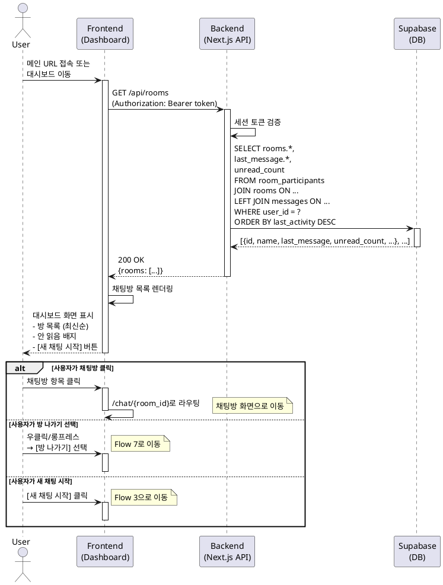

# Flow 5: 재방문 및 복귀 (Re-engagement)

## Primary Actor
- **기존 로그인 사용자** (이미 한 개 이상의 채팅방에 참여한 사용자)

## Precondition
- 사용자는 이미 가입되어 있습니다.
- 사용자는 한 개 이상의 채팅방에 참여 중입니다.
- 사용자가 메인 URL로 재방문합니다.

## Trigger
- 로그인한 기존 사용자가 메인 URL에 접속합니다.
- 또는 사용자가 대시보드 탭/버튼을 클릭합니다.

## Main Scenario

1. 사용자가 `minimal-chat.com`에 접속하거나 앱 내에서 대시보드로 이동합니다.
2. 시스템은 사용자의 인증 상태를 확인합니다.
3. 시스템은 사용자가 로그인되어 있음을 확인합니다.
4. 시스템은 백엔드 API를 호출하여 사용자의 채팅방 목록을 조회합니다.
5. 백엔드는 `room_participants` 테이블에서 해당 사용자가 참여 중인 방들을 조회합니다.
6. 각 방에 대해 다음 정보를 함께 조회합니다:
   - 방 이름
   - 마지막 메시지 내용 및 시각
   - 안 읽은 메시지 수 (선택적)
   - 참여자 수
7. 시스템은 조회된 방 목록을 최신순(마지막 활동 시각 기준)으로 정렬합니다.
8. 시스템은 '메인 대시보드(채팅 목록)' 화면을 렌더링합니다.
9. 페이지에 다음 요소들이 표시됩니다:
   - 상단에 사용자 프로필 정보 (닉네임, 로그아웃 버튼)
   - 채팅방 목록 (각 항목에 방 이름, 최근 메시지, 시각, 배지)
   - 우측 상단 또는 하단에 `[새 채팅 시작]` 버튼
10. 사용자가 채팅방 목록을 확인합니다.
11. **[사용자 행동 분기 1 - 채팅방 클릭]**
    - 11a. 사용자가 특정 채팅방을 클릭합니다.
    - 11b. 시스템은 해당 채팅방 화면(`/chat/{room_id}`)으로 이동합니다.
    - 11c. 채팅방 내에서 메시지를 주고받거나 Flow 6(재초대)을 수행할 수 있습니다.
    - 11d. **[종료]**
12. **[사용자 행동 분기 2 - 방 나가기]**
    - 12a. 사용자가 채팅방 항목을 우클릭하거나 롱프레스합니다.
    - 12b. 컨텍스트 메뉴가 표시되며 `[방 나가기]` 옵션이 노출됩니다.
    - 12c. 사용자가 `[방 나가기]`를 선택합니다.
    - 12d. 시스템은 Flow 7(방 나가기)로 이동합니다.
    - 12e. **[종료]**
13. **[사용자 행동 분기 3 - 새 채팅 시작]**
    - 13a. 사용자가 `[새 채팅 시작]` 버튼을 클릭합니다.
    - 13b. 시스템은 Flow 3(채팅방 생성)으로 이동합니다.
    - 13c. **[종료]**

## Alternative Scenario: 안 읽은 메시지 배지

- 시스템은 각 채팅방의 안 읽은 메시지 수를 계산하여 배지로 표시합니다.
- 사용자가 채팅방에 진입하면 해당 방의 배지가 사라집니다.

## Edge Cases

### 채팅방이 삭제된 경우
- **상황**: 사용자가 참여했던 방이 삭제되었으나 목록에 남아있는 경우
- **처리**: 해당 방을 목록에서 자동으로 제거, 또는 "방을 찾을 수 없습니다." 표시

### 네트워크 오류
- **상황**: 채팅방 목록 조회 중 네트워크 오류 발생
- **처리**: "데이터를 불러오는 중 오류가 발생했습니다. [다시 시도]" 버튼 제공

### 세션 만료
- **상황**: 사용자가 접속했으나 세션이 만료된 경우
- **처리**: 자동으로 로그인 페이지로 리디렉션, "다시 로그인해주세요." 안내

### 빈 목록 (모든 방 나간 경우)
- **상황**: 사용자가 모든 채팅방을 나가서 목록이 비어있는 경우
- **처리**: Flow 2의 Empty State로 전환 ("아직 채팅방이 없습니다.")

### 마지막 메시지 없는 방
- **상황**: 방이 생성되었으나 아직 메시지가 없는 경우
- **처리**: "메시지가 없습니다." 또는 "방이 생성되었습니다." 플레이스홀더 표시

### 정렬 기준 데이터 없음
- **상황**: 마지막 활동 시각이 없는 경우
- **처리**: 방 생성 시각(`created_at`)을 기준으로 정렬

## Business Rules

1. **최신순 정렬**: 채팅방 목록은 마지막 활동 시각 기준 최신순으로 정렬합니다.
2. **안 읽음 배지**: 안 읽은 메시지가 있는 경우 눈에 띄는 배지를 표시합니다.
3. **빠른 접근**: 대시보드에서 한 번의 클릭으로 채팅방에 접근할 수 있어야 합니다.
4. **방 관리**: 우클릭/롱프레스로 방 나가기 등 관리 옵션에 접근할 수 있습니다.
5. **지속적 생성**: 언제든지 새 채팅방을 생성할 수 있도록 버튼을 노출합니다.
6. **미니멀 디자인**: 불필요한 정보를 제거하고 방 이름, 최근 메시지, 시각만 표시합니다.
7. **실시간 업데이트**: WebSocket을 통해 새 메시지 도착 시 목록이 자동으로 업데이트됩니다 (선택적).

## Sequence Diagram

