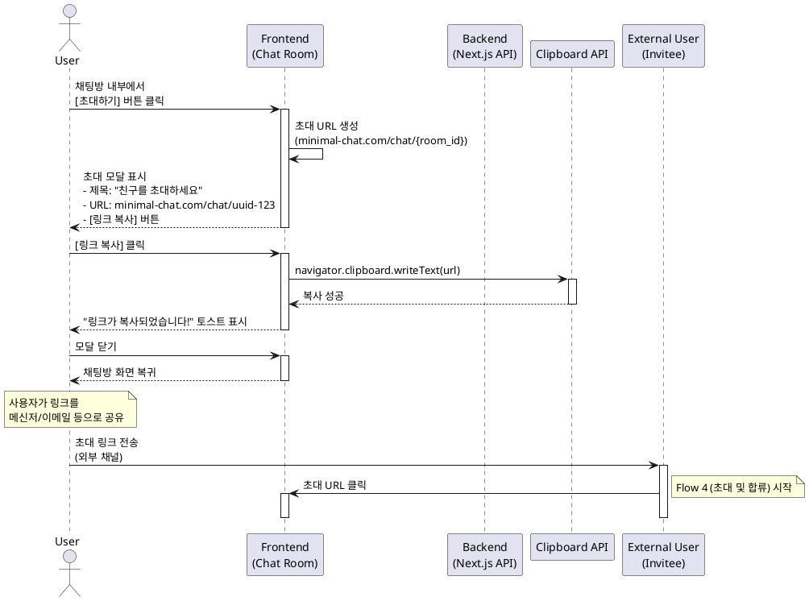

# Flow 6: 재초대 흐름 (Re-Invitation)

## Primary Actor
- **채팅방 참여자** (방 내부에서 추가 인원을 초대하려는 사용자)

## Precondition
- 사용자는 로그인되어 있습니다.
- 사용자는 특정 채팅방에 참여 중입니다.
- 사용자는 채팅방 화면(`/chat/{room_id}`)에 있습니다.

## Trigger
- 사용자가 채팅방 내부의 `[초대하기]` 버튼을 클릭합니다.

## Main Scenario

1. 사용자가 채팅방 화면에 진입합니다.
2. 시스템은 채팅방 헤더 또는 설정 메뉴에 `[초대하기]` 버튼을 항상 표시합니다.
3. 사용자가 `[초대하기]` 버튼을 클릭합니다.
4. 시스템은 '초대 URL 복사' 모달(또는 팝업)을 표시합니다.
5. 모달에 다음 요소들이 표시됩니다:
   - 제목: "친구를 초대하세요"
   - 초대 URL: `minimal-chat.com/chat/{room_id}` (읽기 전용 텍스트 필드)
   - `[링크 복사]` 버튼
   - (선택적) 공유 아이콘 (카카오톡, 문자 등)
6. 사용자가 `[링크 복사]` 버튼을 클릭합니다.
7. 시스템은 초대 URL을 클립보드에 복사합니다.
8. 시스템은 "링크가 복사되었습니다!" 토스트 메시지를 표시합니다.
9. 사용자가 모달을 닫거나 외부를 클릭하여 모달을 종료합니다.
10. 사용자는 복사한 링크를 원하는 채널(메신저, 이메일 등)을 통해 공유합니다.
11. 링크를 받은 사람이 해당 URL을 클릭하면 Flow 4(초대 및 합류)가 시작됩니다.
12. **[종료]**

## Alternative Scenario: 직접 공유 (선택적)

6a. 사용자가 공유 아이콘(카카오톡, 문자 등)을 클릭합니다.
7a. 시스템은 해당 플랫폼의 공유 인터페이스를 호출합니다.
8a. 사용자가 직접 수신자를 선택하고 전송합니다.
9a. 모달이 자동으로 닫힙니다.
10a. **[종료]**

## Alternative Scenario: 버튼 재클릭

- 사용자가 `[초대하기]` 버튼을 여러 번 클릭할 수 있습니다.
- 매번 동일한 초대 URL이 생성됩니다 (방 ID 기반).
- 이전에 복사한 링크와 동일한 링크가 제공됩니다.

## Edge Cases

### 클립보드 접근 권한 없음
- **상황**: 브라우저에서 클립보드 접근이 차단된 경우
- **처리**: "클립보드 접근 권한이 필요합니다. URL을 수동으로 복사하세요." 안내 메시지 표시, 텍스트 필드를 선택 가능하도록 변경

### 네트워크 오류 (방 정보 조회 실패)
- **상황**: 초대 모달 표시 중 방 정보 조회 실패
- **처리**: "잠시 후 다시 시도해주세요." 에러 메시지 표시

### 방이 삭제된 경우
- **상황**: 사용자가 방 내부에 있으나 실제로 방이 삭제됨
- **처리**: "이 채팅방은 더 이상 존재하지 않습니다." 에러 메시지 표시, 대시보드로 리디렉션

### 모바일 환경
- **상황**: 모바일 브라우저에서 접근
- **처리**: 네이티브 공유 시트(Share Sheet) API 활용 (가능한 경우), 또는 동일한 복사 인터페이스 제공

### 초대 링크 길이
- **상황**: URL이 너무 길어서 일부 플랫폼에서 잘릴 수 있음
- **처리**: 짧은 도메인 사용 또는 URL 단축 서비스 고려 (Post-MVP)

## Business Rules

1. **항상 접근 가능**: `[초대하기]` 버튼은 채팅방 내부에서 항상 노출되어야 합니다.
2. **단순한 URL**: 초대 URL은 방 ID만 포함하며, 복잡한 파라미터를 사용하지 않습니다.
3. **무제한 초대**: 초대 횟수에 제한이 없습니다.
4. **영구 유효**: 초대 링크는 방이 존재하는 한 계속 유효합니다 (만료 없음).
5. **권한 불필요**: 방 참여자라면 누구나 초대할 수 있습니다 (방장 개념 없음).
6. **성장 루프**: 이 기능은 핵심 성장 동력(Growth Loop)으로, 사용자 경험을 최대한 단순화합니다.
7. **토큰 재사용**: 동일한 방에 대해서는 항상 동일한 초대 URL이 생성됩니다.

## Sequence Diagram

