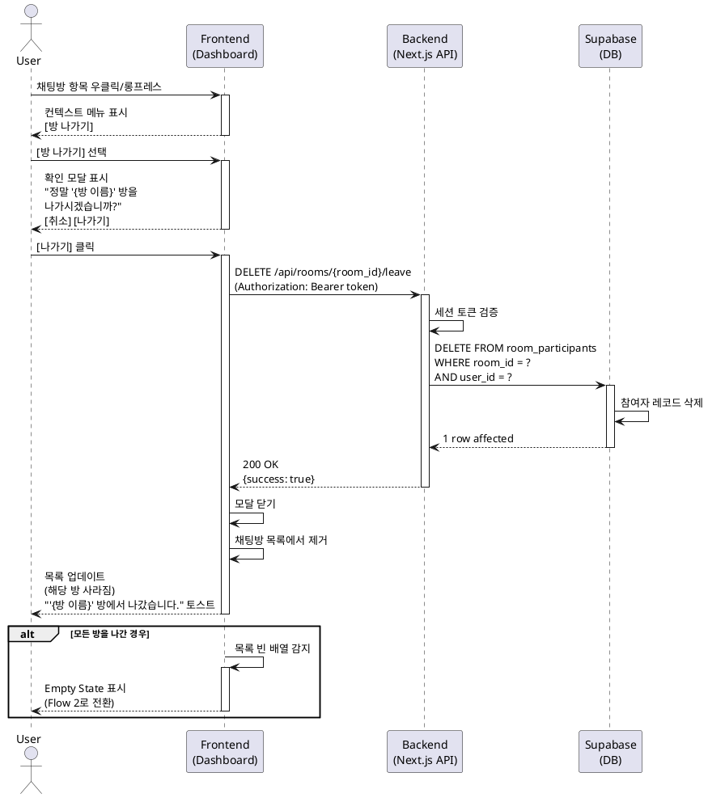

# Flow 7: 방 나가기 (Leave Room)

## Primary Actor
- **채팅방 참여자** (채팅 목록을 관리하고 싶은 사용자)

## Precondition
- 사용자는 로그인되어 있습니다.
- 사용자는 한 개 이상의 채팅방에 참여 중입니다.
- 사용자는 메인 대시보드(Flow 5)에 있거나 채팅방 내부에 있습니다.

## Trigger
- 사용자가 대시보드에서 채팅방 항목을 우클릭하거나 롱프레스하여 `[방 나가기]` 옵션을 선택합니다.
- 또는 채팅방 내부의 설정 메뉴에서 `[방 나가기]` 옵션을 선택합니다.

## Main Scenario (대시보드에서 나가기)

1. 사용자가 메인 대시보드(채팅 목록)에 있습니다.
2. 사용자가 특정 채팅방 항목을 우클릭하거나 롱프레스합니다.
3. 시스템은 컨텍스트 메뉴를 표시합니다.
4. 메뉴에 `[방 나가기]` 옵션이 노출됩니다.
5. 사용자가 `[방 나가기]`를 클릭합니다.
6. 시스템은 확인 모달(또는 다이얼로그)을 표시합니다.
7. 모달에 다음 요소들이 표시됩니다:
   - 제목: "방 나가기"
   - 메시지: "정말 '{방 이름}' 방을 나가시겠습니까?"
   - 안내: "나가면 대화 내역을 더 이상 볼 수 없습니다."
   - `[취소]` 버튼
   - `[나가기]` 버튼 (강조 색상)
8. 사용자가 `[나가기]` 버튼을 클릭합니다.
9. 시스템은 백엔드 API를 호출하여 방 나가기를 요청합니다.
10. 백엔드는 `room_participants` 테이블에서 해당 사용자의 참여 레코드를 삭제합니다.
11. 백엔드는 성공 응답을 반환합니다.
12. 프론트엔드는 모달을 닫습니다.
13. 시스템은 대시보드의 채팅방 목록을 즉시 업데이트합니다.
14. 해당 방이 목록에서 사라집니다.
15. 시스템은 "'{방 이름}' 방에서 나갔습니다." 토스트 메시지를 표시합니다 (선택적).
16. **[종료]**

## Alternative Scenario: 취소

8a. 사용자가 `[취소]` 버튼을 클릭하거나 모달 외부를 클릭합니다.
9a. 시스템은 모달을 닫습니다.
10a. 아무 변경 없이 대시보드에 남아있습니다.
11a. **[종료]**

## Alternative Scenario: 채팅방 내부에서 나가기

1b. 사용자가 채팅방 내부(`/chat/{room_id}`)에 있습니다.
2b. 사용자가 헤더의 설정 아이콘(⋮)을 클릭합니다.
3b. 시스템은 드롭다운 메뉴를 표시합니다.
4b. 메뉴에 `[방 나가기]` 옵션이 노출됩니다.
5b. 사용자가 `[방 나가기]`를 클릭합니다.
6b. 시스템은 확인 모달을 표시합니다 (Main Scenario의 7번과 동일).
8b. 사용자가 `[나가기]`를 확인합니다.
9b. 시스템은 백엔드 API를 호출하여 방 나가기를 처리합니다.
10b. 성공 후 시스템은 사용자를 메인 대시보드로 리디렉션합니다.
11b. 해당 방이 목록에서 사라진 상태로 대시보드가 표시됩니다.
12b. **[종료]**

## Edge Cases

### 마지막 참여자가 나가는 경우
- **상황**: 사용자가 방의 유일한 참여자인 경우
- **처리**: 정상적으로 나가기 처리, 방은 데이터베이스에 남아있으나 아무도 접근할 수 없는 상태가 됨 (Post-MVP에서 자동 삭제 고려)

### 네트워크 오류
- **상황**: 방 나가기 API 호출 중 네트워크 오류 발생
- **처리**: "방 나가기에 실패했습니다. 다시 시도해주세요." 에러 메시지 표시, 모달 유지

### 이미 나간 방
- **상황**: 다른 기기에서 이미 나갔으나 현재 기기의 목록에 남아있는 경우
- **처리**: API 호출 시 404 오류, "이미 나간 방입니다." 메시지 표시 후 목록에서 제거

### 방이 삭제된 경우
- **상황**: 나가기 시도 중 방이 삭제됨
- **처리**: 정상 처리로 간주, 목록에서 제거

### 모든 방을 나간 경우
- **상황**: 사용자가 마지막 남은 방에서 나감
- **처리**: 대시보드가 Empty State(Flow 2)로 전환

### 동시성 문제
- **상황**: 동시에 여러 사용자가 방을 나가는 경우
- **처리**: 각 요청을 독립적으로 처리, 트랜잭션 보장

## Business Rules

1. **미니멀 관리**: 사용자가 채팅 목록을 깔끔하게 유지할 수 있도록 합니다.
2. **명확한 확인**: 실수로 나가는 것을 방지하기 위해 확인 모달을 필수로 표시합니다.
3. **즉시 반영**: 나가기 완료 시 UI에서 즉시 해당 방이 사라집니다.
4. **재방문율 보장**: 이 기능은 사용자가 중요한 방에만 집중하도록 도와 재방문율을 높입니다 (P0 KPI).
5. **권한 불필요**: 모든 참여자는 언제든지 방을 나갈 수 있습니다.
6. **되돌리기 불가**: 나간 방은 다시 초대받아야만 재참여할 수 있습니다.
7. **방 삭제 없음**: 방 나가기는 참여자만 제거하며, 방 자체를 삭제하지 않습니다.
8. **로그 유지**: 백엔드에서 나가기 이벤트를 로깅합니다 (분석 용도).

## Sequence Diagram

