# Chat Room Page - Module Implementation Plan

> **관련 문서**: docs/003/spec.md (Flow 3), docs/006/spec.md (Flow 6), docs/007/spec.md (Flow 7), docs/prd.md (F-02~F-06), docs/requirement.md  
> **우선순위**: P0  
> **상태**: 설계 완료 (복잡도 높음 - Long Polling 포함)

---

## 📋 개요 (Module Overview)

### Presentation Layer (11 modules)
| 모듈 | 위치 | 설명 |
|------|------|------|
| **ChatRoomPage** | `src/app/(protected)/chat/[roomId]/page.tsx` | 채팅방 메인 페이지 |
| **MessageList** | `src/features/chat/components/MessageList.tsx` | 메시지 목록 (가상화 스크롤) |
| **MessageItem** | `src/features/chat/components/MessageItem.tsx` | 개별 메시지 아이템 |
| **MessageInput** | `src/features/chat/components/MessageInput.tsx` | 메시지 입력 폼 |
| **ReplyIndicator** | `src/features/chat/components/ReplyIndicator.tsx` | 답장 대상 표시 |
| **ParticipantsList** | `src/features/chat/components/ParticipantsList.tsx` | 참여자 목록 |
| **InviteButton** | `src/features/chat/components/InviteButton.tsx` | 초대 버튼 및 모달 |
| **OfflineBanner** | `src/features/chat/components/OfflineBanner.tsx` | 오프라인 배너 |
| **CatchupIndicator** | `src/features/chat/components/CatchupIndicator.tsx` | 동기화 중 표시 |

### Business Logic Layer (8 modules)
| 모듈 | 위치 | 설명 |
|------|------|------|
| **ActiveRoomContext** | `src/features/chat/context/ActiveRoomContext.tsx` | 채팅방 상태 관리 Context |
| **useActiveRoom** | `src/features/chat/hooks/useActiveRoom.ts` | 채팅방 훅 |
| **useLongPolling** | `src/features/chat/hooks/useLongPolling.ts` | Long Polling 훅 |
| **useSendMessage** | `src/features/chat/hooks/useSendMessage.ts` | 메시지 전송 훅 (Optimistic UI) |
| **useMessageHistory** | `src/features/chat/hooks/useMessageHistory.ts` | 과거 메시지 로드 훅 |
| **useToggleLike** | `src/features/chat/hooks/useToggleLike.ts` | 좋아요 토글 훅 |
| **useDeleteMessage** | `src/features/chat/hooks/useDeleteMessage.ts` | 메시지 삭제 훅 |
| **NetworkContext** | `src/features/network/context/NetworkContext.tsx` | 네트워크 상태 관리 Context |

### Backend Layer (6 modules)
| 모듈 | 위치 | 설명 |
|------|------|------|
| **chatRoute** | `src/features/chat/backend/route.ts` | Hono chat API 라우트 |
| **chatService** | `src/features/chat/backend/service.ts` | 채팅 CRUD 및 Long Polling 서비스 |
| **messageSchema** | `src/features/chat/backend/schema.ts` | 메시지 요청/응답 스키마 |
| **chatErrorCodes** | `src/features/chat/backend/error.ts` | 채팅 관련 에러 코드 |

---

## 🔄 Diagram (Simplified Module Relationships)

```mermaid
graph TB
    subgraph "Presentation"
        ChatRoomPage["ChatRoomPage"]
        MessageList["MessageList"]
        MessageInput["MessageInput"]
    end
    
    subgraph "Business Logic - Context"
        ActiveRoomContext["ActiveRoomContext<br/>(메시지 상태)"]
        NetworkContext["NetworkContext<br/>(네트워크 상태)"]
    end
    
    subgraph "Business Logic - Hooks"
        useLongPolling["useLongPolling<br/>(실시간 업데이트)"]
        useSendMessage["useSendMessage<br/>(Optimistic UI)"]
        useMessageHistory["useMessageHistory<br/>(과거 로드)"]
    end
    
    subgraph "Backend"
        SnapshotAPI["GET /api/rooms/:id/snapshot"]
        MessagesAPI["POST /api/rooms/:id/messages"]
        UpdatesAPI["GET /api/rooms/:id/updates<br/>(Long Polling)"]
        chatService["chatService"]
    end
    
    subgraph "Database"
        messages["messages"]
        room_events["room_events<br/>(타임라인)"]
    end
    
    ChatRoomPage --> ActiveRoomContext
    MessageList --> ActiveRoomContext
    MessageInput --> useSendMessage
    
    ActiveRoomContext --> useLongPolling
    ActiveRoomContext --> useMessageHistory
    ActiveRoomContext --> NetworkContext
    
    useLongPolling --> UpdatesAPI
    useSendMessage --> MessagesAPI
    useMessageHistory --> SnapshotAPI
    
    UpdatesAPI --> chatService
    MessagesAPI --> chatService
    SnapshotAPI --> chatService
    
    chatService --> messages
    chatService --> room_events
    
    style ChatRoomPage fill:#e1f5ff
    style ActiveRoomContext fill:#fff3e0
    style useLongPolling fill:#fff3e0
    style UpdatesAPI fill:#f3e5f5
    style chatService fill:#f3e5f5
    style room_events fill:#ffebee
```



---

## 🚀 Implementation Plan (핵심 기능 중심)

### 1. Backend Layer

#### 1.1 Database Schema

**Migration: `supabase/migrations/0004_create_messages_tables.sql`**

```sql
-- Messages table
CREATE TABLE IF NOT EXISTS public.messages (
  id UUID PRIMARY KEY DEFAULT gen_random_uuid(),
  room_id UUID NOT NULL REFERENCES public.rooms(id) ON DELETE CASCADE,
  user_id UUID NOT NULL REFERENCES auth.users(id) ON DELETE CASCADE,
  content TEXT NOT NULL,
  reply_to_message_id UUID REFERENCES public.messages(id) ON DELETE SET NULL,
  like_count INT DEFAULT 0,
  is_deleted BOOLEAN DEFAULT FALSE,
  client_message_id UUID, -- for Optimistic UI matching
  created_at TIMESTAMPTZ DEFAULT NOW(),
  updated_at TIMESTAMPTZ DEFAULT NOW(),
  CONSTRAINT content_not_empty CHECK (char_length(content) > 0)
);

-- Room events table (timeline for Long Polling)
CREATE TABLE IF NOT EXISTS public.room_events (
  id BIGSERIAL PRIMARY KEY,
  room_id UUID NOT NULL REFERENCES public.rooms(id) ON DELETE CASCADE,
  version BIGINT NOT NULL, -- monotonic sequence per room
  type TEXT NOT NULL, -- 'message_created', 'message_updated', etc.
  payload JSONB NOT NULL,
  created_at TIMESTAMPTZ DEFAULT NOW(),
  UNIQUE (room_id, version)
);

-- Hidden messages table (private deletions)
CREATE TABLE IF NOT EXISTS public.hidden_messages (
  user_id UUID NOT NULL REFERENCES auth.users(id) ON DELETE CASCADE,
  message_id UUID NOT NULL REFERENCES public.messages(id) ON DELETE CASCADE,
  hidden_at TIMESTAMPTZ DEFAULT NOW(),
  PRIMARY KEY (user_id, message_id)
);

-- Disable RLS
ALTER TABLE public.messages DISABLE ROW LEVEL SECURITY;
ALTER TABLE public.room_events DISABLE ROW LEVEL SECURITY;
ALTER TABLE public.hidden_messages DISABLE ROW LEVEL SECURITY;

-- Triggers
CREATE TRIGGER update_messages_updated_at
  BEFORE UPDATE ON public.messages
  FOR EACH ROW
  EXECUTE FUNCTION update_updated_at_column();

-- Indexes
CREATE INDEX idx_messages_room_id ON public.messages(room_id);
CREATE INDEX idx_messages_user_id ON public.messages(user_id);
CREATE INDEX idx_messages_created_at ON public.messages(created_at DESC);
CREATE INDEX idx_room_events_room_version ON public.room_events(room_id, version);
CREATE INDEX idx_hidden_messages_user_id ON public.hidden_messages(user_id);

-- Room version sequence function
CREATE OR REPLACE FUNCTION get_next_room_version(p_room_id UUID)
RETURNS BIGINT AS $$
DECLARE
  v_next_version BIGINT;
BEGIN
  SELECT COALESCE(MAX(version), 0) + 1 INTO v_next_version
  FROM public.room_events
  WHERE room_id = p_room_id;
  
  RETURN v_next_version;
END;
$$ LANGUAGE plpgsql;
```

---

#### 1.2 Service (핵심 함수만)

**`src/features/chat/backend/service.ts`**

```typescript
// Snapshot API (첫 진입)
export const getRoomSnapshot = async (
  client: SupabaseClient,
  roomId: string,
  userId: string,
  limit: number = 50,
): Promise<HandlerResult<SnapshotResponse, ChatErrorCode, unknown>> => {
  // 1. Get room info
  // 2. Get latest N messages
  // 3. Get participants
  // 4. Get last_sync_version from room_events
  // 5. Filter hidden messages for user
  // Return all
};

// Send Message (Optimistic UI)
export const createMessage = async (
  client: SupabaseClient,
  roomId: string,
  userId: string,
  content: string,
  clientMessageId?: string,
  replyToId?: string,
): Promise<HandlerResult<Message, ChatErrorCode, unknown>> => {
  // 1. Insert into messages
  // 2. Get next version
  // 3. Insert into room_events (type: 'message_created')
  // 4. Update room.updated_at
  // Return message
};

// Long Polling (핵심)
export const getLongPollingUpdates = async (
  client: SupabaseClient,
  roomId: string,
  userId: string,
  sinceVersion: number,
  limit: number = 100,
): Promise<HandlerResult<UpdatesResponse, ChatErrorCode, unknown>> => {
  const TIMEOUT_MS = 30000; // 30 seconds
  const POLL_INTERVAL_MS = 500; // 0.5 seconds
  
  const startTime = Date.now();
  
  while (Date.now() - startTime < TIMEOUT_MS) {
    // 1. Query room_events WHERE version > sinceVersion
    const { data: events, error } = await client
      .from('room_events')
      .select('*')
      .eq('room_id', roomId)
      .gt('version', sinceVersion)
      .order('version', { ascending: true })
      .limit(limit);
    
    if (error) {
      return failure(500, chatErrorCodes.fetchError, error.message);
    }
    
    // 2. If events found, return immediately
    if (events && events.length > 0) {
      const lastVersion = events[events.length - 1].version;
      const hasMore = events.length === limit;
      
      // 3. Get private deletions for user
      const { data: hiddenMessages } = await client
        .from('hidden_messages')
        .select('message_id')
        .eq('user_id', userId);
      
      const privateDeletions = hiddenMessages?.map(h => h.message_id) ?? [];
      
      return success({
        events: events.map(e => ({
          version: e.version,
          type: e.type,
          payload: e.payload,
        })),
        privateDeletions,
        lastVersion,
        hasMore,
      });
    }
    
    // 4. Wait before next poll
    await new Promise(resolve => setTimeout(resolve, POLL_INTERVAL_MS));
  }
  
  // 5. Timeout - return empty
  return success({
    events: [],
    privateDeletions: [],
    lastVersion: sinceVersion,
    hasMore: false,
  });
};

// Load History (과거 메시지)
export const getMessageHistory = async (
  client: SupabaseClient,
  roomId: string,
  userId: string,
  beforeVersion: number,
  limit: number = 50,
): Promise<HandlerResult<HistoryResponse, ChatErrorCode, unknown>> => {
  // Similar to snapshot but with version < beforeVersion
};
```

**Unit Tests (핵심만)**:
```typescript
describe('createMessage', () => {
  it('should create message and room event', async () => {
    const mockClient = createMockSupabaseClient();
    const result = await createMessage(
      mockClient,
      'room-1',
      'user-1',
      'Hello',
      'client-uuid-1'
    );
    expect(result.ok).toBe(true);
    if (result.ok) {
      expect(result.data.content).toBe('Hello');
      expect(result.data.client_message_id).toBe('client-uuid-1');
    }
  });
});

describe('getLongPollingUpdates', () => {
  it('should return events immediately if available', async () => {
    const mockClient = createMockSupabaseClient({
      room_events: [
        { room_id: 'room-1', version: 101, type: 'message_created', payload: {} },
      ],
    });
    const result = await getLongPollingUpdates(mockClient, 'room-1', 'user-1', 100);
    expect(result.ok).toBe(true);
    if (result.ok) {
      expect(result.data.events.length).toBe(1);
      expect(result.data.lastVersion).toBe(101);
    }
  });

  it('should timeout and return empty if no events', async () => {
    jest.setTimeout(35000); // Extend timeout
    const mockClient = createMockSupabaseClient();
    const result = await getLongPollingUpdates(mockClient, 'room-1', 'user-1', 100);
    expect(result.ok).toBe(true);
    if (result.ok) {
      expect(result.data.events.length).toBe(0);
    }
  });
});
```

---

#### 1.3 Routes

**`src/features/chat/backend/route.ts`**

```typescript
export const registerChatRoutes = (app: Hono<AppEnv>) => {
  // GET /api/rooms/:roomId/snapshot
  app.get('/api/rooms/:roomId/snapshot', async (c) => {
    // Verify user, get snapshot
  });

  // POST /api/rooms/:roomId/messages
  app.post('/api/rooms/:roomId/messages', zValidator('json', SendMessageSchema), async (c) => {
    // Create message
  });

  // GET /api/rooms/:roomId/updates (Long Polling)
  app.get('/api/rooms/:roomId/updates', async (c) => {
    const sinceVersion = parseInt(c.req.query('since_version') ?? '0', 10);
    const result = await getLongPollingUpdates(supabase, roomId, userId, sinceVersion);
    return respond(c, result);
  });

  // GET /api/rooms/:roomId/messages (History)
  app.get('/api/rooms/:roomId/messages', async (c) => {
    // Get history
  });

  // POST /api/messages/:messageId/like
  app.post('/api/messages/:messageId/like', async (c) => {
    // Toggle like
  });

  // DELETE /api/messages/:messageId
  app.delete('/api/messages/:messageId', async (c) => {
    // Delete message (public or private)
  });
};
```

---

### 2. Business Logic Layer

#### 2.1 ActiveRoomContext (핵심 상태)

**`src/features/chat/context/ActiveRoomContext.tsx`**

```typescript
type ActiveRoomState = {
  roomId: string | null;
  roomInfo: RoomDetail | null;
  messages: Message[];
  participants: Participant[];
  
  // Long Polling
  lastSyncVersion: number;
  pollingStatus: 'idle' | 'live' | 'catchup' | 'error';
  
  // Optimistic UI
  pendingMessages: Map<string, PendingMessage>;
  
  // UI
  likedMessageIds: Set<string>;
  replyTarget: Message | null;
  
  status: 'idle' | 'loading' | 'loaded' | 'error';
};

type ActiveRoomAction =
  | { type: 'ENTER_ROOM'; payload: { roomId: string } }
  | { type: 'SNAPSHOT_SUCCESS'; payload: SnapshotResponse }
  | { type: 'MESSAGE_SEND_REQUEST'; payload: PendingMessage }
  | { type: 'POLLING_EVENT_RECEIVED'; payload: UpdatesResponse }
  | { type: 'HISTORY_LOADED'; payload: HistoryResponse };
  // ... more actions

// Reducer (순수 함수)
const activeRoomReducer = (state: ActiveRoomState, action: ActiveRoomAction): ActiveRoomState => {
  switch (action.type) {
    case 'SNAPSHOT_SUCCESS':
      return {
        ...state,
        messages: action.payload.messages,
        participants: action.payload.participants,
        lastSyncVersion: action.payload.lastSyncVersion,
        pollingStatus: 'live',
        status: 'loaded',
      };
    
    case 'MESSAGE_SEND_REQUEST':
      return {
        ...state,
        pendingMessages: new Map(state.pendingMessages).set(
          action.payload.clientId,
          action.payload
        ),
      };
    
    case 'POLLING_EVENT_RECEIVED': {
      let newMessages = [...state.messages];
      const newPendingMessages = new Map(state.pendingMessages);
      
      action.payload.events.forEach(event => {
        if (event.type === 'message_created') {
          const msg = event.payload as Message;
          
          // Replace pending if exists
          if (msg.client_message_id) {
            newPendingMessages.delete(msg.client_message_id);
          }
          
          newMessages.push(msg);
        } else if (event.type === 'message_updated') {
          // Update existing message
          newMessages = newMessages.map(m =>
            m.id === event.payload.message_id
              ? { ...m, ...event.payload.updates }
              : m
          );
        }
      });
      
      return {
        ...state,
        messages: newMessages,
        pendingMessages: newPendingMessages,
        lastSyncVersion: action.payload.lastVersion,
        pollingStatus: action.payload.hasMore ? 'catchup' : 'live',
      };
    }
    
    default:
      return state;
  }
};
```

---

#### 2.2 useLongPolling Hook (핵심)

**`src/features/chat/hooks/useLongPolling.ts`**

```typescript
export const useLongPolling = (roomId: string | null, lastSyncVersion: number) => {
  const dispatch = useActiveRoomDispatch();
  const { isOnline } = useNetwork();

  useEffect(() => {
    if (!roomId || !isOnline) return;

    let isCancelled = false;

    const poll = async () => {
      while (!isCancelled) {
        try {
          const response = await apiClient.get(
            `/api/rooms/${roomId}/updates?since_version=${lastSyncVersion}`
          );

          if (!response.ok) {
            throw new Error('Polling failed');
          }

          const data: UpdatesResponse = await response.json();
          
          if (isCancelled) break;
          
          dispatch({
            type: 'POLLING_EVENT_RECEIVED',
            payload: data,
          });

          // If catchup mode (has_more), immediately poll again
          if (!data.hasMore) {
            // Wait a bit before next poll (prevent tight loop)
            await new Promise(resolve => setTimeout(resolve, 100));
          }
        } catch (error) {
          dispatch({ type: 'POLLING_ERROR' });
          await new Promise(resolve => setTimeout(resolve, 5000)); // Backoff
        }
      }
    };

    poll();

    return () => {
      isCancelled = true;
    };
  }, [roomId, lastSyncVersion, isOnline, dispatch]);
};
```

---

### 3. Presentation Layer

#### 3.1 MessageList (가상화 스크롤)

**`src/features/chat/components/MessageList.tsx`**

```typescript
"use client";

import { useVirtualizer } from '@tanstack/react-virtual';
import { useRef, useEffect } from 'react';
import { useActiveRoom } from '../hooks/useActiveRoom';
import { MessageItem } from './MessageItem';

export const MessageList = () => {
  const { visibleMessages, isLoading, loadMoreHistory, hasMoreHistory } = useActiveRoom();
  const parentRef = useRef<HTMLDivElement>(null);

  const virtualizer = useVirtualizer({
    count: visibleMessages.length,
    getScrollElement: () => parentRef.current,
    estimateSize: () => 80, // Estimated message height
    overscan: 5,
  });

  // Auto-scroll to bottom on new message
  useEffect(() => {
    if (parentRef.current) {
      parentRef.current.scrollTop = parentRef.current.scrollHeight;
    }
  }, [visibleMessages.length]);

  // Load more on scroll to top
  useEffect(() => {
    const firstItem = virtualizer.getVirtualItems()[0];
    if (firstItem?.index === 0 && hasMoreHistory && !isLoading) {
      loadMoreHistory();
    }
  }, [virtualizer, hasMoreHistory, isLoading, loadMoreHistory]);

  return (
    <div ref={parentRef} className="h-full overflow-auto">
      <div
        style={{
          height: `${virtualizer.getTotalSize()}px`,
          position: 'relative',
        }}
      >
        {virtualizer.getVirtualItems().map(virtualItem => {
          const message = visibleMessages[virtualItem.index];
          return (
            <div
              key={virtualItem.key}
              style={{
                position: 'absolute',
                top: 0,
                left: 0,
                width: '100%',
                transform: `translateY(${virtualItem.start}px)`,
              }}
            >
              <MessageItem message={message} />
            </div>
          );
        })}
      </div>
    </div>
  );
};
```

**QA Sheet - MessageList**:
| 테스트 케이스 | 조건 | 예상 결과 | 상태 |
|--------------|------|----------|------|
| 메시지 렌더링 | messages: [msg1, msg2] | 모든 메시지 표시 | ⬜ |
| 새 메시지 도착 | 새 메시지 추가 | 자동 스크롤 하단 | ⬜ |
| 스크롤 상단 도달 | scrollTop: 0 | loadMoreHistory 호출 | ⬜ |
| 가상화 | 100개 메시지 | 화면에 보이는 것만 렌더링 | ⬜ |

---

#### 3.2 MessageInput (Optimistic UI)

**`src/features/chat/components/MessageInput.tsx`**

```typescript
"use client";

import { useState } from 'react';
import { Button } from '@/components/ui/button';
import { Textarea } from '@/components/ui/textarea';
import { useSendMessage } from '../hooks/useSendMessage';

export const MessageInput = () => {
  const [content, setContent] = useState('');
  const { sendMessage, isPending } = useSendMessage();

  const handleSubmit = async (e: React.FormEvent) => {
    e.preventDefault();
    if (!content.trim() || isPending) return;

    await sendMessage(content);
    setContent('');
  };

  return (
    <form onSubmit={handleSubmit} className="flex gap-2 p-4 border-t">
      <Textarea
        value={content}
        onChange={(e) => setContent(e.target.value)}
        placeholder="메시지를 입력하세요..."
        className="flex-1"
        rows={1}
        disabled={isPending}
      />
      <Button type="submit" disabled={!content.trim() || isPending}>
        전송
      </Button>
    </form>
  );
};
```

**QA Sheet - MessageInput**:
| 테스트 케이스 | 입력/조건 | 예상 결과 | 상태 |
|--------------|----------|----------|------|
| 메시지 입력 | content: "Hello" | Textarea 업데이트 | ⬜ |
| 빈 메시지 전송 | content: "" | 버튼 비활성화 | ⬜ |
| 유효한 메시지 전송 | content: "Hello" | 즉시 목록에 "전송 중..." 표시 | ⬜ |
| 전송 완료 | Long Polling 응답 | "전송 중..." → 일반 메시지로 교체 | ⬜ |
| 전송 중 | isPending: true | 버튼 및 입력 비활성화 | ⬜ |

---

## 📦 Dependencies

### New Dependencies
- `@tanstack/react-virtual`: 가상화 스크롤

---

## 🔧 Configuration

### Hono App 수정
```typescript
import { registerChatRoutes } from '@/features/chat/backend/route';
registerChatRoutes(app);
```

### Providers 수정
```typescript
import { ActiveRoomProvider } from '@/features/chat/context/ActiveRoomContext';
import { NetworkProvider } from '@/features/network/context/NetworkContext';
```

---

## ✅ Completion Checklist

- [ ] Database
  - [ ] `messages`, `room_events`, `hidden_messages` 테이블 마이그레이션
- [ ] Backend 구현 (핵심만)
  - [ ] `getRoomSnapshot` 서비스
  - [ ] `createMessage` 서비스
  - [ ] `getLongPollingUpdates` 서비스 (핵심)
  - [ ] API 라우트 등록
  - [ ] Unit tests 작성
- [ ] Business Logic 구현 (핵심만)
  - [ ] `ActiveRoomContext` + Reducer
  - [ ] `useLongPolling` 훅 (핵심)
  - [ ] `useSendMessage` 훅 (Optimistic UI)
  - [ ] `NetworkContext`
- [ ] Presentation 구현 (핵심만)
  - [ ] `MessageList` (가상화)
  - [ ] `MessageInput` (Optimistic UI)
  - [ ] `ChatRoomPage` 통합
  - [ ] QA Sheet 테스트 완료
- [ ] Integration
  - [ ] Long Polling E2E 테스트
  - [ ] Optimistic UI 검증
  - [ ] Offline/Online 전환 테스트

---

**⚠️ 참고사항**:
- 이 페이지는 전체 시스템에서 가장 복잡한 부분입니다
- Long Polling 로직은 신중하게 테스트해야 합니다
- Optimistic UI는 client_message_id 매칭이 핵심입니다
- requirement.md AC 3, AC 4 (Gap Handling, Live Polling)를 반드시 준수하세요

---

**최종 업데이트**: 2025년 11월 15일
