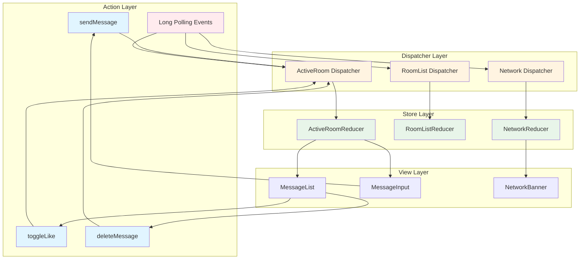
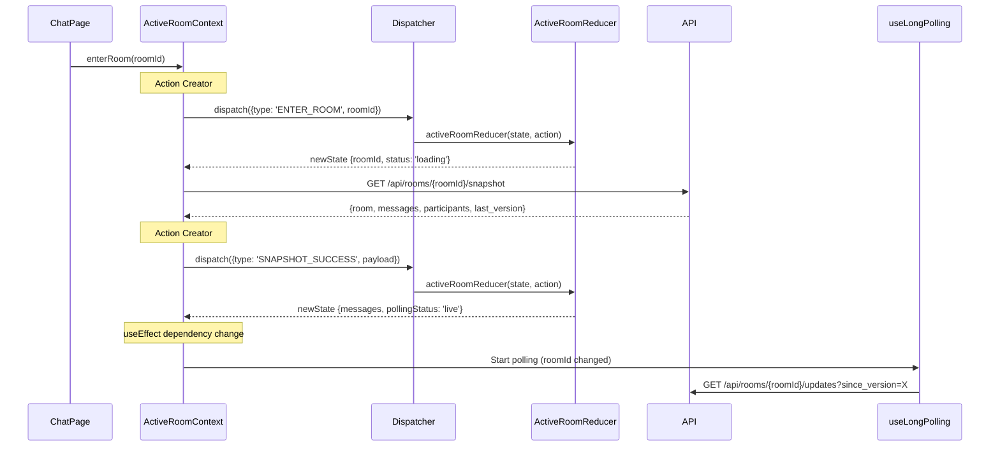
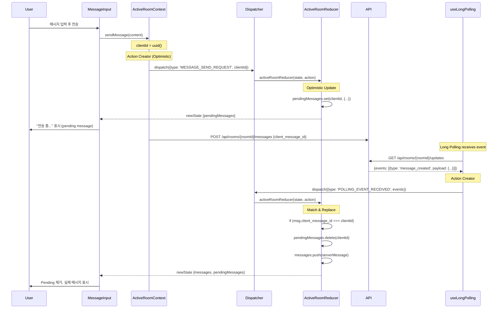
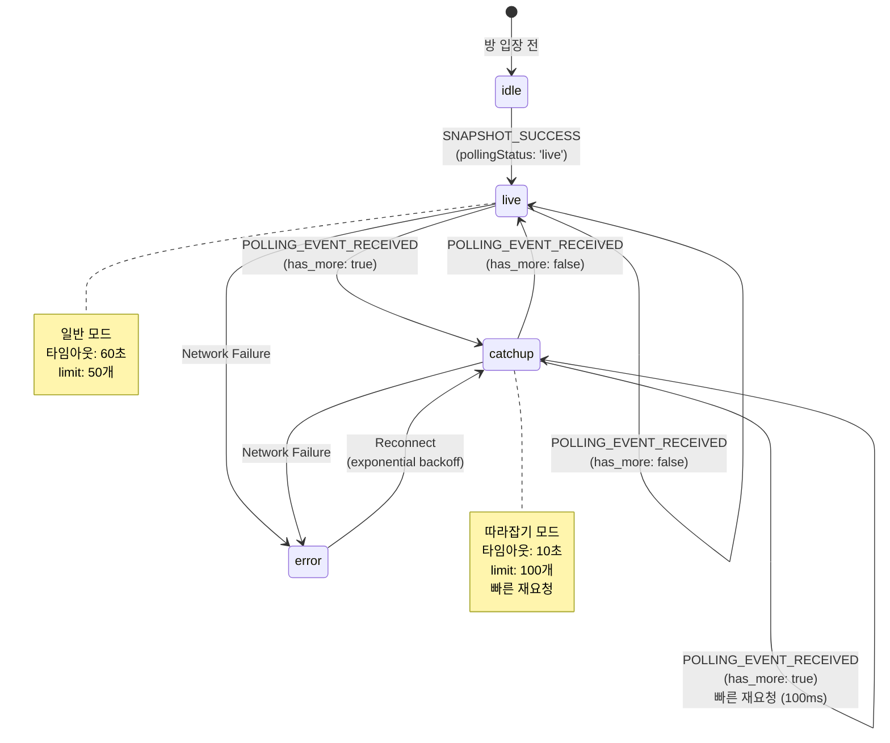
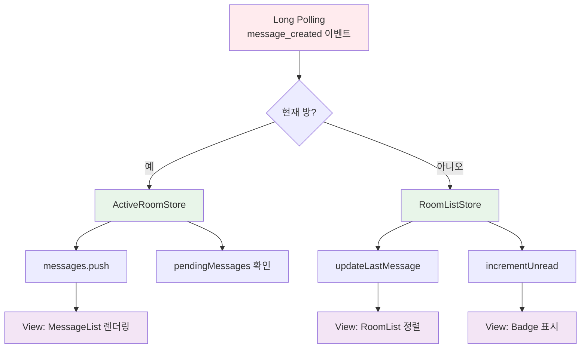
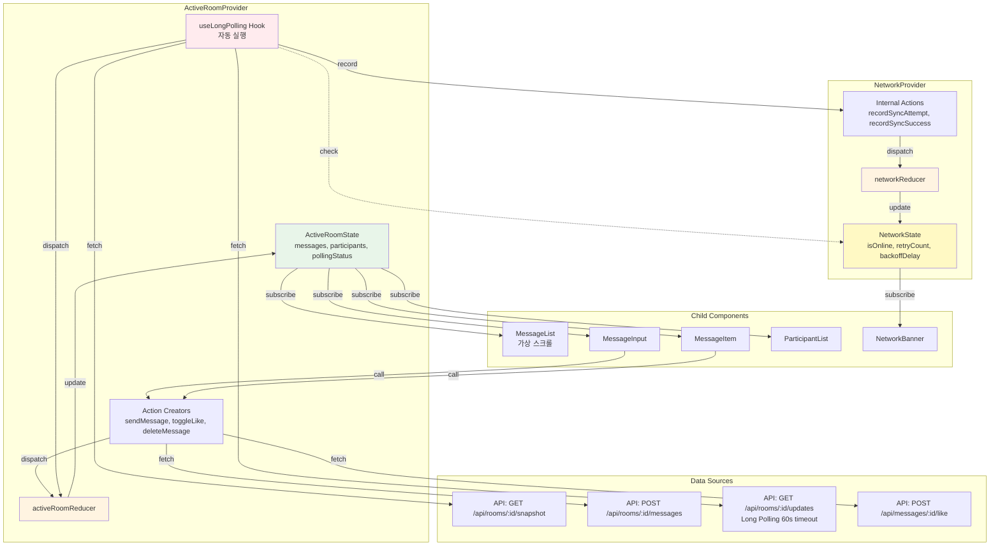
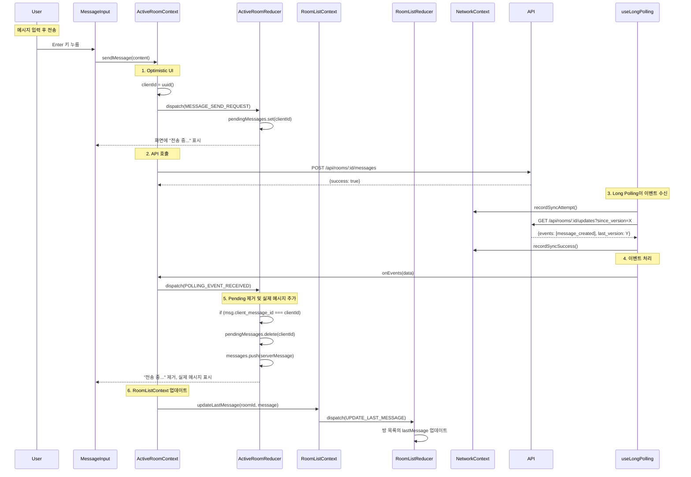

# Chat Room Page - State Management Implementation

> **관련 문서**: docs/state-management.md, docs/pages/chat-room/plan.md  
> **Context**: AuthContext, RoomListContext, ActiveRoomContext, UIContext, NetworkContext  
> **우선순위**: P0  
> **상태**: 미구현

---

## 📋 개요

채팅방 페이지는 **가장 복잡한 상태 관리**가 필요합니다. 5개의 Context를 모두 사용하며, Long Polling을 통한 실시간 동기화를 구현합니다.

---

## 🎯 필요한 Context

### 1. AuthContext
```typescript
const { user } = useAuth();
```

### 2. RoomListContext
```typescript
const {
  updateLastMessage,  // 새 메시지 도착 시 목록 업데이트
  incrementUnread,    // 다른 방에서 메시지 수신
  resetUnread,        // 현재 방 입장 시
} = useRoomList();
```

### 3. ActiveRoomContext (핵심)
```typescript
const {
  visibleMessages,     // Message[] - 화면에 표시할 메시지
  currentRoom,         // RoomDetail | null
  participants,        // Participant[]
  isPollingActive,     // boolean
  isLoading,           // boolean
  hasMoreHistory,      // boolean
  
  enterRoom,           // (roomId: string) => Promise<void>
  exitRoom,            // () => void
  loadMoreHistory,     // () => Promise<void>
  sendMessage,         // (content: string, replyToId?: string) => Promise<void>
  toggleLike,          // (messageId: string) => Promise<void>
  deleteMessage,       // (messageId: string, type: 'all' | 'me') => Promise<void>
  setReplyTarget,      // (message: Message | null) => void
} = useActiveRoom();
```

### 4. UIContext
```typescript
const {
  openModal,    // (modal: 'inviteUser' | 'confirmDelete') => void
  showToast,    // (type, message) => void
} = useUI();
```

### 5. NetworkContext
```typescript
const {
  isOnline,         // boolean
  nextRetryDelay,   // number
} = useNetwork();
```

---

## 🏗️ 구현 계획

### Phase 1: NetworkContext 생성

#### 1.1 상태 정의 (`src/features/network/types.ts`)

```typescript
export interface NetworkState {
  isOnline: boolean;
  lastSyncAttempt: string | null;
  retryCount: number;
  backoffDelay: number; // ms
  syncStatus: 'idle' | 'syncing' | 'error';
}

export type NetworkAction =
  | { type: 'STATUS_CHANGE'; payload: { isOnline: boolean } }
  | { type: 'SYNC_ATTEMPT' }
  | { type: 'SYNC_SUCCESS' }
  | { type: 'SYNC_FAILURE'; payload: { error: string } }
  | { type: 'RESET_BACKOFF' };
```

---

#### 1.2 Reducer (`src/features/network/context/networkReducer.ts`)

```typescript
import type { NetworkState, NetworkAction } from '../types';

export const initialNetworkState: NetworkState = {
  isOnline: true,
  lastSyncAttempt: null,
  retryCount: 0,
  backoffDelay: 100, // Start with 100ms
  syncStatus: 'idle',
};

const MAX_BACKOFF = 30000; // 30초

export function networkReducer(
  state: NetworkState,
  action: NetworkAction
): NetworkState {
  switch (action.type) {
    case 'STATUS_CHANGE':
      return {
        ...state,
        isOnline: action.payload.isOnline,
        retryCount: action.payload.isOnline ? 0 : state.retryCount,
        backoffDelay: action.payload.isOnline ? 100 : state.backoffDelay,
      };

    case 'SYNC_ATTEMPT':
      return {
        ...state,
        lastSyncAttempt: new Date().toISOString(),
        syncStatus: 'syncing',
      };

    case 'SYNC_SUCCESS':
      return {
        ...state,
        retryCount: 0,
        backoffDelay: 100,
        syncStatus: 'idle',
      };

    case 'SYNC_FAILURE': {
      const newRetryCount = state.retryCount + 1;
      const newBackoff = Math.min(state.backoffDelay * 2, MAX_BACKOFF);

      return {
        ...state,
        retryCount: newRetryCount,
        backoffDelay: newBackoff,
        syncStatus: 'error',
      };
    }

    case 'RESET_BACKOFF':
      return {
        ...state,
        retryCount: 0,
        backoffDelay: 100,
      };

    default:
      return state;
  }
}
```

---

#### 1.3 Context Provider (`src/features/network/context/NetworkContext.tsx`)

```typescript
"use client";

import {
  createContext,
  useReducer,
  useCallback,
  useMemo,
  useContext,
  useEffect,
  type ReactNode,
} from 'react';
import { networkReducer, initialNetworkState } from './networkReducer';
import type { NetworkState } from '../types';

interface NetworkContextValue extends NetworkState {
  shouldRetry: boolean;
  nextRetryDelay: number;
  recordSyncAttempt: () => void;
  recordSyncSuccess: () => void;
  recordSyncFailure: (error: string) => void;
  resetBackoff: () => void;
}

const NetworkContext = createContext<NetworkContextValue | null>(null);

export function NetworkProvider({ children }: { children: ReactNode }) {
  const [state, dispatch] = useReducer(networkReducer, initialNetworkState);

  // Listen to online/offline events
  useEffect(() => {
    const handleOnline = () => {
      dispatch({ type: 'STATUS_CHANGE', payload: { isOnline: true } });
    };

    const handleOffline = () => {
      dispatch({ type: 'STATUS_CHANGE', payload: { isOnline: false } });
    };

    window.addEventListener('online', handleOnline);
    window.addEventListener('offline', handleOffline);

    return () => {
      window.removeEventListener('online', handleOnline);
      window.removeEventListener('offline', handleOffline);
    };
  }, []);

  const recordSyncAttempt = useCallback(() => {
    dispatch({ type: 'SYNC_ATTEMPT' });
  }, []);

  const recordSyncSuccess = useCallback(() => {
    dispatch({ type: 'SYNC_SUCCESS' });
  }, []);

  const recordSyncFailure = useCallback((error: string) => {
    dispatch({ type: 'SYNC_FAILURE', payload: { error } });
  }, []);

  const resetBackoff = useCallback(() => {
    dispatch({ type: 'RESET_BACKOFF' });
  }, []);

  const shouldRetry = useMemo(() => {
    return state.isOnline && state.syncStatus !== 'syncing';
  }, [state.isOnline, state.syncStatus]);

  const value = useMemo<NetworkContextValue>(() => ({
    ...state,
    shouldRetry,
    nextRetryDelay: state.backoffDelay,
    recordSyncAttempt,
    recordSyncSuccess,
    recordSyncFailure,
    resetBackoff,
  }), [
    state,
    shouldRetry,
    recordSyncAttempt,
    recordSyncSuccess,
    recordSyncFailure,
    resetBackoff,
  ]);

  return (
    <NetworkContext.Provider value={value}>
      {children}
    </NetworkContext.Provider>
  );
}

export function useNetwork() {
  const context = useContext(NetworkContext);
  if (!context) {
    throw new Error('useNetwork must be used within NetworkProvider');
  }
  return context;
}
```

---

### Phase 2: ActiveRoomContext 생성 (핵심)

#### 2.1 상태 정의 (`src/features/active-room/types.ts`)

```typescript
export interface ActiveRoomState {
  roomId: string | null;
  roomInfo: RoomDetail | null;
  messages: Message[];
  participants: Participant[];
  
  // Long Polling
  lastSyncVersion: number;
  pollingStatus: 'idle' | 'live' | 'catchup' | 'error';
  
  // Optimistic UI
  pendingMessages: Map<string, PendingMessage>;
  
  // UI State
  likedMessageIds: Set<string>;
  hiddenMessageIds: Set<string>;
  replyTarget: Message | null;
  
  // History
  isLoadingHistory: boolean;
  hasMoreHistory: boolean;
  
  status: 'idle' | 'loading' | 'loaded' | 'error';
  error: string | null;
}

export interface Message {
  id: string;
  room_id: string;
  user_id: string;
  user_nickname: string;
  content: string;
  reply_to_message_id: string | null;
  like_count: number;
  is_deleted: boolean;
  client_message_id: string | null;
  created_at: string;
  updated_at: string;
}

export interface PendingMessage {
  clientId: string;
  content: string;
  status: 'sending' | 'error';
  error?: string;
  replyToId?: string;
  created_at: string;
}

export interface RoomDetail {
  id: string;
  name: string;
  participant_count: number;
  created_at: string;
}

export interface Participant {
  id: string;
  user_id: string;
  nickname: string;
  avatar_url?: string;
  role: 'owner' | 'member';
  joined_at: string;
}

export type ActiveRoomAction =
  | { type: 'ENTER_ROOM'; payload: { roomId: string } }
  | { type: 'EXIT_ROOM' }
  | { type: 'SNAPSHOT_SUCCESS'; payload: {
      roomInfo: RoomDetail;
      messages: Message[];
      participants: Participant[];
      lastSyncVersion: number;
    }}
  | { type: 'MESSAGE_SEND_REQUEST'; payload: {
      clientId: string;
      content: string;
      replyToId?: string;
    }}
  | { type: 'MESSAGE_SEND_SUCCESS'; payload: {
      clientId: string;
      message: Message;
    }}
  | { type: 'MESSAGE_SEND_FAILURE'; payload: {
      clientId: string;
      error: string;
    }}
  | { type: 'POLLING_EVENT_RECEIVED'; payload: {
      events: RoomEvent[];
      privateDeletions: string[];
      lastVersion: number;
      hasMore: boolean;
    }}
  | { type: 'LOAD_HISTORY_REQUEST' }
  | { type: 'LOAD_HISTORY_SUCCESS'; payload: {
      messages: Message[];
      hasMore: boolean;
    }}
  | { type: 'MESSAGE_LIKE_TOGGLE'; payload: { messageId: string } }
  | { type: 'MESSAGE_DELETE_LOCAL'; payload: { messageId: string } }
  | { type: 'SET_REPLY_TARGET'; payload: { message: Message | null } };
```

---

#### 2.2 Reducer (일부 - 파일이 길어서 핵심만)

```typescript
export function activeRoomReducer(
  state: ActiveRoomState,
  action: ActiveRoomAction
): ActiveRoomState {
  switch (action.type) {
    case 'ENTER_ROOM':
      return {
        ...initialActiveRoomState,
        roomId: action.payload.roomId,
      };

    case 'SNAPSHOT_SUCCESS':
      return {
        ...state,
        roomInfo: action.payload.roomInfo,
        messages: action.payload.messages,
        participants: action.payload.participants,
        lastSyncVersion: action.payload.lastSyncVersion,
        pollingStatus: 'live',
        status: 'loaded',
      };

    case 'MESSAGE_SEND_REQUEST': {
      const pending: PendingMessage = {
        clientId: action.payload.clientId,
        content: action.payload.content,
        status: 'sending',
        replyToId: action.payload.replyToId,
        created_at: new Date().toISOString(),
      };

      const newPendingMessages = new Map(state.pendingMessages);
      newPendingMessages.set(action.payload.clientId, pending);

      return {
        ...state,
        pendingMessages: newPendingMessages,
      };
    }

    case 'POLLING_EVENT_RECEIVED': {
      let newMessages = [...state.messages];
      let newPendingMessages = new Map(state.pendingMessages);

      action.payload.events.forEach(event => {
        switch (event.type) {
          case 'message_created': {
            const message = event.payload as Message;

            // Remove pending message if it matches
            if (message.client_message_id) {
              newPendingMessages.delete(message.client_message_id);
            }

            newMessages.push(message);
            break;
          }

          case 'message_updated': {
            const { message_id, updates } = event.payload;
            newMessages = newMessages.map(msg =>
              msg.id === message_id ? { ...msg, ...updates } : msg
            );
            break;
          }

          case 'message_deleted': {
            const { message_id } = event.payload;
            newMessages = newMessages.map(msg =>
              msg.id === message_id ? { ...msg, is_deleted: true } : msg
            );
            break;
          }
        }
      });

      // Handle private deletions
      const newHiddenIds = new Set(state.hiddenMessageIds);
      action.payload.privateDeletions.forEach(id => {
        newHiddenIds.add(id);
      });

      return {
        ...state,
        messages: newMessages,
        pendingMessages: newPendingMessages,
        hiddenMessageIds: newHiddenIds,
        lastSyncVersion: action.payload.lastVersion,
        pollingStatus: action.payload.hasMore ? 'catchup' : 'live',
      };
    }

    case 'MESSAGE_LIKE_TOGGLE': {
      const { messageId } = action.payload;
      const newLikedIds = new Set(state.likedMessageIds);

      if (newLikedIds.has(messageId)) {
        newLikedIds.delete(messageId);
      } else {
        newLikedIds.add(messageId);
      }

      // Optimistic update
      const newMessages = state.messages.map(msg =>
        msg.id === messageId
          ? {
              ...msg,
              like_count: newLikedIds.has(messageId)
                ? msg.like_count + 1
                : msg.like_count - 1,
            }
          : msg
      );

      return {
        ...state,
        messages: newMessages,
        likedMessageIds: newLikedIds,
      };
    }

    // ... other cases
  }
}
```

---

#### 2.3 Long Polling Hook (`src/features/active-room/hooks/useLongPolling.ts`)

```typescript
import { useEffect, useRef } from 'react';
import { apiClient } from '@/lib/remote/api-client';
import { useNetwork } from '@/features/network/hooks/useNetwork';

export function useLongPolling(
  roomId: string | null,
  lastSyncVersion: number,
  pollingStatus: 'idle' | 'live' | 'catchup' | 'error',
  onEvents: (data: any) => void,
  enabled: boolean,
) {
  const abortControllerRef = useRef<AbortController | null>(null);
  const { isOnline, shouldRetry, nextRetryDelay, recordSyncAttempt, recordSyncSuccess, recordSyncFailure } = useNetwork();

  useEffect(() => {
    if (!enabled || !roomId || pollingStatus === 'error' || !shouldRetry) {
      return;
    }

    const poll = async () => {
      // Cancel previous request
      if (abortControllerRef.current) {
        abortControllerRef.current.abort();
      }

      const controller = new AbortController();
      abortControllerRef.current = controller;

      try {
        recordSyncAttempt();

        const response = await apiClient.get(
          `/api/rooms/${roomId}/updates`,
          {
            params: {
              since_version: lastSyncVersion,
              limit: pollingStatus === 'catchup' ? 100 : 50,
            },
            signal: controller.signal,
            timeout: 60000, // 60 second timeout for long polling
          }
        );

        recordSyncSuccess();
        onEvents(response.data);

        // If catchup mode and has_more, retry immediately
        if (pollingStatus === 'catchup' && response.data.has_more) {
          setTimeout(poll, nextRetryDelay);
        } else {
          // Normal live mode, start next poll
          poll();
        }
      } catch (error: any) {
        if (error.name === 'AbortError' || error.name === 'CanceledError') {
          return; // Intentionally cancelled
        }

        recordSyncFailure(error.message);

        // Retry with exponential backoff
        setTimeout(poll, nextRetryDelay);
      }
    };

    poll();

    return () => {
      if (abortControllerRef.current) {
        abortControllerRef.current.abort();
      }
    };
  }, [
    roomId,
    lastSyncVersion,
    pollingStatus,
    enabled,
    shouldRetry,
    nextRetryDelay,
    onEvents,
    recordSyncAttempt,
    recordSyncSuccess,
    recordSyncFailure,
  ]);
}
```

---

## 📊 주요 데이터 흐름

### Flux 패턴 아키텍처 (Chat Room - Multi-Store + Long Polling)



**Multi-Store 협력:**
- **ActiveRoomStore**: 현재 방 메시지, 참여자
- **RoomListStore**: 목록의 lastMessage, unreadCount 업데이트
- **NetworkStore**: 재연결, exponential backoff
- **Long Polling**: 모든 Store에 이벤트 전파

---

### 1. 방 입장 및 Snapshot 로드



---

### 2. 메시지 전송 (Optimistic UI with Flux)



---

### 3. Long Polling 상태 전이 (Catchup Mode)



---

### 4. Multi-Store 이벤트 전파



---

## 🏛️ Context 아키텍처 상세 설계

### ActiveRoomContext + NetworkContext 데이터 흐름



---

### ActiveRoomState 인터페이스 설계

```typescript
/**
 * ActiveRoomContext의 중앙 상태
 * - 현재 보고 있는 채팅방의 모든 상태
 */
interface ActiveRoomState {
  // ===== 기본 정보 =====
  roomId: string | null;
  roomInfo: RoomDetail | null;
  
  // ===== 메시지 관련 =====
  messages: Message[];              // 확정된 메시지 목록
  pendingMessages: Map<string, PendingMessage>;  // 전송 중인 메시지 (Optimistic UI)
  
  // ===== 참여자 =====
  participants: Participant[];
  
  // ===== Long Polling 상태 =====
  lastSyncVersion: number;          // 마지막 동기화 버전
  pollingStatus: 'idle' | 'live' | 'catchup' | 'error';
  
  // ===== UI 상태 =====
  likedMessageIds: Set<string>;     // 내가 좋아요한 메시지 ID
  hiddenMessageIds: Set<string>;    // 나만 삭제한 메시지 ID
  replyTarget: Message | null;      // 답장 대상 메시지
  
  // ===== 히스토리 로딩 =====
  isLoadingHistory: boolean;
  hasMoreHistory: boolean;
  oldestMessageVersion: number | null;
  
  // ===== 전체 상태 =====
  status: 'idle' | 'loading' | 'loaded' | 'error';
  error: string | null;
}

/**
 * Message 엔티티
 */
interface Message {
  id: string;
  room_id: string;
  user_id: string;
  user_nickname: string;
  user_avatar_url?: string;
  content: string;
  reply_to_message_id: string | null;
  like_count: number;
  is_deleted: boolean;
  client_message_id: string | null;  // Optimistic UI 매칭용
  created_at: string;
  updated_at: string;
  version: number;                    // Long Polling 버전 관리
}

/**
 * PendingMessage (Optimistic UI)
 */
interface PendingMessage {
  clientId: string;                   // 고유 임시 ID
  content: string;
  status: 'sending' | 'error';
  error?: string;
  replyToId?: string;
  created_at: string;
}

/**
 * RoomDetail 엔티티
 */
interface RoomDetail {
  id: string;
  name: string;
  participant_count: number;
  created_at: string;
  creator_id: string;
}

/**
 * Participant 엔티티
 */
interface Participant {
  id: string;                         // room_participants.id
  user_id: string;
  nickname: string;
  avatar_url?: string;
  role: 'owner' | 'member';
  joined_at: string;
  last_read_version?: number;         // 읽음 표시용
}

/**
 * RoomEvent (Long Polling 응답)
 */
interface RoomEvent {
  type: 'message_created' | 'message_updated' | 'message_deleted' | 'message_liked' | 'participant_joined' | 'participant_left';
  version: number;
  payload: any;
}
```

---

### ActiveRoomAction 인터페이스 설계

```typescript
/**
 * ActiveRoom Reducer Actions
 */
type ActiveRoomAction =
  // ===== 방 입장/퇴장 =====
  | {
      type: 'ENTER_ROOM';
      payload: {
        roomId: string;
      };
    }
  | {
      type: 'EXIT_ROOM';
    }
  | {
      type: 'SNAPSHOT_SUCCESS';
      payload: {
        roomInfo: RoomDetail;
        messages: Message[];
        participants: Participant[];
        lastSyncVersion: number;
      };
    }
  | {
      type: 'SNAPSHOT_FAILURE';
      payload: {
        error: string;
      };
    }
  
  // ===== 메시지 전송 (Optimistic UI) =====
  | {
      type: 'MESSAGE_SEND_REQUEST';
      payload: {
        clientId: string;
        content: string;
        replyToId?: string;
      };
    }
  | {
      type: 'MESSAGE_SEND_SUCCESS';
      payload: {
        clientId: string;
        message: Message;
      };
    }
  | {
      type: 'MESSAGE_SEND_FAILURE';
      payload: {
        clientId: string;
        error: string;
      };
    }
  
  // ===== Long Polling 이벤트 =====
  | {
      type: 'POLLING_EVENT_RECEIVED';
      payload: {
        events: RoomEvent[];
        privateDeletions: string[];   // 나만 삭제한 메시지 ID
        lastVersion: number;
        hasMore: boolean;             // catchup 모드 판단
      };
    }
  | {
      type: 'POLLING_ERROR';
      payload: {
        error: string;
      };
    }
  
  // ===== 히스토리 로딩 =====
  | {
      type: 'LOAD_HISTORY_REQUEST';
    }
  | {
      type: 'LOAD_HISTORY_SUCCESS';
      payload: {
        messages: Message[];
        hasMore: boolean;
      };
    }
  | {
      type: 'LOAD_HISTORY_FAILURE';
      payload: {
        error: string;
      };
    }
  
  // ===== 메시지 액션 =====
  | {
      type: 'MESSAGE_LIKE_TOGGLE';
      payload: {
        messageId: string;
        isLiked: boolean;             // 현재 좋아요 상태
      };
    }
  | {
      type: 'MESSAGE_DELETE_LOCAL';
      payload: {
        messageId: string;
      };
    }
  | {
      type: 'SET_REPLY_TARGET';
      payload: {
        message: Message | null;
      };
    }
  
  // ===== 참여자 =====
  | {
      type: 'PARTICIPANT_JOINED';
      payload: {
        participant: Participant;
      };
    }
  | {
      type: 'PARTICIPANT_LEFT';
      payload: {
        userId: string;
      };
    };
```

---

### ActiveRoomContext 노출 인터페이스

```typescript
/**
 * useActiveRoom() 훅이 반환하는 인터페이스
 */
interface ActiveRoomContextValue {
  // ===== 상태 값 (Read-only) =====
  
  roomId: string | null;
  roomInfo: RoomDetail | null;
  messages: Message[];
  participants: Participant[];
  replyTarget: Message | null;
  pollingStatus: ActiveRoomState['pollingStatus'];
  status: ActiveRoomState['status'];
  error: string | null;
  
  
  // ===== 계산된 값 (Derived State) =====
  
  /**
   * 화면에 표시할 메시지 목록
   * - messages + pendingMessages 병합
   * - hiddenMessageIds 필터링
   * - 시간순 정렬
   */
  visibleMessages: (Message | PendingMessage)[];
  
  /**
   * 현재 방 정보
   */
  currentRoom: RoomDetail | null;
  
  /**
   * Long Polling 활성 상태
   */
  isPollingActive: boolean;
  // computed: pollingStatus === 'live' || pollingStatus === 'catchup'
  
  /**
   * 로딩 중 여부
   */
  isLoading: boolean;
  
  /**
   * 과거 메시지 더 있는지
   */
  hasMoreHistory: boolean;
  
  /**
   * 히스토리 로딩 중
   */
  isLoadingHistory: boolean;
  
  /**
   * 전송 중인 메시지 수
   */
  pendingCount: number;
  // computed: pendingMessages.size
  
  
  // ===== Action Creator 함수 =====
  
  /**
   * 방 입장
   * - Snapshot 로드
   * - Long Polling 시작
   * - RoomListContext의 resetUnread 호출
   */
  enterRoom: (roomId: string) => Promise<void>;
  
  /**
   * 방 퇴장
   * - Long Polling 중단
   * - 상태 초기화
   */
  exitRoom: () => void;
  
  /**
   * 과거 메시지 더 불러오기
   * - 스크롤 상단 도달 시 호출
   */
  loadMoreHistory: () => Promise<void>;
  
  /**
   * 메시지 전송
   * - Optimistic UI
   * - client_message_id 생성
   * @throws {Error} 전송 실패 시
   */
  sendMessage: (content: string, replyToId?: string) => Promise<void>;
  
  /**
   * 메시지 좋아요 토글
   * - Optimistic UI
   */
  toggleLike: (messageId: string) => Promise<void>;
  
  /**
   * 메시지 삭제
   * @param deleteType - 'all': 모두에게 삭제, 'me': 나만 삭제
   */
  deleteMessage: (messageId: string, deleteType: 'all' | 'me') => Promise<void>;
  
  /**
   * 답장 대상 설정
   */
  setReplyTarget: (message: Message | null) => void;
  
  /**
   * 특정 메시지로 스크롤
   */
  scrollToMessage: (messageId: string) => void;
}
```

---

### NetworkState 인터페이스 설계

```typescript
/**
 * NetworkContext의 중앙 상태
 * - 네트워크 상태 및 재연결 로직
 */
interface NetworkState {
  // 온라인 상태
  isOnline: boolean;
  
  // 마지막 동기화 시도 시간
  lastSyncAttempt: string | null;
  
  // 재시도 횟수
  retryCount: number;
  
  // 현재 백오프 지연 시간 (ms)
  backoffDelay: number;               // 100ms → 200ms → 400ms → ... → 30000ms
  
  // 동기화 상태
  syncStatus: 'idle' | 'syncing' | 'error';
}

/**
 * Network Reducer Actions
 */
type NetworkAction =
  | {
      type: 'STATUS_CHANGE';
      payload: {
        isOnline: boolean;
      };
    }
  | {
      type: 'SYNC_ATTEMPT';
    }
  | {
      type: 'SYNC_SUCCESS';
    }
  | {
      type: 'SYNC_FAILURE';
      payload: {
        error: string;
      };
    }
  | {
      type: 'RESET_BACKOFF';
    };
```

---

### NetworkContext 노출 인터페이스

```typescript
/**
 * useNetwork() 훅이 반환하는 인터페이스
 */
interface NetworkContextValue {
  // ===== 상태 값 =====
  
  isOnline: boolean;
  lastSyncAttempt: string | null;
  retryCount: number;
  backoffDelay: number;
  syncStatus: NetworkState['syncStatus'];
  
  
  // ===== 계산된 값 =====
  
  /**
   * 재시도 가능 여부
   */
  shouldRetry: boolean;
  // computed: isOnline && syncStatus !== 'syncing'
  
  /**
   * 다음 재시도 지연 시간
   */
  nextRetryDelay: number;
  // computed: backoffDelay
  
  
  // ===== Internal API (ActiveRoomContext에서만 사용) =====
  
  recordSyncAttempt: () => void;
  recordSyncSuccess: () => void;
  recordSyncFailure: (error: string) => void;
  resetBackoff: () => void;
}
```

---

### useLongPolling Hook 설계

```typescript
/**
 * Long Polling 자동 실행 Hook
 * - ActiveRoomContext 내부에서만 사용
 * - useEffect로 자동 시작/중단
 */
function useLongPolling(
  roomId: string | null,
  lastSyncVersion: number,
  pollingStatus: ActiveRoomState['pollingStatus'],
  onEvents: (data: {
    events: RoomEvent[];
    privateDeletions: string[];
    lastVersion: number;
    hasMore: boolean;
  }) => void,
  enabled: boolean,
): void {
  // 내부 구현:
  // 1. AbortController로 요청 취소 관리
  // 2. NetworkContext에서 shouldRetry, nextRetryDelay 가져오기
  // 3. 재귀적으로 poll() 함수 호출
  // 4. catchup 모드일 때 빠른 재요청 (100ms)
  // 5. live 모드일 때 일반 재요청 (즉시)
  // 6. 에러 시 exponential backoff
}
```

---

### Context 간 협력 시나리오: 메시지 전송



---

### 하위 컴포넌트 사용 예시

```typescript
// ===== ChatRoomPage.tsx =====
function ChatRoomPage({ params }: { params: Promise<{ roomId: string }> }) {
  const { roomId } = use(params);
  const {
    enterRoom,
    exitRoom,
    visibleMessages,
    isLoading,
    currentRoom,
  } = useActiveRoom();
  
  useEffect(() => {
    enterRoom(roomId);
    return () => exitRoom();
  }, [roomId]);
  
  if (isLoading) return <LoadingSpinner />;
  if (!currentRoom) return <NotFound />;
  
  return (
    <div className="chat-container">
      <ChatHeader room={currentRoom} />
      <MessageList messages={visibleMessages} />
      <MessageInput />
    </div>
  );
}

// ===== MessageList.tsx =====
function MessageList({ messages }: { messages: (Message | PendingMessage)[] }) {
  const {
    loadMoreHistory,
    hasMoreHistory,
    isLoadingHistory,
  } = useActiveRoom();
  
  const scrollContainerRef = useRef<HTMLDivElement>(null);
  
  // 스크롤 상단 감지
  const handleScroll = () => {
    if (scrollContainerRef.current.scrollTop === 0 && hasMoreHistory) {
      loadMoreHistory();
    }
  };
  
  return (
    <div ref={scrollContainerRef} onScroll={handleScroll}>
      {isLoadingHistory && <Spinner />}
      {messages.map(msg => (
        <MessageItem key={'id' in msg ? msg.id : msg.clientId} message={msg} />
      ))}
    </div>
  );
}

// ===== MessageInput.tsx =====
function MessageInput() {
  const {
    sendMessage,
    replyTarget,
    setReplyTarget,
  } = useActiveRoom();
  
  const [content, setContent] = useState('');
  
  const handleSubmit = async (e: React.FormEvent) => {
    e.preventDefault();
    if (!content.trim()) return;
    
    try {
      await sendMessage(content, replyTarget?.id);
      setContent('');
      setReplyTarget(null);
    } catch (error) {
      // 에러 처리
    }
  };
  
  return (
    <form onSubmit={handleSubmit}>
      {replyTarget && (
        <ReplyPreview
          message={replyTarget}
          onCancel={() => setReplyTarget(null)}
        />
      )}
      <Input
        value={content}
        onChange={e => setContent(e.target.value)}
        placeholder="메시지를 입력하세요..."
      />
      <Button type="submit">전송</Button>
    </form>
  );
}

// ===== MessageItem.tsx =====
function MessageItem({ message }: { message: Message | PendingMessage }) {
  const { toggleLike, deleteMessage, setReplyTarget } = useActiveRoom();
  const { user } = useAuth();
  
  // Pending 메시지 판별
  const isPending = 'clientId' in message;
  const isMyMessage = !isPending && message.user_id === user?.id;
  
  const handleLike = () => {
    if (!isPending) {
      toggleLike(message.id);
    }
  };
  
  const handleReply = () => {
    if (!isPending) {
      setReplyTarget(message);
    }
  };
  
  const handleDelete = (type: 'all' | 'me') => {
    if (!isPending) {
      deleteMessage(message.id, type);
    }
  };
  
  return (
    <div className={`message ${isPending ? 'pending' : ''} ${isMyMessage ? 'mine' : ''}`}>
      {!isPending && <Avatar src={message.user_avatar_url} />}
      <div className="content">
        {!isPending && <strong>{message.user_nickname}</strong>}
        <p>{message.content}</p>
        {isPending && message.status === 'sending' && <Spinner size="sm" />}
        {isPending && message.status === 'error' && <ErrorIcon />}
      </div>
      {!isPending && (
        <Actions>
          <Button onClick={handleLike}>👍 {message.like_count}</Button>
          <Button onClick={handleReply}>답장</Button>
          {isMyMessage && (
            <>
              <Button onClick={() => handleDelete('all')}>모두 삭제</Button>
              <Button onClick={() => handleDelete('me')}>나만 삭제</Button>
            </>
          )}
        </Actions>
      )}
    </div>
  );
}

// ===== NetworkBanner.tsx =====
function NetworkBanner() {
  const { isOnline, syncStatus } = useNetwork();
  
  if (isOnline && syncStatus === 'idle') return null;
  
  return (
    <div className="network-banner">
      {!isOnline && <span>⚠️ 오프라인 상태입니다</span>}
      {syncStatus === 'syncing' && <span>🔄 동기화 중...</span>}
      {syncStatus === 'error' && <span>❌ 연결 오류 (재시도 중)</span>}
    </div>
  );
}
```

---

### Reducer 로직 요약

**ActiveRoomReducer 핵심 로직:**

1. **ENTER_ROOM**: 상태 초기화, roomId 설정
2. **SNAPSHOT_SUCCESS**: messages, participants 설정, pollingStatus = 'live'
3. **MESSAGE_SEND_REQUEST**: pendingMessages에 추가
4. **POLLING_EVENT_RECEIVED**:
   - 각 이벤트 타입별 처리 (message_created, message_updated 등)
   - client_message_id 매칭으로 pendingMessages 제거
   - messages 배열 업데이트
   - hasMore = true면 pollingStatus = 'catchup'
5. **LOAD_HISTORY_SUCCESS**: messages 배열 앞에 추가 (prepend)
6. **MESSAGE_LIKE_TOGGLE**: Optimistic으로 like_count 증감, likedMessageIds 토글
7. **MESSAGE_DELETE_LOCAL**: hiddenMessageIds에 추가

**NetworkReducer 핵심 로직:**

1. **STATUS_CHANGE**: isOnline 업데이트, 온라인 전환 시 retryCount 초기화
2. **SYNC_ATTEMPT**: syncStatus = 'syncing', lastSyncAttempt 업데이트
3. **SYNC_SUCCESS**: retryCount = 0, backoffDelay = 100, syncStatus = 'idle'
4. **SYNC_FAILURE**: retryCount++, backoffDelay *= 2 (최대 30초)

---

### 메모리 관리 전략

```typescript
/**
 * 메시지 개수 제한
 * - 최대 500개까지만 메모리에 유지
 * - 스크롤 상단으로 가면 과거 메시지 로드
 * - 오래된 메시지는 자동 제거
 */
const MAX_MESSAGES_IN_MEMORY = 500;

// Reducer 내부
if (state.messages.length > MAX_MESSAGES_IN_MEMORY) {
  // 가장 오래된 메시지 제거 (앞쪽 100개)
  state.messages = state.messages.slice(100);
}

/**
 * PendingMessages 타임아웃
 * - 30초 이상 pending 상태면 자동으로 error로 전환
 */
const PENDING_TIMEOUT = 30000;

// 타이머 설정
setTimeout(() => {
  if (pendingMessages.has(clientId)) {
    dispatch({
      type: 'MESSAGE_SEND_FAILURE',
      payload: { clientId, error: 'Timeout' },
    });
  }
}, PENDING_TIMEOUT);
```

---

## 🔗 Context 간 의존성

### ActiveRoomContext의 외부 참조

**→ RoomListContext** (업데이트 호출):
```typescript
const { updateLastMessage, incrementUnread, resetUnread } = useRoomList();

// 1. 방 입장 시: 안읽은 메시지 초기화
enterRoom(roomId) {
  // Snapshot 로드 후
  resetUnread(roomId);
}

// 2. 메시지 전송/수신 시: 방 목록의 lastMessage 업데이트
onPollingEvent(events) {
  events.forEach(event => {
    if (event.type === 'message_created') {
      updateLastMessage(roomId, {
        content: event.payload.content,
        created_at: event.payload.created_at,
        sender_nickname: event.payload.user_nickname,
      });
    }
  });
}

// 3. Long Polling에서 다른 방 메시지 수신 시: 안읽은 메시지 증가
onPollingEvent(events) {
  events.forEach(event => {
    if (event.room_id !== currentRoomId) {
      incrementUnread(event.room_id);
    }
  });
}
```

**→ NetworkContext** (재연결 로직):
```typescript
const { shouldRetry, nextRetryDelay, recordSyncAttempt, recordSyncSuccess, recordSyncFailure } = useNetwork();

// Long Polling 시도 시
useLongPolling() {
  recordSyncAttempt();
  
  try {
    const response = await api.get('/rooms/:id/updates');
    recordSyncSuccess();
  } catch (error) {
    recordSyncFailure(error.message);
    // exponential backoff으로 재시도
    setTimeout(poll, nextRetryDelay);
  }
}
```

**→ AuthContext** (읽기 전용):
- `user.id`: 본인 메시지 판별, 삭제 권한 확인

**→ UIContext** (협력):
- `showToast()`: 메시지 전송 실패, 삭제 완료 알림

---

## 📦 최종 Provider 계층 구조

```typescript
// src/app/providers.tsx (전역)
export default function Providers({ children }: { children: React.ReactNode }) {
  return (
    <QueryClientProvider client={queryClient}>
      <AuthProvider>              {/* 1. 인증 (최상위) */}
        <NetworkProvider>         {/* 2. 네트워크 상태 */}
          <UIProvider>            {/* 3. UI 상태 (모달, Toast) */}
            <RoomListProvider>    {/* 4. 방 목록 */}
              {children}          {/* ActiveRoomProvider는 별도 */}
            </RoomListProvider>
          </UIProvider>
        </NetworkProvider>
      </AuthProvider>
    </QueryClientProvider>
  );
}

// src/app/(protected)/chat-room/layout.tsx (페이지 레벨)
export default function ChatRoomLayout({ children }: { children: React.ReactNode }) {
  return (
    <ActiveRoomProvider>       {/* 5. 현재 채팅방 (Chat 페이지만) */}
      {children}
    </ActiveRoomProvider>
  );
}
```

**ActiveRoomProvider를 페이지 레벨에 두는 이유:**
1. Chat 페이지에서만 필요 (Dashboard에서는 불필요)
2. 방 입장/퇴장 시 Provider mount/unmount로 자동 정리
3. 메모리 효율성 (사용하지 않을 때는 상태 유지 안 함)
4. Long Polling도 페이지 이탈 시 자동 중단

**계층 순서:**
1. **AuthProvider**: 모든 API 호출에 user 정보 필요
2. **NetworkProvider**: Long Polling 재연결 로직에 필요
3. **UIProvider**: Toast 알림에 사용
4. **RoomListProvider**: 방 목록 업데이트에 필요
5. **ActiveRoomProvider**: 위 모든 Context에 의존

---

## ✅ 구현 체크리스트

### Phase 1: NetworkContext
- [ ] `src/features/network/types.ts`
- [ ] `src/features/network/context/networkReducer.ts`
- [ ] `src/features/network/context/NetworkContext.tsx`

### Phase 2: ActiveRoomContext
- [ ] `src/features/active-room/types.ts`
- [ ] `src/features/active-room/context/activeRoomReducer.ts`
- [ ] `src/features/active-room/context/ActiveRoomContext.tsx`
- [ ] `src/features/active-room/hooks/useLongPolling.ts`

### Phase 3: Provider 통합
- [ ] `src/app/providers.tsx`에 NetworkProvider 추가 (전역)
- [ ] `src/app/(protected)/chat-room/layout.tsx`에 ActiveRoomProvider 추가 (페이지 레벨)
- [ ] 의존성 순서: Auth → Network → UI → RoomList → ActiveRoom

### Phase 4: 컴포넌트
- [ ] ChatRoom 페이지에서 useActiveRoom 사용
- [ ] MessageList 구현 (가상 스크롤링)
- [ ] MessageInput 구현
- [ ] MessageItem 구현 (답장, 좋아요, 삭제)
- [ ] NetworkBanner 구현 (오프라인 알림)

---

## 📝 참고사항

### Long Polling 최적화
- **Live Mode**: 새 메시지 대기, 타임아웃 60초
- **Catchup Mode**: 누락된 이벤트 빠르게 가져오기, 100개씩
- **Exponential Backoff**: 100ms → 200ms → 400ms → ... → 최대 30초

### Optimistic UI
- 메시지 전송 시 즉시 화면에 표시 ("전송 중...")
- Long Polling에서 실제 메시지 수신 시 교체
- `client_message_id`로 매칭

### 메모리 관리
- 메시지는 최대 500개까지만 메모리에 유지
- 스크롤 상단 도달 시 과거 메시지 추가 로드
- 오래된 메시지는 자동 제거

---

**문서 버전**: v1.0  
**최종 수정**: 2025년 11월 15일
