# Chat Room Page - State Management Implementation

> **관련 문서**: docs/state-management.md, docs/pages/chat-room/plan.md  
> **Context**: AuthContext, RoomListContext, ActiveRoomContext, UIContext, NetworkContext  
> **우선순위**: P0  
> **상태**: 미구현

---

## 📋 개요

채팅방 페이지는 **가장 복잡한 상태 관리**가 필요합니다. 5개의 Context를 모두 사용하며, Long Polling을 통한 실시간 동기화를 구현합니다.

---

## 🎯 필요한 Context

### 1. AuthContext
```typescript
const { user } = useAuth();
```

### 2. RoomListContext
```typescript
const {
  updateLastMessage,  // 새 메시지 도착 시 목록 업데이트
  incrementUnread,    // 다른 방에서 메시지 수신
  resetUnread,        // 현재 방 입장 시
} = useRoomList();
```

### 3. ActiveRoomContext (핵심)
```typescript
const {
  visibleMessages,     // Message[] - 화면에 표시할 메시지
  currentRoom,         // RoomDetail | null
  participants,        // Participant[]
  isPollingActive,     // boolean
  isLoading,           // boolean
  hasMoreHistory,      // boolean
  
  enterRoom,           // (roomId: string) => Promise<void>
  exitRoom,            // () => void
  loadMoreHistory,     // () => Promise<void>
  sendMessage,         // (content: string, replyToId?: string) => Promise<void>
  toggleLike,          // (messageId: string) => Promise<void>
  deleteMessage,       // (messageId: string, type: 'all' | 'me') => Promise<void>
  setReplyTarget,      // (message: Message | null) => void
} = useActiveRoom();
```

### 4. UIContext
```typescript
const {
  openModal,    // (modal: 'inviteUser' | 'confirmDelete') => void
  showToast,    // (type, message) => void
} = useUI();
```

### 5. NetworkContext
```typescript
const {
  isOnline,         // boolean
  nextRetryDelay,   // number
} = useNetwork();
```

---

## 🏗️ 구현 계획

### Phase 1: NetworkContext 생성

#### 1.1 상태 정의 (`src/features/network/types.ts`)

```typescript
export interface NetworkState {
  isOnline: boolean;
  lastSyncAttempt: string | null;
  retryCount: number;
  backoffDelay: number; // ms
  syncStatus: 'idle' | 'syncing' | 'error';
}

export type NetworkAction =
  | { type: 'STATUS_CHANGE'; payload: { isOnline: boolean } }
  | { type: 'SYNC_ATTEMPT' }
  | { type: 'SYNC_SUCCESS' }
  | { type: 'SYNC_FAILURE'; payload: { error: string } }
  | { type: 'RESET_BACKOFF' };
```

---

#### 1.2 Reducer (`src/features/network/context/networkReducer.ts`)

```typescript
import type { NetworkState, NetworkAction } from '../types';

export const initialNetworkState: NetworkState = {
  isOnline: true,
  lastSyncAttempt: null,
  retryCount: 0,
  backoffDelay: 100, // Start with 100ms
  syncStatus: 'idle',
};

const MAX_BACKOFF = 30000; // 30초

export function networkReducer(
  state: NetworkState,
  action: NetworkAction
): NetworkState {
  switch (action.type) {
    case 'STATUS_CHANGE':
      return {
        ...state,
        isOnline: action.payload.isOnline,
        retryCount: action.payload.isOnline ? 0 : state.retryCount,
        backoffDelay: action.payload.isOnline ? 100 : state.backoffDelay,
      };

    case 'SYNC_ATTEMPT':
      return {
        ...state,
        lastSyncAttempt: new Date().toISOString(),
        syncStatus: 'syncing',
      };

    case 'SYNC_SUCCESS':
      return {
        ...state,
        retryCount: 0,
        backoffDelay: 100,
        syncStatus: 'idle',
      };

    case 'SYNC_FAILURE': {
      const newRetryCount = state.retryCount + 1;
      const newBackoff = Math.min(state.backoffDelay * 2, MAX_BACKOFF);

      return {
        ...state,
        retryCount: newRetryCount,
        backoffDelay: newBackoff,
        syncStatus: 'error',
      };
    }

    case 'RESET_BACKOFF':
      return {
        ...state,
        retryCount: 0,
        backoffDelay: 100,
      };

    default:
      return state;
  }
}
```

---

#### 1.3 Context Provider (`src/features/network/context/NetworkContext.tsx`)

```typescript
"use client";

import {
  createContext,
  useReducer,
  useCallback,
  useMemo,
  useContext,
  useEffect,
  type ReactNode,
} from 'react';
import { networkReducer, initialNetworkState } from './networkReducer';
import type { NetworkState } from '../types';

interface NetworkContextValue extends NetworkState {
  shouldRetry: boolean;
  nextRetryDelay: number;
  recordSyncAttempt: () => void;
  recordSyncSuccess: () => void;
  recordSyncFailure: (error: string) => void;
  resetBackoff: () => void;
}

const NetworkContext = createContext<NetworkContextValue | null>(null);

export function NetworkProvider({ children }: { children: ReactNode }) {
  const [state, dispatch] = useReducer(networkReducer, initialNetworkState);

  // Listen to online/offline events
  useEffect(() => {
    const handleOnline = () => {
      dispatch({ type: 'STATUS_CHANGE', payload: { isOnline: true } });
    };

    const handleOffline = () => {
      dispatch({ type: 'STATUS_CHANGE', payload: { isOnline: false } });
    };

    window.addEventListener('online', handleOnline);
    window.addEventListener('offline', handleOffline);

    return () => {
      window.removeEventListener('online', handleOnline);
      window.removeEventListener('offline', handleOffline);
    };
  }, []);

  const recordSyncAttempt = useCallback(() => {
    dispatch({ type: 'SYNC_ATTEMPT' });
  }, []);

  const recordSyncSuccess = useCallback(() => {
    dispatch({ type: 'SYNC_SUCCESS' });
  }, []);

  const recordSyncFailure = useCallback((error: string) => {
    dispatch({ type: 'SYNC_FAILURE', payload: { error } });
  }, []);

  const resetBackoff = useCallback(() => {
    dispatch({ type: 'RESET_BACKOFF' });
  }, []);

  const shouldRetry = useMemo(() => {
    return state.isOnline && state.syncStatus !== 'syncing';
  }, [state.isOnline, state.syncStatus]);

  const value = useMemo<NetworkContextValue>(() => ({
    ...state,
    shouldRetry,
    nextRetryDelay: state.backoffDelay,
    recordSyncAttempt,
    recordSyncSuccess,
    recordSyncFailure,
    resetBackoff,
  }), [
    state,
    shouldRetry,
    recordSyncAttempt,
    recordSyncSuccess,
    recordSyncFailure,
    resetBackoff,
  ]);

  return (
    <NetworkContext.Provider value={value}>
      {children}
    </NetworkContext.Provider>
  );
}

export function useNetwork() {
  const context = useContext(NetworkContext);
  if (!context) {
    throw new Error('useNetwork must be used within NetworkProvider');
  }
  return context;
}
```

---

### Phase 2: ActiveRoomContext 생성 (핵심)

#### 2.1 상태 정의 (`src/features/active-room/types.ts`)

```typescript
export interface ActiveRoomState {
  roomId: string | null;
  roomInfo: RoomDetail | null;
  messages: Message[];
  participants: Participant[];
  
  // Long Polling
  lastSyncVersion: number;
  pollingStatus: 'idle' | 'live' | 'catchup' | 'error';
  
  // Optimistic UI
  pendingMessages: Map<string, PendingMessage>;
  
  // UI State
  likedMessageIds: Set<string>;
  hiddenMessageIds: Set<string>;
  replyTarget: Message | null;
  
  // History
  isLoadingHistory: boolean;
  hasMoreHistory: boolean;
  
  status: 'idle' | 'loading' | 'loaded' | 'error';
  error: string | null;
}

export interface Message {
  id: string;
  room_id: string;
  user_id: string;
  user_nickname: string;
  content: string;
  reply_to_message_id: string | null;
  like_count: number;
  is_deleted: boolean;
  client_message_id: string | null;
  created_at: string;
  updated_at: string;
}

export interface PendingMessage {
  clientId: string;
  content: string;
  status: 'sending' | 'error';
  error?: string;
  replyToId?: string;
  created_at: string;
}

export interface RoomDetail {
  id: string;
  name: string;
  participant_count: number;
  created_at: string;
}

export interface Participant {
  id: string;
  user_id: string;
  nickname: string;
  avatar_url?: string;
  role: 'owner' | 'member';
  joined_at: string;
}

export type ActiveRoomAction =
  | { type: 'ENTER_ROOM'; payload: { roomId: string } }
  | { type: 'EXIT_ROOM' }
  | { type: 'SNAPSHOT_SUCCESS'; payload: {
      roomInfo: RoomDetail;
      messages: Message[];
      participants: Participant[];
      lastSyncVersion: number;
    }}
  | { type: 'MESSAGE_SEND_REQUEST'; payload: {
      clientId: string;
      content: string;
      replyToId?: string;
    }}
  | { type: 'MESSAGE_SEND_SUCCESS'; payload: {
      clientId: string;
      message: Message;
    }}
  | { type: 'MESSAGE_SEND_FAILURE'; payload: {
      clientId: string;
      error: string;
    }}
  | { type: 'POLLING_EVENT_RECEIVED'; payload: {
      events: RoomEvent[];
      privateDeletions: string[];
      lastVersion: number;
      hasMore: boolean;
    }}
  | { type: 'LOAD_HISTORY_REQUEST' }
  | { type: 'LOAD_HISTORY_SUCCESS'; payload: {
      messages: Message[];
      hasMore: boolean;
    }}
  | { type: 'MESSAGE_LIKE_TOGGLE'; payload: { messageId: string } }
  | { type: 'MESSAGE_DELETE_LOCAL'; payload: { messageId: string } }
  | { type: 'SET_REPLY_TARGET'; payload: { message: Message | null } };
```

---

#### 2.2 Reducer (일부 - 파일이 길어서 핵심만)

```typescript
export function activeRoomReducer(
  state: ActiveRoomState,
  action: ActiveRoomAction
): ActiveRoomState {
  switch (action.type) {
    case 'ENTER_ROOM':
      return {
        ...initialActiveRoomState,
        roomId: action.payload.roomId,
      };

    case 'SNAPSHOT_SUCCESS':
      return {
        ...state,
        roomInfo: action.payload.roomInfo,
        messages: action.payload.messages,
        participants: action.payload.participants,
        lastSyncVersion: action.payload.lastSyncVersion,
        pollingStatus: 'live',
        status: 'loaded',
      };

    case 'MESSAGE_SEND_REQUEST': {
      const pending: PendingMessage = {
        clientId: action.payload.clientId,
        content: action.payload.content,
        status: 'sending',
        replyToId: action.payload.replyToId,
        created_at: new Date().toISOString(),
      };

      const newPendingMessages = new Map(state.pendingMessages);
      newPendingMessages.set(action.payload.clientId, pending);

      return {
        ...state,
        pendingMessages: newPendingMessages,
      };
    }

    case 'POLLING_EVENT_RECEIVED': {
      let newMessages = [...state.messages];
      let newPendingMessages = new Map(state.pendingMessages);

      action.payload.events.forEach(event => {
        switch (event.type) {
          case 'message_created': {
            const message = event.payload as Message;

            // Remove pending message if it matches
            if (message.client_message_id) {
              newPendingMessages.delete(message.client_message_id);
            }

            newMessages.push(message);
            break;
          }

          case 'message_updated': {
            const { message_id, updates } = event.payload;
            newMessages = newMessages.map(msg =>
              msg.id === message_id ? { ...msg, ...updates } : msg
            );
            break;
          }

          case 'message_deleted': {
            const { message_id } = event.payload;
            newMessages = newMessages.map(msg =>
              msg.id === message_id ? { ...msg, is_deleted: true } : msg
            );
            break;
          }
        }
      });

      // Handle private deletions
      const newHiddenIds = new Set(state.hiddenMessageIds);
      action.payload.privateDeletions.forEach(id => {
        newHiddenIds.add(id);
      });

      return {
        ...state,
        messages: newMessages,
        pendingMessages: newPendingMessages,
        hiddenMessageIds: newHiddenIds,
        lastSyncVersion: action.payload.lastVersion,
        pollingStatus: action.payload.hasMore ? 'catchup' : 'live',
      };
    }

    case 'MESSAGE_LIKE_TOGGLE': {
      const { messageId } = action.payload;
      const newLikedIds = new Set(state.likedMessageIds);

      if (newLikedIds.has(messageId)) {
        newLikedIds.delete(messageId);
      } else {
        newLikedIds.add(messageId);
      }

      // Optimistic update
      const newMessages = state.messages.map(msg =>
        msg.id === messageId
          ? {
              ...msg,
              like_count: newLikedIds.has(messageId)
                ? msg.like_count + 1
                : msg.like_count - 1,
            }
          : msg
      );

      return {
        ...state,
        messages: newMessages,
        likedMessageIds: newLikedIds,
      };
    }

    // ... other cases
  }
}
```

---

#### 2.3 Long Polling Hook (`src/features/active-room/hooks/useLongPolling.ts`)

```typescript
import { useEffect, useRef } from 'react';
import { apiClient } from '@/lib/remote/api-client';
import { useNetwork } from '@/features/network/hooks/useNetwork';

export function useLongPolling(
  roomId: string | null,
  lastSyncVersion: number,
  pollingStatus: 'idle' | 'live' | 'catchup' | 'error',
  onEvents: (data: any) => void,
  enabled: boolean,
) {
  const abortControllerRef = useRef<AbortController | null>(null);
  const { isOnline, shouldRetry, nextRetryDelay, recordSyncAttempt, recordSyncSuccess, recordSyncFailure } = useNetwork();

  useEffect(() => {
    if (!enabled || !roomId || pollingStatus === 'error' || !shouldRetry) {
      return;
    }

    const poll = async () => {
      // Cancel previous request
      if (abortControllerRef.current) {
        abortControllerRef.current.abort();
      }

      const controller = new AbortController();
      abortControllerRef.current = controller;

      try {
        recordSyncAttempt();

        const response = await apiClient.get(
          `/api/rooms/${roomId}/updates`,
          {
            params: {
              since_version: lastSyncVersion,
              limit: pollingStatus === 'catchup' ? 100 : 50,
            },
            signal: controller.signal,
            timeout: 60000, // 60 second timeout for long polling
          }
        );

        recordSyncSuccess();
        onEvents(response.data);

        // If catchup mode and has_more, retry immediately
        if (pollingStatus === 'catchup' && response.data.has_more) {
          setTimeout(poll, nextRetryDelay);
        } else {
          // Normal live mode, start next poll
          poll();
        }
      } catch (error: any) {
        if (error.name === 'AbortError' || error.name === 'CanceledError') {
          return; // Intentionally cancelled
        }

        recordSyncFailure(error.message);

        // Retry with exponential backoff
        setTimeout(poll, nextRetryDelay);
      }
    };

    poll();

    return () => {
      if (abortControllerRef.current) {
        abortControllerRef.current.abort();
      }
    };
  }, [
    roomId,
    lastSyncVersion,
    pollingStatus,
    enabled,
    shouldRetry,
    nextRetryDelay,
    onEvents,
    recordSyncAttempt,
    recordSyncSuccess,
    recordSyncFailure,
  ]);
}
```

---

## 📊 주요 데이터 흐름

### 1. 방 입장 및 Snapshot 로드


### 2. 메시지 전송 (Optimistic UI)

```mermaid
sequenceDiagram
    participant User
    participant MessageInput
    participant ActiveRoomContext
    participant Reducer
    participant API
    participant LongPolling
    
    User->>MessageInput: 메시지 입력 후 전송
    MessageInput->>ActiveRoomContext: sendMessage(content)
    
    Note over ActiveRoomContext: clientId = uuid()
    ActiveRoomContext->>Reducer: dispatch('MESSAGE_SEND_REQUEST', clientId)
    Reducer->>MessageInput: pendingMessages.set(clientId)
    MessageInput->>User: "전송 중..." 표시
    
    ActiveRoomContext->>API: POST /api/rooms/{roomId}/messages
    
    Note over LongPolling: Long Polling 수신
    LongPolling->>API: GET /api/rooms/{roomId}/updates
    API-->>LongPolling: {events: [message_created]}
    
    LongPolling->>Reducer: dispatch('POLLING_EVENT_RECEIVED')
    Reducer->>Reducer: pendingMessages.delete(clientId)
    Reducer->>Reducer: messages.push(serverMessage)
    Reducer->>MessageInput: Pending 제거, 실제 메시지 표시
```



---

## ✅ 구현 체크리스트

### Phase 1: NetworkContext
- [ ] `src/features/network/types.ts`
- [ ] `src/features/network/context/networkReducer.ts`
- [ ] `src/features/network/context/NetworkContext.tsx`

### Phase 2: ActiveRoomContext
- [ ] `src/features/active-room/types.ts`
- [ ] `src/features/active-room/context/activeRoomReducer.ts`
- [ ] `src/features/active-room/context/ActiveRoomContext.tsx`
- [ ] `src/features/active-room/hooks/useLongPolling.ts`

### Phase 3: Provider 통합
- [ ] `src/app/providers.tsx`에 NetworkProvider, ActiveRoomProvider 추가
- [ ] 의존성 순서: Auth → Network → RoomList → ActiveRoom → UI

### Phase 4: 컴포넌트
- [ ] ChatRoom 페이지에서 useActiveRoom 사용
- [ ] MessageList 구현 (가상 스크롤링)
- [ ] MessageInput 구현
- [ ] MessageItem 구현 (답장, 좋아요, 삭제)

---

## 📝 참고사항

### Long Polling 최적화
- **Live Mode**: 새 메시지 대기, 타임아웃 60초
- **Catchup Mode**: 누락된 이벤트 빠르게 가져오기, 100개씩
- **Exponential Backoff**: 100ms → 200ms → 400ms → ... → 최대 30초

### Optimistic UI
- 메시지 전송 시 즉시 화면에 표시 ("전송 중...")
- Long Polling에서 실제 메시지 수신 시 교체
- `client_message_id`로 매칭

### 메모리 관리
- 메시지는 최대 500개까지만 메모리에 유지
- 스크롤 상단 도달 시 과거 메시지 추가 로드
- 오래된 메시지는 자동 제거

---

**문서 버전**: v1.0  
**최종 수정**: 2025년 11월 15일
