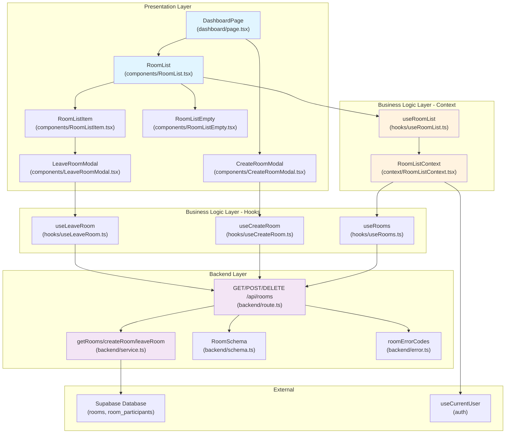

# Dashboard Page - Module Implementation Plan

> **관련 문서**: docs/002/spec.md (Flow 2), docs/005/spec.md (Flow 5), docs/prd.md (F-01, F-07)  
> **우선순위**: P0  
> **상태**: 설계 완료

---

## 📋 개요 (Module Overview)

| 모듈 | 위치 | 설명 | 타입 |
|------|------|------|------|
| **DashboardPage** | `src/app/(protected)/dashboard/page.tsx` | 대시보드 UI 컴포넌트 (이미 존재) | Presentation |
| **RoomList** | `src/features/room-list/components/RoomList.tsx` | 채팅방 목록 컴포넌트 | Presentation |
| **RoomListItem** | `src/features/room-list/components/RoomListItem.tsx` | 개별 방 아이템 컴포넌트 | Presentation |
| **RoomListEmpty** | `src/features/room-list/components/RoomListEmpty.tsx` | Empty State 컴포넌트 | Presentation |
| **CreateRoomModal** | `src/features/room-list/components/CreateRoomModal.tsx` | 방 생성 모달 | Presentation |
| **LeaveRoomModal** | `src/features/room-list/components/LeaveRoomModal.tsx` | 방 나가기 확인 모달 | Presentation |
| **RoomListContext** | `src/features/room-list/context/RoomListContext.tsx` | 방 목록 상태 관리 Context | Business Logic |
| **useRoomList** | `src/features/room-list/hooks/useRoomList.ts` | 방 목록 훅 | Business Logic |
| **useRooms** | `src/features/room-list/hooks/useRooms.ts` | 방 목록 React Query 훅 | Business Logic |
| **useCreateRoom** | `src/features/room-list/hooks/useCreateRoom.ts` | 방 생성 mutation 훅 | Business Logic |
| **useLeaveRoom** | `src/features/room-list/hooks/useLeaveRoom.ts` | 방 나가기 mutation 훅 | Business Logic |
| **roomsRoute** | `src/features/room-list/backend/route.ts` | Hono rooms API 라우트 | Backend |
| **roomService** | `src/features/room-list/backend/service.ts` | 방 CRUD 서비스 | Backend Service |
| **roomSchema** | `src/features/room-list/backend/schema.ts` | 방 요청/응답 스키마 | Backend |
| **roomErrorCodes** | `src/features/room-list/backend/error.ts` | 방 관련 에러 코드 | Backend |

---

## 🔄 Diagram (Module Relationships)



---

## 🚀 Implementation Plan

### 1. Backend Layer

#### 1.1 Error Codes (`src/features/room-list/backend/error.ts`)

```typescript
export const roomErrorCodes = {
  fetchError: 'ROOM_FETCH_ERROR',
  notFound: 'ROOM_NOT_FOUND',
  createError: 'ROOM_CREATE_ERROR',
  deleteError: 'ROOM_DELETE_ERROR',
  unauthorized: 'UNAUTHORIZED',
  invalidRoomName: 'INVALID_ROOM_NAME',
  alreadyParticipant: 'ALREADY_PARTICIPANT',
  notParticipant: 'NOT_PARTICIPANT',
} as const;

export type RoomErrorCode = (typeof roomErrorCodes)[keyof typeof roomErrorCodes];
```

---

#### 1.2 Schema (`src/features/room-list/backend/schema.ts`)

```typescript
import { z } from 'zod';

// Database row schema
export const RoomTableRowSchema = z.object({
  id: z.string().uuid(),
  name: z.string(),
  created_by: z.string().uuid(),
  created_at: z.string(),
  updated_at: z.string(),
});

export type RoomRow = z.infer<typeof RoomTableRowSchema>;

// API Response schemas
export const RoomSchema = z.object({
  id: z.string().uuid(),
  name: z.string(),
  lastMessage: z
    .object({
      content: z.string(),
      createdAt: z.string(),
    })
    .nullable(),
  unreadCount: z.number().int().min(0),
  participantCount: z.number().int().min(1),
  createdAt: z.string(),
  updatedAt: z.string(),
});

export type Room = z.infer<typeof RoomSchema>;

export const GetRoomsResponseSchema = z.object({
  rooms: z.array(RoomSchema),
  total: z.number().int().min(0),
});

export type GetRoomsResponse = z.infer<typeof GetRoomsResponseSchema>;

// Request schemas
export const CreateRoomRequestSchema = z.object({
  name: z
    .string()
    .min(1, 'Room name is required')
    .max(50, 'Room name must be at most 50 characters'),
});

export type CreateRoomRequest = z.infer<typeof CreateRoomRequestSchema>;

export const LeaveRoomParamsSchema = z.object({
  roomId: z.string().uuid('Invalid room ID'),
});

export type LeaveRoomParams = z.infer<typeof LeaveRoomParamsSchema>;
```

---

#### 1.3 Service (`src/features/room-list/backend/service.ts`)

```typescript
import type { SupabaseClient } from '@supabase/supabase-js';
import { success, failure, type HandlerResult } from '@/backend/http/response';
import {
  GetRoomsResponseSchema,
  RoomSchema,
  type GetRoomsResponse,
  type Room,
} from './schema';
import { roomErrorCodes, type RoomErrorCode } from './error';

const ROOMS_TABLE = 'rooms';
const PARTICIPANTS_TABLE = 'room_participants';

export const getRoomsByUserId = async (
  client: SupabaseClient,
  userId: string,
): Promise<HandlerResult<GetRoomsResponse, RoomErrorCode, unknown>> => {
  // Get rooms where user is a participant
  const { data: participantData, error: participantError } = await client
    .from(PARTICIPANTS_TABLE)
    .select('room_id')
    .eq('user_id', userId);

  if (participantError) {
    return failure(500, roomErrorCodes.fetchError, participantError.message);
  }

  if (!participantData || participantData.length === 0) {
    return success({ rooms: [], total: 0 });
  }

  const roomIds = participantData.map((p) => p.room_id);

  // Get room details
  const { data: roomsData, error: roomsError } = await client
    .from(ROOMS_TABLE)
    .select('id, name, created_by, created_at, updated_at')
    .in('id', roomIds)
    .order('updated_at', { ascending: false });

  if (roomsError) {
    return failure(500, roomErrorCodes.fetchError, roomsError.message);
  }

  // For each room, get participant count and last message
  const rooms: Room[] = await Promise.all(
    roomsData.map(async (room) => {
      // Get participant count
      const { count, error: countError } = await client
        .from(PARTICIPANTS_TABLE)
        .select('*', { count: 'exact', head: true })
        .eq('room_id', room.id);

      const participantCount = countError ? 1 : count ?? 1;

      // Get last message (TODO: implement messages table)
      const lastMessage = null;

      // Get unread count (TODO: implement read receipts)
      const unreadCount = 0;

      return {
        id: room.id,
        name: room.name,
        lastMessage,
        unreadCount,
        participantCount,
        createdAt: room.created_at,
        updatedAt: room.updated_at,
      };
    })
  );

  const validated = GetRoomsResponseSchema.safeParse({
    rooms,
    total: rooms.length,
  });

  if (!validated.success) {
    return failure(500, roomErrorCodes.fetchError, 'Validation failed', validated.error);
  }

  return success(validated.data);
};

export const createRoom = async (
  client: SupabaseClient,
  userId: string,
  name: string,
): Promise<HandlerResult<Room, RoomErrorCode, unknown>> => {
  // Create room
  const { data: roomData, error: roomError } = await client
    .from(ROOMS_TABLE)
    .insert({
      name,
      created_by: userId,
    })
    .select('id, name, created_by, created_at, updated_at')
    .single();

  if (roomError) {
    return failure(500, roomErrorCodes.createError, roomError.message);
  }

  // Add creator as participant
  const { error: participantError } = await client
    .from(PARTICIPANTS_TABLE)
    .insert({
      room_id: roomData.id,
      user_id: userId,
    });

  if (participantError) {
    // Rollback: delete room
    await client.from(ROOMS_TABLE).delete().eq('id', roomData.id);
    return failure(500, roomErrorCodes.createError, participantError.message);
  }

  const room: Room = {
    id: roomData.id,
    name: roomData.name,
    lastMessage: null,
    unreadCount: 0,
    participantCount: 1,
    createdAt: roomData.created_at,
    updatedAt: roomData.updated_at,
  };

  const validated = RoomSchema.safeParse(room);

  if (!validated.success) {
    return failure(500, roomErrorCodes.createError, 'Validation failed', validated.error);
  }

  return success(validated.data);
};

export const leaveRoom = async (
  client: SupabaseClient,
  userId: string,
  roomId: string,
): Promise<HandlerResult<{ success: true }, RoomErrorCode, unknown>> => {
  // Check if user is participant
  const { data: participant, error: checkError } = await client
    .from(PARTICIPANTS_TABLE)
    .select('room_id')
    .eq('room_id', roomId)
    .eq('user_id', userId)
    .maybeSingle();

  if (checkError) {
    return failure(500, roomErrorCodes.deleteError, checkError.message);
  }

  if (!participant) {
    return failure(404, roomErrorCodes.notParticipant, 'Not a participant of this room');
  }

  // Remove participant
  const { error: deleteError } = await client
    .from(PARTICIPANTS_TABLE)
    .delete()
    .eq('room_id', roomId)
    .eq('user_id', userId);

  if (deleteError) {
    return failure(500, roomErrorCodes.deleteError, deleteError.message);
  }

  return success({ success: true });
};
```

**Unit Tests**:
```typescript
describe('getRoomsByUserId', () => {
  it('should return empty array for user with no rooms', async () => {
    const mockClient = createMockSupabaseClient();
    const result = await getRoomsByUserId(mockClient, 'user-1');
    expect(result.ok).toBe(true);
    if (result.ok) {
      expect(result.data.rooms).toEqual([]);
      expect(result.data.total).toBe(0);
    }
  });

  it('should return rooms for user', async () => {
    const mockClient = createMockSupabaseClient({
      rooms: [{ id: 'room-1', name: 'Test Room', created_by: 'user-1' }],
      participants: [{ room_id: 'room-1', user_id: 'user-1' }],
    });
    const result = await getRoomsByUserId(mockClient, 'user-1');
    expect(result.ok).toBe(true);
    if (result.ok) {
      expect(result.data.rooms.length).toBe(1);
      expect(result.data.rooms[0].name).toBe('Test Room');
    }
  });
});

describe('createRoom', () => {
  it('should create room and add creator as participant', async () => {
    const mockClient = createMockSupabaseClient();
    const result = await createRoom(mockClient, 'user-1', 'New Room');
    expect(result.ok).toBe(true);
    if (result.ok) {
      expect(result.data.name).toBe('New Room');
      expect(result.data.participantCount).toBe(1);
    }
  });
});

describe('leaveRoom', () => {
  it('should remove user from room', async () => {
    const mockClient = createMockSupabaseClient({
      participants: [{ room_id: 'room-1', user_id: 'user-1' }],
    });
    const result = await leaveRoom(mockClient, 'user-1', 'room-1');
    expect(result.ok).toBe(true);
  });

  it('should fail if user is not a participant', async () => {
    const mockClient = createMockSupabaseClient();
    const result = await leaveRoom(mockClient, 'user-1', 'room-1');
    expect(result.ok).toBe(false);
    if (!result.ok) {
      expect(result.error.code).toBe(roomErrorCodes.notParticipant);
    }
  });
});
```

---

#### 1.4 Route (`src/features/room-list/backend/route.ts`)

```typescript
import type { Hono } from 'hono';
import { zValidator } from '@hono/zod-validator';
import { respond } from '@/backend/http/response';
import { getSupabase, getLogger, type AppEnv } from '@/backend/hono/context';
import {
  CreateRoomRequestSchema,
  LeaveRoomParamsSchema,
} from './schema';
import { getRoomsByUserId, createRoom, leaveRoom } from './service';

export const registerRoomListRoutes = (app: Hono<AppEnv>) => {
  // GET /api/rooms - Get user's rooms
  app.get('/api/rooms', async (c) => {
    const supabase = getSupabase(c);
    const logger = getLogger(c);

    // Get user from session (TODO: implement auth middleware)
    const {
      data: { user },
    } = await supabase.auth.getUser();

    if (!user) {
      logger.warn('Unauthorized access to /api/rooms');
      return c.json({ error: { code: 'UNAUTHORIZED', message: 'Unauthorized' } }, 401);
    }

    const result = await getRoomsByUserId(supabase, user.id);
    return respond(c, result);
  });

  // POST /api/rooms - Create room
  app.post('/api/rooms', zValidator('json', CreateRoomRequestSchema), async (c) => {
    const body = c.req.valid('json');
    const supabase = getSupabase(c);
    const logger = getLogger(c);

    const {
      data: { user },
    } = await supabase.auth.getUser();

    if (!user) {
      logger.warn('Unauthorized access to POST /api/rooms');
      return c.json({ error: { code: 'UNAUTHORIZED', message: 'Unauthorized' } }, 401);
    }

    const result = await createRoom(supabase, user.id, body.name);
    return respond(c, result);
  });

  // DELETE /api/rooms/:roomId/leave - Leave room
  app.delete('/api/rooms/:roomId/leave', async (c) => {
    const params = LeaveRoomParamsSchema.safeParse({ roomId: c.req.param('roomId') });

    if (!params.success) {
      return c.json(
        { error: { code: 'INVALID_PARAMS', message: 'Invalid room ID' } },
        400
      );
    }

    const supabase = getSupabase(c);
    const logger = getLogger(c);

    const {
      data: { user },
    } = await supabase.auth.getUser();

    if (!user) {
      logger.warn('Unauthorized access to DELETE /api/rooms/:roomId/leave');
      return c.json({ error: { code: 'UNAUTHORIZED', message: 'Unauthorized' } }, 401);
    }

    const result = await leaveRoom(supabase, user.id, params.data.roomId);
    return respond(c, result);
  });
};
```

---

### 2. Business Logic Layer

#### 2.1 React Query Hooks

**useRooms** (`src/features/room-list/hooks/useRooms.ts`):
```typescript
import { useQuery } from '@tanstack/react-query';
import { apiClient } from '@/lib/remote/api-client';
import type { GetRoomsResponse } from '../backend/schema';

export const useRooms = () => {
  return useQuery<GetRoomsResponse>({
    queryKey: ['rooms'],
    queryFn: async () => {
      const response = await apiClient.get('/api/rooms');
      if (!response.ok) {
        throw new Error('Failed to fetch rooms');
      }
      return response.json();
    },
    staleTime: 30 * 1000, // 30 seconds
  });
};
```

**useCreateRoom** (`src/features/room-list/hooks/useCreateRoom.ts`):
```typescript
import { useMutation, useQueryClient } from '@tanstack/react-query';
import { apiClient } from '@/lib/remote/api-client';
import type { Room } from '../backend/schema';

export const useCreateRoom = () => {
  const queryClient = useQueryClient();

  return useMutation<Room, Error, { name: string }>({
    mutationFn: async ({ name }) => {
      const response = await apiClient.post('/api/rooms', { name });
      if (!response.ok) {
        const error = await response.json();
        throw new Error(error.error?.message ?? 'Failed to create room');
      }
      return response.json();
    },
    onSuccess: () => {
      queryClient.invalidateQueries({ queryKey: ['rooms'] });
    },
  });
};
```

**useLeaveRoom** (`src/features/room-list/hooks/useLeaveRoom.ts`):
```typescript
import { useMutation, useQueryClient } from '@tanstack/react-query';
import { apiClient } from '@/lib/remote/api-client';

export const useLeaveRoom = () => {
  const queryClient = useQueryClient();

  return useMutation<{ success: true }, Error, { roomId: string }>({
    mutationFn: async ({ roomId }) => {
      const response = await apiClient.delete(`/api/rooms/${roomId}/leave`);
      if (!response.ok) {
        const error = await response.json();
        throw new Error(error.error?.message ?? 'Failed to leave room');
      }
      return response.json();
    },
    onSuccess: () => {
      queryClient.invalidateQueries({ queryKey: ['rooms'] });
    },
  });
};
```

---

#### 2.2 Context (`src/features/room-list/context/RoomListContext.tsx`)

```typescript
"use client";

import { createContext, useContext, useState, useMemo, type ReactNode } from 'react';
import type { Room } from '../backend/schema';

type RoomListContextValue = {
  selectedRoomId: string | null;
  selectRoom: (roomId: string | null) => void;
};

const RoomListContext = createContext<RoomListContextValue | null>(null);

export const RoomListProvider = ({ children }: { children: ReactNode }) => {
  const [selectedRoomId, setSelectedRoomId] = useState<string | null>(null);

  const value = useMemo<RoomListContextValue>(
    () => ({
      selectedRoomId,
      selectRoom: setSelectedRoomId,
    }),
    [selectedRoomId]
  );

  return <RoomListContext.Provider value={value}>{children}</RoomListContext.Provider>;
};

export const useRoomListContext = () => {
  const context = useContext(RoomListContext);
  if (!context) {
    throw new Error('useRoomListContext must be used within RoomListProvider');
  }
  return context;
};
```

---

### 3. Presentation Layer

#### 3.1 Components

**RoomList** (`src/features/room-list/components/RoomList.tsx`):
```typescript
"use client";

import { useRooms } from '../hooks/useRooms';
import { RoomListItem } from './RoomListItem';
import { RoomListEmpty } from './RoomListEmpty';

export const RoomList = () => {
  const { data, isLoading, error } = useRooms();

  if (isLoading) {
    return <div className="p-4 text-center text-slate-500">로딩 중...</div>;
  }

  if (error) {
    return (
      <div className="p-4 text-center text-rose-500">
        방 목록을 불러오는데 실패했습니다.
      </div>
    );
  }

  if (!data || data.rooms.length === 0) {
    return <RoomListEmpty />;
  }

  return (
    <div className="flex flex-col gap-2">
      {data.rooms.map((room) => (
        <RoomListItem key={room.id} room={room} />
      ))}
    </div>
  );
};
```

**QA Sheet - RoomList**:
| 테스트 케이스 | 조건 | 예상 결과 | 상태 |
|--------------|------|----------|------|
| 로딩 중 | isLoading: true | "로딩 중..." 텍스트 표시 | ⬜ |
| 에러 발생 | error: Error | "방 목록을 불러오는데 실패했습니다." 표시 | ⬜ |
| 빈 목록 | rooms: [] | RoomListEmpty 컴포넌트 표시 | ⬜ |
| 방 목록 있음 | rooms: [room1, room2] | 각 방의 RoomListItem 표시 | ⬜ |

---

**RoomListItem** (`src/features/room-list/components/RoomListItem.tsx`):
```typescript
"use client";

import { useState } from 'react';
import { useRouter } from 'next/navigation';
import type { Room } from '../backend/schema';
import { LeaveRoomModal } from './LeaveRoomModal';

type RoomListItemProps = {
  room: Room;
};

export const RoomListItem = ({ room }: RoomListItemProps) => {
  const router = useRouter();
  const [showLeaveModal, setShowLeaveModal] = useState(false);

  const handleClick = () => {
    router.push(`/chat/${room.id}`);
  };

  const handleContextMenu = (e: React.MouseEvent) => {
    e.preventDefault();
    setShowLeaveModal(true);
  };

  return (
    <>
      <div
        className="flex cursor-pointer flex-col gap-1 rounded-lg border border-slate-200 p-4 transition hover:bg-slate-50"
        onClick={handleClick}
        onContextMenu={handleContextMenu}
      >
        <div className="flex items-center justify-between">
          <h3 className="font-medium text-slate-900">{room.name}</h3>
          {room.unreadCount > 0 && (
            <span className="rounded-full bg-rose-500 px-2 py-0.5 text-xs text-white">
              {room.unreadCount}
            </span>
          )}
        </div>
        {room.lastMessage && (
          <p className="text-sm text-slate-500">{room.lastMessage.content}</p>
        )}
        <div className="flex items-center justify-between text-xs text-slate-400">
          <span>{room.participantCount}명</span>
          <span>{new Date(room.updatedAt).toLocaleString('ko-KR')}</span>
        </div>
      </div>

      {showLeaveModal && (
        <LeaveRoomModal
          room={room}
          onClose={() => setShowLeaveModal(false)}
        />
      )}
    </>
  );
};
```

**QA Sheet - RoomListItem**:
| 테스트 케이스 | 입력/조건 | 예상 결과 | 상태 |
|--------------|----------|----------|------|
| 방 클릭 | onClick | /chat/{roomId}로 이동 | ⬜ |
| 우클릭 | onContextMenu | LeaveRoomModal 열림 | ⬜ |
| 안읽은 메시지 있음 | unreadCount > 0 | 빨간 배지 표시 | ⬜ |
| 안읽은 메시지 없음 | unreadCount: 0 | 배지 숨김 | ⬜ |
| 마지막 메시지 있음 | lastMessage: {...} | 메시지 내용 표시 | ⬜ |
| 마지막 메시지 없음 | lastMessage: null | 메시지 내용 숨김 | ⬜ |
| 호버 | hover | 배경색 변경 | ⬜ |

---

**RoomListEmpty** (`src/features/room-list/components/RoomListEmpty.tsx`):
```typescript
"use client";

import { Button } from '@/components/ui/button';

type RoomListEmptyProps = {
  onCreateRoom: () => void;
};

export const RoomListEmpty = ({ onCreateRoom }: RoomListEmptyProps) => {
  return (
    <div className="flex flex-col items-center justify-center gap-4 py-12 text-center">
      <div className="text-6xl">💬</div>
      <h2 className="text-xl font-semibold text-slate-900">
        아직 채팅방이 없습니다
      </h2>
      <p className="text-slate-500">
        첫 채팅을 시작해보세요!
      </p>
      <Button onClick={onCreateRoom}>새 채팅 시작</Button>
    </div>
  );
};
```

**QA Sheet - RoomListEmpty**:
| 테스트 케이스 | 조건 | 예상 결과 | 상태 |
|--------------|------|----------|------|
| Empty State 표시 | - | 이모지, 안내 문구, 버튼 표시 | ⬜ |
| 버튼 클릭 | onClick | onCreateRoom 콜백 호출 | ⬜ |

---

**CreateRoomModal** (`src/features/room-list/components/CreateRoomModal.tsx`):
```typescript
"use client";

import { useState } from 'react';
import { useRouter } from 'next/navigation';
import { Button } from '@/components/ui/button';
import { Input } from '@/components/ui/input';
import { Label } from '@/components/ui/label';
import { useCreateRoom } from '../hooks/useCreateRoom';

type CreateRoomModalProps = {
  onClose: () => void;
};

export const CreateRoomModal = ({ onClose }: CreateRoomModalProps) => {
  const router = useRouter();
  const [name, setName] = useState('');
  const { mutate: createRoom, isPending, error } = useCreateRoom();

  const handleSubmit = (e: React.FormEvent) => {
    e.preventDefault();
    createRoom(
      { name },
      {
        onSuccess: (room) => {
          onClose();
          router.push(`/chat/${room.id}`);
        },
      }
    );
  };

  return (
    <div className="fixed inset-0 z-50 flex items-center justify-center bg-black/50">
      <div className="w-full max-w-md rounded-lg bg-white p-6">
        <h2 className="mb-4 text-xl font-semibold">새 채팅방 만들기</h2>
        <form onSubmit={handleSubmit} className="flex flex-col gap-4">
          <div className="flex flex-col gap-2">
            <Label htmlFor="roomName">채팅방 이름</Label>
            <Input
              id="roomName"
              value={name}
              onChange={(e) => setName(e.target.value)}
              placeholder="채팅방 이름을 입력하세요"
              maxLength={50}
            />
          </div>
          {error && (
            <p className="text-sm text-rose-500">{error.message}</p>
          )}
          <div className="flex gap-2">
            <Button type="button" variant="outline" onClick={onClose}>
              취소
            </Button>
            <Button type="submit" disabled={!name.trim() || isPending}>
              {isPending ? '만드는 중...' : '만들기'}
            </Button>
          </div>
        </form>
      </div>
    </div>
  );
};
```

**QA Sheet - CreateRoomModal**:
| 테스트 케이스 | 입력/조건 | 예상 결과 | 상태 |
|--------------|----------|----------|------|
| 방 이름 입력 | name: "테스트 방" | 입력 필드 업데이트 | ⬜ |
| 빈 이름 제출 | name: "" | 버튼 비활성화 | ⬜ |
| 유효한 이름 제출 | name: "테스트 방" | 방 생성 후 /chat/{roomId}로 이동 | ⬜ |
| 취소 버튼 클릭 | onClick | onClose 콜백 호출 | ⬜ |
| 에러 발생 | error: Error | 에러 메시지 표시 | ⬜ |
| 로딩 중 | isPending: true | "만드는 중..." 텍스트, 버튼 비활성화 | ⬜ |

---

**LeaveRoomModal** (`src/features/room-list/components/LeaveRoomModal.tsx`):
```typescript
"use client";

import { Button } from '@/components/ui/button';
import { useLeaveRoom } from '../hooks/useLeaveRoom';
import type { Room } from '../backend/schema';

type LeaveRoomModalProps = {
  room: Room;
  onClose: () => void;
};

export const LeaveRoomModal = ({ room, onClose }: LeaveRoomModalProps) => {
  const { mutate: leaveRoom, isPending, error } = useLeaveRoom();

  const handleLeave = () => {
    leaveRoom(
      { roomId: room.id },
      {
        onSuccess: () => {
          onClose();
        },
      }
    );
  };

  return (
    <div className="fixed inset-0 z-50 flex items-center justify-center bg-black/50">
      <div className="w-full max-w-md rounded-lg bg-white p-6">
        <h2 className="mb-2 text-xl font-semibold">방 나가기</h2>
        <p className="mb-4 text-slate-600">
          정말 '{room.name}' 방을 나가시겠습니까?
        </p>
        <p className="mb-4 text-sm text-slate-500">
          나가면 대화 내역을 더 이상 볼 수 없습니다.
        </p>
        {error && (
          <p className="mb-4 text-sm text-rose-500">{error.message}</p>
        )}
        <div className="flex gap-2">
          <Button
            type="button"
            variant="outline"
            onClick={onClose}
            disabled={isPending}
          >
            취소
          </Button>
          <Button
            type="button"
            variant="destructive"
            onClick={handleLeave}
            disabled={isPending}
          >
            {isPending ? '나가는 중...' : '나가기'}
          </Button>
        </div>
      </div>
    </div>
  );
};
```

**QA Sheet - LeaveRoomModal**:
| 테스트 케이스 | 입력/조건 | 예상 결과 | 상태 |
|--------------|----------|----------|------|
| 모달 표시 | - | 방 이름, 경고 문구 표시 | ⬜ |
| 나가기 버튼 클릭 | onClick | leaveRoom mutation 실행 | ⬜ |
| 취소 버튼 클릭 | onClick | onClose 콜백 호출 | ⬜ |
| 성공 | onSuccess | onClose 호출, 목록에서 방 제거 | ⬜ |
| 에러 발생 | error: Error | 에러 메시지 표시 | ⬜ |
| 로딩 중 | isPending: true | "나가는 중..." 텍스트, 버튼 비활성화 | ⬜ |

---

#### 3.2 DashboardPage (`src/app/(protected)/dashboard/page.tsx`)

```typescript
"use client";

import { useState } from "react";
import { Button } from "@/components/ui/button";
import { useCurrentUser } from "@/features/auth/hooks/useCurrentUser";
import { RoomListProvider } from "@/features/room-list/context/RoomListContext";
import { RoomList } from "@/features/room-list/components/RoomList";
import { CreateRoomModal } from "@/features/room-list/components/CreateRoomModal";

type DashboardPageProps = {
  params: Promise<Record<string, never>>;
};

export default function DashboardPage({ params }: DashboardPageProps) {
  void params;
  const { user } = useCurrentUser();
  const [showCreateModal, setShowCreateModal] = useState(false);

  return (
    <RoomListProvider>
      <div className="mx-auto flex max-w-4xl flex-col gap-6 px-6 py-12">
        <header className="flex items-center justify-between">
          <div>
            <h1 className="text-3xl font-semibold">대시보드</h1>
            <p className="text-slate-500">
              {user?.email ?? "알 수 없는 사용자"} 님, 환영합니다.
            </p>
          </div>
          <Button onClick={() => setShowCreateModal(true)}>
            + 새 채팅 시작
          </Button>
        </header>

        <RoomList />

        {showCreateModal && (
          <CreateRoomModal onClose={() => setShowCreateModal(false)} />
        )}
      </div>
    </RoomListProvider>
  );
}
```

**QA Sheet - DashboardPage**:
| 테스트 케이스 | 조건 | 예상 결과 | 상태 |
|--------------|------|----------|------|
| 페이지 로드 | - | 헤더, 사용자 이메일, 버튼, RoomList 표시 | ⬜ |
| 새 채팅 시작 버튼 클릭 | onClick | CreateRoomModal 열림 | ⬜ |
| 모달 닫기 | onClose | CreateRoomModal 닫힘 | ⬜ |

---

## 📦 Dependencies

### New Dependencies
- 없음 (기존 의존성으로 충분)

---

## 🔧 Configuration

### Hono App 수정 (`src/backend/hono/app.ts`)

```typescript
import { registerRoomListRoutes } from '@/features/room-list/backend/route';

export const createHonoApp = () => {
  // ... existing code ...
  
  registerExampleRoutes(app);
  registerAuthRoutes(app);
  registerRoomListRoutes(app); // 추가

  return app;
};
```

### Providers 수정 (`src/app/providers.tsx`)

```typescript
import { RoomListProvider } from '@/features/room-list/context/RoomListContext';

export default function Providers({ children }: { children: React.ReactNode }) {
  const queryClient = getQueryClient();

  return (
    <ThemeProvider ...>
      <QueryClientProvider client={queryClient}>
        <RoomListProvider>
          {children}
        </RoomListProvider>
      </QueryClientProvider>
    </ThemeProvider>
  );
}
```

---

## 📝 Migration Required

### Database: `supabase/migrations/0003_create_rooms_tables.sql`

```sql
-- Create rooms table
CREATE TABLE IF NOT EXISTS public.rooms (
  id UUID PRIMARY KEY DEFAULT gen_random_uuid(),
  name TEXT NOT NULL,
  created_by UUID NOT NULL REFERENCES auth.users(id) ON DELETE CASCADE,
  created_at TIMESTAMPTZ DEFAULT NOW(),
  updated_at TIMESTAMPTZ DEFAULT NOW()
);

-- Create room_participants table
CREATE TABLE IF NOT EXISTS public.room_participants (
  room_id UUID NOT NULL REFERENCES public.rooms(id) ON DELETE CASCADE,
  user_id UUID NOT NULL REFERENCES auth.users(id) ON DELETE CASCADE,
  joined_at TIMESTAMPTZ DEFAULT NOW(),
  PRIMARY KEY (room_id, user_id)
);

-- Disable RLS
ALTER TABLE public.rooms DISABLE ROW LEVEL SECURITY;
ALTER TABLE public.room_participants DISABLE ROW LEVEL SECURITY;

-- Triggers
CREATE TRIGGER update_rooms_updated_at
  BEFORE UPDATE ON public.rooms
  FOR EACH ROW
  EXECUTE FUNCTION update_updated_at_column();

-- Indexes
CREATE INDEX idx_rooms_created_by ON public.rooms(created_by);
CREATE INDEX idx_room_participants_user_id ON public.room_participants(user_id);
CREATE INDEX idx_room_participants_room_id ON public.room_participants(room_id);

COMMENT ON TABLE public.rooms IS 'Chat rooms';
COMMENT ON TABLE public.room_participants IS 'Room membership';
```

---

## ✅ Completion Checklist

- [ ] Backend 구현
  - [ ] `roomErrorCodes` 정의
  - [ ] `getRoomsByUserId/createRoom/leaveRoom` 서비스 함수 구현
  - [ ] 스키마 정의
  - [ ] API 라우트 등록
  - [ ] Unit tests 작성
- [ ] Business Logic 구현
  - [ ] `useRooms/useCreateRoom/useLeaveRoom` 훅 구현
  - [ ] `RoomListContext` 구현
- [ ] Presentation 구현
  - [ ] 모든 컴포넌트 구현
  - [ ] DashboardPage 수정
  - [ ] QA Sheet 테스트 완료
- [ ] Database
  - [ ] `rooms`, `room_participants` 테이블 마이그레이션 실행
- [ ] Integration
  - [ ] Hono 앱에 라우트 등록
  - [ ] Providers에 Context 추가
  - [ ] E2E 테스트 실행

---

**최종 업데이트**: 2025년 11월 15일
