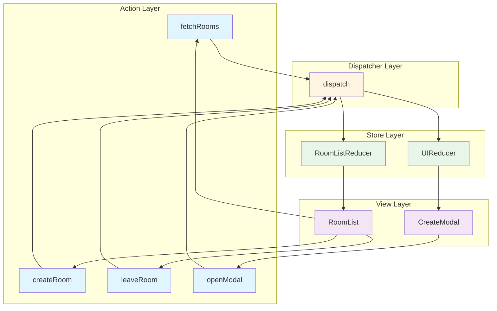
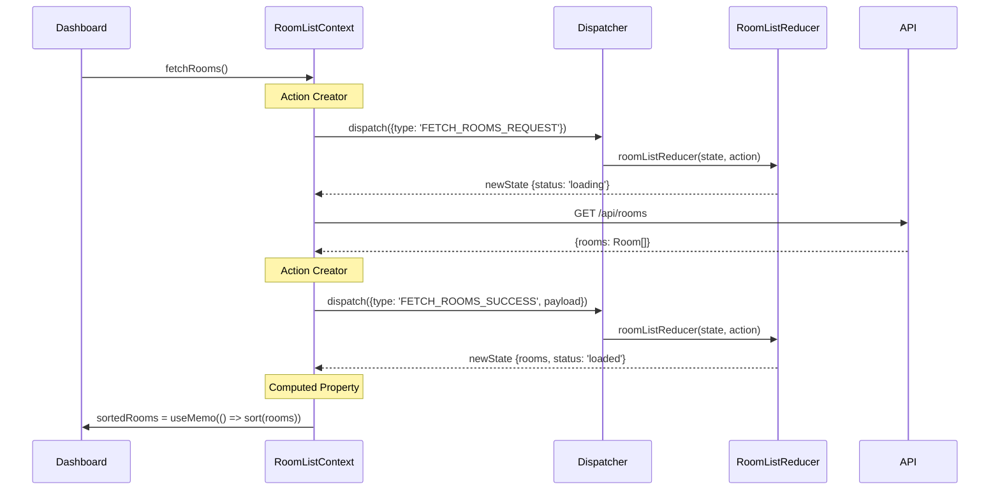
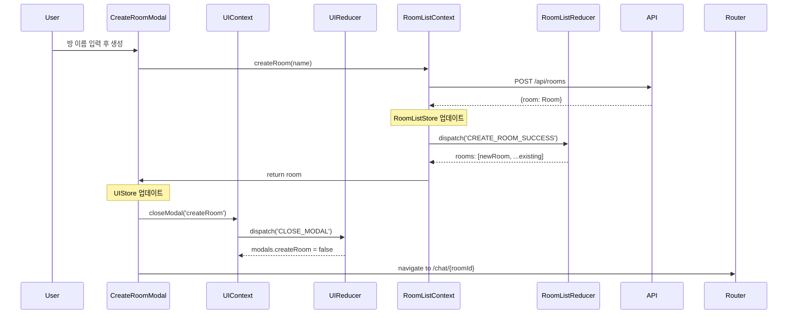
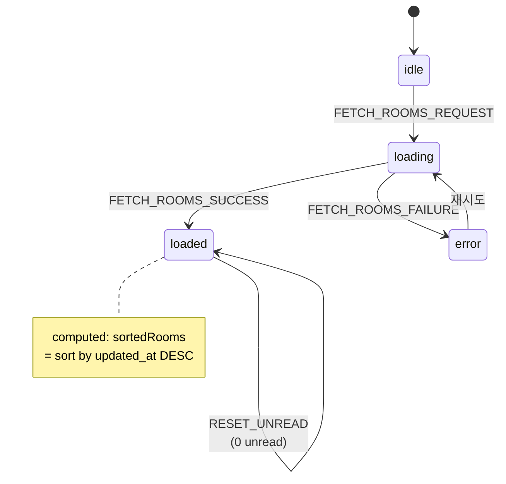
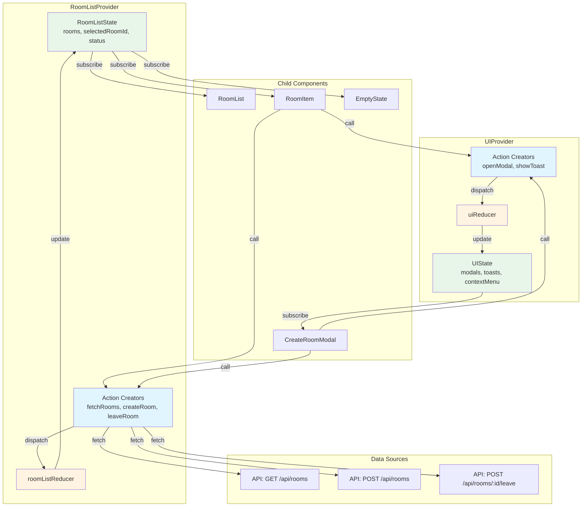
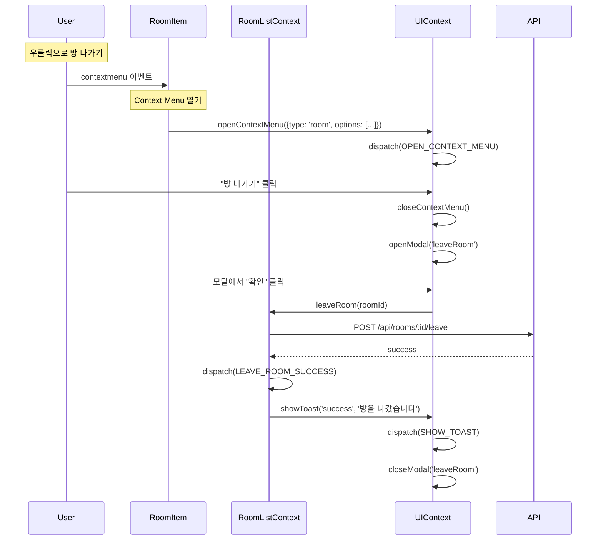

# Dashboard Page - State Management Implementation

> **관련 문서**: docs/state-management.md, docs/pages/dashboard/plan.md  
> **Context**: AuthContext, RoomListContext, UIContext  
> **우선순위**: P0  
> **상태**: 미구현

---

## 📋 개요

대시보드 페이지는 채팅방 목록을 표시하고 관리합니다. **RoomListContext**가 핵심이며, AuthContext와 UIContext를 함께 사용합니다.

---

## 🎯 필요한 Context

### 1. AuthContext (필수)
```typescript
const {
  user,            // User | null
  isAuthenticated, // boolean
  logout,          // () => Promise<void>
} = useAuth();
```

### 2. RoomListContext (필수)
```typescript
const {
  sortedRooms,      // Room[] - 최신 활동순 정렬
  totalUnreadCount, // number
  selectedRoomId,   // string | null
  isLoading,        // boolean
  fetchRooms,       // () => Promise<void>
  createRoom,       // (name: string) => Promise<Room>
  leaveRoom,        // (roomId: string) => Promise<void>
  selectRoom,       // (roomId: string | null) => void
} = useRoomList();
```

### 3. UIContext (필수)
```typescript
const {
  openModal,      // (modal: 'createRoom' | 'leaveRoom') => void
  closeModal,     // (modal: string) => void
  showToast,      // (type, message) => void
} = useUI();
```

---

## 🏗️ 구현 계획

### Phase 1: RoomListContext 생성

#### 1.1 상태 정의 (`src/features/room-list/types.ts`)

```typescript
export interface RoomListState {
  rooms: Room[];
  selectedRoomId: string | null;
  status: 'idle' | 'loading' | 'loaded' | 'error';
  error: string | null;
}

export interface Room {
  id: string;
  name: string;
  lastMessage: {
    content: string;
    created_at: string;
    sender_nickname: string;
  } | null;
  unreadCount: number;
  participantCount: number;
  created_at: string;
  updated_at: string;
}

export type RoomListAction =
  | { type: 'FETCH_ROOMS_REQUEST' }
  | { type: 'FETCH_ROOMS_SUCCESS'; payload: { rooms: Room[] } }
  | { type: 'FETCH_ROOMS_FAILURE'; payload: { error: string } }
  | { type: 'CREATE_ROOM_SUCCESS'; payload: { room: Room } }
  | { type: 'LEAVE_ROOM_SUCCESS'; payload: { roomId: string } }
  | { type: 'SELECT_ROOM'; payload: { roomId: string | null } }
  | { type: 'UPDATE_LAST_MESSAGE'; payload: { roomId: string; message: Message } }
  | { type: 'INCREMENT_UNREAD'; payload: { roomId: string } }
  | { type: 'RESET_UNREAD'; payload: { roomId: string } };
```

---

#### 1.2 Reducer (`src/features/room-list/context/roomListReducer.ts`)

```typescript
import type { RoomListState, RoomListAction, Room } from '../types';

export const initialRoomListState: RoomListState = {
  rooms: [],
  selectedRoomId: null,
  status: 'idle',
  error: null,
};

export function roomListReducer(
  state: RoomListState,
  action: RoomListAction
): RoomListState {
  switch (action.type) {
    case 'FETCH_ROOMS_REQUEST':
      return {
        ...state,
        status: 'loading',
        error: null,
      };

    case 'FETCH_ROOMS_SUCCESS':
      return {
        ...state,
        rooms: action.payload.rooms,
        status: 'loaded',
        error: null,
      };

    case 'FETCH_ROOMS_FAILURE':
      return {
        ...state,
        status: 'error',
        error: action.payload.error,
      };

    case 'CREATE_ROOM_SUCCESS':
      return {
        ...state,
        rooms: [action.payload.room, ...state.rooms],
      };

    case 'LEAVE_ROOM_SUCCESS':
      return {
        ...state,
        rooms: state.rooms.filter(room => room.id !== action.payload.roomId),
        selectedRoomId: state.selectedRoomId === action.payload.roomId
          ? null
          : state.selectedRoomId,
      };

    case 'SELECT_ROOM':
      return {
        ...state,
        selectedRoomId: action.payload.roomId,
      };

    case 'UPDATE_LAST_MESSAGE': {
      const { roomId, message } = action.payload;
      return {
        ...state,
        rooms: state.rooms.map(room =>
          room.id === roomId
            ? {
                ...room,
                lastMessage: {
                  content: message.content,
                  created_at: message.created_at,
                  sender_nickname: message.user_nickname ?? 'Unknown',
                },
                updated_at: message.created_at,
              }
            : room
        ),
      };
    }

    case 'INCREMENT_UNREAD': {
      const { roomId } = action.payload;
      return {
        ...state,
        rooms: state.rooms.map(room =>
          room.id === roomId
            ? { ...room, unreadCount: room.unreadCount + 1 }
            : room
        ),
      };
    }

    case 'RESET_UNREAD': {
      const { roomId } = action.payload;
      return {
        ...state,
        rooms: state.rooms.map(room =>
          room.id === roomId
            ? { ...room, unreadCount: 0 }
            : room
        ),
      };
    }

    default:
      return state;
  }
}
```

---

#### 1.3 Context Provider (`src/features/room-list/context/RoomListContext.tsx`)

```typescript
"use client";

import {
  createContext,
  useReducer,
  useCallback,
  useMemo,
  useContext,
  type ReactNode,
} from 'react';
import { apiClient, extractApiErrorMessage, isAxiosError } from '@/lib/remote/api-client';
import { roomListReducer, initialRoomListState } from './roomListReducer';
import type { RoomListState, Room } from '../types';

interface RoomListContextValue extends RoomListState {
  sortedRooms: Room[];
  totalUnreadCount: number;
  selectedRoom: Room | null;
  isLoading: boolean;
  fetchRooms: () => Promise<void>;
  createRoom: (name: string) => Promise<Room>;
  leaveRoom: (roomId: string) => Promise<void>;
  selectRoom: (roomId: string | null) => void;
  updateLastMessage: (roomId: string, message: any) => void;
  incrementUnread: (roomId: string) => void;
  resetUnread: (roomId: string) => void;
}

const RoomListContext = createContext<RoomListContextValue | null>(null);

export function RoomListProvider({ children }: { children: ReactNode }) {
  const [state, dispatch] = useReducer(roomListReducer, initialRoomListState);

  // Fetch rooms
  const fetchRooms = useCallback(async () => {
    dispatch({ type: 'FETCH_ROOMS_REQUEST' });

    try {
      const response = await apiClient.get('/api/rooms');
      const rooms = response.data.rooms ?? [];

      dispatch({
        type: 'FETCH_ROOMS_SUCCESS',
        payload: { rooms },
      });
    } catch (error) {
      const errorMessage = isAxiosError(error)
        ? extractApiErrorMessage(error, '채팅방 목록을 불러오는데 실패했습니다')
        : '채팅방 목록을 불러오는데 실패했습니다';

      dispatch({
        type: 'FETCH_ROOMS_FAILURE',
        payload: { error: errorMessage },
      });
    }
  }, []);

  // Create room
  const createRoom = useCallback(async (name: string) => {
    try {
      const response = await apiClient.post('/api/rooms', { name });
      const room = response.data;

      dispatch({
        type: 'CREATE_ROOM_SUCCESS',
        payload: { room },
      });

      return room;
    } catch (error) {
      throw error;
    }
  }, []);

  // Leave room
  const leaveRoom = useCallback(async (roomId: string) => {
    try {
      await apiClient.post(`/api/rooms/${roomId}/leave`);

      dispatch({
        type: 'LEAVE_ROOM_SUCCESS',
        payload: { roomId },
      });
    } catch (error) {
      throw error;
    }
  }, []);

  // Select room
  const selectRoom = useCallback((roomId: string | null) => {
    dispatch({
      type: 'SELECT_ROOM',
      payload: { roomId },
    });
  }, []);

  // Internal: Update last message (called by ActiveRoomContext)
  const updateLastMessage = useCallback((roomId: string, message: any) => {
    dispatch({
      type: 'UPDATE_LAST_MESSAGE',
      payload: { roomId, message },
    });
  }, []);

  // Internal: Increment unread
  const incrementUnread = useCallback((roomId: string) => {
    dispatch({
      type: 'INCREMENT_UNREAD',
      payload: { roomId },
    });
  }, []);

  // Internal: Reset unread
  const resetUnread = useCallback((roomId: string) => {
    dispatch({
      type: 'RESET_UNREAD',
      payload: { roomId },
    });
  }, []);

  // Computed: Sorted rooms (최신 활동순)
  const sortedRooms = useMemo(() => {
    return [...state.rooms].sort((a, b) => {
      const aTime = new Date(a.updated_at).getTime();
      const bTime = new Date(b.updated_at).getTime();
      return bTime - aTime;
    });
  }, [state.rooms]);

  // Computed: Total unread count
  const totalUnreadCount = useMemo(() => {
    return state.rooms.reduce((sum, room) => sum + room.unreadCount, 0);
  }, [state.rooms]);

  // Computed: Selected room
  const selectedRoom = useMemo(() => {
    return state.rooms.find(room => room.id === state.selectedRoomId) ?? null;
  }, [state.rooms, state.selectedRoomId]);

  const value = useMemo<RoomListContextValue>(() => ({
    ...state,
    sortedRooms,
    totalUnreadCount,
    selectedRoom,
    isLoading: state.status === 'loading',
    fetchRooms,
    createRoom,
    leaveRoom,
    selectRoom,
    updateLastMessage,
    incrementUnread,
    resetUnread,
  }), [
    state,
    sortedRooms,
    totalUnreadCount,
    selectedRoom,
    fetchRooms,
    createRoom,
    leaveRoom,
    selectRoom,
    updateLastMessage,
    incrementUnread,
    resetUnread,
  ]);

  return (
    <RoomListContext.Provider value={value}>
      {children}
    </RoomListContext.Provider>
  );
}

export function useRoomList() {
  const context = useContext(RoomListContext);
  if (!context) {
    throw new Error('useRoomList must be used within RoomListProvider');
  }
  return context;
}
```

---

### Phase 2: UIContext 생성

#### 2.1 상태 정의 (`src/features/ui/types.ts`)

```typescript
export interface UIState {
  modals: {
    createRoom: boolean;
    inviteUser: boolean;
    leaveRoom: boolean;
    confirmDelete: boolean;
  };
  contextMenu: ContextMenu | null;
  toast: Toast | null;
}

export interface ContextMenu {
  type: 'room' | 'message';
  position: { x: number; y: number };
  targetId: string;
  options: ContextMenuOption[];
}

export interface ContextMenuOption {
  label: string;
  onClick: () => void;
  variant?: 'default' | 'danger';
}

export interface Toast {
  id: string;
  type: 'success' | 'error' | 'info' | 'warning';
  message: string;
  duration: number;
}

export type UIAction =
  | { type: 'OPEN_MODAL'; payload: { modal: keyof UIState['modals'] } }
  | { type: 'CLOSE_MODAL'; payload: { modal: keyof UIState['modals'] } }
  | { type: 'CLOSE_ALL_MODALS' }
  | { type: 'OPEN_CONTEXT_MENU'; payload: { menu: ContextMenu } }
  | { type: 'CLOSE_CONTEXT_MENU' }
  | { type: 'SHOW_TOAST'; payload: { toast: Toast } }
  | { type: 'HIDE_TOAST'; payload: { id: string } };
```

---

#### 2.2 Reducer (`src/features/ui/context/uiReducer.ts`)

```typescript
import type { UIState, UIAction } from '../types';

export const initialUIState: UIState = {
  modals: {
    createRoom: false,
    inviteUser: false,
    leaveRoom: false,
    confirmDelete: false,
  },
  contextMenu: null,
  toast: null,
};

export function uiReducer(state: UIState, action: UIAction): UIState {
  switch (action.type) {
    case 'OPEN_MODAL':
      return {
        ...state,
        modals: {
          ...state.modals,
          [action.payload.modal]: true,
        },
      };

    case 'CLOSE_MODAL':
      return {
        ...state,
        modals: {
          ...state.modals,
          [action.payload.modal]: false,
        },
      };

    case 'CLOSE_ALL_MODALS':
      return {
        ...state,
        modals: {
          createRoom: false,
          inviteUser: false,
          leaveRoom: false,
          confirmDelete: false,
        },
      };

    case 'OPEN_CONTEXT_MENU':
      return {
        ...state,
        contextMenu: action.payload.menu,
      };

    case 'CLOSE_CONTEXT_MENU':
      return {
        ...state,
        contextMenu: null,
      };

    case 'SHOW_TOAST':
      return {
        ...state,
        toast: action.payload.toast,
      };

    case 'HIDE_TOAST':
      return {
        ...state,
        toast: state.toast?.id === action.payload.id ? null : state.toast,
      };

    default:
      return state;
  }
}
```

---

#### 2.3 Context Provider (`src/features/ui/context/UIContext.tsx`)

```typescript
"use client";

import {
  createContext,
  useReducer,
  useCallback,
  useMemo,
  useContext,
  useEffect,
  type ReactNode,
} from 'react';
import { uiReducer, initialUIState } from './uiReducer';
import type { UIState, Toast } from '../types';

interface UIContextValue extends UIState {
  openModal: (modal: keyof UIState['modals']) => void;
  closeModal: (modal: keyof UIState['modals']) => void;
  closeAllModals: () => void;
  showToast: (type: Toast['type'], message: string, duration?: number) => void;
  hideToast: (id: string) => void;
}

const UIContext = createContext<UIContextValue | null>(null);

export function UIProvider({ children }: { children: ReactNode }) {
  const [state, dispatch] = useReducer(uiReducer, initialUIState);

  const openModal = useCallback((modal: keyof UIState['modals']) => {
    dispatch({ type: 'OPEN_MODAL', payload: { modal } });
  }, []);

  const closeModal = useCallback((modal: keyof UIState['modals']) => {
    dispatch({ type: 'CLOSE_MODAL', payload: { modal } });
  }, []);

  const closeAllModals = useCallback(() => {
    dispatch({ type: 'CLOSE_ALL_MODALS' });
  }, []);

  const showToast = useCallback((
    type: Toast['type'],
    message: string,
    duration = 3000
  ) => {
    const id = `toast-${Date.now()}`;
    const toast: Toast = { id, type, message, duration };

    dispatch({ type: 'SHOW_TOAST', payload: { toast } });

    setTimeout(() => {
      dispatch({ type: 'HIDE_TOAST', payload: { id } });
    }, duration);
  }, []);

  const hideToast = useCallback((id: string) => {
    dispatch({ type: 'HIDE_TOAST', payload: { id } });
  }, []);

  const value = useMemo<UIContextValue>(() => ({
    ...state,
    openModal,
    closeModal,
    closeAllModals,
    showToast,
    hideToast,
  }), [state, openModal, closeModal, closeAllModals, showToast, hideToast]);

  return (
    <UIContext.Provider value={value}>
      {children}
    </UIContext.Provider>
  );
}

export function useUI() {
  const context = useContext(UIContext);
  if (!context) {
    throw new Error('useUI must be used within UIProvider');
  }
  return context;
}
```

---

### Phase 3: Provider 통합

#### `src/app/providers.tsx` 수정

```typescript
"use client";

import {
  isServer,
  QueryClient,
  QueryClientProvider,
} from "@tanstack/react-query";
import { ThemeProvider } from "next-themes";
import { AuthProvider } from "@/features/auth/context/AuthContext";
import { RoomListProvider } from "@/features/room-list/context/RoomListContext";
import { UIProvider } from "@/features/ui/context/UIContext";

function makeQueryClient() {
  return new QueryClient({
    defaultOptions: {
      queries: {
        staleTime: 60 * 1000,
      },
    },
  });
}

let browserQueryClient: QueryClient | undefined = undefined;

function getQueryClient() {
  if (isServer) {
    return makeQueryClient();
  } else {
    if (!browserQueryClient) browserQueryClient = makeQueryClient();
    return browserQueryClient;
  }
}

export default function Providers({ children }: { children: React.ReactNode }) {
  const queryClient = getQueryClient();

  return (
    <ThemeProvider
      attribute="class"
      defaultTheme="system"
      enableSystem
      forcedTheme="light"
      disableTransitionOnChange
    >
      <QueryClientProvider client={queryClient}>
        <AuthProvider>
          <UIProvider>
            <RoomListProvider>
              {children}
            </RoomListProvider>
          </UIProvider>
        </AuthProvider>
      </QueryClientProvider>
    </ThemeProvider>
  );
}
```

---

## 📊 데이터 흐름

### Flux 패턴 아키텍처 (Dashboard - Multi-Store)



**Multi-Store 패턴:**
- **RoomListStore**: 채팅방 데이터 관리
- **UIStore**: 모달/Toast UI 상태 관리
- 각 Store는 독립적으로 동작하며 필요 시 상호 참조

---

### 채팅방 목록 로드 (Sequence Diagram)



---

### 방 생성 플로우 (Multi-Store 협력)



---

### RoomListStore 상태 전이



---

## 🏛️ Context 아키텍처 상세 설계

### RoomListContext + UIContext 데이터 흐름



---

### RoomListState 인터페이스 설계

```typescript
/**
 * RoomListContext의 중앙 상태
 */
interface RoomListState {
  // 채팅방 목록
  rooms: Room[];
  
  // 선택된 채팅방 ID (현재 보고 있는 방)
  selectedRoomId: string | null;
  
  // 로딩/에러 상태
  status: 'idle' | 'loading' | 'loaded' | 'error';
  error: string | null;
  
  // 추가: 마지막 fetch 시간 (캐시 유효성 판단)
  lastFetchedAt: string | null;
  
  // 추가: 페이지네이션 (무한 스크롤 대비)
  hasMore: boolean;
  cursor: string | null;
}

/**
 * Room 엔티티
 */
interface Room {
  id: string;
  name: string;
  
  // 마지막 메시지 정보
  lastMessage: {
    content: string;
    created_at: string;
    sender_nickname: string;
  } | null;
  
  // 안읽은 메시지 수
  unreadCount: number;
  
  // 참여자 수
  participantCount: number;
  
  // 타임스탬프
  created_at: string;
  updated_at: string;
  
  // 추가: 방 메타데이터
  creator_id?: string;
  is_archived?: boolean;
}
```

---

### RoomListAction 인터페이스 설계

```typescript
/**
 * RoomList Reducer Actions
 */
type RoomListAction =
  // 방 목록 로드
  | {
      type: 'FETCH_ROOMS_REQUEST';
    }
  | {
      type: 'FETCH_ROOMS_SUCCESS';
      payload: {
        rooms: Room[];
        hasMore: boolean;
        cursor: string | null;
      };
    }
  | {
      type: 'FETCH_ROOMS_FAILURE';
      payload: {
        error: string;
      };
    }
  
  // 방 생성
  | {
      type: 'CREATE_ROOM_SUCCESS';
      payload: {
        room: Room;
      };
    }
  
  // 방 나가기
  | {
      type: 'LEAVE_ROOM_SUCCESS';
      payload: {
        roomId: string;
      };
    }
  
  // 방 선택
  | {
      type: 'SELECT_ROOM';
      payload: {
        roomId: string | null;
      };
    }
  
  // 마지막 메시지 업데이트 (ActiveRoomContext에서 호출)
  | {
      type: 'UPDATE_LAST_MESSAGE';
      payload: {
        roomId: string;
        message: {
          content: string;
          created_at: string;
          sender_nickname: string;
        };
      };
    }
  
  // 안읽은 메시지 증가 (Long Polling에서 호출)
  | {
      type: 'INCREMENT_UNREAD';
      payload: {
        roomId: string;
        count?: number;  // default: 1
      };
    }
  
  // 안읽은 메시지 초기화 (방 입장 시)
  | {
      type: 'RESET_UNREAD';
      payload: {
        roomId: string;
      };
    }
  
  // 방 정보 업데이트 (이름 변경 등)
  | {
      type: 'UPDATE_ROOM';
      payload: {
        roomId: string;
        updates: Partial<Room>;
      };
    };
```

---

### RoomListContext 노출 인터페이스

```typescript
/**
 * useRoomList() 훅이 반환하는 인터페이스
 */
interface RoomListContextValue {
  // ===== 상태 값 (Read-only) =====
  
  /** 전체 채팅방 목록 */
  rooms: Room[];
  
  /** 선택된 채팅방 ID */
  selectedRoomId: string | null;
  
  /** 로딩/에러 상태 */
  status: RoomListState['status'];
  error: string | null;
  
  /** 페이지네이션 */
  hasMore: boolean;
  
  
  // ===== 계산된 값 (Derived State) =====
  
  /** 최신 활동순 정렬된 방 목록 */
  sortedRooms: Room[];
  // computed: rooms.sort((a, b) => b.updated_at - a.updated_at)
  
  /** 전체 안읽은 메시지 수 */
  totalUnreadCount: number;
  // computed: rooms.reduce((sum, room) => sum + room.unreadCount, 0)
  
  /** 선택된 방 객체 */
  selectedRoom: Room | null;
  // computed: rooms.find(r => r.id === selectedRoomId) ?? null
  
  /** 로딩 중 여부 */
  isLoading: boolean;
  // computed: status === 'loading'
  
  /** Empty State 여부 */
  isEmpty: boolean;
  // computed: status === 'loaded' && rooms.length === 0
  
  
  // ===== Action Creator 함수 =====
  
  /**
   * 채팅방 목록 불러오기
   * @param refresh - true면 캐시 무시하고 새로 로드
   */
  fetchRooms: (refresh?: boolean) => Promise<void>;
  
  /**
   * 채팅방 생성
   * @returns 생성된 방 정보
   * @throws {Error} 생성 실패 시
   */
  createRoom: (name: string) => Promise<Room>;
  
  /**
   * 채팅방 나가기
   * @throws {Error} 나가기 실패 시
   */
  leaveRoom: (roomId: string) => Promise<void>;
  
  /**
   * 채팅방 선택
   * - null이면 선택 해제
   */
  selectRoom: (roomId: string | null) => void;
  
  /**
   * 마지막 메시지 업데이트 (내부 API)
   * - ActiveRoomContext에서 호출
   */
  updateLastMessage: (roomId: string, message: {
    content: string;
    created_at: string;
    sender_nickname: string;
  }) => void;
  
  /**
   * 안읽은 메시지 증가 (내부 API)
   * - Long Polling에서 호출
   */
  incrementUnread: (roomId: string, count?: number) => void;
  
  /**
   * 안읽은 메시지 초기화 (내부 API)
   * - 방 입장 시 호출
   */
  resetUnread: (roomId: string) => void;
  
  /**
   * 특정 방 정보 다시 불러오기
   */
  reloadRoom: (roomId: string) => Promise<void>;
}
```

---

### UIState 인터페이스 설계

```typescript
/**
 * UIContext의 중앙 상태
 */
interface UIState {
  // 모달 상태
  modals: {
    createRoom: boolean;
    inviteUser: boolean;
    leaveRoom: boolean;
    confirmDelete: boolean;
    roomSettings: boolean;
  };
  
  // Toast 알림
  toasts: Toast[];
  
  // Context Menu (우클릭 메뉴)
  contextMenu: ContextMenu | null;
  
  // 초대 토큰 (임시 저장)
  inviteToken: string | null;
}

interface Toast {
  id: string;              // 고유 ID
  type: 'success' | 'error' | 'info' | 'warning';
  message: string;
  duration: number;        // ms (0이면 수동 닫기)
  action?: {
    label: string;
    onClick: () => void;
  };
}

interface ContextMenu {
  type: 'room' | 'message' | 'user';
  position: { x: number; y: number };
  targetId: string;        // 대상 room/message/user ID
  options: ContextMenuOption[];
}

interface ContextMenuOption {
  label: string;
  icon?: string;
  onClick: () => void;
  variant?: 'default' | 'danger';
  disabled?: boolean;
}
```

---

### UIAction 인터페이스 설계

```typescript
/**
 * UI Reducer Actions
 */
type UIAction =
  // 모달 제어
  | {
      type: 'OPEN_MODAL';
      payload: {
        modal: keyof UIState['modals'];
        data?: any;  // 모달에 전달할 추가 데이터
      };
    }
  | {
      type: 'CLOSE_MODAL';
      payload: {
        modal: keyof UIState['modals'];
      };
    }
  | {
      type: 'CLOSE_ALL_MODALS';
    }
  
  // Toast 제어
  | {
      type: 'SHOW_TOAST';
      payload: {
        toast: Toast;
      };
    }
  | {
      type: 'HIDE_TOAST';
      payload: {
        id: string;
      };
    }
  | {
      type: 'CLEAR_ALL_TOASTS';
    }
  
  // Context Menu 제어
  | {
      type: 'OPEN_CONTEXT_MENU';
      payload: {
        menu: ContextMenu;
      };
    }
  | {
      type: 'CLOSE_CONTEXT_MENU';
    }
  
  // 초대 토큰
  | {
      type: 'SET_INVITE_TOKEN';
      payload: {
        token: string;
      };
    }
  | {
      type: 'CLEAR_INVITE_TOKEN';
    };
```

---

### UIContext 노출 인터페이스

```typescript
/**
 * useUI() 훅이 반환하는 인터페이스
 */
interface UIContextValue {
  // ===== 상태 값 (Read-only) =====
  
  modals: UIState['modals'];
  toasts: Toast[];
  contextMenu: ContextMenu | null;
  inviteToken: string | null;
  
  
  // ===== 계산된 값 =====
  
  /** 특정 모달이 열려있는지 확인 */
  isModalOpen: (modal: keyof UIState['modals']) => boolean;
  
  /** Toast가 있는지 확인 */
  hasToast: boolean;
  // computed: toasts.length > 0
  
  
  // ===== Action Creator 함수 =====
  
  /**
   * 모달 열기
   */
  openModal: (modal: keyof UIState['modals'], data?: any) => void;
  
  /**
   * 모달 닫기
   */
  closeModal: (modal: keyof UIState['modals']) => void;
  
  /**
   * 모든 모달 닫기
   */
  closeAllModals: () => void;
  
  /**
   * Toast 알림 표시
   * @param duration - 0이면 수동 닫기, 기본값: 3000ms
   */
  showToast: (
    type: Toast['type'],
    message: string,
    duration?: number,
    action?: Toast['action']
  ) => void;
  
  /**
   * Toast 숨기기
   */
  hideToast: (id: string) => void;
  
  /**
   * 모든 Toast 제거
   */
  clearAllToasts: () => void;
  
  /**
   * Context Menu 열기
   */
  openContextMenu: (menu: ContextMenu) => void;
  
  /**
   * Context Menu 닫기
   */
  closeContextMenu: () => void;
  
  /**
   * 초대 토큰 설정
   */
  setInviteToken: (token: string) => void;
  
  /**
   * 초대 토큰 가져오기 (읽기 후 삭제)
   */
  consumeInviteToken: () => string | null;
}
```

---

### Context 간 협력 시나리오



---

### 하위 컴포넌트 사용 예시

```typescript
// ===== RoomList.tsx =====
function RoomList() {
  const {
    sortedRooms,         // Computed: 정렬된 방 목록
    totalUnreadCount,    // Computed: 전체 안읽은 메시지
    isLoading,           // Computed: 로딩 상태
    isEmpty,             // Computed: Empty State
    fetchRooms,          // Action Creator
  } = useRoomList();
  
  const { openModal } = useUI();
  
  useEffect(() => {
    fetchRooms();
  }, []);
  
  if (isLoading) return <Skeleton />;
  if (isEmpty) return <EmptyState />;
  
  return (
    <div>
      <Header unreadCount={totalUnreadCount} />
      {sortedRooms.map(room => (
        <RoomItem key={room.id} room={room} />
      ))}
      <Button onClick={() => openModal('createRoom')}>
        새 채팅 시작
      </Button>
    </div>
  );
}

// ===== RoomItem.tsx =====
function RoomItem({ room }: { room: Room }) {
  const {
    selectRoom,
    leaveRoom,
    selectedRoomId,
  } = useRoomList();
  
  const {
    openContextMenu,
    openModal,
  } = useUI();
  
  const handleContextMenu = (e: React.MouseEvent) => {
    e.preventDefault();
    openContextMenu({
      type: 'room',
      position: { x: e.clientX, y: e.clientY },
      targetId: room.id,
      options: [
        {
          label: '방 설정',
          onClick: () => openModal('roomSettings'),
        },
        {
          label: '방 나가기',
          variant: 'danger',
          onClick: () => openModal('leaveRoom'),
        },
      ],
    });
  };
  
  const isSelected = selectedRoomId === room.id;
  
  return (
    <div
      onClick={() => selectRoom(room.id)}
      onContextMenu={handleContextMenu}
      className={isSelected ? 'selected' : ''}
    >
      <RoomName>{room.name}</RoomName>
      <LastMessage>{room.lastMessage?.content}</LastMessage>
      {room.unreadCount > 0 && (
        <Badge>{room.unreadCount}</Badge>
      )}
    </div>
  );
}

// ===== CreateRoomModal.tsx =====
function CreateRoomModal() {
  const { modals, closeModal } = useUI();
  const { createRoom } = useRoomList();
  const router = useRouter();
  
  const [name, setName] = useState('');
  const [isCreating, setIsCreating] = useState(false);
  
  const handleSubmit = async () => {
    setIsCreating(true);
    try {
      const room = await createRoom(name);
      closeModal('createRoom');
      router.push(`/chat/${room.id}`);
    } catch (error) {
      // 에러 처리
    } finally {
      setIsCreating(false);
    }
  };
  
  if (!modals.createRoom) return null;
  
  return (
    <Modal onClose={() => closeModal('createRoom')}>
      <Input value={name} onChange={e => setName(e.target.value)} />
      <Button onClick={handleSubmit} disabled={isCreating}>
        생성
      </Button>
    </Modal>
  );
}
```

---

### Reducer 상태 전이 요약

**RoomListReducer:**
- `FETCH_ROOMS_REQUEST` → `loading` 상태
- `FETCH_ROOMS_SUCCESS` → `rooms` 배열 설정, `loaded` 상태
- `CREATE_ROOM_SUCCESS` → `rooms` 배열 앞에 추가 (prepend)
- `LEAVE_ROOM_SUCCESS` → `rooms` 배열에서 제거 (filter)
- `UPDATE_LAST_MESSAGE` → 해당 방의 `lastMessage`, `updated_at` 업데이트
- `INCREMENT_UNREAD` → 해당 방의 `unreadCount` 증가
- `RESET_UNREAD` → 해당 방의 `unreadCount` = 0

**UIReducer:**
- `OPEN_MODAL` → 특정 모달 `true`
- `CLOSE_MODAL` → 특정 모달 `false`
- `SHOW_TOAST` → `toasts` 배열에 추가, 타이머 설정
- `HIDE_TOAST` → `toasts` 배열에서 제거

---

## 🔗 Context 간 의존성

### RoomListContext의 외부 참조

**← ActiveRoomContext** (chat-room 페이지에서 호출):
- `updateLastMessage(roomId, message)`: 현재 채팅방에서 새 메시지 전송 시 호출
- `incrementUnread(roomId)`: 다른 방에서 메시지 수신 시 호출 (Long Polling)
- `resetUnread(roomId)`: 채팅방 입장 시 호출

**→ AuthContext** (읽기 전용):
- `user.id`: 방 생성, 참가 권한 확인

**→ UIContext** (협력):
- `showToast()`: 방 생성/나가기 성공/실패 알림
- `openModal()`: 방 설정, 나가기 확인 모달

```typescript
// 예시: ActiveRoomContext에서 RoomListContext 업데이트
const { updateLastMessage, incrementUnread, resetUnread } = useRoomList();

// 방 입장 시
enterRoom(roomId) {
  // ...
  resetUnread(roomId); // 안읽은 메시지 초기화
}

// 메시지 전송 시
sendMessage(content) {
  // ...
  updateLastMessage(roomId, message); // 방 목록의 lastMessage 업데이트
}

// Long Polling에서 다른 방 메시지 수신 시
onPollingEvent(event) {
  if (event.room_id !== currentRoomId) {
    incrementUnread(event.room_id); // 다른 방의 안읽은 메시지 증가
  }
}
```

---

## 📦 최종 Provider 계층 구조

```typescript
// src/app/providers.tsx
export default function Providers({ children }: { children: React.ReactNode }) {
  return (
    <QueryClientProvider client={queryClient}>
      <AuthProvider>              {/* 1. 인증 (최상위) */}
        <NetworkProvider>         {/* 2. 네트워크 상태 */}
          <UIProvider>            {/* 3. UI 상태 (모달, Toast) */}
            <RoomListProvider>    {/* 4. 방 목록 */}
              {children}          {/* 5. ActiveRoomProvider는 chat-room 페이지에서만 */}
            </RoomListProvider>
          </UIProvider>
        </NetworkProvider>
      </AuthProvider>
    </QueryClientProvider>
  );
}

// chat-room 페이지 layout에서만:
<ActiveRoomProvider>
  {children}
</ActiveRoomProvider>
```

**계층 순서 이유:**
1. **AuthProvider**: 모든 Context가 user 정보 필요
2. **NetworkProvider**: 독립적이지만 전역 상태
3. **UIProvider**: 모든 페이지에서 Toast, Modal 사용
4. **RoomListProvider**: Dashboard + Chat에서 사용
5. **ActiveRoomProvider**: Chat 페이지에서만 필요 (페이지 레벨)

---

## ✅ 구현 체크리스트

### Phase 1: RoomListContext
- [ ] `src/features/room-list/types.ts` - 타입 정의
- [ ] `src/features/room-list/context/roomListReducer.ts` - Reducer
- [ ] `src/features/room-list/context/RoomListContext.tsx` - Provider
- [ ] `src/features/room-list/hooks/useRoomList.ts` - Hook

### Phase 2: UIContext
- [ ] `src/features/ui/types.ts` - 타입 정의
- [ ] `src/features/ui/context/uiReducer.ts` - Reducer
- [ ] `src/features/ui/context/UIContext.tsx` - Provider
- [ ] `src/features/ui/hooks/useUI.ts` - Hook

### Phase 3: Provider 통합
- [ ] `src/app/providers.tsx`에 RoomListProvider, UIProvider 추가
- [ ] 의존성 순서 확인 (Auth → Network → UI → RoomList)
- [ ] ActiveRoomProvider는 chat-room layout에 추가

### Phase 4: 컴포넌트
- [ ] Dashboard 페이지에서 useRoomList, useUI 사용
- [ ] CreateRoomModal 구현
- [ ] RoomList 컴포넌트 구현
- [ ] RoomItem 컴포넌트 구현

---

## 📝 참고사항

### 정렬 로직
- 최신 메시지가 있는 방이 최상단
- `updated_at` 기준 내림차순

### 안읽은 메시지
- Long Polling에서 메시지 수신 시 자동 증가
- 방 진입 시 자동 초기화

### Empty State
- `rooms.length === 0` 일 때 "첫 채팅 시작하기" UI 표시

---

**문서 버전**: v1.0  
**최종 수정**: 2025년 11월 15일
