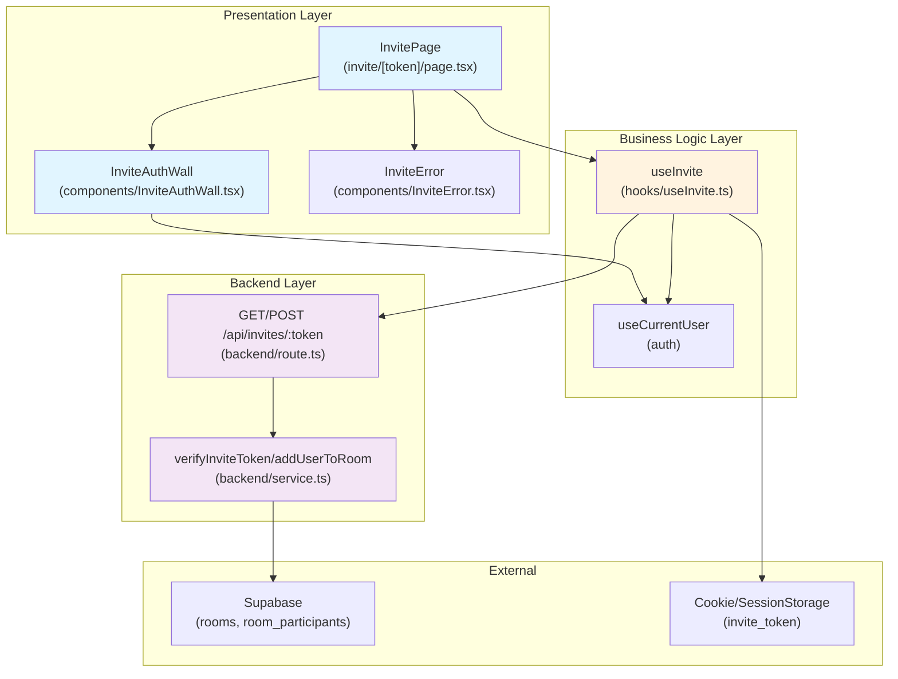

# Invite Page - Module Implementation Plan

> **관련 문서**: docs/004/spec.md (Flow 4), docs/prd.md (비-기능 7.5, 7.6)  
> **우선순위**: P0  
> **상태**: 설계 완료

---

## 📋 개요 (Module Overview)

| 모듈 | 위치 | 설명 | 타입 |
|------|------|------|------|
| **InvitePage** | `src/app/invite/[token]/page.tsx` | 초대 처리 페이지 | Presentation |
| **InviteAuthWall** | `src/features/invite/components/InviteAuthWall.tsx` | 초대 컨텍스트 인증 벽 | Presentation |
| **InviteError** | `src/features/invite/components/InviteError.tsx` | 초대 오류 페이지 | Presentation |
| **useInvite** | `src/features/invite/hooks/useInvite.ts` | 초대 검증 및 참여 로직 | Business Logic |
| **verifyInvite** | `src/features/invite/backend/route.ts` | GET /api/invites/:token 엔드포인트 | Backend |
| **joinRoomWithInvite** | `src/features/invite/backend/route.ts` | POST /api/invites/:token/join 엔드포인트 | Backend |
| **inviteService** | `src/features/invite/backend/service.ts` | 초대 검증 및 참여 서비스 | Backend Service |

---

## 🔄 Diagram (Module Relationships)



---

## 🚀 Implementation Plan

### 1. Backend Layer

#### 1.1 Error Codes (`src/features/invite/backend/error.ts`)

```typescript
export const inviteErrorCodes = {
  invalidToken: 'INVALID_INVITE_TOKEN',
  roomNotFound: 'ROOM_NOT_FOUND',
  alreadyParticipant: 'ALREADY_PARTICIPANT',
  joinError: 'JOIN_ERROR',
  unauthorized: 'UNAUTHORIZED',
} as const;

export type InviteErrorCode = (typeof inviteErrorCodes)[keyof typeof inviteErrorCodes];
```

---

#### 1.2 Service (`src/features/invite/backend/service.ts`)

```typescript
import type { SupabaseClient } from '@supabase/supabase-js';
import { success, failure, type HandlerResult } from '@/backend/http/response';
import { inviteErrorCodes, type InviteErrorCode } from './error';

export type InviteInfo = {
  roomId: string;
  roomName: string;
  participantCount: number;
  valid: true;
};

export const verifyInviteToken = async (
  client: SupabaseClient,
  token: string,
): Promise<HandlerResult<InviteInfo, InviteErrorCode, unknown>> => {
  // Token is actually room_id (simple approach)
  const { data: room, error: roomError } = await client
    .from('rooms')
    .select('id, name')
    .eq('id', token)
    .maybeSingle();

  if (roomError || !room) {
    return failure(404, inviteErrorCodes.roomNotFound, 'Room not found');
  }

  // Get participant count
  const { count, error: countError } = await client
    .from('room_participants')
    .select('*', { count: 'exact', head: true })
    .eq('room_id', room.id);

  if (countError) {
    return failure(500, inviteErrorCodes.joinError, countError.message);
  }

  return success({
    roomId: room.id,
    roomName: room.name,
    participantCount: count ?? 0,
    valid: true,
  });
};

export const addUserToRoom = async (
  client: SupabaseClient,
  userId: string,
  roomId: string,
): Promise<HandlerResult<{ success: true }, InviteErrorCode, unknown>> => {
  // Check if already participant
  const { data: existing, error: checkError } = await client
    .from('room_participants')
    .select('room_id')
    .eq('room_id', roomId)
    .eq('user_id', userId)
    .maybeSingle();

  if (checkError) {
    return failure(500, inviteErrorCodes.joinError, checkError.message);
  }

  if (existing) {
    // Already a participant, return success
    return success({ success: true });
  }

  // Add as participant
  const { error: insertError } = await client
    .from('room_participants')
    .insert({
      room_id: roomId,
      user_id: userId,
    });

  if (insertError) {
    return failure(500, inviteErrorCodes.joinError, insertError.message);
  }

  return success({ success: true });
};
```

**Unit Tests**:
```typescript
describe('verifyInviteToken', () => {
  it('should return room info for valid token', async () => {
    const mockClient = createMockSupabaseClient({
      rooms: [{ id: 'room-1', name: 'Test Room' }],
      participants: [{ room_id: 'room-1', user_id: 'user-1' }],
    });
    const result = await verifyInviteToken(mockClient, 'room-1');
    expect(result.ok).toBe(true);
    if (result.ok) {
      expect(result.data.roomName).toBe('Test Room');
      expect(result.data.participantCount).toBe(1);
    }
  });

  it('should fail for invalid token', async () => {
    const mockClient = createMockSupabaseClient();
    const result = await verifyInviteToken(mockClient, 'invalid-token');
    expect(result.ok).toBe(false);
    if (!result.ok) {
      expect(result.error.code).toBe(inviteErrorCodes.roomNotFound);
    }
  });
});

describe('addUserToRoom', () => {
  it('should add user to room', async () => {
    const mockClient = createMockSupabaseClient({
      rooms: [{ id: 'room-1', name: 'Test Room' }],
    });
    const result = await addUserToRoom(mockClient, 'user-1', 'room-1');
    expect(result.ok).toBe(true);
  });

  it('should succeed if already participant', async () => {
    const mockClient = createMockSupabaseClient({
      participants: [{ room_id: 'room-1', user_id: 'user-1' }],
    });
    const result = await addUserToRoom(mockClient, 'user-1', 'room-1');
    expect(result.ok).toBe(true);
  });
});
```

---

#### 1.3 Route (`src/features/invite/backend/route.ts`)

```typescript
import type { Hono } from 'hono';
import { respond } from '@/backend/http/response';
import { getSupabase, getLogger, type AppEnv } from '@/backend/hono/context';
import { verifyInviteToken, addUserToRoom } from './service';

export const registerInviteRoutes = (app: Hono<AppEnv>) => {
  // GET /api/invites/:token - Verify invite token
  app.get('/api/invites/:token', async (c) => {
    const token = c.req.param('token');
    const supabase = getSupabase(c);

    const result = await verifyInviteToken(supabase, token);
    return respond(c, result);
  });

  // POST /api/invites/:token/join - Join room with invite
  app.post('/api/invites/:token/join', async (c) => {
    const token = c.req.param('token');
    const supabase = getSupabase(c);
    const logger = getLogger(c);

    const {
      data: { user },
    } = await supabase.auth.getUser();

    if (!user) {
      logger.warn('Unauthorized access to POST /api/invites/:token/join');
      return c.json({ error: { code: 'UNAUTHORIZED', message: 'Unauthorized' } }, 401);
    }

    const result = await addUserToRoom(supabase, user.id, token);
    return respond(c, result);
  });
};
```

---

### 2. Business Logic Layer

#### 2.1 useInvite Hook (`src/features/invite/hooks/useInvite.ts`)

```typescript
import { useState, useEffect, useCallback } from 'react';
import { useRouter } from 'next/navigation';
import { apiClient } from '@/lib/remote/api-client';
import { useCurrentUser } from '@/features/auth/hooks/useCurrentUser';

export type InviteState = 
  | { status: 'loading' }
  | { status: 'error'; message: string }
  | { status: 'unauthenticated'; roomName: string; roomId: string }
  | { status: 'joining' }
  | { status: 'success'; roomId: string };

export const useInvite = (token: string) => {
  const router = useRouter();
  const { isAuthenticated, isLoading: authLoading } = useCurrentUser();
  const [state, setState] = useState<InviteState>({ status: 'loading' });

  const verifyAndJoin = useCallback(async () => {
    if (authLoading) return;

    // Step 1: Verify token
    setState({ status: 'loading' });
    try {
      const verifyResponse = await apiClient.get(`/api/invites/${token}`);
      
      if (!verifyResponse.ok) {
        setState({ status: 'error', message: '유효하지 않은 초대 링크입니다.' });
        return;
      }

      const inviteInfo = await verifyResponse.json();

      // Step 2: Check authentication
      if (!isAuthenticated) {
        // Save token to cookie/session
        sessionStorage.setItem('invite_token', token);
        setState({
          status: 'unauthenticated',
          roomName: inviteInfo.roomName,
          roomId: inviteInfo.roomId,
        });
        return;
      }

      // Step 3: Join room
      setState({ status: 'joining' });
      const joinResponse = await apiClient.post(`/api/invites/${token}/join`);

      if (!joinResponse.ok) {
        setState({ status: 'error', message: '방 참여에 실패했습니다.' });
        return;
      }

      // Step 4: Redirect to room
      sessionStorage.removeItem('invite_token');
      setState({ status: 'success', roomId: token });
      router.replace(`/chat/${token}`);
    } catch (error) {
      setState({ status: 'error', message: '초대 처리 중 오류가 발생했습니다.' });
    }
  }, [token, isAuthenticated, authLoading, router]);

  useEffect(() => {
    verifyAndJoin();
  }, [verifyAndJoin]);

  return { state, retry: verifyAndJoin };
};
```

---

### 3. Presentation Layer

#### 3.1 InvitePage (`src/app/invite/[token]/page.tsx`)

```typescript
"use client";

import { use } from "react";
import { useInvite } from "@/features/invite/hooks/useInvite";
import { InviteAuthWall } from "@/features/invite/components/InviteAuthWall";
import { InviteError } from "@/features/invite/components/InviteError";

type InvitePageProps = {
  params: Promise<{ token: string }>;
};

export default function InvitePage({ params }: InvitePageProps) {
  const { token } = use(params);
  const { state, retry } = useInvite(token);

  if (state.status === 'loading' || state.status === 'joining') {
    return (
      <div className="flex min-h-screen items-center justify-center">
        <div className="text-center">
          <div className="mb-4 text-4xl">⏳</div>
          <p className="text-slate-600">
            {state.status === 'loading' ? '초대 확인 중...' : '방에 참여하는 중...'}
          </p>
        </div>
      </div>
    );
  }

  if (state.status === 'error') {
    return <InviteError message={state.message} onRetry={retry} />;
  }

  if (state.status === 'unauthenticated') {
    return <InviteAuthWall roomName={state.roomName} />;
  }

  // Success state redirects automatically
  return null;
}
```

**QA Sheet**:
| 테스트 케이스 | 조건 | 예상 결과 | 상태 |
|--------------|------|----------|------|
| 로딩 중 | status: loading | "초대 확인 중..." 표시 | ⬜ |
| 참여 중 | status: joining | "방에 참여하는 중..." 표시 | ⬜ |
| 유효하지 않은 토큰 | status: error | InviteError 컴포넌트 표시 | ⬜ |
| 미인증 사용자 | status: unauthenticated | InviteAuthWall 표시 | ⬜ |
| 성공 | status: success | /chat/{roomId}로 리디렉션 | ⬜ |

---

#### 3.2 InviteAuthWall (`src/features/invite/components/InviteAuthWall.tsx`)

```typescript
"use client";

import Link from "next/link";
import { Button } from "@/components/ui/button";

type InviteAuthWallProps = {
  roomName: string;
};

export const InviteAuthWall = ({ roomName }: InviteAuthWallProps) => {
  return (
    <div className="flex min-h-screen items-center justify-center px-6">
      <div className="w-full max-w-md text-center">
        <div className="mb-6 text-6xl">💬</div>
        <h1 className="mb-2 text-2xl font-semibold">
          '{roomName}' 방에 초대되었습니다!
        </h1>
        <p className="mb-8 text-slate-600">
          채팅에 참여하려면 로그인이 필요합니다.
        </p>
        <div className="flex flex-col gap-3">
          <Button asChild>
            <Link href="/signup">가입하고 합류하기</Link>
          </Button>
          <Button asChild variant="outline">
            <Link href="/login">이미 계정이 있어요</Link>
          </Button>
        </div>
      </div>
    </div>
  );
};
```

**QA Sheet**:
| 테스트 케이스 | 조건 | 예상 결과 | 상태 |
|--------------|------|----------|------|
| 표시 | - | 방 이름, 안내 문구, 버튼 표시 | ⬜ |
| 가입 버튼 클릭 | - | /signup으로 이동 | ⬜ |
| 로그인 버튼 클릭 | - | /login으로 이동 | ⬜ |

---

#### 3.3 InviteError (`src/features/invite/components/InviteError.tsx`)

```typescript
"use client";

import Link from "next/link";
import { Button } from "@/components/ui/button";

type InviteErrorProps = {
  message: string;
  onRetry: () => void;
};

export const InviteError = ({ message, onRetry }: InviteErrorProps) => {
  return (
    <div className="flex min-h-screen items-center justify-center px-6">
      <div className="w-full max-w-md text-center">
        <div className="mb-6 text-6xl">⚠️</div>
        <h1 className="mb-2 text-2xl font-semibold text-rose-600">
          초대 링크 오류
        </h1>
        <p className="mb-8 text-slate-600">{message}</p>
        <div className="flex flex-col gap-3">
          <Button onClick={onRetry}>다시 시도</Button>
          <Button asChild variant="outline">
            <Link href="/">메인으로 가기</Link>
          </Button>
        </div>
      </div>
    </div>
  );
};
```

**QA Sheet**:
| 테스트 케이스 | 조건 | 예상 결과 | 상태 |
|--------------|------|----------|------|
| 표시 | - | 에러 메시지, 버튼 표시 | ⬜ |
| 다시 시도 버튼 클릭 | onClick | onRetry 콜백 호출 | ⬜ |
| 메인으로 가기 버튼 클릭 | - | / 경로로 이동 | ⬜ |

---

## 🔧 Configuration

### Hono App 수정 (`src/backend/hono/app.ts`)

```typescript
import { registerInviteRoutes } from '@/features/invite/backend/route';

export const createHonoApp = () => {
  // ... existing code ...
  
  registerAuthRoutes(app);
  registerRoomListRoutes(app);
  registerInviteRoutes(app); // 추가

  return app;
};
```

---

## ✅ Completion Checklist

- [ ] Backend 구현
  - [ ] `verifyInviteToken/addUserToRoom` 서비스 함수 구현
  - [ ] API 라우트 등록
  - [ ] Unit tests 작성
- [ ] Business Logic 구현
  - [ ] `useInvite` 훅 구현
- [ ] Presentation 구현
  - [ ] 모든 컴포넌트 구현
  - [ ] QA Sheet 테스트 완료
- [ ] Integration
  - [ ] Hono 앱에 라우트 등록
  - [ ] E2E 테스트 실행

---

**최종 업데이트**: 2025년 11월 15일
