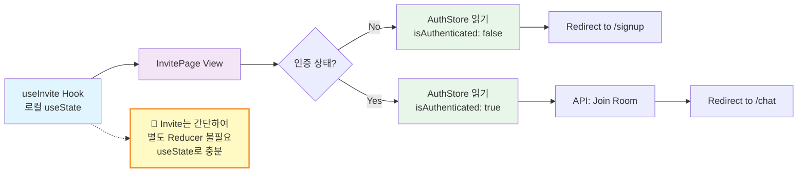
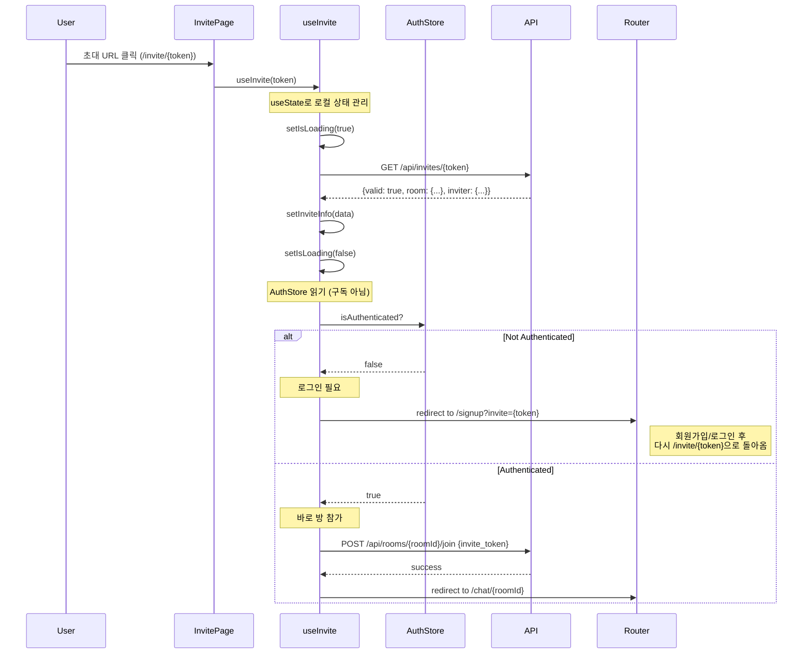
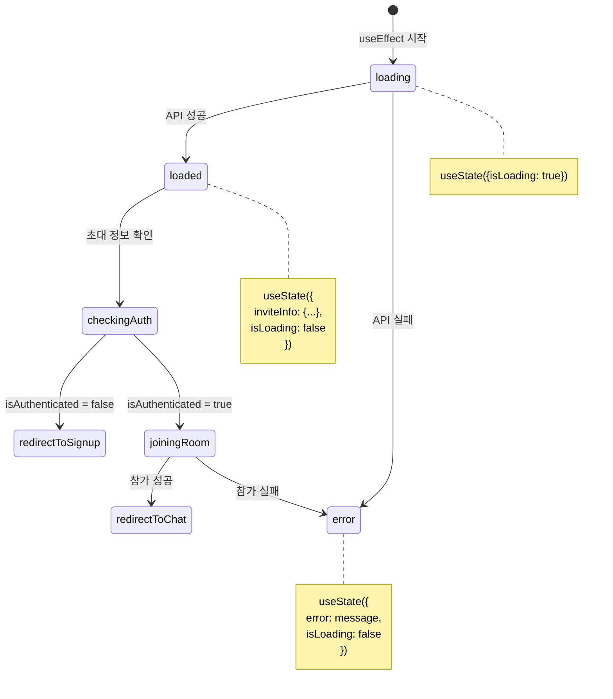
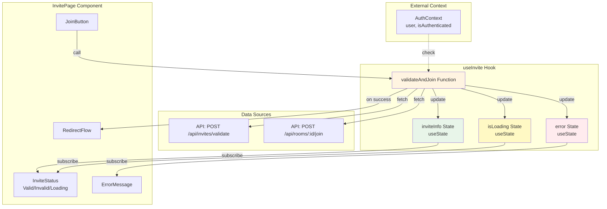
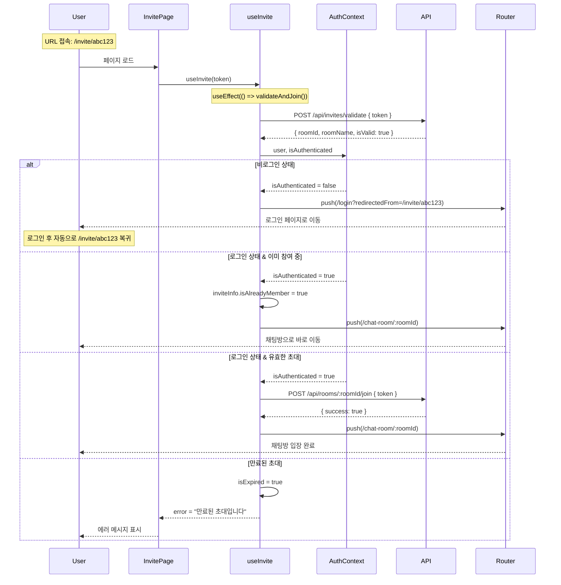

# Invite Page - State Management Implementation

> **관련 문서**: docs/state-management.md, docs/pages/invite/plan.md  
> **Context**: AuthContext, UIContext  
> **우선순위**: P1  
> **상태**: 미구현

---

## 📋 개요

초대 페이지는 간단한 상태 관리만 필요합니다. 초대 토큰을 검증하고 사용자를 적절한 페이지로 리다이렉션합니다.

---

## 🎯 필요한 Context

### 1. AuthContext (필수)
```typescript
const {
  isAuthenticated,  // boolean
  isLoading,        // boolean
} = useAuth();
```

### 2. UIContext (선택)
```typescript
const {
  showToast,  // (type, message) => void
} = useUI();
```

---

## 🏗️ 구현 계획

### Phase 1: useInvite Hook 생성

#### `src/features/invite/hooks/useInvite.ts`

```typescript
"use client";

import { useState, useEffect } from 'react';
import { useRouter } from 'next/navigation';
import { apiClient, extractApiErrorMessage, isAxiosError } from '@/lib/remote/api-client';
import { useAuth } from '@/features/auth/hooks/useAuth';

interface InviteInfo {
  roomId: string;
  roomName: string;
  inviterName: string;
  isValid: boolean;
  expireAt: string | null;
}

export function useInvite(token: string) {
  const router = useRouter();
  const { isAuthenticated, isLoading: isAuthLoading } = useAuth();
  const [inviteInfo, setInviteInfo] = useState<InviteInfo | null>(null);
  const [isLoading, setIsLoading] = useState(true);
  const [error, setError] = useState<string | null>(null);

  // Validate invite token
  useEffect(() => {
    const validateInvite = async () => {
      setIsLoading(true);
      setError(null);

      try {
        const response = await apiClient.get(`/api/invites/${token}`);
        const data = response.data;

        if (!data.valid) {
          setError('유효하지 않거나 만료된 초대 링크입니다');
          setInviteInfo(null);
          return;
        }

        setInviteInfo({
          roomId: data.room.id,
          roomName: data.room.name,
          inviterName: data.inviter?.nickname ?? 'Unknown',
          isValid: true,
          expireAt: data.expire_at,
        });
      } catch (err) {
        const errorMessage = isAxiosError(err)
          ? extractApiErrorMessage(err, '초대 정보를 불러오는데 실패했습니다')
          : '초대 정보를 불러오는데 실패했습니다';

        setError(errorMessage);
        setInviteInfo(null);
      } finally {
        setIsLoading(false);
      }
    };

    validateInvite();
  }, [token]);

  // Handle redirect after auth check
  useEffect(() => {
    if (isAuthLoading || isLoading) return;

    if (!isAuthenticated) {
      // Redirect to signup/login with invite token
      router.replace(`/signup?invite=${token}`);
      return;
    }

    if (inviteInfo && inviteInfo.isValid) {
      // Join room and redirect
      joinRoom(inviteInfo.roomId);
    }
  }, [isAuthenticated, isAuthLoading, isLoading, inviteInfo, token, router]);

  const joinRoom = async (roomId: string) => {
    try {
      await apiClient.post(`/api/rooms/${roomId}/join`, {
        invite_token: token,
      });

      router.replace(`/chat/${roomId}`);
    } catch (err) {
      const errorMessage = isAxiosError(err)
        ? extractApiErrorMessage(err, '채팅방 참가에 실패했습니다')
        : '채팅방 참가에 실패했습니다';

      setError(errorMessage);
    }
  };

  return {
    inviteInfo,
    isLoading: isLoading || isAuthLoading,
    error,
  };
}
```

---

### Phase 2: InvitePage 컴포넌트

#### `src/app/invite/[token]/page.tsx`

```typescript
"use client";

import { use } from 'react';
import Link from 'next/link';
import { useInvite } from '@/features/invite/hooks/useInvite';
import { Button } from '@/components/ui/button';
import { Spinner } from '@/components/ui/spinner';

type InvitePageProps = {
  params: Promise<{ token: string }>;
};

export default function InvitePage({ params }: InvitePageProps) {
  const { token } = use(params);
  const { inviteInfo, isLoading, error } = useInvite(token);

  if (isLoading) {
    return (
      <div className="flex min-h-screen items-center justify-center">
        <div className="text-center">
          <Spinner size="lg" />
          <p className="mt-4 text-slate-600">초대 정보를 확인하는 중...</p>
        </div>
      </div>
    );
  }

  if (error || !inviteInfo) {
    return (
      <div className="flex min-h-screen items-center justify-center">
        <div className="max-w-md text-center">
          <div className="mb-6 text-6xl">❌</div>
          <h1 className="text-2xl font-bold text-slate-900 mb-2">
            유효하지 않은 초대
          </h1>
          <p className="text-slate-600 mb-6">
            {error ?? '초대 링크가 만료되었거나 유효하지 않습니다.'}
          </p>
          <Link href="/dashboard">
            <Button>대시보드로 이동</Button>
          </Link>
        </div>
      </div>
    );
  }

  return (
    <div className="flex min-h-screen items-center justify-center">
      <div className="max-w-md text-center">
        <div className="mb-6 text-6xl">📨</div>
        <h1 className="text-2xl font-bold text-slate-900 mb-2">
          {inviteInfo.roomName}에 초대되었습니다
        </h1>
        <p className="text-slate-600 mb-6">
          {inviteInfo.inviterName}님이 당신을 초대했습니다
        </p>
        <p className="text-sm text-slate-500">
          잠시 후 채팅방으로 이동합니다...
        </p>
      </div>
    </div>
  );
}
```

---

## 📊 데이터 흐름

### Flux 패턴 (Invite는 로컬 상태만 사용, Context Store 없음)



**설계 결정:**
- Invite 페이지는 **일회성 작업**이므로 복잡한 Reducer 불필요
- `useState`로 로컬 상태 관리
- AuthContext는 **읽기 전용**으로만 사용

---

### 초대 처리 플로우 (Sequence Diagram)



---

### 상태 결정 트리

```mermaid
graph TD
    A[Invite Token 검증] --> B{유효한 토큰?}
    
    B -->|No| C[에러 화면]
    B -->|Yes| D{인증됨?}
    
    D -->|No| E[/signup?invite=token]
    D -->|Yes| F[방 참가 API]
    
    F --> G{참가 성공?}
    G -->|Yes| H[/chat/roomId]
    G -->|No| I[에러 Toast]
    
    E --> J[회원가입/로그인]
    J --> K[/invite/token 재방문]
    K --> D
    
    style A fill:#e1f5ff
    style C fill:#ffebee
    style E fill:#fff3e0
    style H fill:#e8f5e9
    style I fill:#ffebee
```

---

### useInvite Hook 상태 관리 (로컬 상태)



---

## 🔄 리다이렉션 시나리오

### 1. 비로그인 사용자
```
1. /invite/abc123 접근
2. 초대 토큰 검증 (유효함)
3. isAuthenticated: false 확인
4. /signup?invite=abc123 로 리다이렉션
5. 회원가입/로그인 완료 후
6. useSignup/useLogin에서 invite 파라미터 확인
7. /invite/abc123 로 다시 리다이렉션
8. 이번에는 isAuthenticated: true
9. 방 참가 API 호출
10. /chat/{roomId} 로 최종 이동
```

### 2. 로그인된 사용자
```
1. /invite/abc123 접근
2. 초대 토큰 검증 (유효함)
3. isAuthenticated: true 확인
4. 방 참가 API 호출
5. /chat/{roomId} 로 즉시 이동
```

### 3. 유효하지 않은 초대
```
1. /invite/invalid 접근
2. 초대 토큰 검증 (유효하지 않음)
3. 에러 화면 표시
4. "대시보드로 이동" 버튼 제공
```

---

## 🏛️ Context 아키텍처 상세 설계

> **Note**: 초대 페이지는 간단한 일회성 검증 로직이므로 Context + useReducer 패턴 대신 **커스텀 훅 (useInvite) + useState**를 사용합니다.

### useInvite Hook 데이터 흐름



---

### InviteInfo 인터페이스 설계

```typescript
/**
 * 초대 토큰 검증 결과
 */
interface InviteInfo {
  // 방 정보
  roomId: string;
  roomName: string;
  
  // 초대자 정보
  inviterName: string;
  inviterAvatarUrl?: string;
  
  // 토큰 상태
  isValid: boolean;
  expireAt: string | null;          // null이면 만료 없음
  
  // 현재 사용자의 참여 상태
  isAlreadyMember: boolean;         // 이미 참여 중인 방인지
  
  // 기타
  participantCount: number;
}

/**
 * useInvite Hook의 내부 상태
 */
interface UseInviteState {
  inviteInfo: InviteInfo | null;
  isLoading: boolean;
  error: string | null;
  
  // 추가 플래그
  isValidating: boolean;            // 토큰 검증 중
  isJoining: boolean;               // 방 참가 중
}
```

---

### useInvite Hook 노출 인터페이스

```typescript
/**
 * useInvite 훅의 반환 타입
 */
interface UseInviteReturn {
  // ===== 상태 값 =====
  
  inviteInfo: InviteInfo | null;
  isLoading: boolean;
  error: string | null;
  
  
  // ===== 계산된 값 =====
  
  /**
   * 참가 가능한 초대인지
   */
  canJoin: boolean;
  // computed: inviteInfo?.isValid && !inviteInfo.isAlreadyMember && !isExpired
  
  /**
   * 만료 여부
   */
  isExpired: boolean;
  // computed: expireAt && new Date(expireAt) < new Date()
  
  /**
   * 이미 참여 중인 방인지
   */
  isAlreadyMember: boolean;
  
  
  // ===== Action 함수 =====
  
  /**
   * 토큰 검증 및 자동 참가 시도
   * 1. AuthContext에서 user 확인
   * 2. 로그인 상태면: 토큰 검증 → 자동 참가 → 채팅방 이동
   * 3. 비로그인 상태면: 토큰 검증만 수행 → 로그인 페이지 이동 (redirectedFrom 설정)
   * 
   * @throws {Error} 검증 실패 시
   */
  validateAndJoin: () => Promise<void>;
  
  /**
   * 수동 참가 시도 (버튼 클릭 시)
   */
  joinRoom: () => Promise<void>;
}
```

---

### useInvite Hook 구현 인터페이스

```typescript
/**
 * useInvite Hook 시그니처
 */
function useInvite(token: string): UseInviteReturn {
  const { user, isAuthenticated } = useAuth();
  const router = useRouter();
  
  const [inviteInfo, setInviteInfo] = useState<InviteInfo | null>(null);
  const [isLoading, setIsLoading] = useState(true);
  const [error, setError] = useState<string | null>(null);
  const [isValidating, setIsValidating] = useState(false);
  const [isJoining, setIsJoining] = useState(false);
  
  // 토큰 검증 및 자동 참가
  const validateAndJoin = useCallback(async () => {
    setIsValidating(true);
    try {
      // 1. 토큰 검증
      const response = await apiClient.post('/api/invites/validate', { token });
      const info = response.data;
      setInviteInfo(info);
      
      // 2. 비로그인 상태면 로그인 페이지로
      if (!isAuthenticated) {
        router.push(`/login?redirectedFrom=/invite/${token}`);
        return;
      }
      
      // 3. 이미 참여 중이면 바로 채팅방으로
      if (info.isAlreadyMember) {
        router.push(`/chat-room/${info.roomId}`);
        return;
      }
      
      // 4. 유효한 초대면 자동 참가
      if (info.isValid && !isExpired) {
        setIsJoining(true);
        await apiClient.post(`/api/rooms/${info.roomId}/join`, { token });
        router.push(`/chat-room/${info.roomId}`);
      }
    } catch (err) {
      setError(err.message);
    } finally {
      setIsValidating(false);
      setIsJoining(false);
      setIsLoading(false);
    }
  }, [token, isAuthenticated]);
  
  // 마운트 시 자동 실행
  useEffect(() => {
    validateAndJoin();
  }, [validateAndJoin]);
  
  // ... computed values
  
  return {
    inviteInfo,
    isLoading,
    error,
    canJoin,
    isExpired,
    isAlreadyMember,
    validateAndJoin,
    joinRoom,
  };
}
```

---

### 초대 흐름 시퀀스 다이어그램



---

### InvitePage 컴포넌트 사용 예시

```typescript
// ===== InvitePage.tsx =====
function InvitePage({ params }: { params: Promise<{ token: string }> }) {
  const { token } = use(params);
  const {
    inviteInfo,
    isLoading,
    error,
    canJoin,
    isExpired,
    isAlreadyMember,
    joinRoom,
  } = useInvite(token);
  
  // 로딩 중
  if (isLoading) {
    return (
      <div className="invite-loading">
        <Spinner />
        <p>초대 정보를 확인하고 있습니다...</p>
      </div>
    );
  }
  
  // 에러 발생
  if (error) {
    return (
      <div className="invite-error">
        <ErrorIcon />
        <h2>초대 링크를 확인할 수 없습니다</h2>
        <p>{error}</p>
        <Button onClick={() => router.push('/dashboard')}>
          대시보드로 이동
        </Button>
      </div>
    );
  }
  
  // 만료된 초대
  if (isExpired) {
    return (
      <div className="invite-expired">
        <WarningIcon />
        <h2>만료된 초대 링크</h2>
        <p>이 초대 링크는 {inviteInfo.expireAt}에 만료되었습니다.</p>
      </div>
    );
  }
  
  // 이미 참여 중 (자동 이동되므로 보통 보이지 않음)
  if (isAlreadyMember) {
    return (
      <div className="invite-already-member">
        <CheckIcon />
        <h2>이미 참여 중인 채팅방입니다</h2>
        <p>"{inviteInfo.roomName}" 채팅방으로 이동합니다...</p>
      </div>
    );
  }
  
  // 정상 초대 (자동 참가되므로 보통 보이지 않음, 에러 시에만 수동 버튼 표시)
  return (
    <div className="invite-success">
      <Avatar src={inviteInfo.inviterAvatarUrl} />
      <h2>{inviteInfo.inviterName}님의 초대</h2>
      <Card>
        <h3>{inviteInfo.roomName}</h3>
        <p>참여자: {inviteInfo.participantCount}명</p>
      </Card>
      {canJoin && (
        <Button onClick={joinRoom} disabled={isLoading}>
          {isLoading ? '참가 중...' : '채팅방 참가'}
        </Button>
      )}
    </div>
  );
}
```

---

### 상태 전이 요약

**useInvite Hook 상태 흐름:**

```
[초기]
  isLoading = true
  inviteInfo = null
  ↓
[검증 요청]
  POST /api/invites/validate
  ↓
[검증 결과]
  ├─ 비로그인 → 로그인 페이지로 redirect
  ├─ 이미 참여 → 채팅방으로 redirect
  ├─ 유효 → 자동 참가 → 채팅방으로 redirect
  ├─ 만료 → error 표시
  └─ 무효 → error 표시
```

---

### 성능 및 보안 고려사항

**보안:**
- 토큰은 일회용이 아니므로 여러 번 사용 가능 (단, 만료 기한 체크)
- 서버에서 참가 권한 재확인 필수
- 이미 참여 중인 사용자는 중복 참가 방지

**UX:**
- 자동 참가 시도로 클릭 최소화
- 로그인 후 자동으로 원래 초대 URL로 복귀
- 에러 발생 시에만 수동 "참가" 버튼 표시

**에러 처리:**
- 네트워크 에러: "다시 시도" 버튼
- 토큰 무효: "만료된 링크입니다"
- 이미 참여 중: 자동으로 채팅방 이동

---

## 🔗 Context 간 의존성

### 초대 페이지의 Context 사용

**→ AuthContext** (읽기 전용):
```typescript
const { user, isAuthenticated } = useAuth();

// 인증 상태 확인 후 분기
if (!isAuthenticated) {
  router.push(`/login?redirectedFrom=/invite/${token}`);
} else {
  // 자동 방 참가
  await joinRoom(roomId);
}
```

**→ UIContext** (선택적):
```typescript
const { showToast } = useUI();

// 방 참가 실패 시
showToast('error', '채팅방 참가에 실패했습니다');
```

**설계 결정**: 
- useState로 로컬 상태 관리 (일회성 작업)
- Context + useReducer 불필요 (과도한 추상화 피함)

---

## 📦 최종 Provider 계층 구조

> **Note**: 초대 페이지는 AuthProvider만 필수입니다. UIContext는 선택적으로 사용합니다.

```typescript
// src/app/providers.tsx
export default function Providers({ children }: { children: React.ReactNode }) {
  return (
    <QueryClientProvider client={queryClient}>
      <AuthProvider>              {/* ✅ 필수: 인증 상태 확인 */}
        <NetworkProvider>
          <UIProvider>            {/* 🔵 선택: Toast 알림용 */}
            <RoomListProvider>
              {children}
            </RoomListProvider>
          </UIProvider>
        </NetworkProvider>
      </AuthProvider>
    </QueryClientProvider>
  );
}
```

**초대 페이지의 Context 사용:**
- ✅ **AuthProvider**: 로그인 상태 확인 (필수)
- 🔵 **UIProvider**: Toast 알림 (선택)
- ❌ NetworkProvider: 불필요
- ❌ RoomListProvider: 초대 수락 후 접근 가능

**초대 흐름:**
```
1. /invite/abc123 접속
2. useInvite Hook (useState 기반)
3. AuthContext에서 isAuthenticated 확인
4. 비로그인 → /login?redirectedFrom=/invite/abc123
5. 로그인됨 → 방 참가 API → /chat-room/:id
```

---

## ✅ 구현 체크리스트

### Phase 1: Hook
- [ ] `src/features/invite/hooks/useInvite.ts` 생성
- [ ] 초대 토큰 검증 로직 (useState 기반)
- [ ] 인증 상태 확인 및 리다이렉션
- [ ] 방 참가 API 호출
- [ ] 만료 시간 체크

### Phase 2: Page
- [ ] `src/app/invite/[token]/page.tsx` 생성
- [ ] 로딩 상태 UI (Spinner + 메시지)
- [ ] 에러 상태 UI (만료, 무효 토큰)
- [ ] 성공 상태 UI (자동 리다이렉트)

### Phase 3: Integration
- [ ] useSignup에서 invite 파라미터 처리 (로그인 후 초대 페이지 복귀)
- [ ] useLogin에서 invite 파라미터 처리
- [ ] UIContext에 invite 토큰 임시 저장 (선택)

### Phase 4: 테스트
- [ ] 비로그인 사용자 플로우 (signup → 초대 복귀)
- [ ] 로그인된 사용자 플로우 (자동 참가)
- [ ] 유효하지 않은 토큰 에러 처리
- [ ] 만료된 토큰 에러 처리
- [ ] 이미 참여 중인 방 처리

---

## 📝 참고사항

### 초대 토큰 저장 (선택)

현재 구현은 URL 파라미터로 토큰을 전달합니다. 만약 UIContext에 저장하고 싶다면:

```typescript
// UIContext에 추가
interface UIState {
  // ... existing
  inviteContext: {
    token: string | null;
    roomInfo: RoomInfo | null;
  };
}

// useInvite에서 사용
const { setInviteToken, clearInviteToken } = useUI();

useEffect(() => {
  if (inviteInfo) {
    setInviteToken(token, {
      roomId: inviteInfo.roomId,
      roomName: inviteInfo.roomName,
    });
  }

  return () => clearInviteToken();
}, [inviteInfo, token]);
```

### 초대 만료 시간

- 기본 7일
- 서버에서 `expire_at` 체크
- 클라이언트에서도 표시 가능

---

**문서 버전**: v1.0  
**최종 수정**: 2025년 11월 15일
