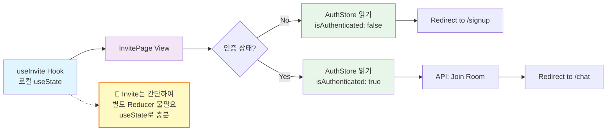
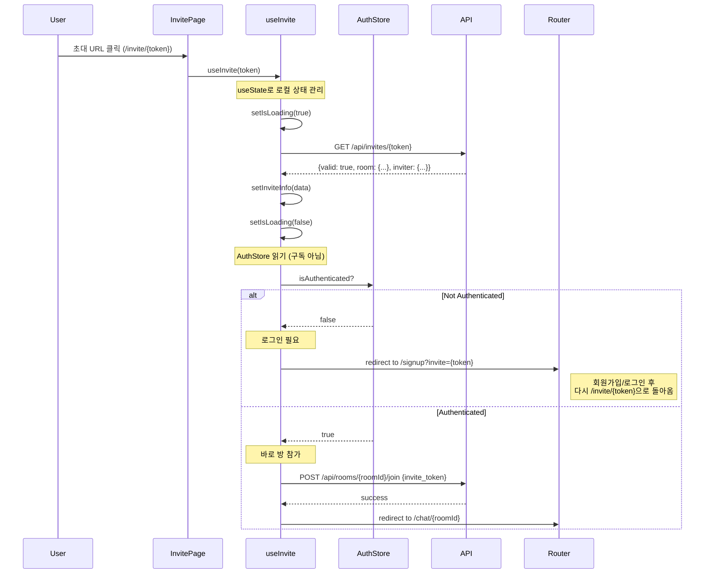
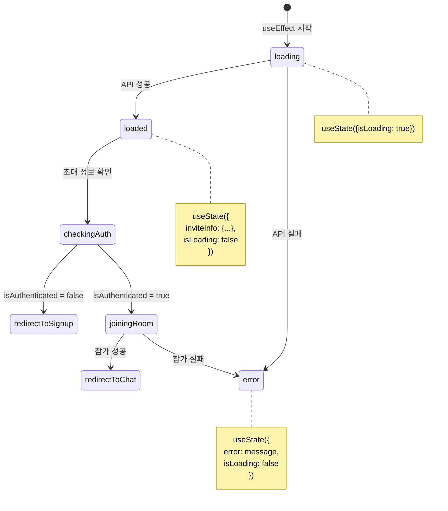

# Invite Page - State Management Implementation

> **관련 문서**: docs/state-management.md, docs/pages/invite/plan.md  
> **Context**: AuthContext, UIContext  
> **우선순위**: P1  
> **상태**: 미구현

---

## 📋 개요

초대 페이지는 간단한 상태 관리만 필요합니다. 초대 토큰을 검증하고 사용자를 적절한 페이지로 리다이렉션합니다.

---

## 🎯 필요한 Context

### 1. AuthContext (필수)
```typescript
const {
  isAuthenticated,  // boolean
  isLoading,        // boolean
} = useAuth();
```

### 2. UIContext (선택)
```typescript
const {
  showToast,  // (type, message) => void
} = useUI();
```

---

## 🏗️ 구현 계획

### Phase 1: useInvite Hook 생성

#### `src/features/invite/hooks/useInvite.ts`

```typescript
"use client";

import { useState, useEffect } from 'react';
import { useRouter } from 'next/navigation';
import { apiClient, extractApiErrorMessage, isAxiosError } from '@/lib/remote/api-client';
import { useAuth } from '@/features/auth/hooks/useAuth';

interface InviteInfo {
  roomId: string;
  roomName: string;
  inviterName: string;
  isValid: boolean;
  expireAt: string | null;
}

export function useInvite(token: string) {
  const router = useRouter();
  const { isAuthenticated, isLoading: isAuthLoading } = useAuth();
  const [inviteInfo, setInviteInfo] = useState<InviteInfo | null>(null);
  const [isLoading, setIsLoading] = useState(true);
  const [error, setError] = useState<string | null>(null);

  // Validate invite token
  useEffect(() => {
    const validateInvite = async () => {
      setIsLoading(true);
      setError(null);

      try {
        const response = await apiClient.get(`/api/invites/${token}`);
        const data = response.data;

        if (!data.valid) {
          setError('유효하지 않거나 만료된 초대 링크입니다');
          setInviteInfo(null);
          return;
        }

        setInviteInfo({
          roomId: data.room.id,
          roomName: data.room.name,
          inviterName: data.inviter?.nickname ?? 'Unknown',
          isValid: true,
          expireAt: data.expire_at,
        });
      } catch (err) {
        const errorMessage = isAxiosError(err)
          ? extractApiErrorMessage(err, '초대 정보를 불러오는데 실패했습니다')
          : '초대 정보를 불러오는데 실패했습니다';

        setError(errorMessage);
        setInviteInfo(null);
      } finally {
        setIsLoading(false);
      }
    };

    validateInvite();
  }, [token]);

  // Handle redirect after auth check
  useEffect(() => {
    if (isAuthLoading || isLoading) return;

    if (!isAuthenticated) {
      // Redirect to signup/login with invite token
      router.replace(`/signup?invite=${token}`);
      return;
    }

    if (inviteInfo && inviteInfo.isValid) {
      // Join room and redirect
      joinRoom(inviteInfo.roomId);
    }
  }, [isAuthenticated, isAuthLoading, isLoading, inviteInfo, token, router]);

  const joinRoom = async (roomId: string) => {
    try {
      await apiClient.post(`/api/rooms/${roomId}/join`, {
        invite_token: token,
      });

      router.replace(`/chat/${roomId}`);
    } catch (err) {
      const errorMessage = isAxiosError(err)
        ? extractApiErrorMessage(err, '채팅방 참가에 실패했습니다')
        : '채팅방 참가에 실패했습니다';

      setError(errorMessage);
    }
  };

  return {
    inviteInfo,
    isLoading: isLoading || isAuthLoading,
    error,
  };
}
```

---

### Phase 2: InvitePage 컴포넌트

#### `src/app/invite/[token]/page.tsx`

```typescript
"use client";

import { use } from 'react';
import Link from 'next/link';
import { useInvite } from '@/features/invite/hooks/useInvite';
import { Button } from '@/components/ui/button';
import { Spinner } from '@/components/ui/spinner';

type InvitePageProps = {
  params: Promise<{ token: string }>;
};

export default function InvitePage({ params }: InvitePageProps) {
  const { token } = use(params);
  const { inviteInfo, isLoading, error } = useInvite(token);

  if (isLoading) {
    return (
      <div className="flex min-h-screen items-center justify-center">
        <div className="text-center">
          <Spinner size="lg" />
          <p className="mt-4 text-slate-600">초대 정보를 확인하는 중...</p>
        </div>
      </div>
    );
  }

  if (error || !inviteInfo) {
    return (
      <div className="flex min-h-screen items-center justify-center">
        <div className="max-w-md text-center">
          <div className="mb-6 text-6xl">❌</div>
          <h1 className="text-2xl font-bold text-slate-900 mb-2">
            유효하지 않은 초대
          </h1>
          <p className="text-slate-600 mb-6">
            {error ?? '초대 링크가 만료되었거나 유효하지 않습니다.'}
          </p>
          <Link href="/dashboard">
            <Button>대시보드로 이동</Button>
          </Link>
        </div>
      </div>
    );
  }

  return (
    <div className="flex min-h-screen items-center justify-center">
      <div className="max-w-md text-center">
        <div className="mb-6 text-6xl">📨</div>
        <h1 className="text-2xl font-bold text-slate-900 mb-2">
          {inviteInfo.roomName}에 초대되었습니다
        </h1>
        <p className="text-slate-600 mb-6">
          {inviteInfo.inviterName}님이 당신을 초대했습니다
        </p>
        <p className="text-sm text-slate-500">
          잠시 후 채팅방으로 이동합니다...
        </p>
      </div>
    </div>
  );
}
```

---

## 📊 데이터 흐름

### Flux 패턴 (Invite는 로컬 상태만 사용, Context Store 없음)



**설계 결정:**
- Invite 페이지는 **일회성 작업**이므로 복잡한 Reducer 불필요
- `useState`로 로컬 상태 관리
- AuthContext는 **읽기 전용**으로만 사용

---

### 초대 처리 플로우 (Sequence Diagram)



---

### 상태 결정 트리

```mermaid
graph TD
    A[Invite Token 검증] --> B{유효한 토큰?}
    
    B -->|No| C[에러 화면]
    B -->|Yes| D{인증됨?}
    
    D -->|No| E[/signup?invite=token]
    D -->|Yes| F[방 참가 API]
    
    F --> G{참가 성공?}
    G -->|Yes| H[/chat/roomId]
    G -->|No| I[에러 Toast]
    
    E --> J[회원가입/로그인]
    J --> K[/invite/token 재방문]
    K --> D
    
    style A fill:#e1f5ff
    style C fill:#ffebee
    style E fill:#fff3e0
    style H fill:#e8f5e9
    style I fill:#ffebee
```

---

### useInvite Hook 상태 관리 (로컬 상태)



---

## 🔄 리다이렉션 시나리오

### 1. 비로그인 사용자
```
1. /invite/abc123 접근
2. 초대 토큰 검증 (유효함)
3. isAuthenticated: false 확인
4. /signup?invite=abc123 로 리다이렉션
5. 회원가입/로그인 완료 후
6. useSignup/useLogin에서 invite 파라미터 확인
7. /invite/abc123 로 다시 리다이렉션
8. 이번에는 isAuthenticated: true
9. 방 참가 API 호출
10. /chat/{roomId} 로 최종 이동
```

### 2. 로그인된 사용자
```
1. /invite/abc123 접근
2. 초대 토큰 검증 (유효함)
3. isAuthenticated: true 확인
4. 방 참가 API 호출
5. /chat/{roomId} 로 즉시 이동
```

### 3. 유효하지 않은 초대
```
1. /invite/invalid 접근
2. 초대 토큰 검증 (유효하지 않음)
3. 에러 화면 표시
4. "대시보드로 이동" 버튼 제공
```

---

## ✅ 구현 체크리스트

### Phase 1: Hook
- [ ] `src/features/invite/hooks/useInvite.ts` 생성
- [ ] 초대 토큰 검증 로직
- [ ] 인증 상태 확인 및 리다이렉션
- [ ] 방 참가 API 호출

### Phase 2: Page
- [ ] `src/app/invite/[token]/page.tsx` 생성
- [ ] 로딩 상태 UI
- [ ] 에러 상태 UI
- [ ] 성공 상태 UI

### Phase 3: Integration
- [ ] useSignup, useLogin에서 invite 파라미터 처리
- [ ] UIContext에 invite 토큰 임시 저장 (선택)

### Phase 4: 테스트
- [ ] 비로그인 사용자 플로우
- [ ] 로그인된 사용자 플로우
- [ ] 유효하지 않은 토큰
- [ ] 만료된 토큰

---

## 📝 참고사항

### 초대 토큰 저장 (선택)

현재 구현은 URL 파라미터로 토큰을 전달합니다. 만약 UIContext에 저장하고 싶다면:

```typescript
// UIContext에 추가
interface UIState {
  // ... existing
  inviteContext: {
    token: string | null;
    roomInfo: RoomInfo | null;
  };
}

// useInvite에서 사용
const { setInviteToken, clearInviteToken } = useUI();

useEffect(() => {
  if (inviteInfo) {
    setInviteToken(token, {
      roomId: inviteInfo.roomId,
      roomName: inviteInfo.roomName,
    });
  }

  return () => clearInviteToken();
}, [inviteInfo, token]);
```

### 초대 만료 시간

- 기본 7일
- 서버에서 `expire_at` 체크
- 클라이언트에서도 표시 가능

---

**문서 버전**: v1.0  
**최종 수정**: 2025년 11월 15일
