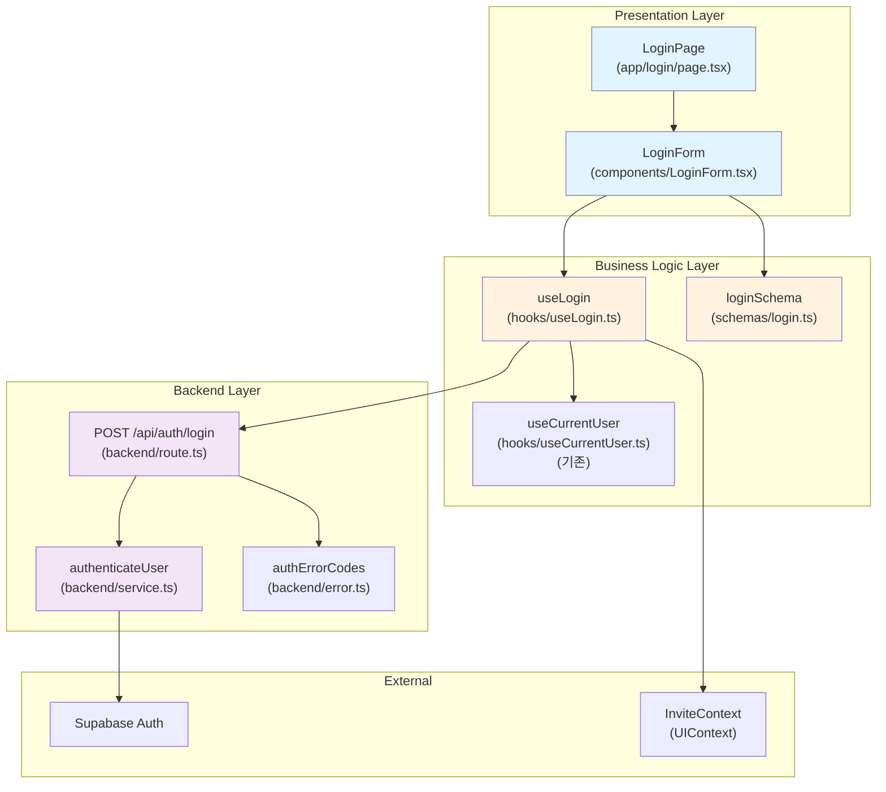

# Login Page - Module Implementation Plan

> **관련 문서**: docs/001/spec.md (Flow 1), docs/prd.md (F-00.2)  
> **우선순위**: P0  
> **상태**: 설계 완료

---

## 📋 개요 (Module Overview)

| 모듈 | 위치 | 설명 | 타입 |
|------|------|------|------|
| **LoginPage** | `src/app/login/page.tsx` | 로그인 UI 컴포넌트 (이미 존재) | Presentation |
| **LoginForm** | `src/features/auth/components/LoginForm.tsx` | 재사용 가능한 로그인 폼 컴포넌트 | Presentation |
| **useLogin** | `src/features/auth/hooks/useLogin.ts` | 로그인 비즈니스 로직 훅 | Business Logic |
| **loginSchema** | `src/features/auth/schemas/login.ts` | 로그인 폼 Zod 스키마 | Validation |
| **login** | `src/features/auth/backend/route.ts` | Hono POST /api/auth/login 엔드포인트 | Backend |
| **authenticateUser** | `src/features/auth/backend/service.ts` | Supabase 로그인 서비스 | Backend Service |

---

## 🔄 Diagram (Module Relationships)



---

## 🚀 Implementation Plan

### 1. Backend Layer

#### 1.1 Service (`src/features/auth/backend/service.ts`)

```typescript
export type LoginPayload = {
  email: string;
  password: string;
};

export type LoginResponse = {
  userId: string;
  email: string;
  session: {
    accessToken: string;
    refreshToken: string;
    expiresAt: number;
  };
};

export const authenticateUser = async (
  client: SupabaseClient,
  payload: LoginPayload,
): Promise<HandlerResult<LoginResponse, AuthErrorCode, unknown>> => {
  const { data, error } = await client.auth.signInWithPassword({
    email: payload.email,
    password: payload.password,
  });

  if (error) {
    if (error.message.includes('Invalid login credentials')) {
      return failure(401, authErrorCodes.invalidCredentials, 'Invalid email or password');
    }
    return failure(500, authErrorCodes.signupFailed, error.message);
  }

  if (!data.user || !data.session) {
    return failure(500, authErrorCodes.signupFailed, 'Login failed');
  }

  return success({
    userId: data.user.id,
    email: data.user.email ?? payload.email,
    session: {
      accessToken: data.session.access_token,
      refreshToken: data.session.refresh_token,
      expiresAt: data.session.expires_at ?? 0,
    },
  });
};
```

**Unit Tests**:
```typescript
describe('authenticateUser', () => {
  it('should authenticate successfully with valid credentials', async () => {
    const mockClient = createMockSupabaseClient({
      authUsers: [{ email: 'test@example.com', password: 'password123' }],
    });
    const result = await authenticateUser(mockClient, {
      email: 'test@example.com',
      password: 'password123',
    });
    
    expect(result.ok).toBe(true);
    if (result.ok) {
      expect(result.data.email).toBe('test@example.com');
      expect(result.data.session.accessToken).toBeDefined();
    }
  });

  it('should fail with invalid credentials', async () => {
    const mockClient = createMockSupabaseClient();
    const result = await authenticateUser(mockClient, {
      email: 'test@example.com',
      password: 'wrongpassword',
    });
    
    expect(result.ok).toBe(false);
    if (!result.ok) {
      expect(result.error.code).toBe(authErrorCodes.invalidCredentials);
    }
  });
});
```

---

#### 1.2 Route (`src/features/auth/backend/route.ts`)

```typescript
export const registerAuthRoutes = (app: Hono<AppEnv>) => {
  // ... existing signup route ...

  app.post(
    '/api/auth/login',
    zValidator('json', LoginRequestSchema),
    async (c) => {
      const body = c.req.valid('json');
      const supabase = getSupabase(c);
      
      const result = await authenticateUser(supabase, {
        email: body.email,
        password: body.password,
      });
      
      return respond(c, result);
    }
  );
};
```

---

#### 1.3 Schema (`src/features/auth/backend/schema.ts`)

```typescript
export const LoginRequestSchema = z.object({
  email: z.string().email('Invalid email format'),
  password: z.string().min(1, 'Password is required'),
});

export type LoginRequest = z.infer<typeof LoginRequestSchema>;
```

---

### 2. Business Logic Layer

#### 2.1 Login Schema (`src/features/auth/schemas/login.ts`)

```typescript
import { z } from 'zod';

export const loginFormSchema = z.object({
  email: z.string().email('올바른 이메일 형식이 아닙니다'),
  password: z.string().min(1, '비밀번호를 입력해주세요'),
});

export type LoginFormData = z.infer<typeof loginFormSchema>;
```

---

#### 2.2 useLogin Hook (`src/features/auth/hooks/useLogin.ts`)

```typescript
import { useState, useCallback } from 'react';
import { useRouter, useSearchParams } from 'next/navigation';
import { apiClient } from '@/lib/remote/api-client';
import { useCurrentUser } from './useCurrentUser';
import type { LoginFormData } from '../schemas/login';

export const useLogin = () => {
  const router = useRouter();
  const searchParams = useSearchParams();
  const { refresh } = useCurrentUser();
  const [isSubmitting, setIsSubmitting] = useState(false);
  const [errorMessage, setErrorMessage] = useState<string | null>(null);

  const login = useCallback(
    async (data: LoginFormData) => {
      setIsSubmitting(true);
      setErrorMessage(null);

      try {
        const response = await apiClient.post('/api/auth/login', {
          email: data.email,
          password: data.password,
        });

        if (!response.ok) {
          const errorData = await response.json();
          setErrorMessage(errorData.error?.message ?? '로그인에 실패했습니다');
          return { ok: false };
        }

        // Refresh user context
        await refresh();

        // Handle redirect
        const redirectedFrom = searchParams.get('redirectedFrom');
        const inviteToken = searchParams.get('invite');
        
        if (inviteToken) {
          router.replace(`/invite/${inviteToken}`);
        } else if (redirectedFrom) {
          router.replace(redirectedFrom);
        } else {
          router.replace('/dashboard');
        }

        return { ok: true };
      } catch (error) {
        setErrorMessage('로그인 처리 중 오류가 발생했습니다');
        return { ok: false };
      } finally {
        setIsSubmitting(false);
      }
    },
    [refresh, router, searchParams]
  );

  return {
    login,
    isSubmitting,
    errorMessage,
  };
};
```

---

### 3. Presentation Layer

#### 3.1 LoginForm Component (`src/features/auth/components/LoginForm.tsx`)

```typescript
"use client";

import { useForm } from 'react-hook-form';
import { zodResolver } from '@hookform/resolvers/zod';
import { Button } from '@/components/ui/button';
import { Input } from '@/components/ui/input';
import { Label } from '@/components/ui/label';
import { loginFormSchema, type LoginFormData } from '../schemas/login';
import { useLogin } from '../hooks/useLogin';

export const LoginForm = () => {
  const { login, isSubmitting, errorMessage } = useLogin();
  const {
    register,
    handleSubmit,
    formState: { errors },
  } = useForm<LoginFormData>({
    resolver: zodResolver(loginFormSchema),
  });

  const onSubmit = async (data: LoginFormData) => {
    await login(data);
  };

  return (
    <form onSubmit={handleSubmit(onSubmit)} className="flex flex-col gap-4">
      <div className="flex flex-col gap-2">
        <Label htmlFor="email">이메일</Label>
        <Input
          id="email"
          type="email"
          autoComplete="email"
          {...register('email')}
        />
        {errors.email && (
          <p className="text-sm text-rose-500">{errors.email.message}</p>
        )}
      </div>

      <div className="flex flex-col gap-2">
        <Label htmlFor="password">비밀번호</Label>
        <Input
          id="password"
          type="password"
          autoComplete="current-password"
          {...register('password')}
        />
        {errors.password && (
          <p className="text-sm text-rose-500">{errors.password.message}</p>
        )}
      </div>

      {errorMessage && (
        <p className="text-sm text-rose-500">{errorMessage}</p>
      )}

      <Button type="submit" disabled={isSubmitting}>
        {isSubmitting ? '로그인 중...' : '로그인'}
      </Button>
    </form>
  );
};
```

**QA Sheet**:
| 테스트 케이스 | 입력 | 예상 결과 | 상태 |
|--------------|------|----------|------|
| 유효한 로그인 | email: test@example.com, password: password123 | 로그인 성공, 대시보드로 이동 | ⬜ |
| 이메일 형식 오류 | email: invalid-email | "올바른 이메일 형식이 아닙니다" 에러 표시 | ⬜ |
| 비밀번호 빈값 | password: "" | "비밀번호를 입력해주세요" 에러 표시 | ⬜ |
| 잘못된 자격증명 | email/password: wrong | "Invalid email or password" 에러 표시 | ⬜ |
| 네트워크 오류 | - | "로그인 처리 중 오류가 발생했습니다" 에러 표시 | ⬜ |
| redirectedFrom 파라미터 | ?redirectedFrom=/chat/room-1 | 로그인 후 /chat/room-1로 이동 | ⬜ |
| 초대 토큰 있음 | ?invite=room-uuid | 로그인 후 /invite/room-uuid로 이동 | ⬜ |
| 로딩 상태 | 제출 중 | 버튼 비활성화, "로그인 중..." 텍스트 표시 | ⬜ |

---

#### 3.2 LoginPage (`src/app/login/page.tsx`)

기존 파일을 수정하여 `LoginForm` 컴포넌트를 사용하도록 리팩토링:

```typescript
"use client";

import { useEffect } from "react";
import Image from "next/image";
import Link from "next/link";
import { useRouter } from "next/navigation";
import { useCurrentUser } from "@/features/auth/hooks/useCurrentUser";
import { LoginForm } from "@/features/auth/components/LoginForm";

type LoginPageProps = {
  params: Promise<Record<string, never>>;
};

export default function LoginPage({ params }: LoginPageProps) {
  void params;
  const router = useRouter();
  const { isAuthenticated } = useCurrentUser();

  useEffect(() => {
    if (isAuthenticated) {
      router.replace('/dashboard');
    }
  }, [isAuthenticated, router]);

  if (isAuthenticated) {
    return null;
  }

  return (
    <div className="mx-auto flex min-h-screen w-full max-w-4xl flex-col items-center justify-center gap-10 px-6 py-16">
      <header className="flex flex-col items-center gap-3 text-center">
        <h1 className="text-3xl font-semibold">로그인</h1>
        <p className="text-slate-500">
          계정으로 로그인하고 채팅을 계속하세요.
        </p>
      </header>
      <div className="grid w-full gap-8 md:grid-cols-2">
        <div className="rounded-xl border border-slate-200 p-6 shadow-sm">
          <LoginForm />
          <p className="mt-4 text-xs text-slate-500">
            계정이 없으신가요?{" "}
            <Link
              href="/signup"
              className="font-medium text-slate-700 underline hover:text-slate-900"
            >
              회원가입
            </Link>
          </p>
        </div>
        <figure className="overflow-hidden rounded-xl border border-slate-200">
          <Image
            src="https://picsum.photos/seed/login/640/640"
            alt="로그인"
            width={640}
            height={640}
            className="h-full w-full object-cover"
            priority
          />
        </figure>
      </div>
    </div>
  );
}
```

**QA Sheet**:
| 테스트 케이스 | 조건 | 예상 결과 | 상태 |
|--------------|------|----------|------|
| 이미 로그인된 사용자 | isAuthenticated: true | /dashboard로 리디렉션 | ⬜ |
| 비로그인 사용자 | isAuthenticated: false | 로그인 폼 표시 | ⬜ |
| 회원가입 링크 클릭 | - | /signup으로 이동 | ⬜ |
| 반응형 레이아웃 | 모바일/데스크톱 | 적절한 그리드 레이아웃 표시 | ⬜ |

---

## ✅ Completion Checklist

- [ ] Backend 구현
  - [ ] `authenticateUser` 서비스 함수 구현
  - [ ] `LoginRequestSchema` 정의
  - [ ] `/api/auth/login` 라우트 등록
  - [ ] Unit tests 작성
- [ ] Business Logic 구현
  - [ ] `loginFormSchema` 정의
  - [ ] `useLogin` 훅 구현
- [ ] Presentation 구현
  - [ ] `LoginForm` 컴포넌트 구현
  - [ ] `LoginPage` 리팩토링
  - [ ] QA Sheet 테스트 완료
- [ ] Integration
  - [ ] Hono 앱에 라우트 등록
  - [ ] E2E 테스트 실행

---

**최종 업데이트**: 2025년 11월 15일
