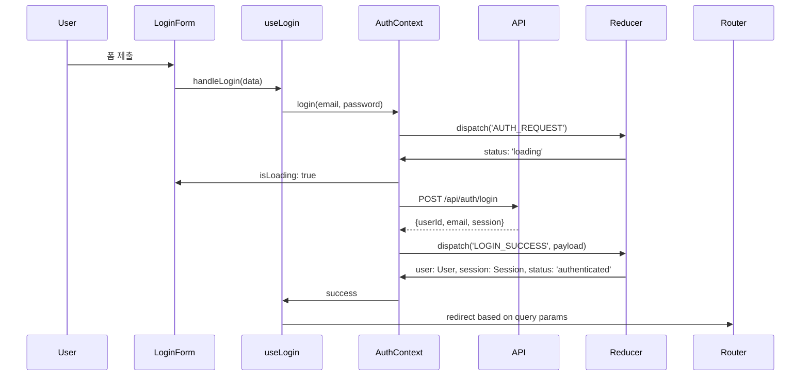

# Login Page - State Management Implementation

> **관련 문서**: docs/state-management.md, docs/pages/login/plan.md  
> **Context**: AuthContext  
> **우선순위**: P0  
> **상태**: 미구현

---

## 📋 개요

로그인 페이지는 회원가입 페이지와 동일한 **AuthContext**를 공유합니다.

---

## 🎯 필요한 Context

### 1. AuthContext (필수)

**사용 목적:**
- 로그인 처리
- 세션 복원
- 사용자 상태 관리

**필요한 기능:**
```typescript
const {
  login,           // (email, password) => Promise<void>
  isLoading,       // boolean
  error,           // string | null
  isAuthenticated, // boolean
} = useAuth();
```

---

## 🏗️ 구현 계획

### Phase 1: useLogin Hook 생성

#### `src/features/auth/hooks/useLogin.ts`

```typescript
"use client";

import { useState, useCallback } from 'react';
import { useRouter, useSearchParams } from 'next/navigation';
import { useAuth } from './useAuth';
import type { LoginFormData } from '../schemas/login';

export const useLogin = () => {
  const router = useRouter();
  const searchParams = useSearchParams();
  const { login, error: authError, isLoading } = useAuth();
  const [errorMessage, setErrorMessage] = useState<string | null>(null);

  const handleLogin = useCallback(
    async (data: LoginFormData) => {
      setErrorMessage(null);

      try {
        await login(data.email, data.password);

        // Handle redirect
        const redirectedFrom = searchParams.get('redirectedFrom');
        const inviteToken = searchParams.get('invite');
        
        if (inviteToken) {
          router.replace(`/invite/${inviteToken}`);
        } else if (redirectedFrom) {
          router.replace(redirectedFrom);
        } else {
          router.replace('/dashboard');
        }

        return { ok: true };
      } catch (error) {
        setErrorMessage(authError ?? '로그인에 실패했습니다');
        return { ok: false };
      }
    },
    [login, authError, router, searchParams]
  );

  return {
    login: handleLogin,
    isSubmitting: isLoading,
    errorMessage: errorMessage ?? authError,
  };
};
```

---

### Phase 2: LoginForm 컴포넌트

#### `src/features/auth/components/LoginForm.tsx`

```typescript
"use client";

import { useForm } from 'react-hook-form';
import { zodResolver } from '@hookform/resolvers/zod';
import Link from 'next/link';
import { Button } from '@/components/ui/button';
import { Input } from '@/components/ui/input';
import { Label } from '@/components/ui/label';
import { loginFormSchema, type LoginFormData } from '../schemas/login';
import { useLogin } from '../hooks/useLogin';

export const LoginForm = () => {
  const { login, isSubmitting, errorMessage } = useLogin();
  const {
    register,
    handleSubmit,
    formState: { errors },
  } = useForm<LoginFormData>({
    resolver: zodResolver(loginFormSchema),
  });

  const onSubmit = async (data: LoginFormData) => {
    await login(data);
  };

  return (
    <form onSubmit={handleSubmit(onSubmit)} className="flex flex-col gap-4">
      <div className="flex flex-col gap-2">
        <Label htmlFor="email">이메일</Label>
        <Input
          id="email"
          type="email"
          autoComplete="email"
          {...register('email')}
        />
        {errors.email && (
          <p className="text-sm text-rose-500">{errors.email.message}</p>
        )}
      </div>

      <div className="flex flex-col gap-2">
        <Label htmlFor="password">비밀번호</Label>
        <Input
          id="password"
          type="password"
          autoComplete="current-password"
          {...register('password')}
        />
        {errors.password && (
          <p className="text-sm text-rose-500">{errors.password.message}</p>
        )}
      </div>

      {errorMessage && (
        <p className="text-sm text-rose-500">{errorMessage}</p>
      )}

      <Button type="submit" disabled={isSubmitting}>
        {isSubmitting ? '로그인 중...' : '로그인'}
      </Button>

      <div className="text-center text-sm text-slate-500">
        <Link
          href="/auth/reset-password"
          className="hover:text-slate-700 underline"
        >
          비밀번호를 잊으셨나요?
        </Link>
      </div>
    </form>
  );
};
```

---

## 📊 데이터 흐름

### 로그인 플로우



---

## 🔄 리다이렉션 로직

### 우선순위

1. **초대 토큰 존재**: `/invite/{token}`
2. **redirectedFrom 파라미터**: 원래 가려던 페이지
3. **기본값**: `/dashboard`

```typescript
// Example URLs and their redirects:
// /login → /dashboard
// /login?invite=room-uuid → /invite/room-uuid
// /login?redirectedFrom=/chat/room-1 → /chat/room-1
// /login?invite=room-uuid&redirectedFrom=/chat/room-2 → /invite/room-uuid (초대 우선)
```

---

## ✅ 구현 체크리스트

### Phase 1: Hook 생성
- [ ] `src/features/auth/hooks/useLogin.ts` 생성
- [ ] 리다이렉션 로직 구현
- [ ] 에러 처리 구현

### Phase 2: 컴포넌트
- [ ] `src/features/auth/components/LoginForm.tsx` 생성
- [ ] 폼 검증 연동
- [ ] 로딩 상태 UI

### Phase 3: 페이지 통합
- [ ] `src/app/login/page.tsx` 수정
- [ ] LoginForm 컴포넌트 사용
- [ ] 이미 로그인된 사용자 리다이렉션

### Phase 4: 테스트
- [ ] 로그인 플로우 테스트
- [ ] 리다이렉션 시나리오 테스트
- [ ] 에러 처리 테스트

---

## 📝 참고사항

### 공통 AuthContext
- 회원가입과 로그인은 동일한 AuthContext 사용
- signup(), login() 모두 `LOGIN_SUCCESS` 액션 발행
- 세션 저장 로직 공유

### 비밀번호 찾기
- 향후 구현 예정 (`/auth/reset-password`)
- 별도 Context 불필요 (일회성 작업)

---

**문서 버전**: v1.0  
**최종 수정**: 2025년 11월 15일
