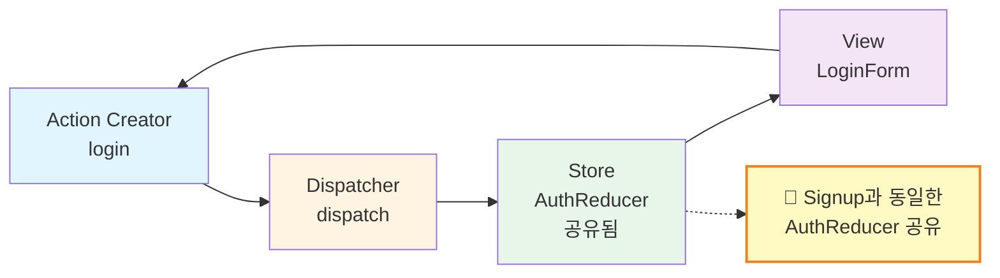
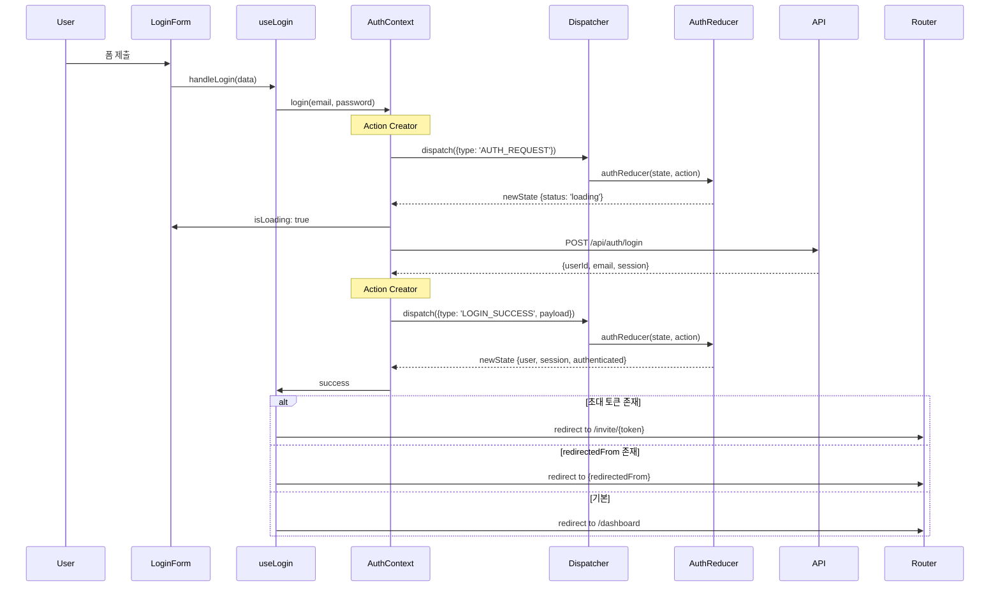
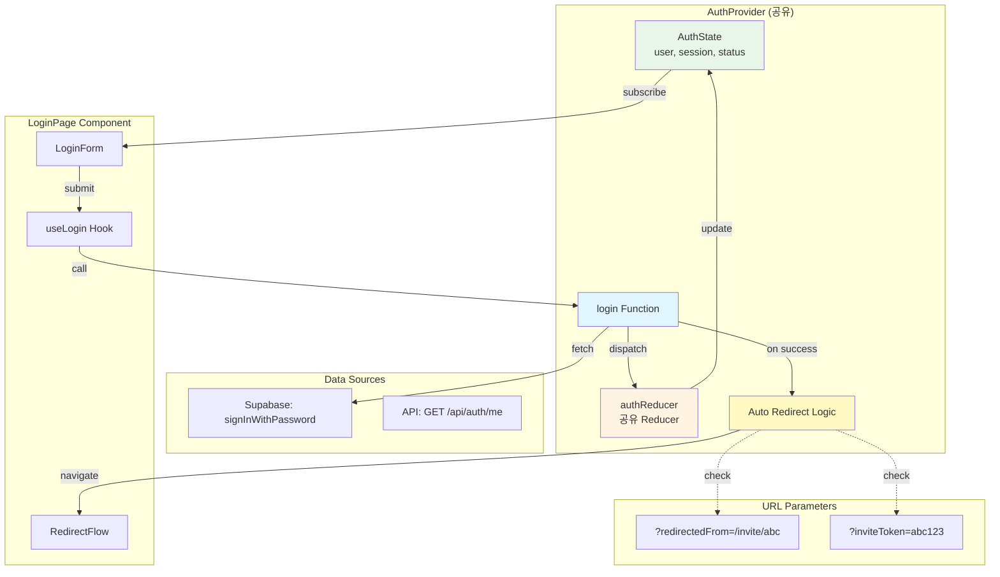
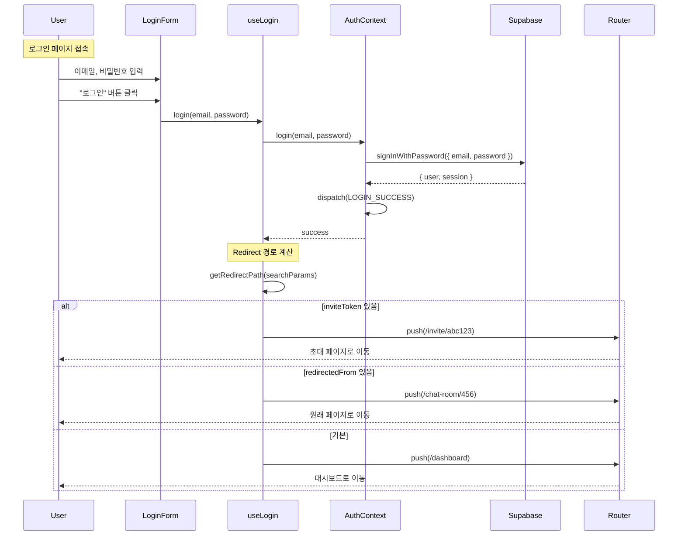

# Login Page - State Management Implementation

> **관련 문서**: docs/state-management.md, docs/pages/login/plan.md  
> **Context**: AuthContext  
> **우선순위**: P0  
> **상태**: 미구현

---

## 📋 개요

로그인 페이지는 회원가입 페이지와 동일한 **AuthContext**를 공유합니다.

---

## 🎯 필요한 Context

### 1. AuthContext (필수)

**사용 목적:**
- 로그인 처리
- 세션 복원
- 사용자 상태 관리

**필요한 기능:**
```typescript
const {
  login,           // (email, password) => Promise<void>
  isLoading,       // boolean
  error,           // string | null
  isAuthenticated, // boolean
} = useAuth();
```

---

## 🏗️ 구현 계획

### Phase 1: useLogin Hook 생성

#### `src/features/auth/hooks/useLogin.ts`

```typescript
"use client";

import { useState, useCallback } from 'react';
import { useRouter, useSearchParams } from 'next/navigation';
import { useAuth } from './useAuth';
import type { LoginFormData } from '../schemas/login';

export const useLogin = () => {
  const router = useRouter();
  const searchParams = useSearchParams();
  const { login, error: authError, isLoading } = useAuth();
  const [errorMessage, setErrorMessage] = useState<string | null>(null);

  const handleLogin = useCallback(
    async (data: LoginFormData) => {
      setErrorMessage(null);

      try {
        await login(data.email, data.password);

        // Handle redirect
        const redirectedFrom = searchParams.get('redirectedFrom');
        const inviteToken = searchParams.get('invite');
        
        if (inviteToken) {
          router.replace(`/invite/${inviteToken}`);
        } else if (redirectedFrom) {
          router.replace(redirectedFrom);
        } else {
          router.replace('/dashboard');
        }

        return { ok: true };
      } catch (error) {
        setErrorMessage(authError ?? '로그인에 실패했습니다');
        return { ok: false };
      }
    },
    [login, authError, router, searchParams]
  );

  return {
    login: handleLogin,
    isSubmitting: isLoading,
    errorMessage: errorMessage ?? authError,
  };
};
```

---

### Phase 2: LoginForm 컴포넌트

#### `src/features/auth/components/LoginForm.tsx`

```typescript
"use client";

import { useForm } from 'react-hook-form';
import { zodResolver } from '@hookform/resolvers/zod';
import Link from 'next/link';
import { Button } from '@/components/ui/button';
import { Input } from '@/components/ui/input';
import { Label } from '@/components/ui/label';
import { loginFormSchema, type LoginFormData } from '../schemas/login';
import { useLogin } from '../hooks/useLogin';

export const LoginForm = () => {
  const { login, isSubmitting, errorMessage } = useLogin();
  const {
    register,
    handleSubmit,
    formState: { errors },
  } = useForm<LoginFormData>({
    resolver: zodResolver(loginFormSchema),
  });

  const onSubmit = async (data: LoginFormData) => {
    await login(data);
  };

  return (
    <form onSubmit={handleSubmit(onSubmit)} className="flex flex-col gap-4">
      <div className="flex flex-col gap-2">
        <Label htmlFor="email">이메일</Label>
        <Input
          id="email"
          type="email"
          autoComplete="email"
          {...register('email')}
        />
        {errors.email && (
          <p className="text-sm text-rose-500">{errors.email.message}</p>
        )}
      </div>

      <div className="flex flex-col gap-2">
        <Label htmlFor="password">비밀번호</Label>
        <Input
          id="password"
          type="password"
          autoComplete="current-password"
          {...register('password')}
        />
        {errors.password && (
          <p className="text-sm text-rose-500">{errors.password.message}</p>
        )}
      </div>

      {errorMessage && (
        <p className="text-sm text-rose-500">{errorMessage}</p>
      )}

      <Button type="submit" disabled={isSubmitting}>
        {isSubmitting ? '로그인 중...' : '로그인'}
      </Button>

      <div className="text-center text-sm text-slate-500">
        <Link
          href="/auth/reset-password"
          className="hover:text-slate-700 underline"
        >
          비밀번호를 잊으셨나요?
        </Link>
      </div>
    </form>
  );
};
```

---

## 📊 데이터 흐름

### Flux 패턴 아키텍처 (Login은 Signup과 동일한 AuthContext 사용)



---

### 로그인 플로우 (Sequence Diagram)



---

### 리다이렉션 결정 흐름

```mermaid
graph TD
    A[LOGIN_SUCCESS Action] --> B{초대 토큰?}
    B -->|있음| C[/invite/token]
    B -->|없음| D{redirectedFrom?}
    D -->|있음| E[원래 페이지]
    D -->|없음| F[/dashboard]
    
    style A fill:#e8f5e9
    style C fill:#fff3e0
    style E fill:#fff3e0
    style F fill:#fff3e0
```

---

## 🔄 리다이렉션 로직

### 우선순위

1. **초대 토큰 존재**: `/invite/{token}`
2. **redirectedFrom 파라미터**: 원래 가려던 페이지
3. **기본값**: `/dashboard`

```typescript
// Example URLs and their redirects:
// /login → /dashboard
// /login?invite=room-uuid → /invite/room-uuid
// /login?redirectedFrom=/chat/room-1 → /chat/room-1
// /login?invite=room-uuid&redirectedFrom=/chat/room-2 → /invite/room-uuid (초대 우선)
```

---

## 🏛️ Context 아키텍처 상세 설계

> **Note**: 로그인 페이지는 회원가입과 동일한 **AuthContext**를 공유합니다. 자세한 AuthContext 설계는 [signup/state-management.md](../signup/state-management.md)를 참고하세요.

### AuthContext 데이터 흐름 (로그인 페이지)



---

### useLogin Hook 인터페이스 설계

> **Note**: `useLogin`은 `AuthContext`를 래핑한 커스텀 훅으로, 로그인 페이지 전용 로직을 포함합니다.

```typescript
/**
 * useLogin 훅의 반환 타입
 * - AuthContext의 login 함수를 래핑
 * - redirectedFrom, inviteToken 처리 추가
 */
interface UseLoginReturn {
  // ===== AuthContext에서 가져온 값 =====
  
  user: User | null;
  status: AuthState['status'];
  error: string | null;
  
  
  // ===== 로그인 페이지 전용 함수 =====
  
  /**
   * 로그인 시도
   * 1. Supabase signInWithPassword 호출
   * 2. 성공 시 AuthContext 상태 업데이트
   * 3. redirectedFrom 또는 inviteToken에 따라 자동 이동
   * 
   * @throws {Error} 로그인 실패 시
   */
  login: (email: string, password: string) => Promise<void>;
  
  /**
   * 로그인 성공 후 이동할 경로 계산
   * 우선순위: inviteToken > redirectedFrom > /dashboard
   */
  getRedirectPath: () => string;
}
```

---

### 로그인 Redirect 로직 상세

```typescript
/**
 * getRedirectPath 구현
 */
function getRedirectPath(
  searchParams: URLSearchParams
): string {
  // 1. inviteToken이 있으면 초대 페이지로
  const inviteToken = searchParams.get('inviteToken');
  if (inviteToken) {
    return `/invite/${inviteToken}`;
  }
  
  // 2. redirectedFrom이 있으면 원래 페이지로
  const redirectedFrom = searchParams.get('redirectedFrom');
  if (redirectedFrom) {
    return redirectedFrom;
  }
  
  // 3. 기본: 대시보드
  return '/dashboard';
}

/**
 * 예시 URL 및 이동 경로:
 * 
 * /login
 *   → /dashboard
 * 
 * /login?redirectedFrom=/chat-room/123
 *   → /chat-room/123
 * 
 * /login?inviteToken=abc123
 *   → /invite/abc123
 * 
 * /login?inviteToken=abc123&redirectedFrom=/chat-room/456
 *   → /invite/abc123 (inviteToken 우선)
 */
```

---

### AuthContext 공유 설계 요약

**AuthContext 재사용:**
- `AuthState`, `AuthAction`, `authReducer` 모두 동일
- 로그인, 회원가입, 로그아웃 모두 같은 Context 사용
- 참고: [signup/state-management.md의 AuthContext 설계](../signup/state-management.md#🏛️-context-아키텍처-상세-설계)

**로그인 페이지 차이점:**
1. **useLogin 훅**: `login` 함수에 redirect 로직 추가
2. **URL 파라미터 처리**: `redirectedFrom`, `inviteToken` 우선순위
3. **폼 필드**: 이메일, 비밀번호만 (닉네임 없음)

---

### 로그인 흐름 시퀀스 다이어그램



---

### LoginPage 컴포넌트 사용 예시

```typescript
// ===== LoginPage.tsx =====
function LoginPage({ searchParams }: { searchParams: Promise<{ redirectedFrom?: string; inviteToken?: string }> }) {
  const params = use(searchParams);
  const { login, status, error } = useLogin();
  const router = useRouter();
  
  const [email, setEmail] = useState('');
  const [password, setPassword] = useState('');
  
  const handleSubmit = async (e: React.FormEvent) => {
    e.preventDefault();
    try {
      await login(email, password);
      
      // Redirect 경로 계산
      const redirectPath = getRedirectPath(new URLSearchParams(params));
      router.push(redirectPath);
    } catch (err) {
      // 에러는 AuthContext에서 관리
      console.error(err);
    }
  };
  
  return (
    <div className="login-page">
      <h1>로그인</h1>
      
      {params.redirectedFrom && (
        <p className="info-message">
          로그인 후 원래 페이지로 돌아갑니다.
        </p>
      )}
      
      {params.inviteToken && (
        <p className="info-message">
          로그인 후 채팅방에 초대됩니다.
        </p>
      )}
      
      <form onSubmit={handleSubmit}>
        <Input
          type="email"
          value={email}
          onChange={e => setEmail(e.target.value)}
          placeholder="이메일"
          required
        />
        <Input
          type="password"
          value={password}
          onChange={e => setPassword(e.target.value)}
          placeholder="비밀번호"
          required
        />
        
        {error && <ErrorMessage>{error}</ErrorMessage>}
        
        <Button type="submit" disabled={status === 'loading'}>
          {status === 'loading' ? '로그인 중...' : '로그인'}
        </Button>
      </form>
      
      <p className="signup-link">
        계정이 없으신가요? <a href="/signup">회원가입</a>
      </p>
    </div>
  );
}

// ===== useLogin.ts =====
function useLogin(): UseLoginReturn {
  const { user, status, error, login: authLogin } = useAuth();
  
  const login = useCallback(async (email: string, password: string) => {
    await authLogin(email, password);
  }, [authLogin]);
  
  const getRedirectPath = useCallback((searchParams: URLSearchParams) => {
    const inviteToken = searchParams.get('inviteToken');
    if (inviteToken) return `/invite/${inviteToken}`;
    
    const redirectedFrom = searchParams.get('redirectedFrom');
    if (redirectedFrom) return redirectedFrom;
    
    return '/dashboard';
  }, []);
  
  return {
    user,
    status,
    error,
    login,
    getRedirectPath,
  };
}
```

---

### 로그인 vs 회원가입 비교

| 항목 | 로그인 | 회원가입 |
|------|--------|----------|
| **AuthContext** | ✅ 공유 | ✅ 공유 |
| **Reducer** | `authReducer` | `authReducer` |
| **Action** | `LOGIN_SUCCESS` | `SIGNUP_SUCCESS` |
| **Supabase API** | `signInWithPassword` | `signUp` |
| **폼 필드** | 이메일, 비밀번호 | 이메일, 비밀번호, 닉네임 |
| **Redirect 로직** | inviteToken > redirectedFrom > dashboard | 자동 로그인 → dashboard |
| **Custom Hook** | `useLogin` | `useSignup` |

---

### 상태 전이 요약

**로그인 페이지 흐름:**

```
[초기]
  status = 'idle'
  user = null
  ↓
[폼 제출]
  dispatch(AUTH_REQUEST)
  status = 'loading'
  ↓
[Supabase 응답]
  ├─ 성공 → dispatch(LOGIN_SUCCESS) → status = 'authenticated' → Redirect
  └─ 실패 → dispatch(AUTH_FAILURE) → status = 'error' → 에러 메시지 표시
```

---

### 에러 처리

**공통 에러 (AuthContext):**
- 네트워크 에러
- Supabase 서버 오류

**로그인 전용 에러:**
- "이메일 또는 비밀번호가 틀렸습니다"
- "존재하지 않는 사용자입니다"
- "이메일 인증이 필요합니다" (선택 사항)

---

## ✅ 구현 체크리스트

### Phase 1: Hook 생성
- [ ] `src/features/auth/hooks/useLogin.ts` 생성
- [ ] 리다이렉션 로직 구현
- [ ] 에러 처리 구현

### Phase 2: 컴포넌트
- [ ] `src/features/auth/components/LoginForm.tsx` 생성
- [ ] 폼 검증 연동
- [ ] 로딩 상태 UI

### Phase 3: 페이지 통합
- [ ] `src/app/login/page.tsx` 수정
- [ ] LoginForm 컴포넌트 사용
- [ ] 이미 로그인된 사용자 리다이렉션

### Phase 4: 테스트
- [ ] 로그인 플로우 테스트
- [ ] 리다이렉션 시나리오 테스트
- [ ] 에러 처리 테스트

---

## 📝 참고사항

### 공통 AuthContext
- 회원가입과 로그인은 동일한 AuthContext 사용
- signup(), login() 모두 `LOGIN_SUCCESS` 액션 발행
- 세션 저장 로직 공유

### 비밀번호 찾기
- 향후 구현 예정 (`/auth/reset-password`)
- 별도 Context 불필요 (일회성 작업)

---

**문서 버전**: v1.0  
**최종 수정**: 2025년 11월 15일
