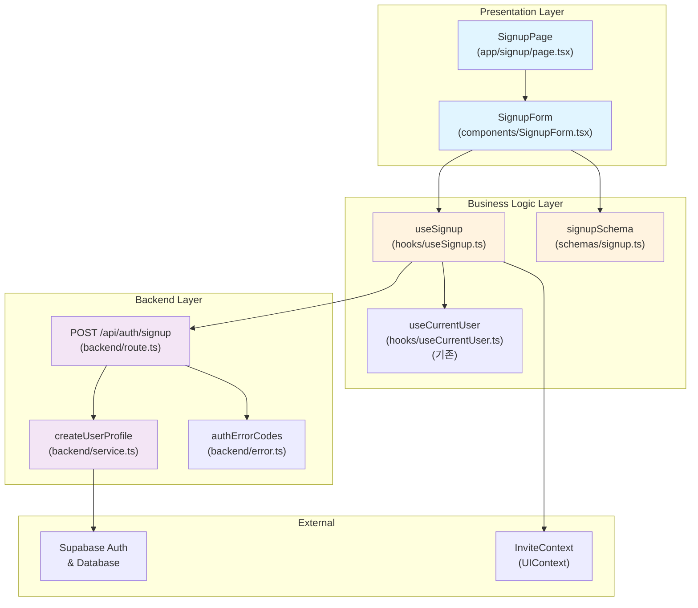

# Signup Page - Module Implementation Plan

> **관련 문서**: docs/001/spec.md (Flow 1), docs/prd.md (F-00.1)  
> **우선순위**: P0  
> **상태**: 설계 완료

---

## 📋 개요 (Module Overview)

| 모듈 | 위치 | 설명 | 타입 |
|------|------|------|------|
| **SignupPage** | `src/app/signup/page.tsx` | 회원가입 UI 컴포넌트 (이미 존재) | Presentation |
| **SignupForm** | `src/features/auth/components/SignupForm.tsx` | 재사용 가능한 회원가입 폼 컴포넌트 | Presentation |
| **useSignup** | `src/features/auth/hooks/useSignup.ts` | 회원가입 비즈니스 로직 훅 | Business Logic |
| **signupSchema** | `src/features/auth/schemas/signup.ts` | 회원가입 폼 Zod 스키마 | Validation |
| **signup** | `src/features/auth/backend/route.ts` | Hono POST /api/auth/signup 엔드포인트 | Backend |
| **createUserProfile** | `src/features/auth/backend/service.ts` | Supabase 사용자 및 프로필 생성 서비스 | Backend Service |
| **authErrorCodes** | `src/features/auth/backend/error.ts` | 인증 관련 에러 코드 정의 | Backend |

---

## 🔄 Diagram (Module Relationships)



---

## 🚀 Implementation Plan

### 1. Backend Layer

#### 1.1 Error Codes (`src/features/auth/backend/error.ts`)

```typescript
export const authErrorCodes = {
  invalidCredentials: 'INVALID_CREDENTIALS',
  emailAlreadyExists: 'EMAIL_ALREADY_EXISTS',
  weakPassword: 'WEAK_PASSWORD',
  invalidEmail: 'INVALID_EMAIL',
  nicknameAlreadyExists: 'NICKNAME_ALREADY_EXISTS',
  profileCreationFailed: 'PROFILE_CREATION_FAILED',
  signupFailed: 'SIGNUP_FAILED',
} as const;

export type AuthErrorCode = (typeof authErrorCodes)[keyof typeof authErrorCodes];
```

**Unit Tests**:
```typescript
describe('authErrorCodes', () => {
  it('should have unique error codes', () => {
    const values = Object.values(authErrorCodes);
    const uniqueValues = new Set(values);
    expect(uniqueValues.size).toBe(values.length);
  });
});
```

---

#### 1.2 Service (`src/features/auth/backend/service.ts`)

```typescript
import type { SupabaseClient } from '@supabase/supabase-js';
import { success, failure, type HandlerResult } from '@/backend/http/response';
import { authErrorCodes, type AuthErrorCode } from './error';

export type SignupPayload = {
  email: string;
  password: string;
  nickname: string;
};

export type SignupResponse = {
  userId: string;
  email: string;
  nickname: string;
};

export const createUserProfile = async (
  client: SupabaseClient,
  payload: SignupPayload,
): Promise<HandlerResult<SignupResponse, AuthErrorCode, unknown>> => {
  // 1. Check nickname uniqueness
  const { data: existingProfile, error: checkError } = await client
    .from('profiles')
    .select('id')
    .eq('nickname', payload.nickname)
    .maybeSingle();

  if (checkError) {
    return failure(500, authErrorCodes.signupFailed, checkError.message);
  }

  if (existingProfile) {
    return failure(409, authErrorCodes.nicknameAlreadyExists, 'Nickname already exists');
  }

  // 2. Create auth user
  const { data: authData, error: authError } = await client.auth.signUp({
    email: payload.email,
    password: payload.password,
  });

  if (authError) {
    if (authError.message.includes('already registered')) {
      return failure(409, authErrorCodes.emailAlreadyExists, 'Email already exists');
    }
    if (authError.message.includes('Password')) {
      return failure(400, authErrorCodes.weakPassword, authError.message);
    }
    return failure(500, authErrorCodes.signupFailed, authError.message);
  }

  if (!authData.user) {
    return failure(500, authErrorCodes.signupFailed, 'User creation failed');
  }

  // 3. Create profile
  const { error: profileError } = await client
    .from('profiles')
    .insert({
      id: authData.user.id,
      nickname: payload.nickname,
      email: payload.email,
    });

  if (profileError) {
    // Rollback: delete auth user (TODO: implement cleanup)
    return failure(500, authErrorCodes.profileCreationFailed, profileError.message);
  }

  return success({
    userId: authData.user.id,
    email: authData.user.email ?? payload.email,
    nickname: payload.nickname,
  });
};
```

**Unit Tests**:
```typescript
describe('createUserProfile', () => {
  it('should create user and profile successfully', async () => {
    // Mock Supabase client
    const mockClient = createMockSupabaseClient();
    const result = await createUserProfile(mockClient, {
      email: 'test@example.com',
      password: 'password123',
      nickname: 'testuser',
    });
    
    expect(result.ok).toBe(true);
    if (result.ok) {
      expect(result.data.email).toBe('test@example.com');
      expect(result.data.nickname).toBe('testuser');
    }
  });

  it('should fail if nickname already exists', async () => {
    const mockClient = createMockSupabaseClient({
      profiles: [{ id: '1', nickname: 'testuser' }],
    });
    const result = await createUserProfile(mockClient, {
      email: 'test@example.com',
      password: 'password123',
      nickname: 'testuser',
    });
    
    expect(result.ok).toBe(false);
    if (!result.ok) {
      expect(result.error.code).toBe(authErrorCodes.nicknameAlreadyExists);
    }
  });

  it('should fail if email already exists', async () => {
    const mockClient = createMockSupabaseClient({
      authUsers: [{ email: 'test@example.com' }],
    });
    const result = await createUserProfile(mockClient, {
      email: 'test@example.com',
      password: 'password123',
      nickname: 'newuser',
    });
    
    expect(result.ok).toBe(false);
    if (!result.ok) {
      expect(result.error.code).toBe(authErrorCodes.emailAlreadyExists);
    }
  });

  it('should fail if password is weak', async () => {
    const mockClient = createMockSupabaseClient();
    const result = await createUserProfile(mockClient, {
      email: 'test@example.com',
      password: '123',
      nickname: 'testuser',
    });
    
    expect(result.ok).toBe(false);
    if (!result.ok) {
      expect(result.error.code).toBe(authErrorCodes.weakPassword);
    }
  });
});
```

---

#### 1.3 Route (`src/features/auth/backend/route.ts`)

```typescript
import type { Hono } from 'hono';
import { zValidator } from '@hono/zod-validator';
import { respond } from '@/backend/http/response';
import { getSupabase, type AppEnv } from '@/backend/hono/context';
import { SignupRequestSchema } from './schema';
import { createUserProfile } from './service';

export const registerAuthRoutes = (app: Hono<AppEnv>) => {
  app.post(
    '/api/auth/signup',
    zValidator('json', SignupRequestSchema),
    async (c) => {
      const body = c.req.valid('json');
      const supabase = getSupabase(c);
      
      const result = await createUserProfile(supabase, {
        email: body.email,
        password: body.password,
        nickname: body.nickname,
      });
      
      return respond(c, result);
    }
  );
};
```

---

#### 1.4 Schema (`src/features/auth/backend/schema.ts`)

```typescript
import { z } from 'zod';

export const SignupRequestSchema = z.object({
  email: z.string().email('Invalid email format'),
  password: z.string().min(8, 'Password must be at least 8 characters'),
  nickname: z
    .string()
    .min(2, 'Nickname must be at least 2 characters')
    .max(20, 'Nickname must be at most 20 characters')
    .regex(/^[a-zA-Z0-9가-힣_]+$/, 'Nickname can only contain letters, numbers, and underscores'),
});

export type SignupRequest = z.infer<typeof SignupRequestSchema>;
```

---

### 2. Business Logic Layer

#### 2.1 Signup Schema (`src/features/auth/schemas/signup.ts`)

```typescript
import { z } from 'zod';

export const signupFormSchema = z
  .object({
    email: z.string().email('올바른 이메일 형식이 아닙니다'),
    password: z.string().min(8, '비밀번호는 최소 8자 이상이어야 합니다'),
    confirmPassword: z.string(),
    nickname: z
      .string()
      .min(2, '닉네임은 최소 2자 이상이어야 합니다')
      .max(20, '닉네임은 최대 20자까지 가능합니다')
      .regex(
        /^[a-zA-Z0-9가-힣_]+$/,
        '닉네임은 영문, 숫자, 한글, 언더스코어만 사용할 수 있습니다'
      ),
  })
  .refine((data) => data.password === data.confirmPassword, {
    message: '비밀번호가 일치하지 않습니다',
    path: ['confirmPassword'],
  });

export type SignupFormData = z.infer<typeof signupFormSchema>;
```

---

#### 2.2 useSignup Hook (`src/features/auth/hooks/useSignup.ts`)

```typescript
import { useState, useCallback } from 'react';
import { useRouter, useSearchParams } from 'next/navigation';
import { apiClient } from '@/lib/remote/api-client';
import { useCurrentUser } from './useCurrentUser';
import type { SignupFormData } from '../schemas/signup';

export const useSignup = () => {
  const router = useRouter();
  const searchParams = useSearchParams();
  const { refresh } = useCurrentUser();
  const [isSubmitting, setIsSubmitting] = useState(false);
  const [errorMessage, setErrorMessage] = useState<string | null>(null);

  const signup = useCallback(
    async (data: SignupFormData) => {
      setIsSubmitting(true);
      setErrorMessage(null);

      try {
        const response = await apiClient.post('/api/auth/signup', {
          email: data.email,
          password: data.password,
          nickname: data.nickname,
        });

        if (!response.ok) {
          const errorData = await response.json();
          setErrorMessage(errorData.error?.message ?? '회원가입에 실패했습니다');
          return { ok: false };
        }

        // Refresh user context
        await refresh();

        // Handle invite token if exists
        const inviteToken = searchParams.get('invite');
        if (inviteToken) {
          router.replace(`/invite/${inviteToken}`);
        } else {
          router.replace('/dashboard');
        }

        return { ok: true };
      } catch (error) {
        setErrorMessage('회원가입 처리 중 오류가 발생했습니다');
        return { ok: false };
      } finally {
        setIsSubmitting(false);
      }
    },
    [refresh, router, searchParams]
  );

  return {
    signup,
    isSubmitting,
    errorMessage,
  };
};
```

---

### 3. Presentation Layer

#### 3.1 SignupForm Component (`src/features/auth/components/SignupForm.tsx`)

```typescript
"use client";

import { useForm } from 'react-hook-form';
import { zodResolver } from '@hookform/resolvers/zod';
import { Button } from '@/components/ui/button';
import { Input } from '@/components/ui/input';
import { Label } from '@/components/ui/label';
import { signupFormSchema, type SignupFormData } from '../schemas/signup';
import { useSignup } from '../hooks/useSignup';

export const SignupForm = () => {
  const { signup, isSubmitting, errorMessage } = useSignup();
  const {
    register,
    handleSubmit,
    formState: { errors },
  } = useForm<SignupFormData>({
    resolver: zodResolver(signupFormSchema),
  });

  const onSubmit = async (data: SignupFormData) => {
    await signup(data);
  };

  return (
    <form onSubmit={handleSubmit(onSubmit)} className="flex flex-col gap-4">
      <div className="flex flex-col gap-2">
        <Label htmlFor="email">이메일</Label>
        <Input
          id="email"
          type="email"
          autoComplete="email"
          {...register('email')}
        />
        {errors.email && (
          <p className="text-sm text-rose-500">{errors.email.message}</p>
        )}
      </div>

      <div className="flex flex-col gap-2">
        <Label htmlFor="nickname">닉네임</Label>
        <Input
          id="nickname"
          type="text"
          autoComplete="username"
          {...register('nickname')}
        />
        {errors.nickname && (
          <p className="text-sm text-rose-500">{errors.nickname.message}</p>
        )}
      </div>

      <div className="flex flex-col gap-2">
        <Label htmlFor="password">비밀번호</Label>
        <Input
          id="password"
          type="password"
          autoComplete="new-password"
          {...register('password')}
        />
        {errors.password && (
          <p className="text-sm text-rose-500">{errors.password.message}</p>
        )}
      </div>

      <div className="flex flex-col gap-2">
        <Label htmlFor="confirmPassword">비밀번호 확인</Label>
        <Input
          id="confirmPassword"
          type="password"
          autoComplete="new-password"
          {...register('confirmPassword')}
        />
        {errors.confirmPassword && (
          <p className="text-sm text-rose-500">{errors.confirmPassword.message}</p>
        )}
      </div>

      {errorMessage && (
        <p className="text-sm text-rose-500">{errorMessage}</p>
      )}

      <Button type="submit" disabled={isSubmitting}>
        {isSubmitting ? '등록 중...' : '회원가입'}
      </Button>
    </form>
  );
};
```

**QA Sheet**:
| 테스트 케이스 | 입력 | 예상 결과 | 상태 |
|--------------|------|----------|------|
| 유효한 회원가입 | email: test@example.com, password: password123, confirmPassword: password123, nickname: testuser | 회원가입 성공, 대시보드로 이동 | ⬜ |
| 이메일 형식 오류 | email: invalid-email | "올바른 이메일 형식이 아닙니다" 에러 표시 | ⬜ |
| 비밀번호 짧음 | password: 123 | "비밀번호는 최소 8자 이상이어야 합니다" 에러 표시 | ⬜ |
| 비밀번호 불일치 | password: password123, confirmPassword: password456 | "비밀번호가 일치하지 않습니다" 에러 표시 | ⬜ |
| 닉네임 짧음 | nickname: a | "닉네임은 최소 2자 이상이어야 합니다" 에러 표시 | ⬜ |
| 닉네임 특수문자 | nickname: test!@# | "닉네임은 영문, 숫자, 한글, 언더스코어만 사용할 수 있습니다" 에러 표시 | ⬜ |
| 이메일 중복 | email: existing@example.com | "Email already exists" 에러 표시 | ⬜ |
| 닉네임 중복 | nickname: existinguser | "Nickname already exists" 에러 표시 | ⬜ |
| 네트워크 오류 | - | "회원가입 처리 중 오류가 발생했습니다" 에러 표시 | ⬜ |
| 초대 토큰 있음 | ?invite=room-uuid | 회원가입 후 /invite/room-uuid로 이동 | ⬜ |
| 로딩 상태 | 제출 중 | 버튼 비활성화, "등록 중..." 텍스트 표시 | ⬜ |

---

#### 3.2 SignupPage (`src/app/signup/page.tsx`)

기존 파일을 수정하여 `SignupForm` 컴포넌트를 사용하도록 리팩토링:

```typescript
"use client";

import { useEffect } from "react";
import Image from "next/image";
import Link from "next/link";
import { useRouter } from "next/navigation";
import { useCurrentUser } from "@/features/auth/hooks/useCurrentUser";
import { SignupForm } from "@/features/auth/components/SignupForm";

type SignupPageProps = {
  params: Promise<Record<string, never>>;
};

export default function SignupPage({ params }: SignupPageProps) {
  void params;
  const router = useRouter();
  const { isAuthenticated } = useCurrentUser();

  useEffect(() => {
    if (isAuthenticated) {
      router.replace('/dashboard');
    }
  }, [isAuthenticated, router]);

  if (isAuthenticated) {
    return null;
  }

  return (
    <div className="mx-auto flex min-h-screen w-full max-w-4xl flex-col items-center justify-center gap-10 px-6 py-16">
      <header className="flex flex-col items-center gap-3 text-center">
        <h1 className="text-3xl font-semibold">회원가입</h1>
        <p className="text-slate-500">
          계정을 만들고 채팅을 시작하세요.
        </p>
      </header>
      <div className="grid w-full gap-8 md:grid-cols-2">
        <div className="rounded-xl border border-slate-200 p-6 shadow-sm">
          <SignupForm />
          <p className="mt-4 text-xs text-slate-500">
            이미 계정이 있으신가요?{" "}
            <Link
              href="/login"
              className="font-medium text-slate-700 underline hover:text-slate-900"
            >
              로그인으로 이동
            </Link>
          </p>
        </div>
        <figure className="overflow-hidden rounded-xl border border-slate-200">
          <Image
            src="https://picsum.photos/seed/signup/640/640"
            alt="회원가입"
            width={640}
            height={640}
            className="h-full w-full object-cover"
            priority
          />
        </figure>
      </div>
    </div>
  );
}
```

**QA Sheet**:
| 테스트 케이스 | 조건 | 예상 결과 | 상태 |
|--------------|------|----------|------|
| 이미 로그인된 사용자 | isAuthenticated: true | /dashboard로 리디렉션 | ⬜ |
| 비로그인 사용자 | isAuthenticated: false | 회원가입 폼 표시 | ⬜ |
| 로그인 링크 클릭 | - | /login으로 이동 | ⬜ |
| 반응형 레이아웃 | 모바일/데스크톱 | 적절한 그리드 레이아웃 표시 | ⬜ |

---

## 📦 Dependencies

### New Dependencies
- `react-hook-form`: 폼 상태 관리
- `@hookform/resolvers`: Zod 통합
- `@hono/zod-validator`: Hono Zod 검증 미들웨어

### Existing Dependencies
- `zod`: 스키마 검증
- `@tanstack/react-query`: 서버 상태 관리 (indirect)
- `next`: Next.js 프레임워크
- `@supabase/supabase-js`: Supabase 클라이언트

---

## 🔧 Configuration

### Hono App 수정 (`src/backend/hono/app.ts`)

```typescript
import { registerAuthRoutes } from '@/features/auth/backend/route';

export const createHonoApp = () => {
  // ... existing code ...
  
  registerExampleRoutes(app);
  registerAuthRoutes(app); // 추가

  return app;
};
```

---

## 📝 Migration Required

### Database: `supabase/migrations/0002_create_profiles_table.sql`

```sql
-- Create profiles table
CREATE TABLE IF NOT EXISTS public.profiles (
  id UUID PRIMARY KEY REFERENCES auth.users(id) ON DELETE CASCADE,
  email TEXT NOT NULL,
  nickname TEXT NOT NULL UNIQUE,
  avatar_url TEXT,
  created_at TIMESTAMPTZ DEFAULT NOW(),
  updated_at TIMESTAMPTZ DEFAULT NOW()
);

-- Disable RLS (as per database.md guideline)
ALTER TABLE public.profiles DISABLE ROW LEVEL SECURITY;

-- Create updated_at trigger
CREATE OR REPLACE FUNCTION update_updated_at_column()
RETURNS TRIGGER AS $$
BEGIN
  NEW.updated_at = NOW();
  RETURN NEW;
END;
$$ LANGUAGE plpgsql;

CREATE TRIGGER update_profiles_updated_at
  BEFORE UPDATE ON public.profiles
  FOR EACH ROW
  EXECUTE FUNCTION update_updated_at_column();

-- Create index on nickname for fast lookup
CREATE INDEX idx_profiles_nickname ON public.profiles(nickname);

COMMENT ON TABLE public.profiles IS 'User profile metadata synced from auth.users';
```

---

## ✅ Completion Checklist

- [ ] Backend 구현
  - [ ] `authErrorCodes` 정의
  - [ ] `createUserProfile` 서비스 함수 구현
  - [ ] `SignupRequestSchema` 정의
  - [ ] `/api/auth/signup` 라우트 등록
  - [ ] Unit tests 작성
- [ ] Business Logic 구현
  - [ ] `signupFormSchema` 정의
  - [ ] `useSignup` 훅 구현
- [ ] Presentation 구현
  - [ ] `SignupForm` 컴포넌트 구현
  - [ ] `SignupPage` 리팩토링
  - [ ] QA Sheet 테스트 완료
- [ ] Database
  - [ ] `profiles` 테이블 마이그레이션 실행
- [ ] Integration
  - [ ] Hono 앱에 라우트 등록
  - [ ] E2E 테스트 실행

---

**최종 업데이트**: 2025년 11월 15일
