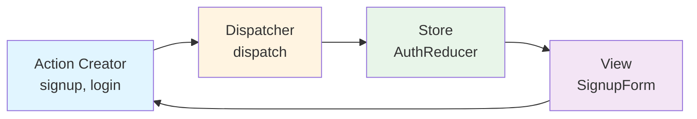
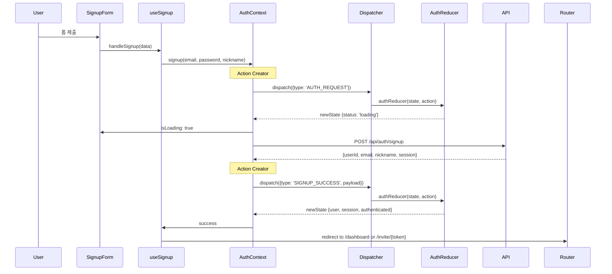
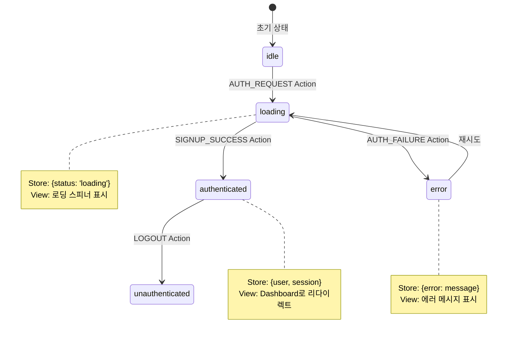

# Signup Page - State Management Implementation

> **관련 문서**: docs/state-management.md, docs/pages/signup/plan.md  
> **Context**: AuthContext  
> **우선순위**: P0  
> **상태**: 미구현

---

## 📋 개요

회원가입 페이지는 **AuthContext**를 사용하여 사용자 인증 상태를 관리합니다.

---

## 🎯 필요한 Context

### 1. AuthContext (필수)

**사용 목적:**
- 회원가입 후 자동 로그인
- 세션 생성 및 저장
- 사용자 상태 전역 관리

**필요한 기능:**
```typescript
const {
  signup,          // (email, password, nickname) => Promise<void>
  isLoading,       // boolean
  error,           // string | null
  isAuthenticated, // boolean
} = useAuth();
```

---

## 🏗️ 구현 계획

### Phase 1: AuthContext 생성

#### 1.1 상태 정의 (`src/features/auth/types.ts`)

```typescript
export interface AuthState {
  user: User | null;
  session: Session | null;
  status: 'idle' | 'loading' | 'authenticated' | 'unauthenticated' | 'error';
  error: string | null;
}

export interface User {
  id: string;
  email: string;
  nickname: string;
  avatar_url?: string;
  created_at: string;
}

export interface Session {
  access_token: string;
  refresh_token: string;
  expires_at: number;
}
```

---

#### 1.2 Action 타입 (`src/features/auth/types.ts`)

```typescript
export type AuthAction =
  | { type: 'AUTH_REQUEST' }
  | { type: 'SIGNUP_SUCCESS'; payload: { user: User; session: Session } }
  | { type: 'LOGIN_SUCCESS'; payload: { user: User; session: Session } }
  | { type: 'AUTH_FAILURE'; payload: { error: string } }
  | { type: 'LOGOUT' }
  | { type: 'REFRESH_SESSION'; payload: { session: Session } };
```

---

#### 1.3 Reducer (`src/features/auth/context/authReducer.ts`)

```typescript
import type { AuthState, AuthAction } from '../types';

export const initialAuthState: AuthState = {
  user: null,
  session: null,
  status: 'idle',
  error: null,
};

export function authReducer(state: AuthState, action: AuthAction): AuthState {
  switch (action.type) {
    case 'AUTH_REQUEST':
      return {
        ...state,
        status: 'loading',
        error: null,
      };

    case 'SIGNUP_SUCCESS':
    case 'LOGIN_SUCCESS':
      return {
        ...state,
        user: action.payload.user,
        session: action.payload.session,
        status: 'authenticated',
        error: null,
      };

    case 'AUTH_FAILURE':
      return {
        ...state,
        status: 'error',
        error: action.payload.error,
      };

    case 'LOGOUT':
      return {
        ...initialAuthState,
        status: 'unauthenticated',
      };

    case 'REFRESH_SESSION':
      return {
        ...state,
        session: action.payload.session,
      };

    default:
      return state;
  }
}
```

---

#### 1.4 Context Provider (`src/features/auth/context/AuthContext.tsx`)

```typescript
"use client";

import {
  createContext,
  useReducer,
  useCallback,
  useMemo,
  type ReactNode,
} from 'react';
import { apiClient, extractApiErrorMessage, isAxiosError } from '@/lib/remote/api-client';
import { authReducer, initialAuthState } from './authReducer';
import type { AuthState } from '../types';

interface AuthContextValue extends AuthState {
  isAuthenticated: boolean;
  isLoading: boolean;
  signup: (email: string, password: string, nickname: string) => Promise<void>;
  login: (email: string, password: string) => Promise<void>;
  logout: () => Promise<void>;
  refreshSession: () => Promise<void>;
}

const AuthContext = createContext<AuthContextValue | null>(null);

export function AuthProvider({ children }: { children: ReactNode }) {
  const [state, dispatch] = useReducer(authReducer, initialAuthState);

  // Signup
  const signup = useCallback(async (
    email: string,
    password: string,
    nickname: string
  ) => {
    dispatch({ type: 'AUTH_REQUEST' });

    try {
      const response = await apiClient.post('/api/auth/signup', {
        email,
        password,
        nickname,
      });

      const data = response.data;

      dispatch({
        type: 'SIGNUP_SUCCESS',
        payload: {
          user: {
            id: data.userId,
            email: data.email,
            nickname: data.nickname,
            created_at: new Date().toISOString(),
          },
          session: {
            access_token: data.session?.accessToken ?? '',
            refresh_token: data.session?.refreshToken ?? '',
            expires_at: data.session?.expiresAt ?? 0,
          },
        },
      });
    } catch (error) {
      const errorMessage = isAxiosError(error)
        ? extractApiErrorMessage(error, '회원가입에 실패했습니다')
        : '회원가입 처리 중 오류가 발생했습니다';

      dispatch({
        type: 'AUTH_FAILURE',
        payload: { error: errorMessage },
      });

      throw error;
    }
  }, []);

  // Login
  const login = useCallback(async (email: string, password: string) => {
    dispatch({ type: 'AUTH_REQUEST' });

    try {
      const response = await apiClient.post('/api/auth/login', {
        email,
        password,
      });

      const data = response.data;

      dispatch({
        type: 'LOGIN_SUCCESS',
        payload: {
          user: {
            id: data.userId,
            email: data.email,
            nickname: data.nickname ?? '',
            created_at: new Date().toISOString(),
          },
          session: {
            access_token: data.session.accessToken,
            refresh_token: data.session.refreshToken,
            expires_at: data.session.expiresAt,
          },
        },
      });
    } catch (error) {
      const errorMessage = isAxiosError(error)
        ? extractApiErrorMessage(error, '로그인에 실패했습니다')
        : '로그인 처리 중 오류가 발생했습니다';

      dispatch({
        type: 'AUTH_FAILURE',
        payload: { error: errorMessage },
      });

      throw error;
    }
  }, []);

  // Logout
  const logout = useCallback(async () => {
    try {
      await apiClient.post('/api/auth/logout');
    } catch (error) {
      console.error('Logout error:', error);
    } finally {
      dispatch({ type: 'LOGOUT' });
    }
  }, []);

  // Refresh Session
  const refreshSession = useCallback(async () => {
    try {
      const response = await apiClient.get('/api/auth/me');
      const data = response.data;

      if (data.user) {
        dispatch({
          type: 'LOGIN_SUCCESS',
          payload: {
            user: data.user,
            session: data.session,
          },
        });
      } else {
        dispatch({ type: 'LOGOUT' });
      }
    } catch (error) {
      dispatch({ type: 'LOGOUT' });
    }
  }, []);

  // Computed values
  const value = useMemo<AuthContextValue>(() => ({
    ...state,
    isAuthenticated: state.status === 'authenticated',
    isLoading: state.status === 'loading',
    signup,
    login,
    logout,
    refreshSession,
  }), [state, signup, login, logout, refreshSession]);

  return (
    <AuthContext.Provider value={value}>
      {children}
    </AuthContext.Provider>
  );
}

export function useAuth() {
  const context = useContext(AuthContext);
  if (!context) {
    throw new Error('useAuth must be used within AuthProvider');
  }
  return context;
}
```

---

#### 1.5 Custom Hook (`src/features/auth/hooks/useAuth.ts`)

```typescript
import { useContext } from 'react';
import { AuthContext } from '../context/AuthContext';

export function useAuth() {
  const context = useContext(AuthContext);
  
  if (!context) {
    throw new Error('useAuth must be used within AuthProvider');
  }
  
  return context;
}
```

---

### Phase 2: useSignup Hook 리팩토링

#### 기존 코드 수정 (`src/features/auth/hooks/useSignup.ts`)

```typescript
"use client";

import { useState, useCallback } from 'react';
import { useRouter, useSearchParams } from 'next/navigation';
import { useAuth } from './useAuth';
import type { SignupFormData } from '../schemas/signup';

export const useSignup = () => {
  const router = useRouter();
  const searchParams = useSearchParams();
  const { signup, error: authError, isLoading } = useAuth();
  const [errorMessage, setErrorMessage] = useState<string | null>(null);

  const handleSignup = useCallback(
    async (data: SignupFormData) => {
      setErrorMessage(null);

      try {
        await signup(data.email, data.password, data.nickname);

        // Handle invite token if exists
        const inviteToken = searchParams.get('invite');
        if (inviteToken) {
          router.replace(`/invite/${inviteToken}`);
        } else {
          router.replace('/dashboard');
        }

        return { ok: true };
      } catch (error) {
        setErrorMessage(authError ?? '회원가입에 실패했습니다');
        return { ok: false };
      }
    },
    [signup, authError, router, searchParams]
  );

  return {
    signup: handleSignup,
    isSubmitting: isLoading,
    errorMessage: errorMessage ?? authError,
  };
};
```

---

### Phase 3: Provider 통합

#### `src/app/providers.tsx` 수정

```typescript
"use client";

import {
  isServer,
  QueryClient,
  QueryClientProvider,
} from "@tanstack/react-query";
import { ThemeProvider } from "next-themes";
import { AuthProvider } from "@/features/auth/context/AuthContext";

function makeQueryClient() {
  return new QueryClient({
    defaultOptions: {
      queries: {
        staleTime: 60 * 1000,
      },
    },
  });
}

let browserQueryClient: QueryClient | undefined = undefined;

function getQueryClient() {
  if (isServer) {
    return makeQueryClient();
  } else {
    if (!browserQueryClient) browserQueryClient = makeQueryClient();
    return browserQueryClient;
  }
}

export default function Providers({ children }: { children: React.ReactNode }) {
  const queryClient = getQueryClient();

  return (
    <ThemeProvider
      attribute="class"
      defaultTheme="system"
      enableSystem
      forcedTheme="light"
      disableTransitionOnChange
    >
      <QueryClientProvider client={queryClient}>
        <AuthProvider>
          {children}
        </AuthProvider>
      </QueryClientProvider>
    </ThemeProvider>
  );
}
```

---

## 📊 데이터 흐름

### Flux 패턴 아키텍처



**Flux 흐름 설명:**
1. **Action Creator** (signup, login): 사용자 액션을 Action 객체로 변환
2. **Dispatcher** (dispatch): Action을 Store로 전달
3. **Store** (AuthReducer): 상태 업데이트 로직 실행
4. **View** (SignupForm): 새 상태를 구독하고 UI 렌더링

---

### 회원가입 플로우 (Sequence Diagram)



---

### Action → Store → View 상태 변화



---

## ✅ 구현 체크리스트

### Phase 1: AuthContext 생성
- [ ] `src/features/auth/types.ts` - 상태 및 Action 타입 정의
- [ ] `src/features/auth/context/authReducer.ts` - Reducer 구현
- [ ] `src/features/auth/context/AuthContext.tsx` - Context Provider 구현
- [ ] `src/features/auth/hooks/useAuth.ts` - Custom Hook

### Phase 2: Hook 리팩토링
- [ ] `useSignup` Hook을 AuthContext 사용하도록 수정
- [ ] 기존 `useCurrentUser` Hook과 통합 검토

### Phase 3: Provider 통합
- [ ] `src/app/providers.tsx`에 AuthProvider 추가
- [ ] 모든 페이지에서 AuthContext 접근 가능하도록 설정

### Phase 4: 테스트
- [ ] 회원가입 플로우 테스트
- [ ] 에러 처리 테스트
- [ ] 리다이렉션 테스트

---

## 🔄 기존 코드와의 통합

### CurrentUserContext 마이그레이션 계획

**현재 상태:**
- `CurrentUserContext`는 Supabase Auth를 직접 호출
- `useState`로 상태 관리

**변경 계획:**
1. `CurrentUserContext` → `AuthContext`로 통합
2. `useReducer` 패턴 적용
3. API 엔드포인트를 통한 인증 처리

**마이그레이션 단계:**
```typescript
// Step 1: AuthContext 완성
// Step 2: CurrentUserProvider를 AuthProvider로 교체
// Step 3: 모든 useCurrentUser() 호출을 useAuth()로 변경
// Step 4: CurrentUserContext 파일 제거
```

---

## 📝 참고사항

### 세션 저장
- 세션은 Supabase가 자동으로 쿠키에 저장
- AuthContext는 메모리에만 상태 유지
- 페이지 새로고침 시 `refreshSession()` 호출 필요

### 에러 처리
- API 에러는 AuthContext에서 catch
- 사용자 친화적인 메시지로 변환
- errorMessage는 컴포넌트에서 표시

### 성능 최적화
- Context value는 useMemo로 메모이제이션
- signup/login/logout 함수는 useCallback으로 최적화

---

**문서 버전**: v1.0  
**최종 수정**: 2025년 11월 15일
