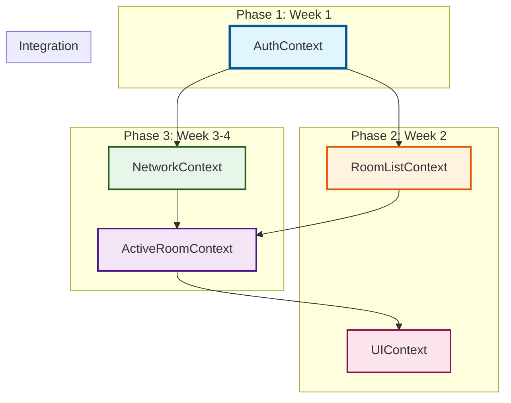

# State Management Implementation - Overview

> **전체 문서 인덱스**  
> **우선순위**: P0  
> **상태**: 계획 단계

---

## 📋 문서 구조

각 페이지별 state management 구현 계획이 별도 문서로 작성되었습니다.

### 페이지별 문서

| 페이지 | 문서 | Context | 우선순위 | 상태 |
|--------|------|---------|----------|------|
| **Signup** | [state-management.md](./signup/state-management.md) | AuthContext | P0 | 미구현 |
| **Login** | [state-management.md](./login/state-management.md) | AuthContext | P0 | 미구현 |
| **Dashboard** | [state-management.md](./dashboard/state-management.md) | Auth, RoomList, UI | P0 | 미구현 |
| **ChatRoom** | [state-management.md](./chat-room/state-management.md) | 모든 Context | P0 | 미구현 |
| **Invite** | [state-management.md](./invite/state-management.md) | Auth, UI | P1 | 미구현 |

---

## 🎯 전체 구현 순서

### Phase 1: 기초 Context (1주)

**목표**: 인증 기반 완성

#### Week 1
- [ ] **Day 1-2**: AuthContext 구현
  - types.ts, authReducer.ts, AuthContext.tsx
  - useAuth Hook
  - Provider 통합
- [ ] **Day 3**: useSignup, useLogin Hook 리팩토링
  - 기존 코드 AuthContext 사용하도록 수정
- [ ] **Day 4-5**: Signup/Login 페이지 통합 및 테스트
  - 회원가입 플로우
  - 로그인 플로우
  - 에러 처리

---

### Phase 2: UI & RoomList Context (1주)

**목표**: 대시보드 완성

#### Week 2
- [ ] **Day 1-2**: UIContext 구현
  - types.ts, uiReducer.ts, UIContext.tsx
  - 모달, Toast, ContextMenu
- [ ] **Day 3-4**: RoomListContext 구현
  - types.ts, roomListReducer.ts, RoomListContext.tsx
  - 방 목록, 생성, 나가기
- [ ] **Day 5**: Dashboard 페이지 통합
  - 방 목록 표시
  - Empty State
  - 방 생성 모달

---

### Phase 3: Network & ActiveRoom Context (2주)

**목표**: 채팅방 기능 완성

#### Week 3
- [ ] **Day 1-2**: NetworkContext 구현
  - types.ts, networkReducer.ts, NetworkContext.tsx
  - 온라인/오프라인 감지
  - Exponential Backoff
- [ ] **Day 3-5**: ActiveRoomContext 기본 구현
  - types.ts, activeRoomReducer.ts
  - enterRoom, exitRoom
  - Snapshot API 연동

#### Week 4
- [ ] **Day 1-3**: Long Polling 구현
  - useLongPolling Hook
  - 실시간 메시지 수신
  - Catchup 모드
- [ ] **Day 4-5**: Optimistic UI
  - 메시지 전송 (pending 상태)
  - 좋아요 토글
  - 삭제 처리

---

### Phase 4: 통합 및 최적화 (1주)

#### Week 5
- [ ] **Day 1-2**: ChatRoom 페이지 완성
  - MessageList, MessageInput 컴포넌트
  - 스크롤 최적화
  - 과거 메시지 로드
- [ ] **Day 3**: Invite 페이지 구현
  - useInvite Hook
  - 초대 플로우
- [ ] **Day 4-5**: 전체 테스트 및 버그 수정
  - E2E 테스트
  - 성능 최적화
  - 메모리 누수 체크

---

## 📊 Context 의존성 그래프



---

## ✅ 전체 체크리스트

### Context 구현

#### AuthContext
- [ ] `src/features/auth/types.ts`
- [ ] `src/features/auth/context/authReducer.ts`
- [ ] `src/features/auth/context/AuthContext.tsx`
- [ ] `src/features/auth/hooks/useAuth.ts`

#### UIContext
- [ ] `src/features/ui/types.ts`
- [ ] `src/features/ui/context/uiReducer.ts`
- [ ] `src/features/ui/context/UIContext.tsx`
- [ ] `src/features/ui/hooks/useUI.ts`

#### RoomListContext
- [ ] `src/features/room-list/types.ts`
- [ ] `src/features/room-list/context/roomListReducer.ts`
- [ ] `src/features/room-list/context/RoomListContext.tsx`
- [ ] `src/features/room-list/hooks/useRoomList.ts`

#### NetworkContext
- [ ] `src/features/network/types.ts`
- [ ] `src/features/network/context/networkReducer.ts`
- [ ] `src/features/network/context/NetworkContext.tsx`
- [ ] `src/features/network/hooks/useNetwork.ts`

#### ActiveRoomContext
- [ ] `src/features/active-room/types.ts`
- [ ] `src/features/active-room/context/activeRoomReducer.ts`
- [ ] `src/features/active-room/context/ActiveRoomContext.tsx`
- [ ] `src/features/active-room/hooks/useActiveRoom.ts`
- [ ] `src/features/active-room/hooks/useLongPolling.ts`

### Provider 통합
- [ ] `src/app/providers.tsx` - 모든 Provider 중첩

### 페이지 통합
- [ ] Signup 페이지
- [ ] Login 페이지
- [ ] Dashboard 페이지
- [ ] ChatRoom 페이지
- [ ] Invite 페이지

---

## 📝 구현 시 주의사항

### 1. Context Value 메모이제이션
모든 Context의 value는 useMemo로 감싸야 합니다.

```typescript
const value = useMemo<ContextValue>(() => ({
  ...state,
  // computed values
  // functions
}), [state, /* dependencies */]);
```

### 2. Reducer 순수성
Reducer는 반드시 순수 함수여야 합니다. 부수 효과 금지.

```typescript
// ❌ 나쁜 예
function reducer(state, action) {
  state.count++; // Mutation!
  return state;
}

// ✅ 좋은 예
function reducer(state, action) {
  return { ...state, count: state.count + 1 };
}
```

### 3. Action Creator 사용
복잡한 액션은 Action Creator로 분리.

```typescript
// src/features/auth/context/authActions.ts
export function createSignupSuccessAction(user: User, session: Session) {
  return {
    type: 'SIGNUP_SUCCESS' as const,
    payload: { user, session },
  };
}
```

### 4. Context 분리의 장점 활용
각 Context는 독립적으로 리렌더링됩니다. 관련 없는 상태 변화에는 영향 받지 않습니다.

---

## 🔍 트러블슈팅 가이드

### 문제 1: 무한 리렌더링
**원인**: Context value가 매번 새로 생성됨  
**해결**: useMemo로 value 감싸기

### 문제 2: 액션이 동작하지 않음
**원인**: Reducer에서 state를 mutation  
**해결**: 항상 새 객체 반환 (`{ ...state }`)

### 문제 3: Long Polling이 멈춤
**원인**: 에러 발생 후 재시도 안됨  
**해결**: try-catch에서 재귀 호출 확인

### 문제 4: Pending 메시지가 사라지지 않음
**원인**: client_message_id 매칭 실패  
**해결**: 서버 응답에 client_message_id 포함 확인

---

## 📚 참고 문서

- [state-management.md](../../state-management.md) - 전체 아키텍처
- [implementation-plan.md](../../implementation-plan.md) - 페이지 구현 계획
- [requirement.md](../../requirement.md) - API 명세
- [prd.md](../../prd.md) - 기능 정의

---

**문서 버전**: v1.0  
**최종 수정**: 2025년 11월 15일  
**다음 업데이트**: Phase 1 완료 후
