# Context + useReducer 상태 관리 아키텍처

> 작성일: 2025년 11월 15일  
> 기반 문서: `docs/flux-architecture.md`, `docs/state-management.md`  
> 패턴: Context API + useReducer + Custom Hooks

---

## 목차

1. [전체 아키텍처 개요](#1-전체-아키텍처-개요)
2. [Context 계층 구조](#2-context-계층-구조)
3. [데이터 흐름 시각화](#3-데이터-흐름-시각화)
4. [각 Context 상세 설계](#4-각-context-상세-설계)
5. [하위 컴포넌트 노출 인터페이스](#5-하위-컴포넌트-노출-인터페이스)
6. [Context 간 통신 패턴](#6-context-간-통신-패턴)
7. [성능 최적화 전략](#7-성능-최적화-전략)

---

## 1. 전체 아키텍처 개요

### 1.1 Context 분리 전략

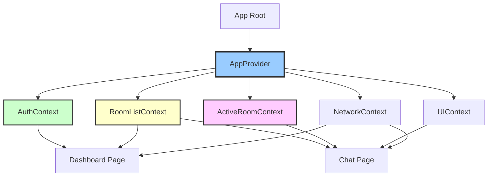

### 1.2 분리 기준

| Context | 책임 범위 | 생명주기 | 구독 빈도 |
|---------|-----------|----------|-----------|
| **AuthContext** | 인증, 세션 관리 | 앱 전체 | 낮음 (로그인/로그아웃 시) |
| **RoomListContext** | 채팅방 목록, 선택 | 로그인 후 전체 | 중간 (새 메시지 도착 시) |
| **ActiveRoomContext** | 현재 채팅방 메시지/참여자 | 채팅방 입장 후 | 높음 (메시지 전송 시) |
| **UIContext** | 모달, 토스트, 컨텍스트 메뉴 | 앱 전체 | 낮음 (UI 인터랙션 시) |
| **NetworkContext** | 네트워크 상태, 재시도 로직 | 앱 전체 | 낮음 (네트워크 변화 시) |

---

## 2. Context 계층 구조

### 2.1 Provider 중첩 구조

```typescript
// src/app/providers.tsx
<AuthProvider>
  <NetworkProvider>
    <RoomListProvider>
      <ActiveRoomProvider>
        <UIProvider>
          {children}
        </UIProvider>
      </ActiveRoomProvider>
    </RoomListProvider>
  </NetworkProvider>
</AuthProvider>
```

### 2.2 의존성 그래프

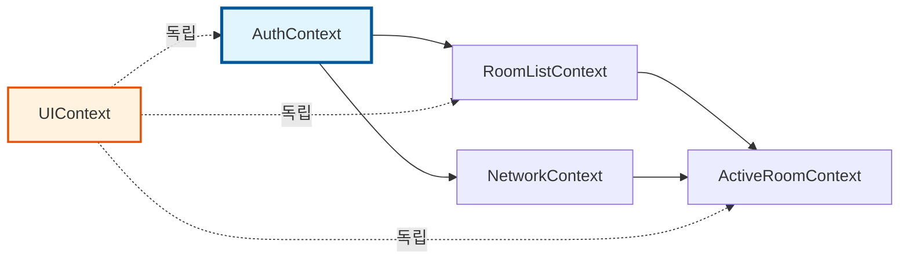

**의존성 규칙:**
- `AuthContext`: 다른 Context에 의존하지 않음 (최상위)
- `RoomListContext`: `AuthContext`에 의존 (user 정보 필요)
- `ActiveRoomContext`: `RoomListContext`, `NetworkContext`에 의존
- `UIContext`: 독립적 (다른 Context 참조 가능하지만 의존하지 않음)
- `NetworkContext`: `AuthContext`에 의존 (재인증 필요 시)

---

## 3. 데이터 흐름 시각화

### 3.1 초기 로드 흐름

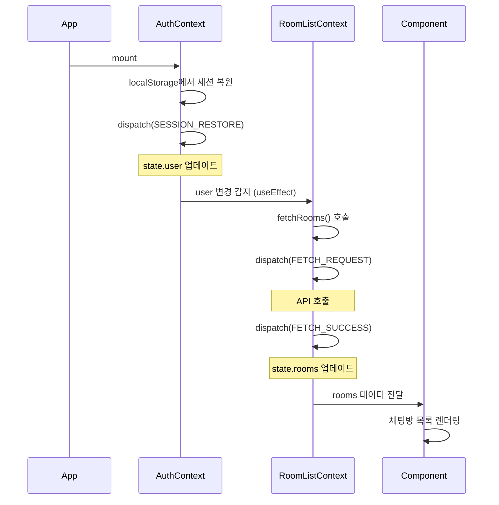

### 3.2 메시지 전송 흐름 (Context 간 협력)

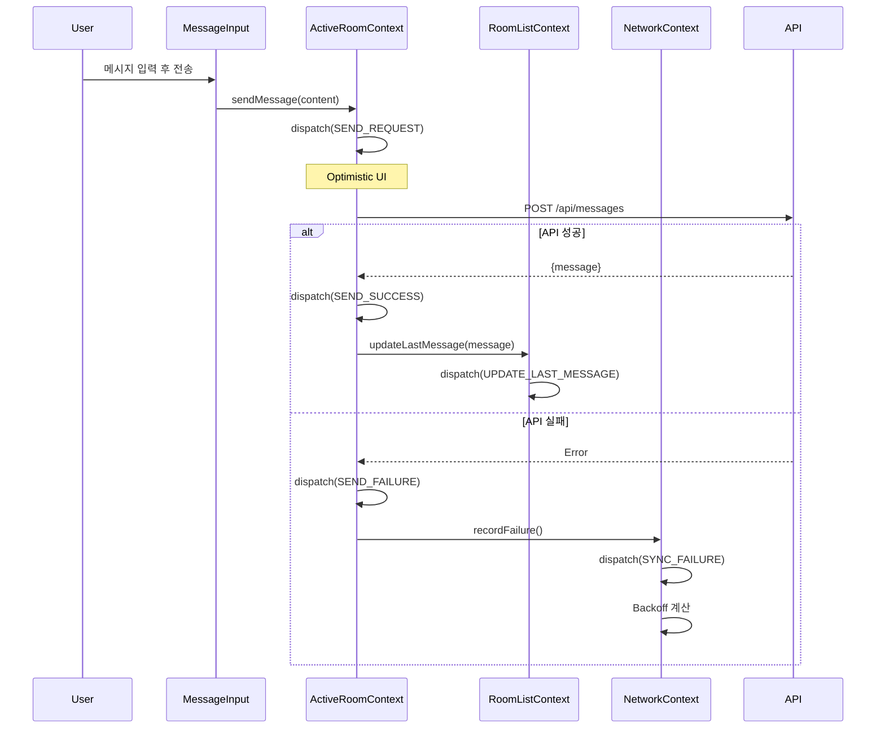

### 3.3 Long Polling 실시간 동기화 흐름

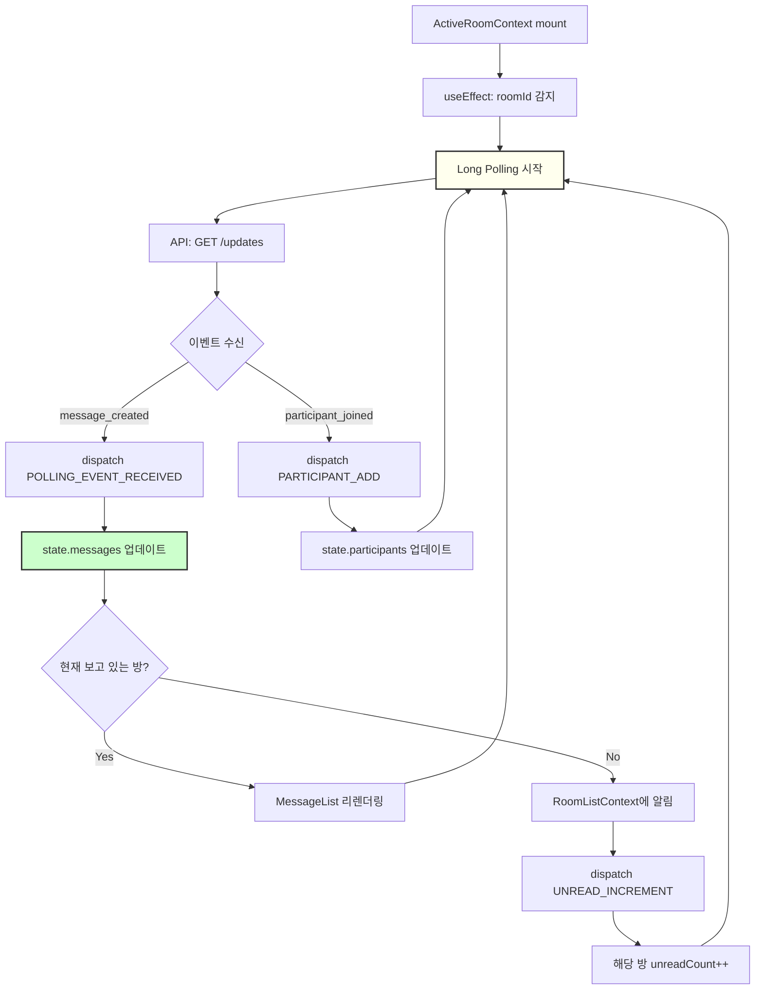

### 3.4 오프라인 → 온라인 복구 흐름

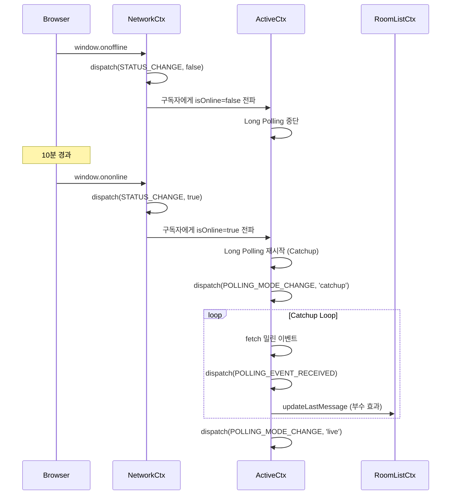

---

## 4. 각 Context 상세 설계

### 4.1 AuthContext

#### 4.1.1 상태 인터페이스

```typescript
interface AuthState {
  user: User | null;
  session: Session | null;
  status: 'idle' | 'loading' | 'authenticated' | 'error';
  error: string | null;
}

interface User {
  id: string;
  email: string;
  nickname: string;
  avatar_url?: string;
  created_at: string;
}

interface Session {
  access_token: string;
  refresh_token: string;
  expires_at: number;
}
```

#### 4.1.2 Action 타입

```typescript
type AuthAction =
  | { type: 'LOGIN_REQUEST' }
  | { type: 'LOGIN_SUCCESS'; payload: { user: User; session: Session } }
  | { type: 'LOGIN_FAILURE'; payload: { error: string } }
  | { type: 'SIGNUP_REQUEST' }
  | { type: 'SIGNUP_SUCCESS'; payload: { user: User; session: Session } }
  | { type: 'SIGNUP_FAILURE'; payload: { error: string } }
  | { type: 'LOGOUT' }
  | { type: 'SESSION_RESTORE'; payload: { user: User; session: Session } }
  | { type: 'SESSION_EXPIRED' }
  | { type: 'TOKEN_REFRESH'; payload: { session: Session } };
```

#### 4.1.3 Context 값 인터페이스

```typescript
interface AuthContextValue {
  // 상태
  state: AuthState;
  
  // Computed Values (Selectors)
  isAuthenticated: boolean;
  currentUser: User | null;
  isLoading: boolean;
  
  // Actions (Dispatch Wrappers)
  login: (email: string, password: string) => Promise<void>;
  signup: (email: string, password: string, nickname: string) => Promise<void>;
  logout: () => Promise<void>;
  refreshSession: () => Promise<void>;
  
  // Internal (다른 Context에서만 사용)
  dispatch: Dispatch<AuthAction>;
}
```

#### 4.1.4 데이터 로드 흐름

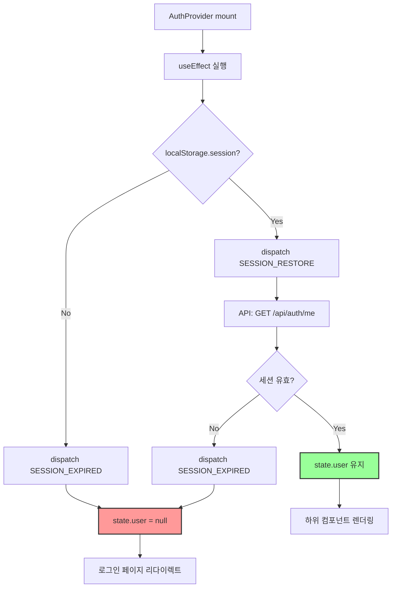

---

### 4.2 RoomListContext

#### 4.2.1 상태 인터페이스

```typescript
interface RoomListState {
  rooms: Room[];
  status: 'idle' | 'loading' | 'loaded' | 'error';
  error: string | null;
  selectedRoomId: string | null;
}

interface Room {
  id: string;
  name: string;
  lastMessage: Message | null;
  lastActivity: string;
  unreadCount: number;
  participantCount: number;
  created_at: string;
}
```

#### 4.2.2 Action 타입

```typescript
type RoomListAction =
  | { type: 'FETCH_REQUEST' }
  | { type: 'FETCH_SUCCESS'; payload: { rooms: Room[] } }
  | { type: 'FETCH_FAILURE'; payload: { error: string } }
  | { type: 'SELECT_ROOM'; payload: { roomId: string | null } }
  | { type: 'ADD_ROOM'; payload: { room: Room } }
  | { type: 'REMOVE_ROOM'; payload: { roomId: string } }
  | { type: 'UPDATE_LAST_MESSAGE'; payload: { roomId: string; message: Message } }
  | { type: 'INCREMENT_UNREAD'; payload: { roomId: string } }
  | { type: 'RESET_UNREAD'; payload: { roomId: string } }
  | { type: 'UPDATE_PARTICIPANT_COUNT'; payload: { roomId: string; count: number } };
```

#### 4.2.3 Context 값 인터페이스

```typescript
interface RoomListContextValue {
  // 상태
  state: RoomListState;
  
  // Computed Values
  sortedRooms: Room[];
  totalUnreadCount: number;
  selectedRoom: Room | null;
  isLoading: boolean;
  
  // Actions
  fetchRooms: () => Promise<void>;
  selectRoom: (roomId: string | null) => void;
  createRoom: (name: string) => Promise<Room>;
  leaveRoom: (roomId: string) => Promise<void>;
  
  // Internal (다른 Context용)
  updateLastMessage: (roomId: string, message: Message) => void;
  incrementUnread: (roomId: string) => void;
  resetUnread: (roomId: string) => void;
  dispatch: Dispatch<RoomListAction>;
}
```

#### 4.2.4 데이터 로드 흐름

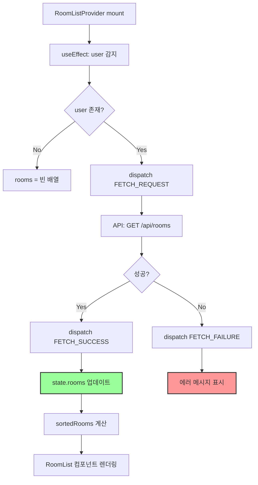

---

### 4.3 ActiveRoomContext

#### 4.3.1 상태 인터페이스

```typescript
interface ActiveRoomState {
  roomId: string | null;
  roomInfo: RoomDetail | null;
  messages: Message[];
  participants: Participant[];
  
  // Long Polling
  lastSyncVersion: number;
  pollingStatus: 'idle' | 'live' | 'catchup' | 'error';
  
  // 전송 중 메시지
  pendingMessages: Map<string, PendingMessage>;
  
  // UI 상태
  likedMessageIds: Set<string>;
  hiddenMessageIds: Set<string>;
  replyTarget: Message | null;
  
  // 히스토리 로드
  isLoadingHistory: boolean;
  hasMoreHistory: boolean;
  
  // 상태
  status: 'idle' | 'loading' | 'loaded' | 'error';
  error: string | null;
}

interface RoomDetail {
  id: string;
  name: string;
  description?: string;
  created_at: string;
  owner_id: string;
}

interface Message {
  id: string;
  room_id: string;
  user_id: string;
  content: string;
  reply_to_message_id: string | null;
  like_count: number;
  is_deleted: boolean;
  client_message_id: string | null;
  created_at: string;
  updated_at: string;
}

interface PendingMessage {
  clientId: string;
  content: string;
  status: 'sending' | 'error';
  error?: string;
  replyToId?: string;
  created_at: string;
}

interface Participant {
  id: string;
  user_id: string;
  nickname: string;
  avatar_url?: string;
  role: 'owner' | 'admin' | 'member';
  joined_at: string;
}
```

#### 4.3.2 Action 타입

```typescript
type ActiveRoomAction =
  | { type: 'ENTER_ROOM'; payload: { roomId: string } }
  | { type: 'EXIT_ROOM' }
  | { type: 'SNAPSHOT_REQUEST' }
  | { type: 'SNAPSHOT_SUCCESS'; payload: {
      roomInfo: RoomDetail;
      messages: Message[];
      participants: Participant[];
      lastSyncVersion: number;
    }}
  | { type: 'SNAPSHOT_FAILURE'; payload: { error: string } }
  | { type: 'POLLING_START' }
  | { type: 'POLLING_EVENT_RECEIVED'; payload: {
      events: RoomEvent[];
      privateDeletions: string[];
      lastVersion: number;
      hasMore: boolean;
    }}
  | { type: 'POLLING_MODE_CHANGE'; payload: { mode: 'live' | 'catchup' } }
  | { type: 'POLLING_ERROR'; payload: { error: string } }
  | { type: 'MESSAGE_SEND_REQUEST'; payload: {
      clientId: string;
      content: string;
      replyToId?: string;
    }}
  | { type: 'MESSAGE_SEND_SUCCESS'; payload: {
      clientId: string;
      message: Message;
    }}
  | { type: 'MESSAGE_SEND_FAILURE'; payload: {
      clientId: string;
      error: string;
    }}
  | { type: 'MESSAGE_ADD'; payload: { message: Message } }
  | { type: 'MESSAGE_UPDATE'; payload: {
      messageId: string;
      updates: Partial<Message>;
    }}
  | { type: 'MESSAGE_HIDE'; payload: { messageId: string } }
  | { type: 'MESSAGE_LIKE_TOGGLE'; payload: { messageId: string } }
  | { type: 'REPLY_TARGET_SET'; payload: { message: Message | null } }
  | { type: 'PARTICIPANT_ADD'; payload: { participant: Participant } }
  | { type: 'PARTICIPANT_REMOVE'; payload: { userId: string } }
  | { type: 'HISTORY_LOAD_REQUEST' }
  | { type: 'HISTORY_LOAD_SUCCESS'; payload: {
      messages: Message[];
      hasMore: boolean;
    }}
  | { type: 'HISTORY_LOAD_FAILURE'; payload: { error: string } };

interface RoomEvent {
  type: 'message_created' | 'message_updated' | 'participant_joined' | 'participant_left' | 'participant_kicked';
  payload: any;
  version: number;
  created_at: string;
}
```

#### 4.3.3 Context 값 인터페이스

```typescript
interface ActiveRoomContextValue {
  // 상태
  state: ActiveRoomState;
  
  // Computed Values
  visibleMessages: Message[];
  allMessages: (Message | PendingMessage)[];
  currentRoom: RoomDetail | null;
  isPollingActive: boolean;
  isLoading: boolean;
  
  // Room Actions
  enterRoom: (roomId: string) => Promise<void>;
  exitRoom: () => void;
  loadMoreHistory: () => Promise<void>;
  
  // Message Actions
  sendMessage: (content: string, replyToId?: string) => Promise<void>;
  toggleLike: (messageId: string) => Promise<void>;
  deleteMessage: (messageId: string, deleteType: 'all' | 'me') => Promise<void>;
  setReplyTarget: (message: Message | null) => void;
  
  // Internal
  dispatch: Dispatch<ActiveRoomAction>;
}
```

#### 4.3.4 데이터 로드 흐름

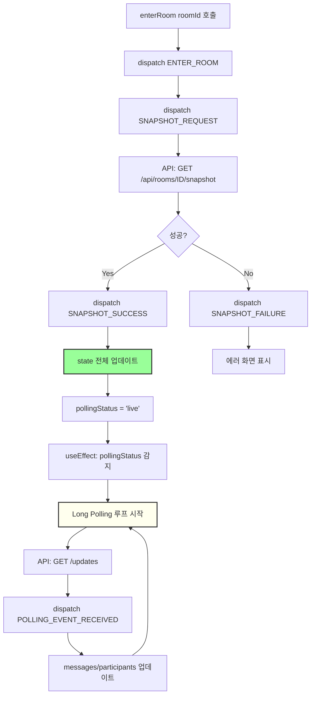

---

### 4.4 UIContext

#### 4.4.1 상태 인터페이스

```typescript
interface UIState {
  modals: {
    createRoom: boolean;
    inviteUser: boolean;
    leaveRoom: boolean;
    confirmDelete: boolean;
  };
  
  contextMenu: ContextMenu | null;
  
  toast: Toast | null;
  
  inviteContext: {
    token: string | null;
    roomInfo: RoomInfo | null;
  };
}

interface ContextMenu {
  type: 'room' | 'message';
  position: { x: number; y: number };
  targetId: string;
  options: ContextMenuOption[];
}

interface ContextMenuOption {
  label: string;
  icon?: string;
  action: () => void;
  destructive?: boolean;
}

interface Toast {
  id: string;
  type: 'success' | 'error' | 'info' | 'warning';
  message: string;
  duration: number;
}

interface RoomInfo {
  id: string;
  name: string;
  participantCount: number;
}
```

#### 4.4.2 Action 타입

```typescript
type UIAction =
  | { type: 'MODAL_OPEN'; payload: { modal: keyof UIState['modals'] } }
  | { type: 'MODAL_CLOSE'; payload: { modal: keyof UIState['modals'] } }
  | { type: 'MODAL_CLOSE_ALL' }
  | { type: 'CONTEXT_MENU_OPEN'; payload: { menu: ContextMenu } }
  | { type: 'CONTEXT_MENU_CLOSE' }
  | { type: 'TOAST_SHOW'; payload: { toast: Omit<Toast, 'id'> } }
  | { type: 'TOAST_HIDE'; payload: { id: string } }
  | { type: 'INVITE_TOKEN_SET'; payload: { token: string; roomInfo: RoomInfo } }
  | { type: 'INVITE_TOKEN_CLEAR' };
```

#### 4.4.3 Context 값 인터페이스

```typescript
interface UIContextValue {
  // 상태
  state: UIState;
  
  // Computed Values
  hasOpenModal: boolean;
  activeModal: keyof UIState['modals'] | null;
  
  // Modal Actions
  openModal: (modal: keyof UIState['modals']) => void;
  closeModal: (modal: keyof UIState['modals']) => void;
  closeAllModals: () => void;
  
  // Context Menu Actions
  openContextMenu: (menu: ContextMenu) => void;
  closeContextMenu: () => void;
  
  // Toast Actions
  showToast: (type: Toast['type'], message: string, duration?: number) => void;
  hideToast: (id: string) => void;
  
  // Invite Actions
  setInviteToken: (token: string, roomInfo: RoomInfo) => void;
  clearInviteToken: () => void;
  
  // Internal
  dispatch: Dispatch<UIAction>;
}
```

#### 4.4.4 UI 상호작용 흐름

```mermaid
flowchart LR
    A[User: 버튼 클릭] --> B[Component]
    B --> C[openModal 'createRoom']
    C --> D[dispatch MODAL_OPEN]
    D --> E[state.modals.createRoom = true]
    E --> F[Modal 컴포넌트 렌더링]
    
    F --> G[User: 폼 작성]
    G --> H[Submit]
    H --> I[RoomListContext.createRoom]
    I --> J{성공?}
    
    J -->|Yes| K[closeModal 'createRoom']
    J -->|No| L[showToast 'error']
    
    K --> M[dispatch MODAL_CLOSE]
    L --> N[dispatch TOAST_SHOW]
    
    M --> O[Modal 사라짐]
    N --> P[Toast 표시]
    
    P --> Q[3초 후 자동]
    Q --> R[hideToast]
    R --> S[dispatch TOAST_HIDE]
    
    style F fill:#cff,stroke:#333,stroke-width:2px
    style P fill:#fcf,stroke:#333,stroke-width:2px
```

---

### 4.5 NetworkContext

#### 4.5.1 상태 인터페이스

```typescript
interface NetworkState {
  isOnline: boolean;
  lastSyncAttempt: string | null;
  retryCount: number;
  backoffDelay: number; // ms
  syncStatus: 'idle' | 'syncing' | 'error';
}
```

#### 4.5.2 Action 타입

```typescript
type NetworkAction =
  | { type: 'STATUS_CHANGE'; payload: { isOnline: boolean } }
  | { type: 'SYNC_ATTEMPT' }
  | { type: 'SYNC_SUCCESS' }
  | { type: 'SYNC_FAILURE'; payload: { error: string } }
  | { type: 'BACKOFF_RESET' };
```

#### 4.5.3 Context 값 인터페이스

```typescript
interface NetworkContextValue {
  // 상태
  state: NetworkState;
  
  // Computed Values
  isOnline: boolean;
  shouldRetry: boolean;
  nextRetryDelay: number;
  
  // Actions
  recordSyncAttempt: () => void;
  recordSyncSuccess: () => void;
  recordSyncFailure: (error: string) => void;
  resetBackoff: () => void;
  
  // Internal
  dispatch: Dispatch<NetworkAction>;
}
```

#### 4.5.4 네트워크 감지 흐름

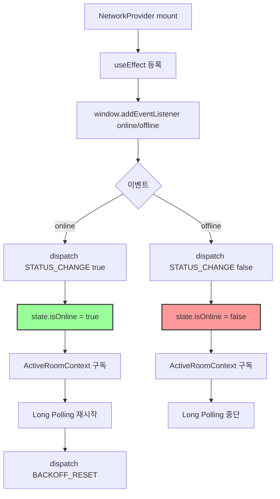

---

## 5. 하위 컴포넌트 노출 인터페이스

### 5.1 AuthContext 노출 인터페이스

```typescript
// 🔹 Custom Hook
function useAuth(): AuthContextValue

// 🔹 노출 변수
const {
  // 상태
  state,                    // 전체 상태 (거의 사용 안함)
  
  // 계산된 값
  isAuthenticated,          // boolean - 로그인 여부
  currentUser,              // User | null - 현재 사용자 정보
  isLoading,                // boolean - 로딩 상태
  
  // 액션
  login,                    // (email, password) => Promise<void>
  signup,                   // (email, password, nickname) => Promise<void>
  logout,                   // () => Promise<void>
  refreshSession,           // () => Promise<void>
} = useAuth();
```

**사용 예시:**

```typescript
// ✅ 헤더 컴포넌트
function Header() {
  const { isAuthenticated, currentUser, logout } = useAuth();
  
  if (!isAuthenticated) return <LoginButton />;
  
  return (
    <div>
      <Avatar user={currentUser} />
      <button onClick={logout}>로그아웃</button>
    </div>
  );
}

// ✅ Protected Route
function ProtectedPage() {
  const { isAuthenticated, isLoading } = useAuth();
  
  if (isLoading) return <Spinner />;
  if (!isAuthenticated) return <Navigate to="/login" />;
  
  return <Dashboard />;
}

// ✅ 로그인 폼
function LoginForm() {
  const { login, isLoading } = useAuth();
  
  const handleSubmit = async (e) => {
    e.preventDefault();
    await login(email, password);
  };
  
  return <form onSubmit={handleSubmit}>...</form>;
}
```

---

### 5.2 RoomListContext 노출 인터페이스

```typescript
// 🔹 Custom Hook
function useRoomList(): RoomListContextValue

// 🔹 노출 변수
const {
  // 상태
  state,                    // 전체 상태 (거의 사용 안함)
  
  // 계산된 값
  sortedRooms,              // Room[] - 최신 활동 순 정렬
  totalUnreadCount,         // number - 전체 안읽은 메시지 수
  selectedRoom,             // Room | null - 현재 선택된 방
  isLoading,                // boolean - 로딩 상태
  
  // 액션
  fetchRooms,               // () => Promise<void>
  selectRoom,               // (roomId: string | null) => void
  createRoom,               // (name: string) => Promise<Room>
  leaveRoom,                // (roomId: string) => Promise<void>
  
  // Internal (주의: 일반 컴포넌트에서 사용 금지)
  updateLastMessage,        // ActiveRoomContext에서만 호출
  incrementUnread,          // ActiveRoomContext에서만 호출
  resetUnread,              // ActiveRoomContext에서만 호출
} = useRoomList();
```

**사용 예시:**

```typescript
// ✅ 채팅방 목록
function RoomList() {
  const { sortedRooms, selectRoom, isLoading } = useRoomList();
  
  if (isLoading) return <Skeleton />;
  
  return (
    <ul>
      {sortedRooms.map(room => (
        <RoomItem 
          key={room.id} 
          room={room}
          onClick={() => selectRoom(room.id)}
        />
      ))}
    </ul>
  );
}

// ✅ 헤더 배지
function UnreadBadge() {
  const { totalUnreadCount } = useRoomList();
  
  if (totalUnreadCount === 0) return null;
  
  return <Badge>{totalUnreadCount}</Badge>;
}

// ✅ 채팅방 생성 모달
function CreateRoomModal() {
  const { createRoom } = useRoomList();
  const { closeModal, showToast } = useUI();
  
  const handleSubmit = async (name: string) => {
    try {
      const room = await createRoom(name);
      closeModal('createRoom');
      showToast('success', `${room.name} 방이 생성되었습니다`);
    } catch (error) {
      showToast('error', '방 생성에 실패했습니다');
    }
  };
  
  return <form onSubmit={handleSubmit}>...</form>;
}
```

---

### 5.3 ActiveRoomContext 노출 인터페이스

```typescript
// 🔹 Custom Hook
function useActiveRoom(): ActiveRoomContextValue

// 🔹 노출 변수
const {
  // 상태
  state,                    // 전체 상태 (거의 사용 안함)
  
  // 계산된 값
  visibleMessages,          // Message[] - 삭제/숨김 제외한 메시지
  allMessages,              // (Message | PendingMessage)[] - 전송 중 포함
  currentRoom,              // RoomDetail | null - 현재 방 정보
  isPollingActive,          // boolean - 실시간 동기화 중
  isLoading,                // boolean - Snapshot 로딩 중
  
  // Room Actions
  enterRoom,                // (roomId: string) => Promise<void>
  exitRoom,                 // () => void
  loadMoreHistory,          // () => Promise<void>
  
  // Message Actions
  sendMessage,              // (content: string, replyToId?: string) => Promise<void>
  toggleLike,               // (messageId: string) => Promise<void>
  deleteMessage,            // (messageId: string, deleteType: 'all' | 'me') => Promise<void>
  setReplyTarget,           // (message: Message | null) => void
} = useActiveRoom();
```

**사용 예시:**

```typescript
// ✅ 메시지 목록
function MessageList() {
  const { visibleMessages, isLoading, loadMoreHistory } = useActiveRoom();
  
  const handleScroll = (e) => {
    if (e.target.scrollTop === 0) {
      loadMoreHistory();
    }
  };
  
  if (isLoading) return <Skeleton />;
  
  return (
    <div onScroll={handleScroll}>
      {visibleMessages.map(msg => (
        <MessageItem key={msg.id} message={msg} />
      ))}
    </div>
  );
}

// ✅ 메시지 입력
function MessageInput() {
  const { sendMessage, setReplyTarget } = useActiveRoom();
  const [content, setContent] = useState('');
  
  const handleSubmit = async (e) => {
    e.preventDefault();
    await sendMessage(content);
    setContent('');
  };
  
  return <form onSubmit={handleSubmit}>...</form>;
}

// ✅ 메시지 아이템
function MessageItem({ message }: { message: Message }) {
  const { toggleLike, deleteMessage, setReplyTarget } = useActiveRoom();
  
  return (
    <div>
      <p>{message.content}</p>
      <button onClick={() => toggleLike(message.id)}>
        ❤️ {message.like_count}
      </button>
      <button onClick={() => setReplyTarget(message)}>
        답장
      </button>
      <button onClick={() => deleteMessage(message.id, 'all')}>
        삭제
      </button>
    </div>
  );
}

// ✅ 채팅방 페이지
function ChatPage({ roomId }: { roomId: string }) {
  const { enterRoom, exitRoom } = useActiveRoom();
  
  useEffect(() => {
    enterRoom(roomId);
    return () => exitRoom();
  }, [roomId]);
  
  return (
    <div>
      <MessageList />
      <MessageInput />
    </div>
  );
}
```

---

### 5.4 UIContext 노출 인터페이스

```typescript
// 🔹 Custom Hook
function useUI(): UIContextValue

// 🔹 노출 변수
const {
  // 상태
  state,                    // 전체 상태 (거의 사용 안함)
  
  // 계산된 값
  hasOpenModal,             // boolean - 모달이 열려있는지
  activeModal,              // keyof modals | null - 현재 열린 모달
  
  // Modal Actions
  openModal,                // (modal: keyof modals) => void
  closeModal,               // (modal: keyof modals) => void
  closeAllModals,           // () => void
  
  // Context Menu Actions
  openContextMenu,          // (menu: ContextMenu) => void
  closeContextMenu,         // () => void
  
  // Toast Actions
  showToast,                // (type, message, duration?) => void
  hideToast,                // (id: string) => void
  
  // Invite Actions
  setInviteToken,           // (token: string, roomInfo: RoomInfo) => void
  clearInviteToken,         // () => void
} = useUI();
```

**사용 예시:**

```typescript
// ✅ 모달 트리거
function Header() {
  const { openModal } = useUI();
  
  return (
    <button onClick={() => openModal('createRoom')}>
      + 새 채팅
    </button>
  );
}

// ✅ 모달 렌더러
function ModalContainer() {
  const { state, closeModal } = useUI();
  
  return (
    <>
      {state.modals.createRoom && (
        <CreateRoomModal onClose={() => closeModal('createRoom')} />
      )}
      {state.modals.inviteUser && (
        <InviteUserModal onClose={() => closeModal('inviteUser')} />
      )}
    </>
  );
}

// ✅ 컨텍스트 메뉴
function MessageItem({ message }: { message: Message }) {
  const { openContextMenu } = useUI();
  
  const handleRightClick = (e: React.MouseEvent) => {
    e.preventDefault();
    openContextMenu({
      type: 'message',
      position: { x: e.clientX, y: e.clientY },
      targetId: message.id,
      options: [
        { label: '답장', action: () => setReplyTarget(message) },
        { label: '삭제', action: () => deleteMessage(message.id), destructive: true },
      ],
    });
  };
  
  return <div onContextMenu={handleRightClick}>...</div>;
}

// ✅ Toast 사용
function SaveButton() {
  const { showToast } = useUI();
  
  const handleSave = async () => {
    try {
      await saveData();
      showToast('success', '저장되었습니다');
    } catch (error) {
      showToast('error', '저장 실패', 5000);
    }
  };
  
  return <button onClick={handleSave}>저장</button>;
}
```

---

### 5.5 NetworkContext 노출 인터페이스

```typescript
// 🔹 Custom Hook
function useNetwork(): NetworkContextValue

// 🔹 노출 변수
const {
  // 상태
  state,                    // 전체 상태 (거의 사용 안함)
  
  // 계산된 값
  isOnline,                 // boolean - 네트워크 연결 상태
  shouldRetry,              // boolean - 재시도 가능 여부
  nextRetryDelay,           // number - 다음 재시도까지 대기 시간
  
  // Actions (주의: 대부분 Internal)
  recordSyncAttempt,        // ActiveRoomContext에서만 호출
  recordSyncSuccess,        // ActiveRoomContext에서만 호출
  recordSyncFailure,        // ActiveRoomContext에서만 호출
  resetBackoff,             // ActiveRoomContext에서만 호출
} = useNetwork();
```

**사용 예시:**

```typescript
// ✅ 오프라인 배너
function OfflineBanner() {
  const { isOnline } = useNetwork();
  
  if (isOnline) return null;
  
  return (
    <div className="banner">
      ⚠️ 오프라인 상태입니다
    </div>
  );
}

// ✅ 동기화 상태 표시
function SyncStatusIndicator() {
  const { isOnline, nextRetryDelay } = useNetwork();
  const { isPollingActive } = useActiveRoom();
  
  if (!isOnline) {
    return <span>🔴 오프라인 (재연결 대기 중...)</span>;
  }
  
  if (!isPollingActive) {
    return <span>🟡 동기화 대기 중</span>;
  }
  
  return <span>🟢 실시간 연결됨</span>;
}

// ⚠️ Internal 사용 (ActiveRoomContext 내부)
function useLongPolling() {
  const { recordSyncAttempt, recordSyncSuccess, recordSyncFailure } = useNetwork();
  
  const poll = async () => {
    recordSyncAttempt();
    
    try {
      const data = await fetch('/api/updates');
      recordSyncSuccess();
      return data;
    } catch (error) {
      recordSyncFailure(error.message);
      throw error;
    }
  };
  
  return { poll };
}
```

---

## 6. Context 간 통신 패턴

### 6.1 Parent → Child (Props 전달 불필요)

```typescript
// ❌ 나쁜 예: Props Drilling
<RoomListProvider>
  <ChatPage user={user} isOnline={isOnline} />
</RoomListProvider>

// ✅ 좋은 예: Context 직접 참조
function ChatPage() {
  const { currentUser } = useAuth();
  const { isOnline } = useNetwork();
  
  // user, isOnline을 props로 받지 않아도 됨
}
```

### 6.2 Sibling → Sibling (상위 Context를 통한 통신)

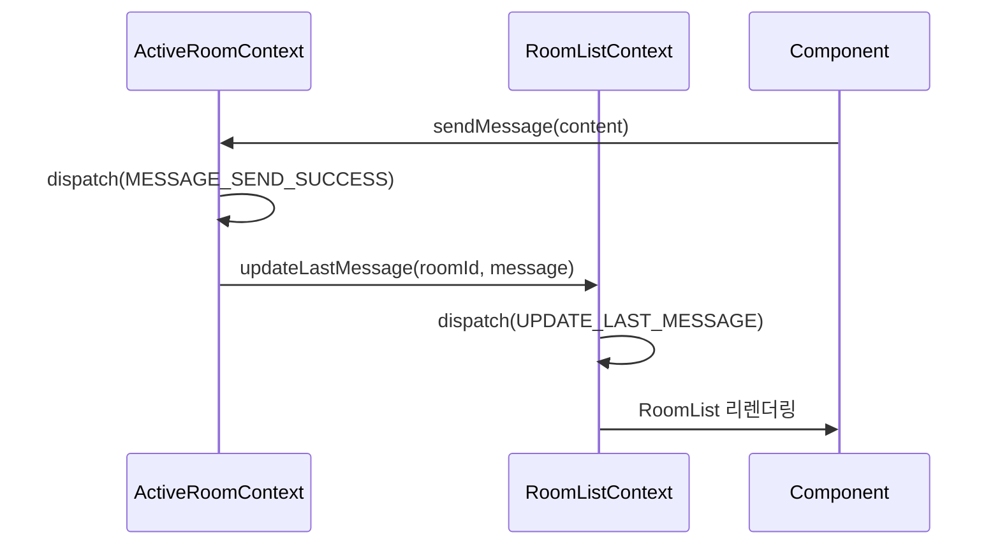

**구현:**

```typescript
// ActiveRoomContext.tsx
function ActiveRoomProvider({ children }) {
  const { updateLastMessage } = useRoomList(); // 상위 Context 참조
  
  const sendMessage = async (content: string) => {
    // ...
    dispatch({ type: 'MESSAGE_SEND_SUCCESS', payload: { message } });
    
    // 부수 효과: RoomList 업데이트
    updateLastMessage(state.roomId, message);
  };
  
  return <Context.Provider value={{ sendMessage, ... }}>{children}</Context.Provider>;
}
```

### 6.3 Child → Parent (Callback 패턴)

```typescript
// UIContext에서 Modal 닫기 후 후속 작업
function CreateRoomModal() {
  const { createRoom } = useRoomList();
  const { closeModal, showToast } = useUI();
  
  const handleSubmit = async (name: string) => {
    const room = await createRoom(name);
    
    // 1. Modal 닫기 (UIContext)
    closeModal('createRoom');
    
    // 2. Toast 표시 (UIContext)
    showToast('success', '방이 생성되었습니다');
    
    // 3. 방 입장 (ActiveRoomContext)
    const { enterRoom } = useActiveRoom();
    await enterRoom(room.id);
  };
  
  return <form onSubmit={handleSubmit}>...</form>;
}
```

### 6.4 Global Event (Custom Event)

```typescript
// 특수한 경우: 전역 이벤트 발행
// (예: 강퇴당했을 때 모든 Context 초기화)

// ActiveRoomContext.tsx
useEffect(() => {
  if (kickedEvent) {
    // 1. 자체 상태 초기화
    dispatch({ type: 'EXIT_ROOM' });
    
    // 2. 전역 이벤트 발행
    window.dispatchEvent(new CustomEvent('user:kicked', {
      detail: { roomId: state.roomId },
    }));
  }
}, [kickedEvent]);

// RoomListContext.tsx
useEffect(() => {
  const handleKicked = (e: CustomEvent) => {
    dispatch({ type: 'REMOVE_ROOM', payload: { roomId: e.detail.roomId } });
    showToast('error', '방에서 강퇴당했습니다');
  };
  
  window.addEventListener('user:kicked', handleKicked);
  return () => window.removeEventListener('user:kicked', handleKicked);
}, []);
```

---

## 7. 성능 최적화 전략

### 7.1 Context 분리의 장점

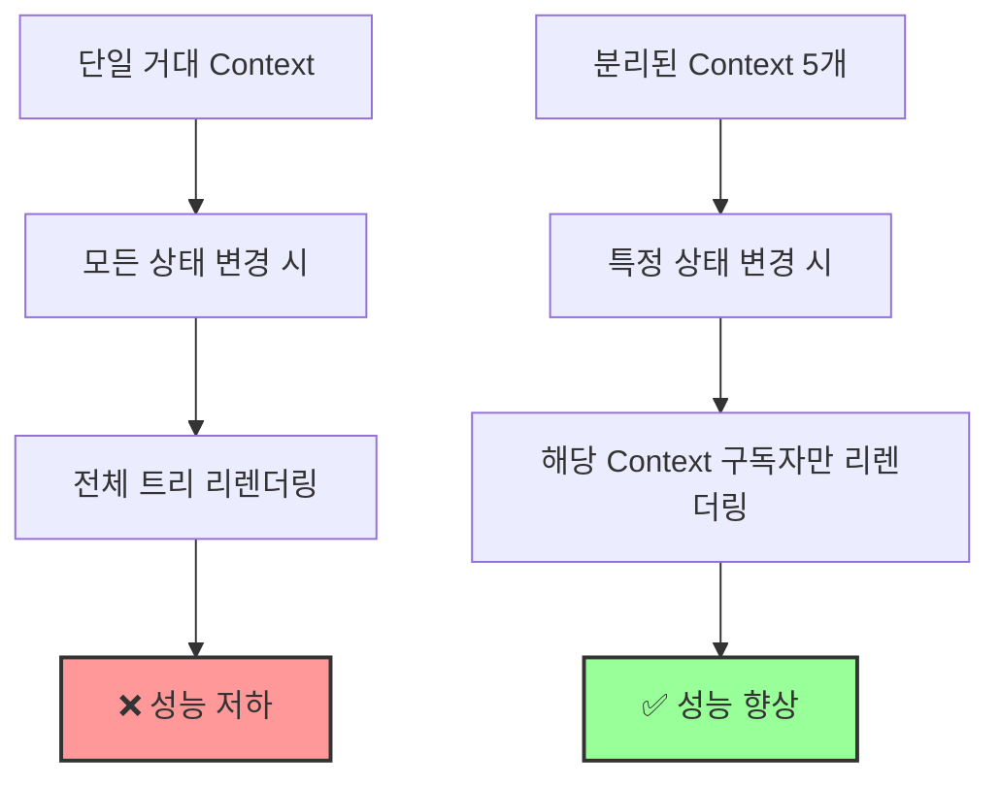

**예시:**

```typescript
// ✅ 좋은 예: 분리된 Context
function Header() {
  const { currentUser } = useAuth(); // Auth 변경 시만 리렌더링
  return <Avatar user={currentUser} />;
}

function RoomList() {
  const { sortedRooms } = useRoomList(); // RoomList 변경 시만 리렌더링
  return <ul>{sortedRooms.map(...)}</ul>;
}

// ❌ 나쁜 예: 단일 Context
function Header() {
  const { state } = useApp(); // 모든 상태 변경 시 리렌더링
  return <Avatar user={state.auth.user} />;
}
```

### 7.2 Selector 최적화

```typescript
// ✅ useMemo로 계산 최적화
function useVisibleMessages() {
  const { state } = useActiveRoom();
  
  return useMemo(() => {
    return state.messages.filter(
      msg => !state.hiddenMessageIds.has(msg.id) && !msg.is_deleted
    );
  }, [state.messages, state.hiddenMessageIds]);
}

// ❌ 매번 재계산 (성능 저하)
function useVisibleMessages() {
  const { state } = useActiveRoom();
  return state.messages.filter(msg => !msg.is_deleted); // 매 렌더링마다 실행
}
```

### 7.3 Context Value 메모이제이션

```typescript
function AuthProvider({ children }) {
  const [state, dispatch] = useReducer(authReducer, initialState);
  
  // ✅ value를 useMemo로 감싸기
  const value = useMemo(() => ({
    state,
    isAuthenticated: state.user !== null,
    currentUser: state.user,
    login: async (email, password) => { /* ... */ },
    logout: async () => { /* ... */ },
  }), [state]); // state 변경 시에만 재생성
  
  return <AuthContext.Provider value={value}>{children}</AuthContext.Provider>;
}

// ❌ 나쁜 예: 매 렌더링마다 새 객체 생성
const value = {
  state,
  login: async () => { /* ... */ }, // 매번 새 함수
};
```

### 7.4 Component Splitting

```typescript
// ✅ 좋은 예: 작은 컴포넌트로 분리
function MessageList() {
  const { visibleMessages } = useActiveRoom();
  
  return (
    <div>
      {visibleMessages.map(msg => (
        <MessageItem key={msg.id} message={msg} />
      ))}
    </div>
  );
}

function MessageItem({ message }) {
  // message prop만 의존 → 해당 메시지만 리렌더링
  return <div>{message.content}</div>;
}

// ❌ 나쁜 예: 모든 메시지를 한 컴포넌트에서 렌더링
function MessageList() {
  const { visibleMessages, toggleLike, deleteMessage } = useActiveRoom();
  
  return (
    <div>
      {visibleMessages.map(msg => (
        <div key={msg.id}>
          {msg.content}
          <button onClick={() => toggleLike(msg.id)}>Like</button>
          <button onClick={() => deleteMessage(msg.id)}>Delete</button>
        </div>
      ))}
    </div>
  ); // 전체가 하나의 컴포넌트 → 모든 메시지 리렌더링
}
```

### 7.5 조건부 Context 구독

```typescript
// ✅ 필요할 때만 Context 구독
function ChatPage({ roomId }: { roomId?: string }) {
  if (!roomId) {
    // ActiveRoomContext 구독 안함
    return <EmptyState />;
  }
  
  return <ChatView roomId={roomId} />;
}

function ChatView({ roomId }) {
  const { enterRoom } = useActiveRoom(); // 여기서만 구독
  
  useEffect(() => {
    enterRoom(roomId);
  }, [roomId]);
  
  return <MessageList />;
}
```

---

## 8. 디렉토리 구조

```
src/
├── features/
│   ├── auth/
│   │   ├── context/
│   │   │   ├── AuthContext.tsx       # Context 정의 + Provider
│   │   │   ├── authReducer.ts        # Reducer 로직
│   │   │   ├── authActions.ts        # Action Creators
│   │   │   └── useAuth.ts            # Custom Hook
│   │   ├── types.ts                  # State, Action 타입
│   │   └── selectors.ts              # Computed Values
│   │
│   ├── room-list/
│   │   ├── context/
│   │   │   ├── RoomListContext.tsx
│   │   │   ├── roomListReducer.ts
│   │   │   ├── roomListActions.ts
│   │   │   └── useRoomList.ts
│   │   ├── types.ts
│   │   └── selectors.ts
│   │
│   ├── active-room/
│   │   ├── context/
│   │   │   ├── ActiveRoomContext.tsx
│   │   │   ├── activeRoomReducer.ts
│   │   │   ├── activeRoomActions.ts
│   │   │   ├── useLongPolling.ts    # Long Polling Effect
│   │   │   └── useActiveRoom.ts
│   │   ├── types.ts
│   │   └── selectors.ts
│   │
│   ├── ui/
│   │   ├── context/
│   │   │   ├── UIContext.tsx
│   │   │   ├── uiReducer.ts
│   │   │   └── useUI.ts
│   │   └── types.ts
│   │
│   └── network/
│       ├── context/
│       │   ├── NetworkContext.tsx
│       │   ├── networkReducer.ts
│       │   └── useNetwork.ts
│       └── types.ts
│
├── app/
│   ├── providers.tsx                  # 모든 Provider 중첩
│   └── layout.tsx                     # <Providers> 래핑
│
└── components/
    └── ...
```

---

## 9. 타입 안전성 보장

### 9.1 Discriminated Union for Actions

```typescript
// ✅ 타입 안전한 Action
type AuthAction =
  | { type: 'LOGIN_SUCCESS'; payload: { user: User; session: Session } }
  | { type: 'LOGIN_FAILURE'; payload: { error: string } }
  | { type: 'LOGOUT' };

function authReducer(state: AuthState, action: AuthAction): AuthState {
  switch (action.type) {
    case 'LOGIN_SUCCESS':
      // payload.user, payload.session 타입 추론 ✅
      return { ...state, user: action.payload.user };
    
    case 'LOGOUT':
      // payload 없음 → 컴파일 에러 방지 ✅
      return { ...state, user: null };
    
    default:
      return state;
  }
}
```

### 9.2 Context Value 타입 안전성

```typescript
// ✅ Context Value 타입 정의
interface AuthContextValue {
  state: AuthState;
  isAuthenticated: boolean;
  login: (email: string, password: string) => Promise<void>;
  logout: () => Promise<void>;
}

const AuthContext = createContext<AuthContextValue | null>(null);

// ✅ useAuth Hook에서 타입 체크
export function useAuth(): AuthContextValue {
  const context = useContext(AuthContext);
  if (!context) {
    throw new Error('useAuth must be used within AuthProvider');
  }
  return context;
}

// ❌ 타입 안전하지 않은 방식
const AuthContext = createContext<any>(null); // any 사용 금지
```

---

## 10. 결론

### 10.1 Context + useReducer의 장점

1. ✅ **명확한 데이터 흐름**: Action → Reducer → State → View
2. ✅ **타입 안전성**: TypeScript로 모든 Action과 State 타입 보장
3. ✅ **성능 최적화**: Context 분리로 불필요한 리렌더링 방지
4. ✅ **테스트 용이**: Reducer는 순수 함수 → 단위 테스트 쉬움
5. ✅ **디버깅 편의**: Redux DevTools 연동 가능
6. ✅ **확장성**: 새 기능 추가 시 독립적인 Context 추가

### 10.2 설계 원칙 요약

| 원칙 | 설명 |
|------|------|
| **Single Responsibility** | 각 Context는 하나의 책임만 가짐 |
| **Unidirectional Data Flow** | Action → Reducer → State → View |
| **Immutability** | 모든 상태 업데이트는 새 객체 생성 |
| **Type Safety** | TypeScript로 모든 타입 정의 |
| **Performance** | useMemo, Context 분리로 최적화 |
| **Testability** | Reducer는 순수 함수로 테스트 가능 |

### 10.3 다음 단계

1. 각 Context별 Reducer 구현
2. Custom Hook 작성 (useAuth, useRoomList 등)
3. Provider 중첩 구조 설정 (providers.tsx)
4. 컴포넌트에서 Context 사용 (useAuth, useRoomList 호출)
5. Long Polling Effect 구현 (useLongPolling)
6. 성능 측정 및 최적화

---

**문서 작성 완료**

이 설계를 따르면 **대규모 채팅 애플리케이션에서도 유지보수 가능하고 성능이 뛰어난 상태 관리**를 구현할 수 있습니다! 🚀
