# Flux 패턴 상태 흐름 시각화

> 작성일: 2025년 11월 15일  
> 기반 문서: `docs/flux-architecture.md`, `docs/requirement.md v1.6`  
> 다이어그램: Mermaid Flowcharts

---

## 목차

1. [인증 흐름 (Auth Flow)](#1-인증-흐름-auth-flow)
2. [채팅방 목록 흐름 (Room List Flow)](#2-채팅방-목록-흐름-room-list-flow)
3. [메시지 전송 흐름 (Message Send Flow)](#3-메시지-전송-흐름-message-send-flow)
4. [Long Polling 실시간 동기화 흐름](#4-long-polling-실시간-동기화-흐름)
5. [좋아요 토글 흐름 (Like Toggle Flow)](#5-좋아요-토글-흐름-like-toggle-flow)
6. [채팅방 입장 흐름 (Room Enter Flow)](#6-채팅방-입장-흐름-room-enter-flow)
7. [메시지 답장 흐름 (Reply Flow)](#7-메시지-답장-흐름-reply-flow)
8. [메시지 삭제 흐름 (Delete Flow)](#8-메시지-삭제-흐름-delete-flow)
9. [오프라인 복구 흐름 (Offline Recovery Flow)](#9-오프라인-복구-흐름-offline-recovery-flow)
10. [채팅방 생성 흐름 (Create Room Flow)](#10-채팅방-생성-흐름-create-room-flow)
11. [초대 수락 흐름 (Invite Accept Flow)](#11-초대-수락-흐름-invite-accept-flow)
12. [채팅방 나가기 흐름 (Leave Room Flow)](#12-채팅방-나가기-흐름-leave-room-flow)

---

## 1. 인증 흐름 (Auth Flow)

### 1.1 로그인 성공 시나리오

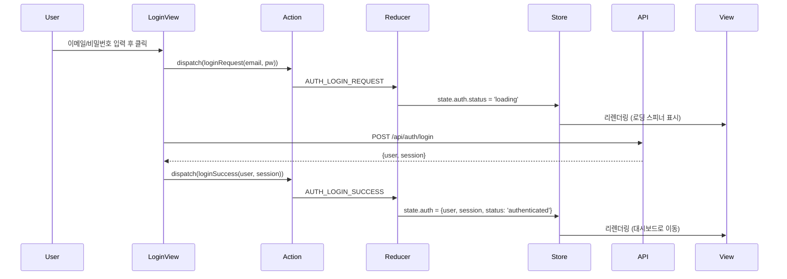

### 1.2 로그인 실패 시나리오

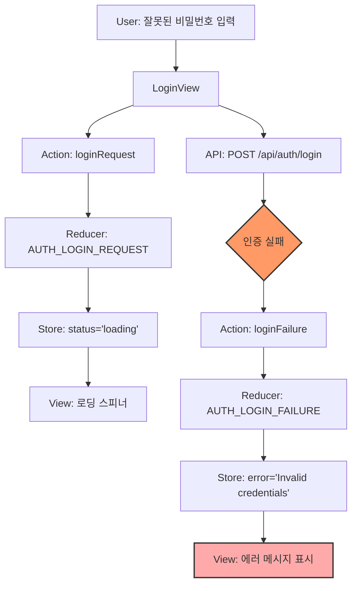

### 1.3 세션 복원 흐름

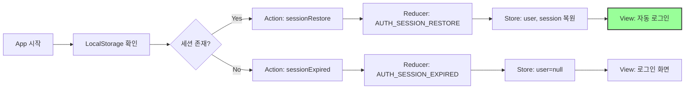

---

## 2. 채팅방 목록 흐름 (Room List Flow)

### 2.1 초기 로드 흐름

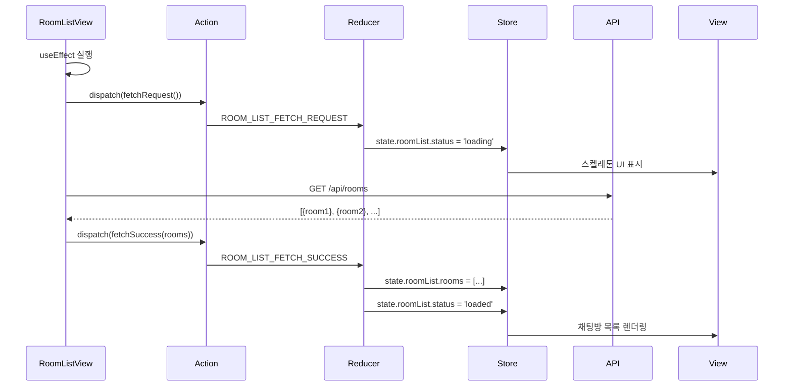

### 2.2 채팅방 선택 흐름

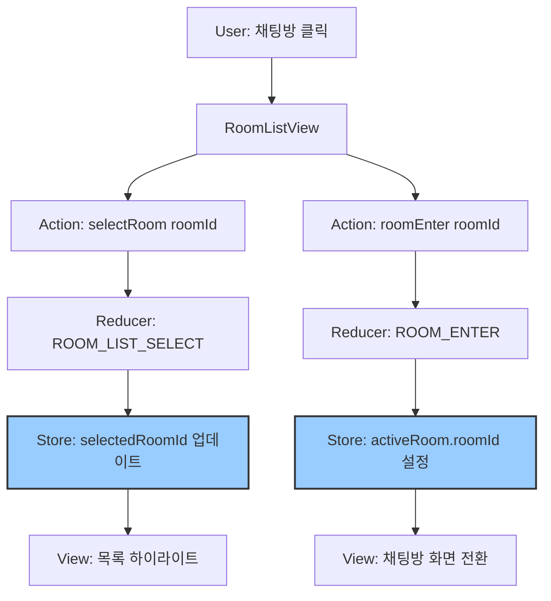

### 2.3 실시간 업데이트 (새 메시지 도착)

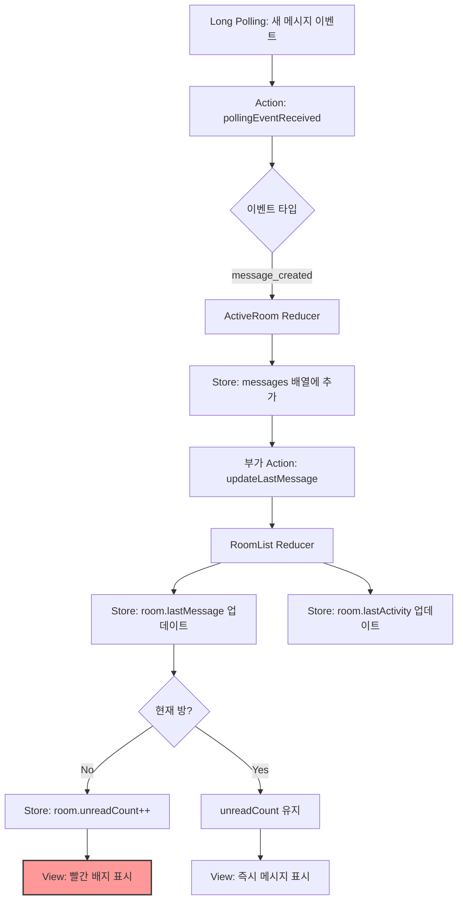

---

## 3. 메시지 전송 흐름 (Message Send Flow)

### 3.1 Optimistic UI 패턴

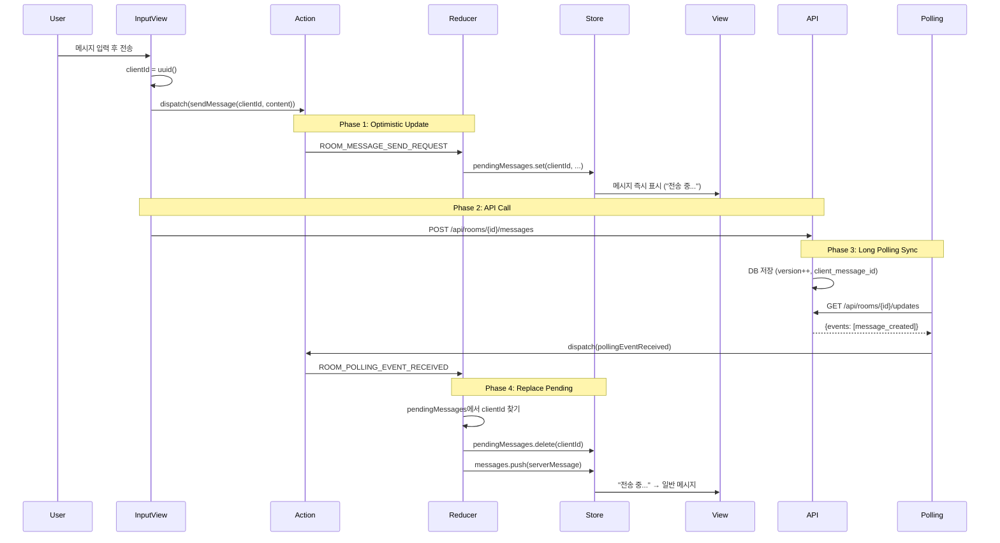

### 3.2 전송 실패 시나리오

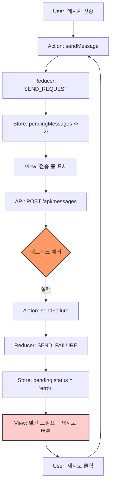

---

## 4. Long Polling 실시간 동기화 흐름

### 4.1 Live 모드 (정상 실시간)

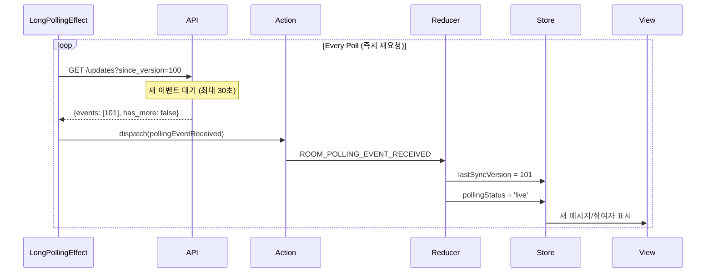

### 4.2 Catchup 모드 (밀린 이벤트 처리)

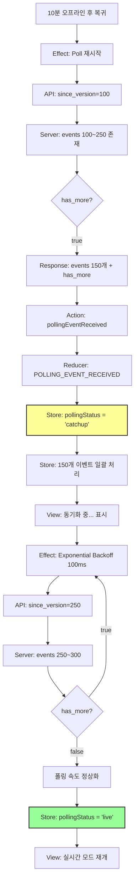

### 4.3 이벤트 타입별 처리

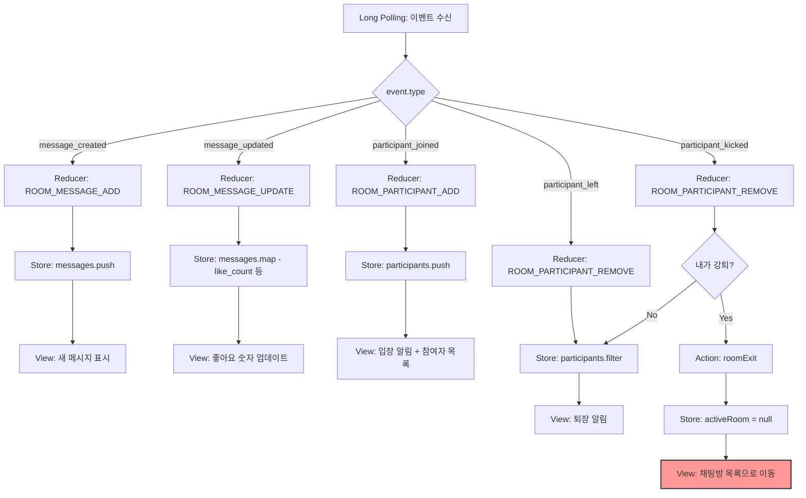

---

## 5. 좋아요 토글 흐름 (Like Toggle Flow)

### 5.1 Optimistic + 서버 배칭

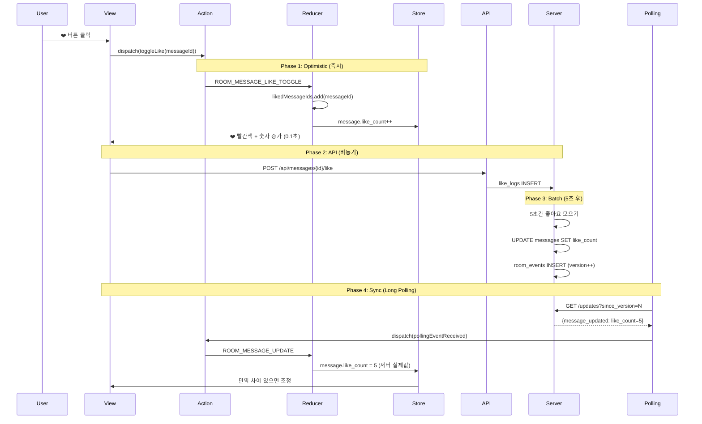

### 5.2 좋아요 취소 흐름

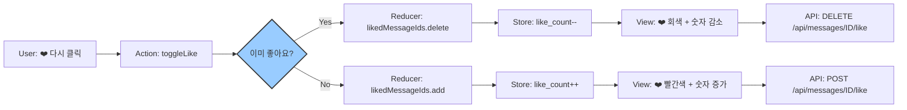

---

## 6. 채팅방 입장 흐름 (Room Enter Flow)

### 6.1 Snapshot 로드 → Live Polling 시작

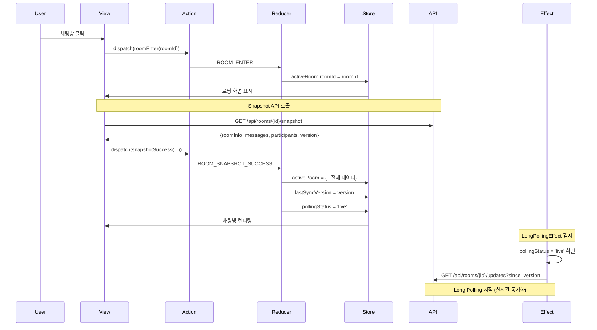

### 6.2 과거 메시지 로드 (Scroll Up)

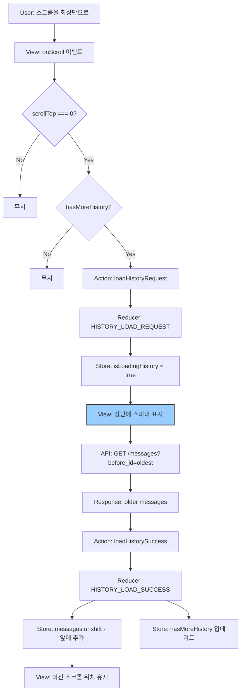

---

## 7. 메시지 답장 흐름 (Reply Flow)

### 7.1 답장 대상 설정

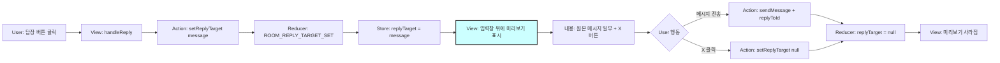

### 7.2 답장 메시지 렌더링

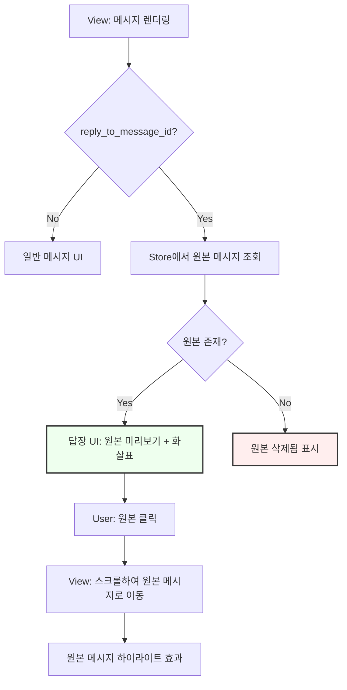

---

## 8. 메시지 삭제 흐름 (Delete Flow)

### 8.1 모두에게 삭제 (Soft Delete)

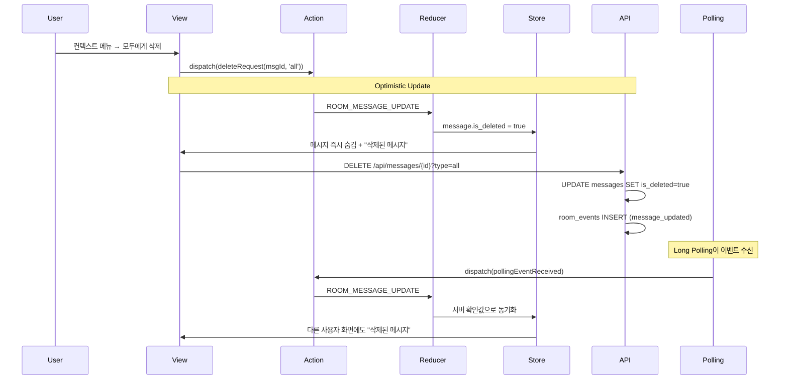

### 8.2 나만 삭제 (Private Delete)

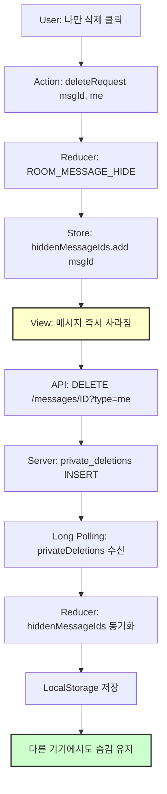

---

## 9. 오프라인 복구 흐름 (Offline Recovery Flow)

### 9.1 네트워크 끊김 → 재연결

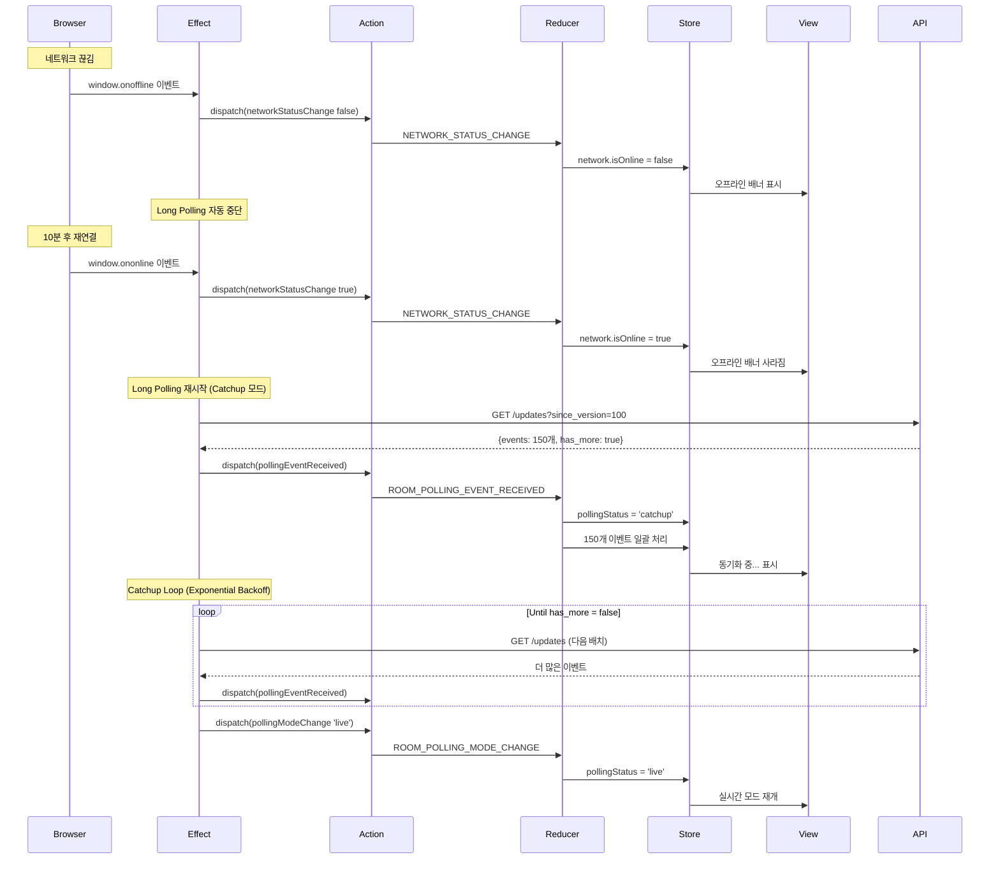

### 9.2 재시도 Backoff 전략

```mermaid
flowchart TD
    A[Long Polling 실패] --> B[Action: syncFailure]
    B --> C[Reducer: NETWORK_SYNC_FAILURE]
    C --> D[Store: retryCount++]
    C --> E[Store: backoffDelay *= 2]
    
    E --> F{backoffDelay}
    F -->|1회| G[100ms 대기]
    F -->|2회| H[200ms 대기]
    F -->|3회| I[400ms 대기]
    F -->|4회| J[800ms 대기]
    F -->|5회+| K[1000ms 대기 - 최대값]
    
    G --> L[재시도]
    H --> L
    I --> L
    J --> L
    K --> L
    
    L --> M{성공?}
    M -->|Yes| N[Action: syncSuccess]
    M -->|No| A
    
    N --> O[Reducer: NETWORK_SYNC_SUCCESS]
    O --> P[Store: retryCount = 0]
    O --> Q[Store: backoffDelay = 100]
    
    style K fill:#f99,stroke:#333,stroke-width:2px
    style P fill:#9f9,stroke:#333,stroke-width:2px
```

---

## 10. 채팅방 생성 흐름 (Create Room Flow)

### 10.1 모달 → API → 목록 추가

```mermaid
sequenceDiagram
    participant User
    participant View
    participant UIAction
    participant UIReducer
    participant Store
    participant Modal
    participant API
    participant RoomAction
    participant RoomReducer

    User->>View: + 새 채팅 버튼 클릭
    View->>UIAction: dispatch(openModal 'createRoom')
    UIAction->>UIReducer: UI_MODAL_OPEN
    UIReducer->>Store: ui.modals.createRoom = true
    Store->>Modal: 모달 렌더링
    
    User->>Modal: 방 이름 입력 + 생성 클릭
    Modal->>API: POST /api/rooms {name}
    API-->>Modal: {room: {...새 방 정보}}
    
    Modal->>RoomAction: dispatch(addRoom(room))
    RoomAction->>RoomReducer: ROOM_LIST_ADD_ROOM
    RoomReducer->>Store: roomList.rooms.unshift(room)
    
    Modal->>UIAction: dispatch(closeModal 'createRoom')
    UIAction->>UIReducer: UI_MODAL_CLOSE
    UIReducer->>Store: ui.modals.createRoom = false
    Store->>View: 모달 닫힘 + 새 방이 목록 최상단에
    
    Modal->>RoomAction: dispatch(roomEnter(room.id))
    RoomAction->>RoomReducer: ROOM_ENTER
    RoomReducer->>Store: activeRoom.roomId = room.id
    Store->>View: 새 채팅방 화면으로 전환
```

---

## 11. 초대 수락 흐름 (Invite Accept Flow)

### 11.1 토큰 검증 → 방 입장

```mermaid
flowchart TD
    A[User: 초대 링크 클릭] --> B[App: URL에서 token 추출]
    B --> C[Action: setInviteToken token]
    C --> D[Reducer: UI_INVITE_TOKEN_SET]
    D --> E[Store: ui.inviteContext.token = token]
    
    E --> F{로그인 여부?}
    F -->|No| G[View: 로그인 페이지 표시]
    F -->|Yes| H[API: POST /api/invites/validate]
    
    G --> I[User: 로그인/회원가입]
    I --> H
    
    H --> J{토큰 유효?}
    J -->|No| K[View: 초대 만료 에러]
    J -->|Yes| L[Response: roomInfo]
    
    L --> M[Store: ui.inviteContext.roomInfo]
    M --> N[View: 수락 확인 모달]
    N --> O[User: 수락 버튼 클릭]
    
    O --> P[API: POST /api/invites/accept]
    P --> Q[Server: room_participants INSERT]
    Q --> R[Action: addRoom]
    R --> S[Store: roomList에 추가]
    S --> T[Action: roomEnter]
    T --> U[View: 채팅방 화면]
    
    style K fill:#f99,stroke:#333,stroke-width:2px
    style U fill:#9f9,stroke:#333,stroke-width:2px
```

---

## 12. 채팅방 나가기 흐름 (Leave Room Flow)

### 12.1 확인 모달 → API → 목록 제거

```mermaid
sequenceDiagram
    participant User
    participant View
    participant UIAction
    participant Store
    participant Modal
    participant API
    participant RoomAction
    participant Reducer

    User->>View: 설정 메뉴 → 나가기
    View->>UIAction: dispatch(openModal 'leaveRoom')
    UIAction->>Store: ui.modals.leaveRoom = true
    Store->>Modal: 확인 모달 표시
    
    User->>Modal: 나가기 버튼 클릭
    Modal->>API: DELETE /api/rooms/{id}/leave
    API->>API: room_participants DELETE
    API->>API: room_events INSERT (participant_left)
    API-->>Modal: {success: true}
    
    Modal->>RoomAction: dispatch(removeRoom(roomId))
    RoomAction->>Reducer: ROOM_LIST_REMOVE_ROOM
    Reducer->>Store: roomList.rooms.filter
    Reducer->>Store: selectedRoomId = null
    
    Modal->>RoomAction: dispatch(roomExit())
    RoomAction->>Reducer: ROOM_EXIT
    Reducer->>Store: activeRoom = initialState
    
    Modal->>UIAction: dispatch(closeModal 'leaveRoom')
    UIAction->>Store: ui.modals.leaveRoom = false
    Store->>View: 채팅방 목록 화면으로 이동
    
    Note over API: 다른 참여자들에게 Long Polling으로 전파
    API-->>View: participant_left 이벤트
    View->>View: "OOO님이 나갔습니다" 알림
```

---

## 13. 전체 통합 흐름 (Complete Integration)

### 13.1 앱 시작부터 메시지 전송까지

```mermaid
flowchart TD
    Start([앱 시작]) --> Auth{세션 복원?}
    Auth -->|Yes| Dashboard[대시보드]
    Auth -->|No| Login[로그인]
    
    Login --> LoginAPI[POST /api/auth/login]
    LoginAPI --> AuthSuccess[Action: loginSuccess]
    AuthSuccess --> Dashboard
    
    Dashboard --> FetchRooms[Action: fetchRoomsRequest]
    FetchRooms --> RoomAPI[GET /api/rooms]
    RoomAPI --> RoomSuccess[Action: fetchSuccess]
    RoomSuccess --> RoomList[채팅방 목록 표시]
    
    RoomList --> SelectRoom[User: 방 클릭]
    SelectRoom --> EnterRoom[Action: roomEnter]
    EnterRoom --> Snapshot[GET /api/rooms/ID/snapshot]
    Snapshot --> SnapshotSuccess[Action: snapshotSuccess]
    SnapshotSuccess --> ChatView[채팅방 화면]
    
    ChatView --> StartPolling[LongPollingEffect 시작]
    StartPolling --> LiveMode[pollingStatus: live]
    
    ChatView --> TypeMessage[User: 메시지 입력]
    TypeMessage --> SendMessage[Action: sendMessage]
    SendMessage --> OptimisticUI[즉시 화면 표시]
    OptimisticUI --> SendAPI[POST /api/messages]
    SendAPI --> ServerSave[DB 저장]
    ServerSave --> PollEvent[Long Polling 이벤트]
    PollEvent --> ReplacePending[Pending → Real Message]
    ReplacePending --> FinalView[최종 메시지 표시]
    
    style Start fill:#9cf,stroke:#333,stroke-width:3px
    style FinalView fill:#9f9,stroke:#333,stroke-width:3px
```

---

## 14. 상태별 Action-Store-View 매핑 테이블

| 상태 카테고리 | 주요 Action | Reducer 업데이트 | View 반영 |
|--------------|------------|-----------------|----------|
| **Auth** | `loginSuccess` | `state.auth.user = {...}` | 대시보드 리다이렉트 |
| **RoomList** | `fetchSuccess` | `state.roomList.rooms = [...]` | 방 목록 렌더링 |
| **ActiveRoom** | `snapshotSuccess` | `state.activeRoom = {...전체}` | 채팅방 화면 표시 |
| **Message Send** | `sendMessage` | `pendingMessages.set(...)` | Optimistic UI |
| **Long Polling** | `pollingEventReceived` | `messages.push(...)` | 실시간 업데이트 |
| **Like** | `toggleLike` | `likedMessageIds.add(...)` | ❤️ 색상 + 숫자 |
| **Reply** | `setReplyTarget` | `replyTarget = message` | 입력창 미리보기 |
| **Delete** | `deleteRequest` | `message.is_deleted = true` | "삭제된 메시지" |
| **Network** | `statusChange` | `network.isOnline = false` | 오프라인 배너 |
| **UI Modal** | `openModal` | `ui.modals.createRoom = true` | 모달 렌더링 |

---

## 15. 성능 최적화 포인트

### 15.1 Memoization 흐름

```mermaid
flowchart LR
    A[Store State 변경] --> B{useVisibleMessages}
    B --> C{messages 배열 변경?}
    C -->|No| D[캐시된 값 반환 - 리렌더링 없음]
    C -->|Yes| E[필터링 재계산]
    E --> F[새 배열 반환]
    F --> G[View 리렌더링]
    
    style D fill:#9f9,stroke:#333,stroke-width:2px
    style G fill:#fc9,stroke:#333,stroke-width:2px
```

### 15.2 Component Splitting

```mermaid
flowchart TD
    A[RootStore 변경] --> B{어떤 상태?}
    B -->|auth| C[AuthHeader만 리렌더링]
    B -->|roomList| D[RoomListView만 리렌더링]
    B -->|activeRoom| E[ChatView만 리렌더링]
    B -->|ui| F[Modal/Toast만 리렌더링]
    
    E --> G{activeRoom 세부}
    G -->|messages| H[MessageList만]
    G -->|participants| I[ParticipantList만]
    G -->|replyTarget| J[MessageInput만]
    
    style C fill:#cfc,stroke:#333,stroke-width:2px
    style D fill:#cfc,stroke:#333,stroke-width:2px
    style E fill:#cfc,stroke:#333,stroke-width:2px
```

---

## 16. 에러 처리 흐름

### 16.1 API 에러 → Toast 표시

```mermaid
sequenceDiagram
    participant View
    participant API
    participant Action
    participant Reducer
    participant Store
    participant Toast

    View->>API: POST /api/rooms (네트워크 에러)
    API-->>View: Error: Network Failure
    View->>Action: dispatch(showToast 'error', '방 생성 실패')
    Action->>Reducer: UI_TOAST_SHOW
    Reducer->>Store: ui.toast = {type: 'error', message: '...'}
    Store->>Toast: 화면 우측 하단에 에러 토스트
    
    Note over Toast: 3초 후 자동 사라짐
    Toast->>Action: dispatch(hideToast(id))
    Action->>Reducer: UI_TOAST_HIDE
    Reducer->>Store: ui.toast = null
    Store->>Toast: 토스트 사라짐
```

---

**문서 작성 완료**

이 다이어그램들은 Flux 패턴의 단방향 데이터 흐름을 명확히 시각화하며, 각 상태별 Action → Reducer → Store → View 흐름을 구체적으로 보여줍니다.
