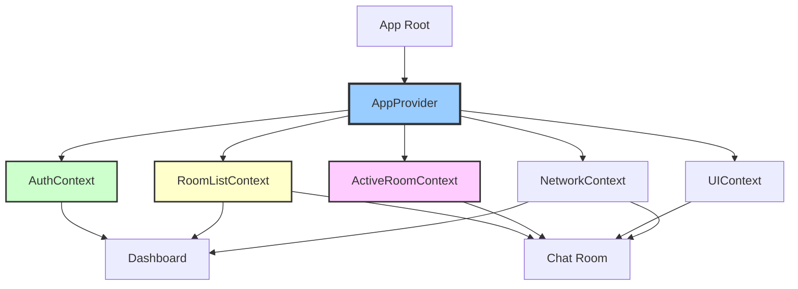
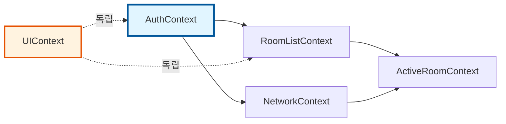
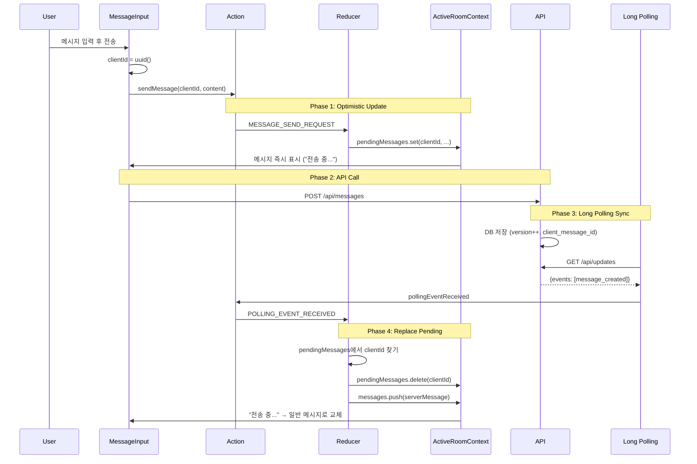
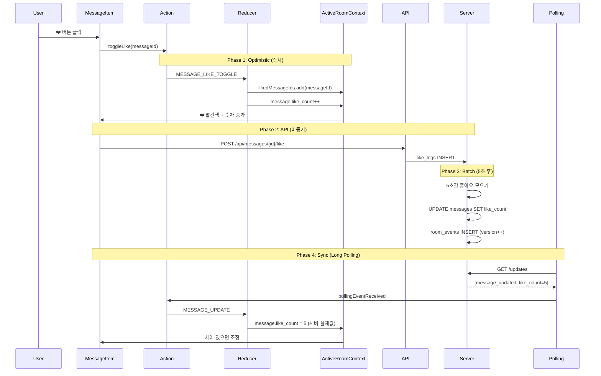
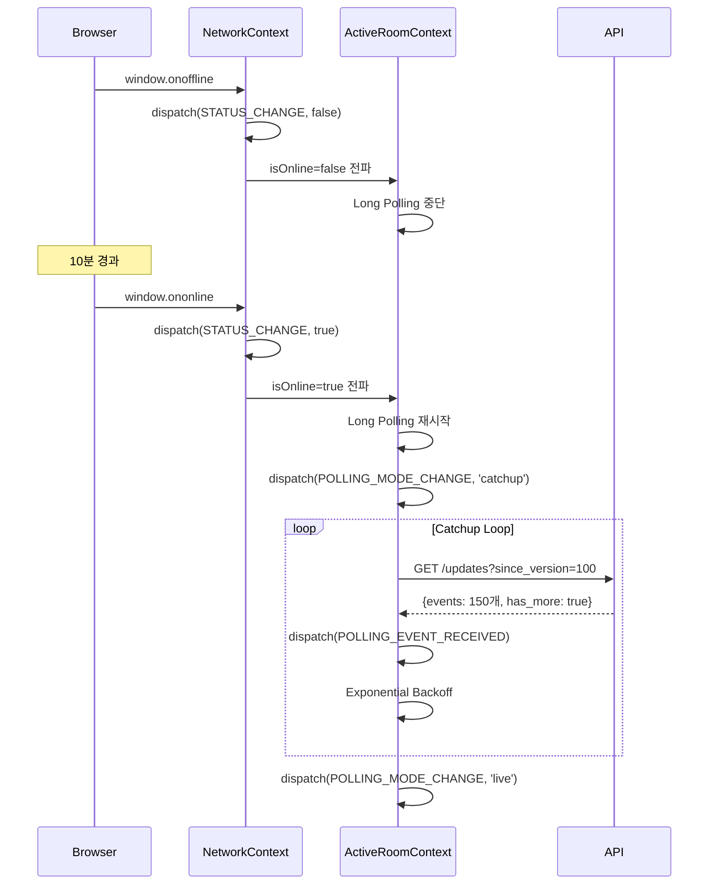
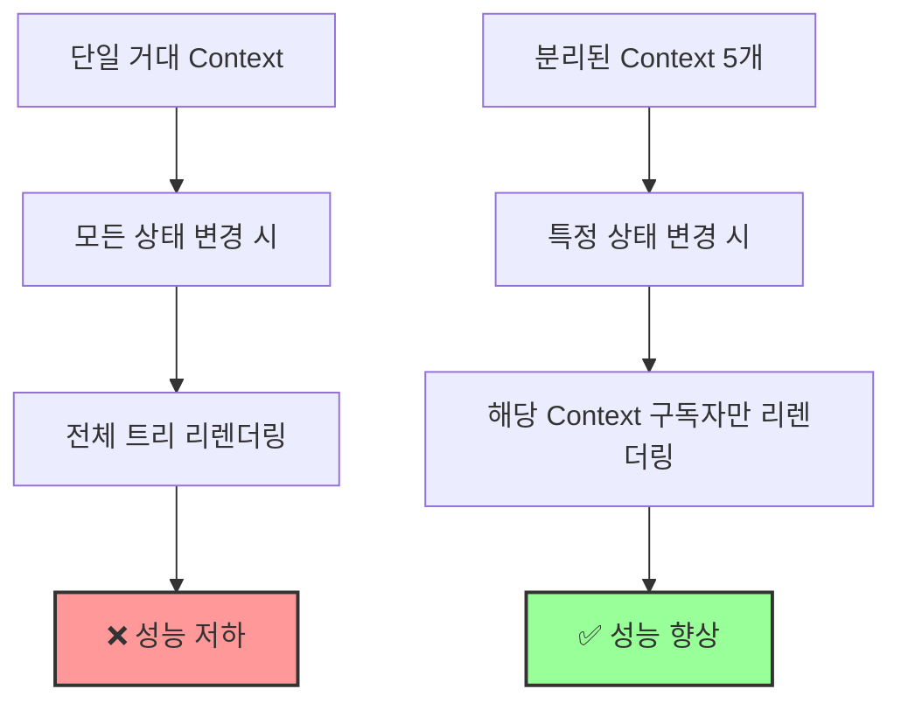

# 채팅 서비스 상태 관리 설계 (State Management Design)

> 작성일: 2025년 11월 15일  
> 버전: v2.0 (통합)  
> 기반 문서: `requirement.md v1.6`  
> 패턴: Context API + useReducer + Flux Architecture

---

## 📚 목차

1. [개요](#1-개요)
2. [아키텍처 패턴](#2-아키텍처-패턴)
3. [Context 구조 설계](#3-context-구조-설계)
4. [상태 데이터 정의](#4-상태-데이터-정의)
5. [데이터 흐름 (Flux Pattern)](#5-데이터-흐름-flux-pattern)
6. [Context 간 통신](#6-context-간-통신)
7. [하위 컴포넌트 인터페이스](#7-하위-컴포넌트-인터페이스)
8. [성능 최적화 전략](#8-성능-최적화-전략)
9. [구현 가이드](#9-구현-가이드)

---

## 1. 개요

### 1.1 설계 목표

본 문서는 Long Polling 기반 실시간 채팅 서비스의 **클라이언트 상태 관리**를 정의합니다.

**핵심 설계 원칙:**
- ✅ **단방향 데이터 흐름** (Unidirectional Data Flow)
- ✅ **명확한 책임 분리** (Separation of Concerns)
- ✅ **타입 안전성** (Type Safety with TypeScript)
- ✅ **성능 최적화** (Context Splitting, Memoization)
- ✅ **테스트 가능성** (Pure Reducer Functions)

### 1.2 기술 스택

| 레이어 | 기술 | 용도 |
|--------|------|------|
| **상태 관리** | React Context + useReducer | 전역 상태 |
| **서버 상태** | React Query (선택적) | API 캐싱 |
| **타입 시스템** | TypeScript | 타입 안전성 |
| **성능 최적화** | useMemo, useCallback | 리렌더링 최소화 |

---

## 2. 아키텍처 패턴

### 2.1 Flux 패턴 적용

```
┌─────────┐      ┌──────────┐      ┌───────┐      ┌──────┐
│ Action  │─────▶│ Reducer  │─────▶│ Store │─────▶│ View │
└─────────┘      └──────────┘      └───────┘      └──────┘
     ▲                                                 │
     └─────────────────────────────────────────────────┘
                  User Interaction
```

**데이터 흐름:**
1. **View** → 사용자 인터랙션 (클릭, 입력 등)
2. **Action** → 이벤트를 나타내는 객체 생성
3. **Reducer** → 순수 함수로 새 상태 계산
4. **Store** → Context에 새 상태 저장
5. **View** → 구독 중인 컴포넌트 리렌더링

### 2.2 Context 분리 전략



**분리 기준:**

| Context | 책임 범위 | 변경 빈도 | 구독자 수 |
|---------|-----------|----------|-----------|
| **AuthContext** | 인증, 세션 | 낮음 | 많음 (Header, Route Guard 등) |
| **RoomListContext** | 채팅방 목록 | 중간 | 중간 (Sidebar, Badge 등) |
| **ActiveRoomContext** | 현재 채팅방 | 높음 | 적음 (Chat Page만) |
| **UIContext** | 모달, Toast | 낮음 | 전체 |
| **NetworkContext** | 네트워크 상태 | 낮음 | 적음 (Status Bar 등) |

---

## 3. Context 구조 설계

### 3.1 Provider 중첩 구조

```typescript
// src/app/providers.tsx
export function AppProviders({ children }: { children: React.ReactNode }) {
  return (
    <AuthProvider>
      <NetworkProvider>
        <RoomListProvider>
          <ActiveRoomProvider>
            <UIProvider>
              {children}
            </UIProvider>
          </ActiveRoomProvider>
        </RoomListProvider>
      </NetworkProvider>
    </AuthProvider>
  );
}
```

### 3.2 의존성 그래프



**의존성 규칙:**
- `AuthContext`: 최상위, 의존 없음
- `RoomListContext`: `AuthContext`의 `user` 필요
- `ActiveRoomContext`: `RoomListContext`, `NetworkContext` 참조
- `UIContext`: 독립적 (다른 Context와 통신하지만 의존하지 않음)

---

## 4. 상태 데이터 정의

### 4.1 AuthContext 상태

```typescript
interface AuthState {
  user: User | null;
  session: Session | null;
  status: 'idle' | 'loading' | 'authenticated' | 'error';
  error: string | null;
}

interface User {
  id: string;
  email: string;
  nickname: string;
  avatar_url?: string;
  created_at: string;
}

interface Session {
  access_token: string;
  refresh_token: string;
  expires_at: number;
}
```

**변경 조건:**

| 상태 | 변경 시점 | 화면 반영 |
|------|----------|----------|
| `user: null → User` | 로그인/회원가입 성공 | Dashboard로 리다이렉트 |
| `user: User → null` | 로그아웃 | 로그인 화면으로 이동 |
| `status: loading` | API 요청 중 | 로딩 스피너 표시 |
| `session: Session` | 토큰 발급 | Cookie 저장 |

### 4.2 RoomListContext 상태

```typescript
interface RoomListState {
  rooms: Room[];
  status: 'idle' | 'loading' | 'loaded' | 'error';
  error: string | null;
  selectedRoomId: string | null;
}

interface Room {
  id: string;
  name: string;
  lastMessage: Message | null;
  lastActivity: string;
  unreadCount: number;
  participantCount: number;
  created_at: string;
}
```

**변경 조건:**

| 상태 | 변경 시점 | 화면 반영 |
|------|----------|----------|
| `rooms: [] → [Room]` | 첫 방 생성 | Empty State → 목록 표시 |
| `rooms: 정렬 변경` | 새 메시지 도착 | 해당 방이 최상단으로 이동 |
| `unreadCount: +1` | 다른 방에서 메시지 수신 | 배지 숫자 증가 |
| `selectedRoomId: roomId` | 방 클릭 | 채팅방 화면으로 전환 |

### 4.3 ActiveRoomContext 상태

```typescript
interface ActiveRoomState {
  roomId: string | null;
  roomInfo: RoomDetail | null;
  messages: Message[];
  participants: Participant[];
  
  // Long Polling
  lastSyncVersion: number;
  pollingStatus: 'idle' | 'live' | 'catchup' | 'error';
  
  // 전송 중 메시지 (Optimistic UI)
  pendingMessages: Map<string, PendingMessage>;
  
  // UI 상태
  likedMessageIds: Set<string>;
  hiddenMessageIds: Set<string>;
  replyTarget: Message | null;
  
  // 히스토리 로드
  isLoadingHistory: boolean;
  hasMoreHistory: boolean;
  
  status: 'idle' | 'loading' | 'loaded' | 'error';
  error: string | null;
}

interface Message {
  id: string;
  room_id: string;
  user_id: string;
  content: string;
  reply_to_message_id: string | null;
  like_count: number;
  is_deleted: boolean;
  client_message_id: string | null;
  created_at: string;
  updated_at: string;
}

interface PendingMessage {
  clientId: string;
  content: string;
  status: 'sending' | 'error';
  error?: string;
  replyToId?: string;
  created_at: string;
}

interface Participant {
  id: string;
  user_id: string;
  nickname: string;
  avatar_url?: string;
  role: 'owner' | 'admin' | 'member';
  joined_at: string;
}
```

**변경 조건:**

| 상태 | 변경 시점 | 화면 반영 |
|------|----------|----------|
| `messages: append` | Long Polling에서 `message_created` | 새 메시지가 하단에 추가 |
| `messages: prepend` | 스크롤 상단 도달 (과거 로드) | 과거 메시지가 상단에 추가 |
| `pendingMessages: add` | 전송 버튼 클릭 | "전송 중..." 라벨과 함께 표시 |
| `likedMessageIds: add` | 좋아요 버튼 클릭 | ❤️ 색상 변경, 숫자 +1 (Optimistic) |
| `pollingStatus: catchup` | `has_more: true` 수신 | "동기화 중..." 배너 표시 |
| `participants: add` | `participant_joined` 이벤트 | 참여자 목록에 추가 |

### 4.4 UIContext 상태

```typescript
interface UIState {
  modals: {
    createRoom: boolean;
    inviteUser: boolean;
    leaveRoom: boolean;
    confirmDelete: boolean;
  };
  
  contextMenu: ContextMenu | null;
  toast: Toast | null;
  
  inviteContext: {
    token: string | null;
    roomInfo: RoomInfo | null;
  };
}

interface ContextMenu {
  type: 'room' | 'message';
  position: { x: number; y: number };
  targetId: string;
  options: ContextMenuOption[];
}

interface Toast {
  id: string;
  type: 'success' | 'error' | 'info' | 'warning';
  message: string;
  duration: number;
}
```

### 4.5 NetworkContext 상태

```typescript
interface NetworkState {
  isOnline: boolean;
  lastSyncAttempt: string | null;
  retryCount: number;
  backoffDelay: number; // ms
  syncStatus: 'idle' | 'syncing' | 'error';
}
```

---

## 5. 데이터 흐름 (Flux Pattern)

### 5.1 메시지 전송 흐름 (Optimistic UI)



### 5.2 좋아요 토글 흐름 (서버 배칭)



### 5.3 오프라인 복구 흐름 (Catchup)



---

## 6. Context 간 통신

### 6.1 상위 Context 참조 패턴

```typescript
// ActiveRoomContext에서 RoomListContext 참조
function ActiveRoomProvider({ children }) {
  const { updateLastMessage } = useRoomList(); // 상위 Context
  
  const sendMessage = async (content: string) => {
    // 메시지 전송 로직...
    dispatch({ type: 'MESSAGE_SEND_SUCCESS', payload: { message } });
    
    // 부수 효과: RoomList 업데이트
    updateLastMessage(state.roomId, message);
  };
  
  return <Context.Provider value={{ sendMessage, ... }}>{children}</Context.Provider>;
}
```

### 6.2 전역 이벤트 패턴 (특수한 경우)

```typescript
// 강퇴당했을 때 모든 Context 초기화
// ActiveRoomContext.tsx
useEffect(() => {
  if (kickedEvent) {
    dispatch({ type: 'EXIT_ROOM' });
    
    // 전역 이벤트 발행
    window.dispatchEvent(new CustomEvent('user:kicked', {
      detail: { roomId: state.roomId },
    }));
  }
}, [kickedEvent]);

// RoomListContext.tsx
useEffect(() => {
  const handleKicked = (e: CustomEvent) => {
    dispatch({ type: 'REMOVE_ROOM', payload: { roomId: e.detail.roomId } });
  };
  
  window.addEventListener('user:kicked', handleKicked);
  return () => window.removeEventListener('user:kicked', handleKicked);
}, []);
```

---

## 7. 하위 컴포넌트 인터페이스

### 7.1 AuthContext 노출 API

```typescript
// Custom Hook
function useAuth(): AuthContextValue

// 노출 변수 및 함수
const {
  // 계산된 값
  isAuthenticated,          // boolean
  currentUser,              // User | null
  isLoading,                // boolean
  
  // 액션
  login,                    // (email: string, password: string) => Promise<void>
  signup,                   // (email: string, password: string, nickname: string) => Promise<void>
  logout,                   // () => Promise<void>
  refreshSession,           // () => Promise<void>
} = useAuth();
```

**사용 예시:**

```typescript
// ✅ 헤더 컴포넌트
function Header() {
  const { isAuthenticated, currentUser, logout } = useAuth();
  
  if (!isAuthenticated) return <LoginButton />;
  
  return (
    <div>
      <Avatar user={currentUser} />
      <button onClick={logout}>로그아웃</button>
    </div>
  );
}

// ✅ Protected Route
function ProtectedPage() {
  const { isAuthenticated, isLoading } = useAuth();
  
  if (isLoading) return <Spinner />;
  if (!isAuthenticated) return <Navigate to="/login" />;
  
  return <Dashboard />;
}
```

### 7.2 RoomListContext 노출 API

```typescript
const {
  // 계산된 값
  sortedRooms,              // Room[] - 최신 활동순 정렬
  totalUnreadCount,         // number - 전체 안읽은 메시지 수
  selectedRoom,             // Room | null
  isLoading,                // boolean
  
  // 액션
  fetchRooms,               // () => Promise<void>
  selectRoom,               // (roomId: string | null) => void
  createRoom,               // (name: string) => Promise<Room>
  leaveRoom,                // (roomId: string) => Promise<void>
  
  // Internal (다른 Context에서만 사용)
  updateLastMessage,        // (roomId: string, message: Message) => void
  incrementUnread,          // (roomId: string) => void
  resetUnread,              // (roomId: string) => void
} = useRoomList();
```

**사용 예시:**

```typescript
// ✅ 채팅방 목록
function RoomList() {
  const { sortedRooms, selectRoom, isLoading } = useRoomList();
  
  if (isLoading) return <Skeleton />;
  
  return (
    <ul>
      {sortedRooms.map(room => (
        <RoomItem 
          key={room.id} 
          room={room}
          onClick={() => selectRoom(room.id)}
        />
      ))}
    </ul>
  );
}

// ✅ 헤더 배지
function UnreadBadge() {
  const { totalUnreadCount } = useRoomList();
  
  if (totalUnreadCount === 0) return null;
  
  return <Badge>{totalUnreadCount}</Badge>;
}
```

### 7.3 ActiveRoomContext 노출 API

```typescript
const {
  // 계산된 값
  visibleMessages,          // Message[] - 삭제/숨김 제외
  allMessages,              // (Message | PendingMessage)[] - 전송 중 포함
  currentRoom,              // RoomDetail | null
  isPollingActive,          // boolean
  isLoading,                // boolean
  
  // Room Actions
  enterRoom,                // (roomId: string) => Promise<void>
  exitRoom,                 // () => void
  loadMoreHistory,          // () => Promise<void>
  
  // Message Actions
  sendMessage,              // (content: string, replyToId?: string) => Promise<void>
  toggleLike,               // (messageId: string) => Promise<void>
  deleteMessage,            // (messageId: string, deleteType: 'all' | 'me') => Promise<void>
  setReplyTarget,           // (message: Message | null) => void
} = useActiveRoom();
```

**사용 예시:**

```typescript
// ✅ 메시지 목록
function MessageList() {
  const { visibleMessages, isLoading, loadMoreHistory } = useActiveRoom();
  
  const handleScroll = (e) => {
    if (e.target.scrollTop === 0) {
      loadMoreHistory();
    }
  };
  
  if (isLoading) return <Skeleton />;
  
  return (
    <div onScroll={handleScroll}>
      {visibleMessages.map(msg => (
        <MessageItem key={msg.id} message={msg} />
      ))}
    </div>
  );
}

// ✅ 메시지 입력
function MessageInput() {
  const { sendMessage } = useActiveRoom();
  const [content, setContent] = useState('');
  
  const handleSubmit = async (e) => {
    e.preventDefault();
    await sendMessage(content);
    setContent('');
  };
  
  return <form onSubmit={handleSubmit}>...</form>;
}
```

### 7.4 UIContext 노출 API

```typescript
const {
  // 계산된 값
  hasOpenModal,             // boolean
  activeModal,              // keyof modals | null
  
  // Modal Actions
  openModal,                // (modal: keyof modals) => void
  closeModal,               // (modal: keyof modals) => void
  closeAllModals,           // () => void
  
  // Context Menu Actions
  openContextMenu,          // (menu: ContextMenu) => void
  closeContextMenu,         // () => void
  
  // Toast Actions
  showToast,                // (type: Toast['type'], message: string, duration?: number) => void
  hideToast,                // (id: string) => void
  
  // Invite Actions
  setInviteToken,           // (token: string, roomInfo: RoomInfo) => void
  clearInviteToken,         // () => void
} = useUI();
```

**사용 예시:**

```typescript
// ✅ 모달 트리거
function Header() {
  const { openModal } = useUI();
  
  return (
    <button onClick={() => openModal('createRoom')}>
      + 새 채팅
    </button>
  );
}

// ✅ Toast 사용
function SaveButton() {
  const { showToast } = useUI();
  
  const handleSave = async () => {
    try {
      await saveData();
      showToast('success', '저장되었습니다');
    } catch (error) {
      showToast('error', '저장 실패', 5000);
    }
  };
  
  return <button onClick={handleSave}>저장</button>;
}
```

### 7.5 NetworkContext 노출 API

```typescript
const {
  // 계산된 값
  isOnline,                 // boolean
  shouldRetry,              // boolean
  nextRetryDelay,           // number (ms)
  
  // Actions (Internal - 대부분 ActiveRoomContext에서만 사용)
  recordSyncAttempt,        // () => void
  recordSyncSuccess,        // () => void
  recordSyncFailure,        // (error: string) => void
  resetBackoff,             // () => void
} = useNetwork();
```

**사용 예시:**

```typescript
// ✅ 오프라인 배너
function OfflineBanner() {
  const { isOnline } = useNetwork();
  
  if (isOnline) return null;
  
  return (
    <div className="banner">
      ⚠️ 오프라인 상태입니다
    </div>
  );
}

// ✅ 동기화 상태 표시
function SyncStatusIndicator() {
  const { isOnline, nextRetryDelay } = useNetwork();
  const { isPollingActive } = useActiveRoom();
  
  if (!isOnline) {
    return <span>🔴 오프라인 (재연결 대기 중...)</span>;
  }
  
  if (!isPollingActive) {
    return <span>🟡 동기화 대기 중</span>;
  }
  
  return <span>🟢 실시간 연결됨</span>;
}
```

---

## 8. 성능 최적화 전략

### 8.1 Context 분리의 장점



**예시:**

```typescript
// ✅ 좋은 예: 분리된 Context
function Header() {
  const { currentUser } = useAuth(); // Auth 변경 시만 리렌더링
  return <Avatar user={currentUser} />;
}

function RoomList() {
  const { sortedRooms } = useRoomList(); // RoomList 변경 시만 리렌더링
  return <ul>{sortedRooms.map(...)}</ul>;
}
```

### 8.2 Selector 최적화 (useMemo)

```typescript
// ✅ useMemo로 계산 최적화
function useVisibleMessages() {
  const { state } = useActiveRoom();
  
  return useMemo(() => {
    return state.messages.filter(
      msg => !state.hiddenMessageIds.has(msg.id) && !msg.is_deleted
    );
  }, [state.messages, state.hiddenMessageIds]);
}
```

### 8.3 Context Value 메모이제이션

```typescript
function AuthProvider({ children }) {
  const [state, dispatch] = useReducer(authReducer, initialState);
  
  // ✅ value를 useMemo로 감싸기
  const value = useMemo(() => ({
    state,
    isAuthenticated: state.user !== null,
    currentUser: state.user,
    login: async (email, password) => { /* ... */ },
    logout: async () => { /* ... */ },
  }), [state]); // state 변경 시에만 재생성
  
  return <AuthContext.Provider value={value}>{children}</AuthContext.Provider>;
}
```

### 8.4 Component Splitting

```typescript
// ✅ 좋은 예: 작은 컴포넌트로 분리
function MessageList() {
  const { visibleMessages } = useActiveRoom();
  
  return (
    <div>
      {visibleMessages.map(msg => (
        <MessageItem key={msg.id} message={msg} />
      ))}
    </div>
  );
}

function MessageItem({ message }) {
  // message prop만 의존 → 해당 메시지만 리렌더링
  return <div>{message.content}</div>;
}
```

---

## 9. 구현 가이드

### 9.1 디렉토리 구조

```
src/
├── features/
│   ├── auth/
│   │   ├── context/
│   │   │   ├── AuthContext.tsx       # Context + Provider
│   │   │   ├── authReducer.ts        # Reducer 로직
│   │   │   ├── authActions.ts        # Action Creators
│   │   │   └── useAuth.ts            # Custom Hook
│   │   ├── types.ts                  # State, Action 타입
│   │   └── selectors.ts              # Computed Values
│   │
│   ├── room-list/
│   │   ├── context/
│   │   │   ├── RoomListContext.tsx
│   │   │   ├── roomListReducer.ts
│   │   │   ├── roomListActions.ts
│   │   │   └── useRoomList.ts
│   │   ├── types.ts
│   │   └── selectors.ts
│   │
│   ├── active-room/
│   │   ├── context/
│   │   │   ├── ActiveRoomContext.tsx
│   │   │   ├── activeRoomReducer.ts
│   │   │   ├── activeRoomActions.ts
│   │   │   ├── useLongPolling.ts    # Long Polling Effect
│   │   │   └── useActiveRoom.ts
│   │   ├── types.ts
│   │   └── selectors.ts
│   │
│   ├── ui/
│   │   ├── context/
│   │   │   ├── UIContext.tsx
│   │   │   ├── uiReducer.ts
│   │   │   └── useUI.ts
│   │   └── types.ts
│   │
│   └── network/
│       ├── context/
│       │   ├── NetworkContext.tsx
│       │   ├── networkReducer.ts
│       │   └── useNetwork.ts
│       └── types.ts
│
├── app/
│   ├── providers.tsx                  # 모든 Provider 중첩
│   └── layout.tsx                     # <Providers> 래핑
│
└── components/
    └── ...
```

### 9.2 Action 타입 정의 (예시)

```typescript
// src/features/active-room/types.ts
export type ActiveRoomAction =
  | { type: 'ENTER_ROOM'; payload: { roomId: string } }
  | { type: 'EXIT_ROOM' }
  | { type: 'SNAPSHOT_SUCCESS'; payload: {
      roomInfo: RoomDetail;
      messages: Message[];
      participants: Participant[];
      lastSyncVersion: number;
    }}
  | { type: 'MESSAGE_SEND_REQUEST'; payload: {
      clientId: string;
      content: string;
      replyToId?: string;
    }}
  | { type: 'MESSAGE_SEND_SUCCESS'; payload: {
      clientId: string;
      message: Message;
    }}
  | { type: 'POLLING_EVENT_RECEIVED'; payload: {
      events: RoomEvent[];
      privateDeletions: string[];
      lastVersion: number;
      hasMore: boolean;
    }};
```

### 9.3 Reducer 구현 패턴 (예시)

```typescript
// src/features/active-room/context/activeRoomReducer.ts
export function activeRoomReducer(
  state: ActiveRoomState,
  action: ActiveRoomAction
): ActiveRoomState {
  switch (action.type) {
    case 'ENTER_ROOM':
      return {
        ...initialState,
        roomId: action.payload.roomId,
      };
    
    case 'SNAPSHOT_SUCCESS':
      return {
        ...state,
        roomInfo: action.payload.roomInfo,
        messages: action.payload.messages,
        participants: action.payload.participants,
        lastSyncVersion: action.payload.lastSyncVersion,
        pollingStatus: 'live',
        status: 'loaded',
      };
    
    case 'MESSAGE_SEND_REQUEST': {
      const pending: PendingMessage = {
        clientId: action.payload.clientId,
        content: action.payload.content,
        status: 'sending',
        created_at: new Date().toISOString(),
      };
      
      return {
        ...state,
        pendingMessages: new Map(state.pendingMessages).set(
          action.payload.clientId,
          pending
        ),
      };
    }
    
    case 'POLLING_EVENT_RECEIVED': {
      let newState = { ...state };
      
      // 이벤트 처리
      action.payload.events.forEach(event => {
        switch (event.type) {
          case 'message_created':
            newState.messages = [...newState.messages, event.payload as Message];
            break;
          
          case 'message_updated':
            newState.messages = newState.messages.map(msg =>
              msg.id === event.payload.message_id
                ? { ...msg, ...event.payload.updates }
                : msg
            );
            break;
        }
      });
      
      return {
        ...newState,
        lastSyncVersion: action.payload.lastVersion,
        pollingStatus: action.payload.hasMore ? 'catchup' : 'live',
      };
    }
    
    default:
      return state;
  }
}
```

### 9.4 Context Provider 구현 (예시)

```typescript
// src/features/active-room/context/ActiveRoomContext.tsx
const ActiveRoomContext = createContext<ActiveRoomContextValue | null>(null);

export function ActiveRoomProvider({ children }: { children: ReactNode }) {
  const [state, dispatch] = useReducer(activeRoomReducer, initialState);
  const { updateLastMessage } = useRoomList(); // 상위 Context 참조
  
  // Computed Values
  const visibleMessages = useMemo(() => 
    state.messages.filter(msg => !state.hiddenMessageIds.has(msg.id) && !msg.is_deleted),
    [state.messages, state.hiddenMessageIds]
  );
  
  // Actions
  const enterRoom = useCallback(async (roomId: string) => {
    dispatch({ type: 'ENTER_ROOM', payload: { roomId } });
    
    try {
      const response = await fetch(`/api/rooms/${roomId}/snapshot`);
      const data = await response.json();
      
      dispatch({
        type: 'SNAPSHOT_SUCCESS',
        payload: {
          roomInfo: data.room,
          messages: data.messages,
          participants: data.participants,
          lastSyncVersion: data.last_version,
        },
      });
    } catch (error) {
      dispatch({ type: 'SNAPSHOT_FAILURE', payload: { error: error.message } });
    }
  }, []);
  
  const sendMessage = useCallback(async (content: string, replyToId?: string) => {
    const clientId = crypto.randomUUID();
    
    // Optimistic UI
    dispatch({
      type: 'MESSAGE_SEND_REQUEST',
      payload: { clientId, content, replyToId },
    });
    
    try {
      const response = await fetch(`/api/rooms/${state.roomId}/messages`, {
        method: 'POST',
        body: JSON.stringify({ content, client_message_id: clientId, reply_to_message_id: replyToId }),
      });
      
      // Long Polling이 실제 메시지 전달
    } catch (error) {
      dispatch({
        type: 'MESSAGE_SEND_FAILURE',
        payload: { clientId, error: error.message },
      });
    }
  }, [state.roomId]);
  
  // Context Value
  const value = useMemo(() => ({
    state,
    visibleMessages,
    currentRoom: state.roomInfo,
    isPollingActive: state.pollingStatus === 'live' || state.pollingStatus === 'catchup',
    isLoading: state.status === 'loading',
    enterRoom,
    sendMessage,
    // ... other actions
    dispatch,
  }), [state, visibleMessages, enterRoom, sendMessage]);
  
  return (
    <ActiveRoomContext.Provider value={value}>
      {children}
    </ActiveRoomContext.Provider>
  );
}

export function useActiveRoom() {
  const context = useContext(ActiveRoomContext);
  if (!context) {
    throw new Error('useActiveRoom must be used within ActiveRoomProvider');
  }
  return context;
}
```

### 9.5 타입 안전성 보장

```typescript
// ✅ Discriminated Union for Actions
type AuthAction =
  | { type: 'LOGIN_SUCCESS'; payload: { user: User; session: Session } }
  | { type: 'LOGIN_FAILURE'; payload: { error: string } }
  | { type: 'LOGOUT' };

function authReducer(state: AuthState, action: AuthAction): AuthState {
  switch (action.type) {
    case 'LOGIN_SUCCESS':
      // payload.user, payload.session 타입 추론 ✅
      return { ...state, user: action.payload.user };
    
    case 'LOGOUT':
      // payload 없음 → 컴파일 에러 방지 ✅
      return { ...state, user: null };
    
    default:
      return state;
  }
}
```

---

## 10. 상태 동기화 흐름

### 10.1 초기 진입 (Snapshot)

```
1. 사용자가 채팅방 진입
2. dispatch({ type: 'ENTER_ROOM', payload: { roomId } })
3. API: GET /rooms/{roomId}/snapshot
4. dispatch({ type: 'SNAPSHOT_SUCCESS', payload: { roomInfo, messages, participants, lastSyncVersion } })
5. pollingStatus: 'idle' → 'live'
6. Long Polling 시작 (useEffect에서 감지)
```

### 10.2 실시간 메시지 수신 (Live)

```
1. Long Polling: GET /updates?since_version=500
2. 서버에서 새 메시지 발생 (version: 501)
3. 서버 즉시 응답: { events: [{ type: 'message_created', ... }], has_more: false }
4. dispatch({ type: 'POLLING_EVENT_RECEIVED', payload: { events, lastVersion: 501 } })
5. messages 배열에 append
6. 즉시 다음 Polling 요청
```

### 10.3 오프라인 복구 (Catchup)

```
1. 네트워크 끊김 (10분)
2. NetworkContext: dispatch({ type: 'STATUS_CHANGE', payload: { isOnline: false } })
3. Long Polling 중단
4. 네트워크 재연결
5. NetworkContext: dispatch({ type: 'STATUS_CHANGE', payload: { isOnline: true } })
6. pollingStatus: 'idle' → 'catchup'
7. API: GET /updates?since_version=500
8. 서버: { events: [501~650], has_more: true }
9. dispatch({ type: 'POLLING_EVENT_RECEIVED', payload: { events: 150개, hasMore: true } })
10. Exponential Backoff (100ms, 200ms, 400ms, ...)
11. 재귀 호출 (has_more = false까지)
12. pollingStatus: 'catchup' → 'live'
```

---

## 11. 디버깅 체크리스트

| 문제 | 확인 사항 | 해결 방법 |
|------|----------|----------|
| 메시지 중복 | `client_message_id` 매칭 로직 | Pending 메시지를 서버 응답으로 교체 |
| 좋아요 수 불일치 | Optimistic vs 서버 값 | Polling 응답으로 교체 |
| 참여자 목록 오류 | Kick 이벤트 처리 | `participant_kicked` 이벤트 리스너 |
| Polling 무한루프 | `lastSyncVersion` 업데이트 누락 | 응답 처리 후 반드시 업데이트 |
| 스크롤 점프 | 메시지 prepend 시 스크롤 보정 | `scrollTop` 계산 및 조정 |
| 세션 만료 | 401 에러 처리 | 자동 로그아웃 및 리디렉션 |
| 불필요한 리렌더링 | Context Value 메모이제이션 | useMemo로 value 감싸기 |

---

## 12. 결론

### 12.1 설계 요약

본 문서는 **Context API + useReducer + Flux 패턴**을 활용한 채팅 서비스의 상태 관리 아키텍처를 정의합니다.

**핵심 특징:**
1. ✅ **명확한 데이터 흐름**: Action → Reducer → Store → View
2. ✅ **성능 최적화**: Context 분리로 불필요한 리렌더링 방지
3. ✅ **타입 안전성**: TypeScript로 모든 Action과 State 타입 보장
4. ✅ **테스트 용이**: Reducer는 순수 함수 → 단위 테스트 쉬움
5. ✅ **확장성**: 새 기능 추가 시 독립적인 Context 추가

### 12.2 구현 우선순위

1. **Phase 1**: AuthContext, UIContext (기본 인증 및 UI)
2. **Phase 2**: RoomListContext (채팅방 목록)
3. **Phase 3**: ActiveRoomContext (채팅방 상세, Long Polling)
4. **Phase 4**: NetworkContext (오프라인 복구)

### 12.3 참고 문서

- **상세 설계**: `/docs/state-design/flux-architecture.md` - Flux 패턴 상세 설명
- **흐름 다이어그램**: `/docs/state-design/flux-flow-diagrams.md` - Mermaid 시각화
- **Context 아키텍처**: `/docs/state-design/context-architecture.md` - Context 구조 상세
- **초기 명세**: `/docs/state-design/state-management-v1.md` - v1 상태 정의

---

**문서 버전**: v2.0 (통합)  
**최종 수정**: 2025년 11월 15일  
**작성자**: ChatService Development Team
